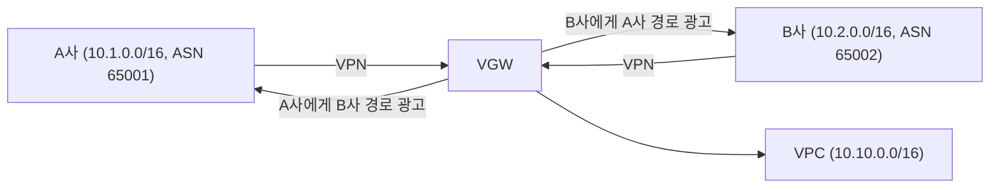
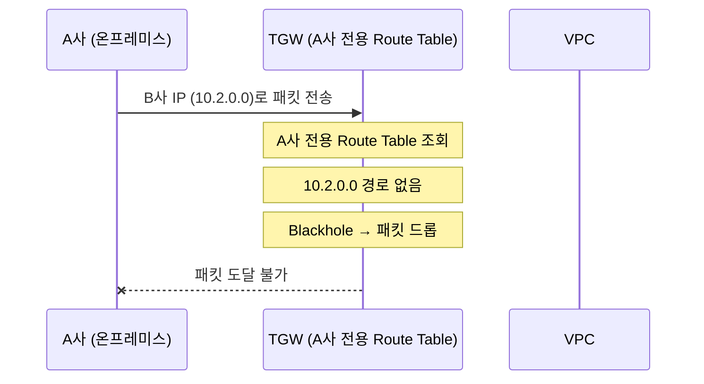
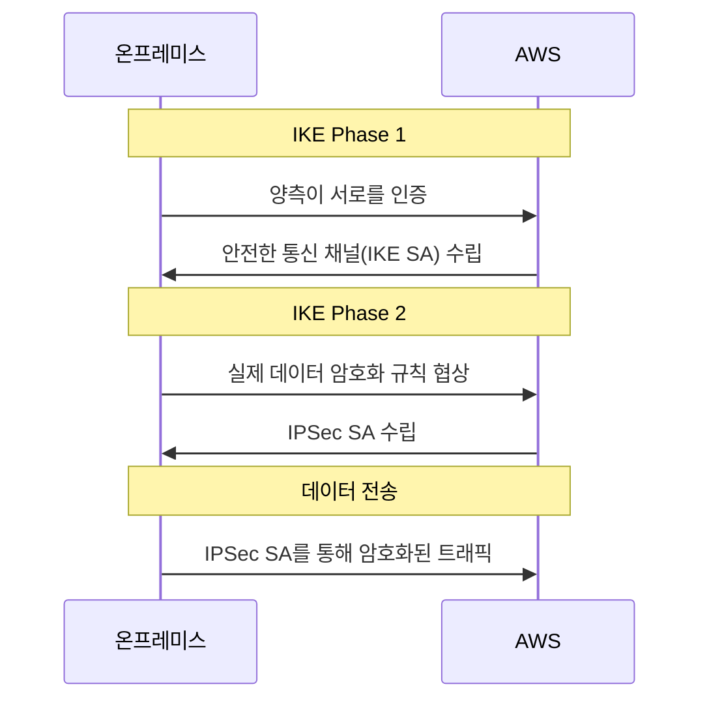
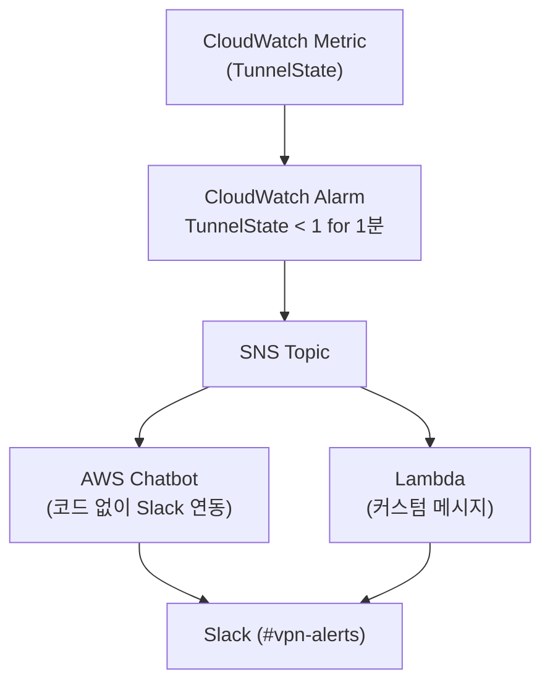

# AWS Site-to-Site VPN 보안 격리와 고가용성: VGW vs TGW 비교와 운영 가이드

이상적인 VPN 아키텍처를 현실에서 구현하려고 하면, VPN 장비의 제약사항이라는 벽에 부딪힙니다.

파트너사마다 VPN 장비 사양이 다릅니다. 어떤 회사는 BGP를 지원하고, 어떤 회사는 Static Routing만 됩니다. 어떤 장비는 HA sync를 지원하고, 어떤 장비는 지원하지 않습니다. **이 제약사항들이 아키텍처를 결정합니다.**

이 글에서는 두 가지를 다룹니다. 먼저 보안 관점에서 VGW와 TGW의 격리 차이를 살펴보고, 이어서 운영 관점에서 고가용성(High Availability) 아키텍처, 터널 장애 시나리오, 모니터링 방법을 정리합니다.

시작하기 전에, 이 글에서 자주 등장하는 두 가지 AWS 서비스를 먼저 정리합니다.

- **VGW(Virtual Private Gateway)**: VPC에 직접 붙는 VPN 게이트웨이입니다. 단일 VPC와 온프레미스를 연결할 때 사용하며, 자체 라우팅 테이블이 없습니다.
- **TGW(Transit Gateway)**: 여러 VPC와 VPN 연결을 중앙에서 관리하는 네트워크 허브입니다. VPN 연결별로 독립적인 라우팅 테이블을 할당할 수 있어 보안 격리가 가능합니다.

---

## AWS Site-to-Site VPN 보안 격리: VGW vs TGW

### 이 글에서 다루는 상황

먼저 상황을 명확히 하겠습니다. **이 글에서 다루는 것은 같은 회사의 지사 간 연결이 아닙니다.**

서로 이해관계가 없는, 완전히 다른 회사들과 각각 Site-to-Site VPN을 맺는 경우입니다. A사는 파트너사이고, B사는 규제기관일 수 있습니다. 이 두 회사가 같은 AWS 환경에 VPN으로 들어옵니다.

이 구성에서 반드시 답해야 하는 질문이 있습니다:

- A사가 B사의 네트워크에 접근할 수 없는가?
- 외부 회사가 허용된 AWS 리소스 외에 다른 리소스에 접근할 수 없는가?
- VPN 설정만으로 이 격리가 보장되는가?

---

### VGW의 구조적 한계

VGW로 여러 외부 회사를 연결하면 왜 보안 격리가 어려운지, VGW의 구조부터 이해해야 합니다.

#### VGW에는 내부 라우팅 테이블이 없다

VGW의 가장 큰 한계는 **자체적인 라우팅 테이블이 없다**는 점입니다. VGW는 단순한 게이트웨이입니다. 트래픽을 필터링하거나 경로를 제한하는 기능이 없습니다.

```
온프레미스 → VPN 터널 → VGW → VPC (10.10.0.0/16 전체에 접근 가능)
```

온프레미스 VPN 장비가 VPC 대역 어디로든 패킷을 보내면, VGW는 그대로 VPC에 전달합니다. "이 IP로만 접근을 허용하겠다"는 제어를 VGW 레벨에서는 할 수 없습니다.

#### Static IP Prefixes는 방향이 반대다

> 주의사항: VPN Connection에서 설정하는 Static IP Prefixes가 온프레미스의 AWS 접근을 제어해줄 것 같지만, 실제로는 그렇지 않습니다.

Static IP Prefixes는 **온프레미스 네트워크 대역**을 AWS에 알려주는 설정입니다. **AWS → 온프레미스 방향의 라우팅만 제어**합니다.

```
Static IP Prefixes = 10.20.1.100/32 (온프레미스 서버 IP)

의미:      "10.20.1.100으로 가는 트래픽은 VGW를 통해 온프레미스로 보내라"
           → VPC Route Table에 전파: 10.20.1.100/32 → VGW

제어 불가: 온프레미스 → AWS 방향의 트래픽 필터링
```

VGW의 Static IP Prefixes를 VPC Route Table에 반영하려면 **Route Propagation**을 활성화해야 합니다. Route Propagation은 VGW가 알고 있는 온프레미스 경로를 VPC Route Table에 자동으로 추가해주는 기능입니다. 이 설정은 기본적으로 비활성화되어 있습니다.

#### 정리: 방향별 제어 가능 여부

| 방향 | VGW에서 제어 가능? | 설명 |
|------|:---:|------|
| AWS → 온프레미스 | O | Static IP Prefixes로 라우팅 경로 제어 |
| 온프레미스 → AWS | **X** | 내부 라우팅 테이블이 없어 패킷 필터링 불가 |

온프레미스 → AWS 방향의 접근 제어는 VPC 레벨의 Security Group과 NACL에 의존해야 합니다. **게이트웨이 레벨에서 막을 수 없다는 것이 VGW의 근본적 한계입니다.**

---

### CloudHub 리스크

#### CloudHub란?

**[AWS VPN CloudHub](https://docs.aws.amazon.com/vpn/latest/s2svpn/VPN_CloudHub.html)는 하나의 VGW에 여러 Customer Gateway가 BGP로 연결되면, VGW가 각 사이트의 경로를 다른 모든 BGP 피어에게 재광고(re-advertise)하는 기능입니다.**

같은 회사의 지사 간 연결이라면 유용한 기능입니다. 하지만 서로 관계없는 외부 회사들이 연결된 상황에서는 보안 리스크가 됩니다.

CloudHub의 전제 조건은 BGP 동적 라우팅입니다:
- 각 Customer Gateway에 고유한 BGP ASN(Autonomous System Number, 각 네트워크를 식별하는 고유 번호) 필요
- 동적으로 라우팅된(BGP) Site-to-Site VPN 연결
- 각 BGP 피어에서 경로를 수신하여 다시 공급



VGW가 A사에게 B사의 경로(10.2.0.0/16)를 광고합니다. B사에게도 A사의 경로(10.1.0.0/16)를 광고합니다. 서로 관계없는 회사끼리 통신 경로가 열립니다.

#### Static Routing이면 CloudHub는 성립하지 않는다

CloudHub는 BGP 재광고가 핵심 메커니즘이므로, **Static Routing만 사용하면 CloudHub 자체가 성립하지 않습니다.** 재광고할 BGP 프로토콜이 없기 때문입니다.

#### 그런데 Static Routing이 완전히 안전한 것은 아니다

CloudHub 재광고는 없지만, VGW + Static 구성에서도 회사 간 트래픽이 흐를 수 있는 경로가 이론적으로 존재합니다.

```
A사 → VPN 터널 → VGW → VPC → VGW → VPN 터널 → B사
```

이 경로가 성립하려면 두 가지 조건이 동시에 충족되어야 합니다:

1. VPC Route Table에 B사 대역이 존재해야 함 (Route Propagation으로 전파된 상태)
2. A사가 B사의 IP 대역을 알아야 함 (BGP 재광고가 없으므로 자동으로 알 수 없지만, 실수나 추측으로 알게 될 수 있음)

현실적으로 두 조건이 동시에 충족될 가능성은 낮습니다. 하지만 보안 관점에서 **"가능성이 낮다"와 "구조적으로 불가능하다"는 완전히 다릅니다.**

#### 시나리오별 리스크 비교

| 시나리오 | CloudHub 성립 | 회사 간 통신 가능성 | 격리 수준 |
|---------|:---:|:---:|------|
| VGW + BGP | **O** (재광고 발생) | 높음 | 낮음 |
| VGW + Static | X (BGP 없음) | 낮음 (IP를 알면 가능) | 중간 |
| TGW (BGP/Static 모두) | X (Route Table 분리) | **불가능** (Blackhole) | **높음** |

---

### 그렇다면 VPN Local/Remote ID로 격리할 수 있을까?

"Local ID와 Remote ID를 회사별로 다르게 설정하면 격리할 수 있지 않나?"라는 질문이 나올 수 있습니다.

결론부터 말하면, **Local/Remote ID는 인증 메커니즘이지 접근 제어 도구가 아닙니다.**

IPSec VPN에서 `leftid`(Local ID)와 `rightid`(Remote ID)는 IKE Phase 1에서 피어 인증에 사용되는 식별자입니다.

**Local/Remote ID가 하는 일:**
- IKE 협상 시 올바른 피어와 연결되었는지 확인
- Pre-Shared Key 또는 인증서 기반 인증에서 올바른 자격 증명 선택

**Local/Remote ID가 하지 않는 일:**
- 네트워크 레벨의 트래픽 격리
- 라우팅 테이블의 경로 분리
- 특정 목적지로의 접근 제한

"누구와 VPN을 맺었는가"를 확인하는 것과 "어디에 접근할 수 있는가"를 제어하는 것은 완전히 다른 문제입니다.

---

### TGW를 사용한 보안 격리 (권장 방식)

#### 왜 TGW인가?

TGW는 VGW와 달리 **VPN 연결별로 독립적인 라우팅 테이블**을 할당할 수 있습니다. 이것이 보안 격리에서 결정적인 차이입니다.

VGW는 온프레미스 → AWS 방향의 트래픽을 무조건 VPC에 전달합니다. TGW는 Route Table에 경로가 없으면 패킷을 드롭합니다. **게이트웨이 레벨에서 접근을 제어할 수 있습니다.**

#### TGW 하나로 충분하다

"BGP를 쓰는 회사와 Static Routing을 쓰는 회사를 분리해서 TGW를 2개 만들어야 하나?" 결론부터 말하면, **TGW 하나면 충분합니다.**

TGW는 VPN Connection별로 별도의 Route Table을 할당합니다. BGP든 Static이든 같은 TGW에 연결해도 서로의 경로를 볼 수 없습니다.

```
A사 (BGP)    ── VPN ── TGW Attachment ── TGW Route Table (A사 전용)
B사 (Static) ── VPN ── TGW Attachment ── TGW Route Table (B사 전용)
C사 (BGP)    ── VPN ── TGW Attachment ── TGW Route Table (C사 전용)
                              │
                       하나의 TGW에 모두 연결
                       Route Table이 분리되어 있으므로 서로 격리됨
```

#### TGW 격리의 동작 원리

A사가 B사 IP로 패킷을 보내면 어떻게 될까요?



경로가 없으면 Blackhole(목적지가 없는 패킷을 폐기하는 것)이 됩니다. 허용된 목적지 외의 AWS 리소스에는 도달 자체가 불가능합니다. 이것이 VGW와의 결정적 차이입니다.

#### 핵심 설정 3가지

**1. Default Route Table Association / Propagation 비활성화**

TGW를 생성할 때 반드시 기본 라우팅 테이블 자동 연결과 전파를 끕니다. 이렇게 해야 각 VPN 연결에 별도의 라우팅 테이블을 수동으로 지정할 수 있습니다.

**2. VPN 연결별 전용 [TGW Route Table](https://docs.aws.amazon.com/vpc/latest/tgw/tgw-route-tables.html) 생성**

각 회사의 VPN Attachment를 별도의 Route Table에 Associate합니다. Route Table 간에는 경로가 공유되지 않습니다.

**3. Route Propagation 비활성화, /32 Static Route 사용**

BGP를 쓰는 회사라도, 해당 회사 전용 TGW Route Table에서는 Route Propagation을 끄고 허용할 목적지만 `/32` Static Route로 수동 등록합니다.

```
TGW Route Table (A사 전용):
  10.10.1.50/32 → VPC Attachment   # NLB IP
  10.10.1.51/32 → VPC Attachment   # 다른 허용 대상
  (그 외 경로 없음 → Blackhole → 패킷 드롭)
```

---

### VGW vs TGW 보안 비교

| 항목 | VGW | TGW |
|-----|-----|-----|
| 자체 라우팅 테이블 | **없음** | 있음 (VPN별 전용 테이블) |
| 온프레미스→AWS 패킷 필터링 | **불가** (무조건 VPC로 전달) | **가능** (Route Table에 없으면 Blackhole) |
| /32로 접근 제한 | 불가 (게이트웨이 레벨) | **가능** (/32 Static Route만 등록) |
| CloudHub 재광고 차단 | Static 사용 시 부분적 | Route Table 분리로 완전 차단 |
| BGP + Static 회사 혼용 | 별도 VGW 필요 | **하나의 TGW로 처리** |
| 회사 간 격리 수준 | 낮음~중간 (SG/NACL 의존) | **높음** (게이트웨이 레벨 격리) |
| 비용 | VGW 무료 + VPN 과금 | TGW 시간당 + 데이터 처리 과금 |

TGW가 비용이 더 들지만, 비용 외에는 보안과 운영 모든 면에서 TGW가 우위입니다. 고가용성 측면에서도 TGW + Static Routing은 VGW와 동일하게 DPD 기반 Active/Standby로 동작하며, BGP를 쓰면 Active/Active ECMP까지 가능합니다.

---

### Defense-in-Depth (다층 방어)

TGW Route Table 격리가 1차 방어선이지만, 단일 방어선에 의존하는 것은 보안 원칙에 어긋납니다.

#### Layer 1: TGW Route Table (게이트웨이 레벨)

- 회사별 전용 Route Table
- 허용할 목적지만 /32 Static Route 등록
- 경로가 없는 목적지는 Blackhole → 패킷 드롭

#### Layer 2: Security Group (인스턴스 레벨)

```
NLB Security Group:
  Inbound:  TCP 443 from 10.20.0.0/16 (A사), 10.30.0.0/16 (B사)
  Outbound: 백엔드 타겟으로만 허용

Backend Security Group:
  Inbound:  NLB Security Group에서만 허용
```

TGW를 통과하더라도, Security Group에서 허용된 Source IP + Port 조합만 통과합니다.

#### Layer 3: Network ACL (서브넷 레벨)

NACL은 Stateless이므로 Inbound와 Outbound 모두 명시적으로 설정해야 합니다.

```
NLB Subnet NACL:
  Inbound:
    Rule 100: Allow TCP 443 from 10.20.0.0/16
    Rule 110: Allow TCP 443 from 10.30.0.0/16
    Rule *:   Deny All
  Outbound:
    Rule 100: Allow TCP 1024-65535 to 10.20.0.0/16
    Rule 110: Allow TCP 1024-65535 to 10.30.0.0/16
    Rule *:   Deny All
```

Security Group이 실수로 열려 있어도 NACL이 방어합니다.

#### Layer 4: 로깅 및 모니터링

- [VPN Connection 로깅](https://docs.aws.amazon.com/vpn/latest/s2svpn/monitoring-logs.html) → CloudWatch Logs
- VPC Flow Logs → 비정상 트래픽 패턴 감지
- CloudWatch Alarm → 터널 DOWN 시 Slack 알림

```
┌──────────────────────────────────────────────────┐
│  Layer 1: TGW Route Table                        │
│  → 허용된 /32 목적지만 통과                        │
│  ┌────────────────────────────────────────────┐   │
│  │  Layer 2: Security Group                  │   │
│  │  → 허용된 Source IP + Port만 통과          │   │
│  │  ┌──────────────────────────────────────┐  │   │
│  │  │  Layer 3: NACL                       │  │   │
│  │  │  → 서브넷 경계에서 추가 필터링        │  │   │
│  │  │  ┌────────────────────────────────┐  │  │   │
│  │  │  │  Layer 4: Logging             │  │  │   │
│  │  │  │  → 비정상 트래픽 감지/알림      │  │  │   │
│  │  │  └────────────────────────────────┘  │  │   │
│  │  └──────────────────────────────────────┘  │   │
│  └────────────────────────────────────────────┘   │
└──────────────────────────────────────────────────┘
```

---

보안 격리 방법을 정했으니, 이제 운영에서 가장 중요한 질문으로 넘어갑니다: 터널이 끊기면 어떻게 되는가?

## AWS Site-to-Site VPN 운영: 고가용성과 터널 장애 대응

### Active/Active vs Active/Standby 고가용성 아키텍처

AWS Site-to-Site VPN은 항상 **두 개의 터널**을 생성합니다. 이 두 터널을 어떻게 운용하느냐에 따라 고가용성(HA) 아키텍처가 나뉩니다.

#### Active/Active (TGW + BGP + ECMP)

**ECMP(Equal-Cost Multi-Path)는 동일한 목적지로 가는 경로가 여러 개일 때 트래픽을 분산하는 메커니즘입니다.** TGW에서 BGP를 활성화하고 ECMP를 켜면, 두 터널을 동시에 사용합니다.

- 두 터널 모두 Active 상태로 트래픽 처리
- ECMP로 부하 분산 (터널당 최대 1.25Gbps, 합산 2.5Gbps)
- 한 터널이 다운되면 나머지 터널이 이미 Active이므로 거의 즉시 전환
- **BGP 필수** (온프레미스에서 BGP를 지원해야 함)

#### Active/Standby (VGW 또는 TGW + Static Routing)

**한 터널만 Active로 사용하고, 나머지는 대기합니다.** VGW 환경이거나 TGW에서 Static Routing을 쓰면 이 방식입니다.

- Active 터널 1개, Standby 터널 1개
- Active 터널 장애 시 DPD(Dead Peer Detection)로 감지 후 Standby로 전환
- Failover 소요 시간: 10~30초 이상
- BGP 없이 Static Routing만으로 동작

#### 비교표

| 비교 항목 | Active/Active (TGW + BGP + ECMP) | Active/Standby (VGW + Static) | Active/Standby (TGW + Static) |
|-----------|----------------------------------|-------------------------------|-------------------------------|
| Gateway | Transit Gateway | Virtual Private Gateway | Transit Gateway |
| 라우팅 방식 | **BGP 필수** | Static | Static |
| 동시 Active 터널 | 2개 | 1개 | 1개 |
| Failover 중단 시간 | **거의 0초** | 10~30초+ | 10~30초+ |
| 트래픽 분산 | ECMP | 불가 | 불가 |
| 대역폭 | 2.5Gbps | 1.25Gbps | 1.25Gbps |
| 보안 격리 | **가능** | 불가 | **가능** |
| 비용 | TGW 과금 | VGW 무료 | TGW 과금 |
| 온프레미스 필요 SW | strongSwan + FRR | strongSwan만 | strongSwan만 |

---

### IPSec IKE Phase 1/2와 DPD 동작 원리

터널 장애 시나리오를 이해하려면, VPN 터널이 어떻게 맺어지고 감시되는지 먼저 알아야 합니다.

#### IPSec 터널 수립 과정

VPN 터널이 맺어지는 과정은 두 단계입니다.



SA(Security Association)는 암호화 알고리즘, 키, 유효기간 등 터널의 보안 파라미터를 담은 상태 정보입니다. IKE SA는 협상을 위한 보안 채널이고, IPSec SA는 실제 데이터를 암호화하는 터널입니다.

Phase 1이 실패하면 Phase 2로 갈 수 없습니다. Phase 2가 실패하면 터널은 맺어졌지만 데이터가 흐르지 않습니다. **대부분의 VPN 트러블슈팅은 이 두 단계에서 양측 파라미터가 안 맞아서 발생합니다.**

#### DPD(Dead Peer Detection) - 터널 생존 감시

**DPD는 VPN 상대방이 살아있는지 주기적으로 확인하는 메커니즘입니다.** Failover 시간에 직접적인 영향을 미칩니다.

| 파라미터 | AWS 기본값 | 설명 |
|----------|-----------|------|
| DPD Interval | 10초 | R-U-THERE 전송 간격 |
| DPD Timeout | 30초 | 응답 없을 시 dead 판정까지 대기 시간 |
| DPD Action | `clear` | timeout 시 SA 삭제하고 터널 종료 |

> 주의사항: DPD Action 조합이 중요합니다. 양측 모두 `clear`로 설정하면, 둘 다 상대방이 먼저 연결해주길 기다려서 터널 복구가 안 됩니다. **AWS 측은 `clear`(기본값), 온프레미스 측은 `restart`가 권장 조합입니다.**

| AWS DPD Action | 온프레미스 DPD Action | 결과 |
|----------------|---------------------|------|
| `clear` (권장) | `restart` (권장) | 온프레미스가 자동 재연결 → **가장 빠른 복구** |
| `clear` | `clear` | 양쪽 모두 대기 → **터널 복구 안 됨** |
| `restart` | `restart` | 양쪽 동시 재협상 → **충돌/플래핑 가능** |

---

### AWS VPN 터널 장애 시나리오

터널 끊김 시나리오를 AWS 관점과 온프레미스 관점으로 나눠서 살펴보겠습니다.

#### AWS 관점: VPN 엔드포인트 장애

**Active/Standby:**

1. Active 터널의 AWS 엔드포인트가 다운
2. DPD timeout으로 터널 장애 감지 (기본 30초)
3. Standby 터널을 Active로 전환
4. 총 중단 시간: 약 10~30초, 실제로는 1분 이상 걸릴 수 있음

**Active/Active (ECMP):**

1. 터널 하나의 AWS 엔드포인트가 다운
2. BGP가 해당 터널의 경로를 철회
3. 나머지 Active 터널이 이미 트래픽을 처리 중
4. 총 중단 시간: 수 초 이내

#### AWS 관점: [관리형 유지보수 (터널 엔드포인트 교체)](https://docs.aws.amazon.com/vpn/latest/s2svpn/endpoint-replacements.html)

AWS는 패치, 하드웨어 폐기 등의 이유로 VPN 터널 엔드포인트를 교체합니다.

일반적으로 한 터널씩 교체합니다:

```
시간축 →
터널1: ████ UP ████ | DOWN (교체) | ████ UP ████
터널2: ████████████████ UP ████████████████████████
```

하지만 **"한 번에 한 터널"은 보장이 아닙니다.** 드물게 양쪽 터널이 동시에 영향받을 수 있습니다. 또한 어떤 터널을 먼저 교체할지 보장하지 않으므로, Active 터널이 교체 대상이 될 수 있습니다.

#### AWS 관점: 고객 주도 변경 (VPN 설정 변경)

> 주의사항: **대부분의 VPN 설정 변경은 양쪽 터널 모두 다운됩니다.**

| 변경 작업 | 영향 범위 |
|----------|----------|
| 대상 게이트웨이 변경 | **양쪽 터널 모두 다운** |
| Customer Gateway 변경 | **양쪽 터널 모두 다운** |
| VPN Connection 옵션 수정 | **양쪽 터널 모두 다운** |
| VPN 터널 옵션 수정 | 해당 터널만 다운 |

VPN Connection 설정 변경은 반드시 점검 시간에 수행해야 합니다.

---

### 온프레미스 관점: 터널 장애 시나리오

#### 단일 VPN 장비 다운

온프레미스에 VPN 장비가 1대인 경우, 장비가 다운되면 **두 터널 모두 다운**됩니다. Active/Active든 Active/Standby든, 단일 장비가 죽으면 VPN 연결이 완전히 끊어집니다.

#### Active/Standby 이중 장비 구성

파트너사가 두 대의 VPN 장비를 VIP(Virtual IP)로 Active/Standby 구성하는 경우입니다. VIP 전환에는 VRRP/HSRP 같은 VIP 전환 프로토콜이 사용됩니다.

| 단계 | 소요 시간 | 설명 |
|------|----------|------|
| VIP 전환 (VRRP/HSRP) | 1~3초 | Standby 장비가 VIP를 인수 |
| IKE Phase 1 재수립 | 3~10초 | 인증 + 암호화 채널 수립 |
| IKE Phase 2 재수립 | 2~5초 | IPSec SA 협상 |
| BGP 세션 재수립 | 10~30초 | BGP hold timer 만료 + 경로 교환 |
| **합계** | **약 20초~1분+** | 환경에 따라 더 길어질 수 있음 |

#### 파트너사가 "장애 없다"고 주장할 때

IPSec SA는 **stateful**합니다. 장비 전환 시 기존 SA가 무효화되고 새로 협상해야 합니다. VIP 전환 + IPSec 재협상 + BGP 수렴까지 합산하면 최소 20~60초의 트래픽 중단이 발생합니다.

예외가 있습니다. 일부 고급 VPN 장비(Palo Alto, Fortinet 등)는 **HA sync 기능**으로 IPSec SA 상태를 Standby에 동기화하여 재협상 없이 전환할 수 있습니다. 이 경우 중단 시간이 1~3초로 단축됩니다.

파트너사에 확인할 질문: **"IPSec SA 재협상 없이 전환되는 것이 맞나요?"** 이 질문으로 HA sync 구성 여부를 파악할 수 있습니다.

---

### 서비스 영향도 정리

| 시나리오 | Active/Standby 영향 | Active/Active (ECMP) 영향 |
|----------|---------------------|--------------------------|
| 터널 1개 다운 | Failover 발생, **10~30초 중단** | **거의 즉시 전환**, 대역폭 절반 |
| 양쪽 터널 동시 다운 | **VPN 완전 중단** | **VPN 완전 중단** |
| AWS 유지보수 (터널 1개) | 10~30초 중단 가능 | 최소 영향 (대역폭 절반) |
| VPN 설정 변경 | **양쪽 터널 모두 다운** | **양쪽 터널 모두 다운** |
| 온프레미스 단일 장비 다운 | **VPN 완전 중단** | **VPN 완전 중단** |
| 온프레미스 HA 장비 전환 | 20초~1분+ 중단 | 20초~1분+ 중단 |

실질적인 Failover 소요 시간을 정리하면:

**Active/Standby:**
```
Failover 총 시간 = DPD Timeout + SA 재수립 + 라우팅 수렴
                 = 30초 + 5~15초 + α초
                 ≈ 35~50초 (이상적), 실제 1분 이상 가능
```

**Active/Active (ECMP):**
```
Failover 총 시간 = BGP 경로 철회 시간
                 ≈ 수 초 이내
```

---

### AWS VPN 모니터링 및 알람 설정

#### CloudWatch 메트릭

| 메트릭 | 설명 | 활용 |
|--------|------|------|
| `TunnelState` | 터널 UP(1) / DOWN(0) 상태 | **가장 중요한 메트릭.** Alarm 설정 필수 |
| `TunnelDataIn` | 터널로 수신된 바이트 수 | 트래픽 패턴 분석 |
| `TunnelDataOut` | 터널에서 송신된 바이트 수 | 대역폭 모니터링 |

#### 알림 파이프라인: CloudWatch Alarm → SNS → Slack



#### Composite Alarm: 두 터널 모두 DOWN 감지

터널 2개에 대해 각각 별도의 Alarm을 만들고, 추가로 Composite Alarm을 생성합니다.

```
개별 Alarm (터널 1개 DOWN)  → 주의 단계: Failover 중이므로 모니터링
Composite Alarm (2개 모두 DOWN) → 즉시 대응: VPN 완전 중단
```

#### AWS Personal Health Dashboard

AWS는 VPN 터널 엔드포인트 교체 전에 Personal Health Dashboard(PHD)에서 사전 알림을 보냅니다. EventBridge 규칙으로 PHD 이벤트를 감지하고 Slack으로 전달할 수 있습니다.

유지보수 알림을 받으면 온프레미스 팀에도 공유하여, 양측이 유지보수 시간대를 인지하도록 해야 합니다.

#### 모니터링 대시보드 구성

CloudWatch Dashboard에 다음 위젯을 추가합니다:

| 위젯 | 타입 | 내용 |
|------|------|------|
| Tunnel State | 숫자 위젯 | 터널별 UP(1)/DOWN(0) 상태 |
| Tunnel Data In/Out | 그래프 위젯 | 트래픽 추이 |
| Alarm Status | Alarm 위젯 | 현재 활성화된 Alarm 목록 |
| VPN Connection Log | Log Insights 위젯 | 최근 IKE/DPD 이벤트 |

---

### 파트너사와의 기술 미팅 시 확인 사항

VPN을 구축하기 전에 파트너사 인프라팀과 확인해야 할 질문 목록입니다:

1. **온프레미스 VPN 장비 HA 구성**: Active/Standby인지, Active/Active인지, VIP를 사용하는지
2. **IPSec SA 동기화 여부**: Standby 장비로 전환 시 SA를 재협상하는지, HA sync로 넘기는지
3. **DPD 설정**: DPD interval, timeout, action 값
4. **BGP 지원 여부**: BGP를 지원하면 Active/Active(ECMP) 구성 가능
5. **IKE/ESP 알고리즘**: 양측이 지원하는 암호화/해시/DH Group 목록
6. **Failover 테스트 결과**: 실제 측정한 Failover 시간 (주장이 아닌 데이터)

---

## 현실의 제약사항과 트레이드오프

결국 아키텍처는 VPN 장비의 제약사항에 의해 결정됩니다.

BGP를 지원하지 않으면 Active/Active(ECMP)는 불가능합니다. HA sync를 지원하지 않으면 장비 전환 시 20초~1분 이상의 중단은 피할 수 없습니다. 보안 격리를 위해 TGW를 쓰고 싶지만, VPN 연결이 하나뿐이라면 비용이 부담될 수 있습니다.

이상적인 것과 현실적인 것 사이에는 항상 트레이드오프가 있습니다. 중요한 것은 각 선택의 결과를 이해하고, 근거를 가지고 판단하는 것입니다. 이 글이 그 판단에 도움이 되었으면 합니다.

---

## 자주 묻는 질문 (FAQ)

### Q. VGW에 여러 회사를 연결하면 회사 간 통신이 가능한가요?

BGP를 사용하는 경우, CloudHub 재광고로 인해 회사 간 통신 경로가 열립니다. Static Routing만 사용하면 CloudHub는 성립하지 않지만, VPC를 경유하는 경로가 이론적으로 존재합니다. 구조적으로 완전히 차단하려면 TGW의 회사별 전용 Route Table을 사용해야 합니다.

### Q. TGW가 VGW보다 비싸지만 보안 격리를 위해 반드시 필요한가요?

VPN 연결이 1개이고 단일 회사만 연결한다면 VGW + Security Group/NACL 조합으로도 충분할 수 있습니다. 하지만 여러 외부 회사를 연결하거나, 게이트웨이 레벨에서 /32 단위의 접근 제어가 필요하다면 TGW가 사실상 유일한 선택지입니다.

### Q. Active/Active(ECMP) 구성에는 반드시 BGP가 필요한가요?

네, 필수입니다. ECMP는 BGP로 학습한 동일 비용 경로로 트래픽을 분산하는 메커니즘이므로, BGP 없이는 동작하지 않습니다. 온프레미스 VPN 장비가 BGP를 지원하지 않으면 Active/Standby로 구성해야 합니다.

### Q. VPN 터널 1개가 끊기면 서비스에 영향이 있나요?

Active/Active(ECMP)에서는 나머지 터널이 이미 Active이므로 거의 즉시 전환되며, 대역폭만 절반으로 줄어듭니다. Active/Standby에서는 DPD timeout + SA 재수립 + 라우팅 수렴까지 합산하여 약 10~30초 이상의 중단이 발생합니다.

### Q. AWS VPN 유지보수 시 서비스 중단이 발생하나요?

AWS는 일반적으로 한 번에 한 터널씩 교체하므로 Failover로 서비스를 유지할 수 있습니다. 하지만 "한 번에 한 터널"은 보장이 아니며, Active 터널이 먼저 교체될 수도 있습니다. Active/Standby에서는 최대 10~30초의 Failover 중단이 발생할 수 있습니다.

---

## 참고자료

- [AWS VPN CloudHub](https://docs.aws.amazon.com/vpn/latest/s2svpn/VPN_CloudHub.html)
- [AWS Site-to-Site VPN Concentrator](https://docs.aws.amazon.com/vpn/latest/s2svpn/vpn-concentrator.html)
- [AWS Site-to-Site VPN - Tunnel Endpoint Replacements](https://docs.aws.amazon.com/vpn/latest/s2svpn/endpoint-replacements.html)
- [AWS Site-to-Site VPN - Monitoring VPN Logs](https://docs.aws.amazon.com/vpn/latest/s2svpn/monitoring-logs.html)
- [AWS Site-to-Site VPN - Status Logs](https://docs.aws.amazon.com/vpn/latest/s2svpn/status-logs.html)
- [AWS Site-to-Site VPN - Enable Logs](https://docs.aws.amazon.com/vpn/latest/s2svpn/enable-logs.html)
- [AWS Site-to-Site VPN - Tunnel Options](https://docs.aws.amazon.com/vpn/latest/s2svpn/VPNTunnels.html)
- [AWS Transit Gateway - What is Transit Gateway](https://docs.aws.amazon.com/vpc/latest/tgw/what-is-transit-gateway.html)
- [AWS Transit Gateway - Route Tables](https://docs.aws.amazon.com/vpc/latest/tgw/tgw-route-tables.html)
