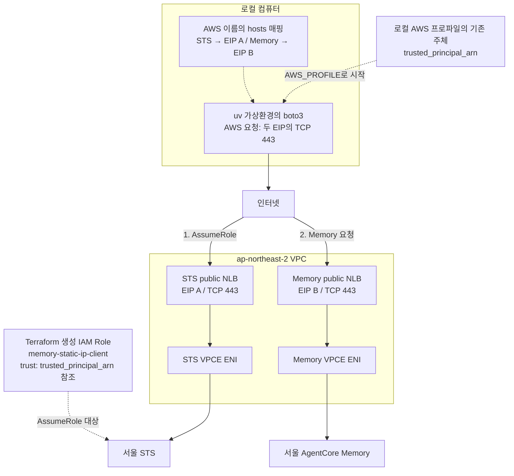
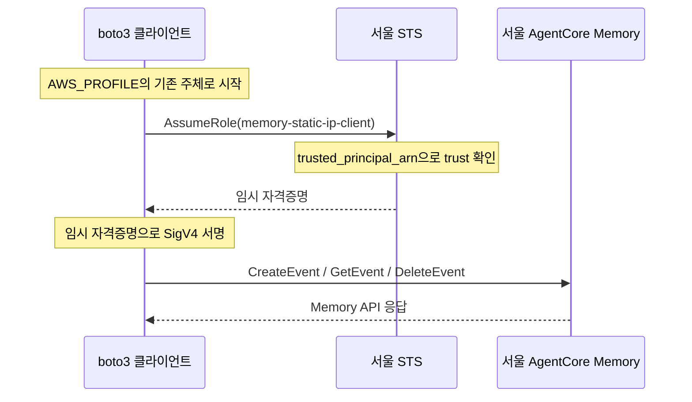

# S01 인터넷 NLB·DNS 변경·STS

- 판정: 조건부 가능. 로컬 `/etc/hosts`를 변경할 수 있어야 해요. 인증은 로컬 AWS 프로파일로 시작해요.
- 환경: [S01 준비](1-setup.md).
- 코드: [s01_public_dns_sts.py](../../../scenarios/s01_public_dns_sts.py). 한 파일에 DNS·TLS 검사, STS, Memory 호출이 모두 있어요. 설명은 [코드 설명](../../9-s01-code-walkthrough.md)에 있어요.
- 경로: 클라이언트 → 서비스별 public TCP NLB → STS/Memory VPCE.

## 아키텍처

인터넷에서 STS와 Memory의 public TCP NLB에 각각 연결해요. 그림은 기본 AZ 1개 구성이에요.



- AWS URL·TLS SNI·HTTP Host를 유지하고, DNS 응답만 각 NLB EIP로 바꿔요.
- NLB는 TLS를 그대로 전달해요. ACM 인증서와 Route 53 레코드는 필요하지 않아요.
- NLB target은 해당 VPCE ENI의 사설 IPv4예요. client IP 보존과 Proxy Protocol v2는 꺼요.
- 방화벽에는 모든 AZ의 NLB EIP를 허용해요. AZ 1개는 EIP 2개, AZ 2개는 EIP 4개예요.
- AWS 실통신 검증 범위는 [검증 상태](../../4-validation.md)를 확인해요.

## 인증과 Memory 호출 순서

로컬 AWS 프로파일의 기존 주체로 서울 STS를 호출하고, 반환된 client Role의 임시 자격증명으로 Memory 요청을 서명해요. 아래 화살표는 위 네트워크 경로를 통과해요.



- STS는 서울 endpoint를 사용하고, 서명 리전은 `ap-northeast-2`로 지정해요.
- SigV4 서명은 클라이언트에서 계산해요. 런타임 IAM API 호출은 없어요.
- Terraform은 IAM 사용자나 키를 만들지 않아요. `trusted_principal_arn`의 기존 주체를 Role trust에서 참조하고, Memory 권한은 client Role에만 있어요.
- STS endpoint policy는 PoC라서 전체 허용이에요. Memory endpoint policy와 Role의 `aws:SourceVpce` 조건은 유지해요.

## 실험

가상환경을 활성화하고, 준비한 hosts와 같은 AZ로 실행해요.

```bash
python -m scenarios.s01_public_dns_sts --az ap-northeast-2a
```

- [성공 기준](../../3-experiment.md#성공-기준)의 DNS·TLS·AssumeRole·Memory 읽기·삭제를 확인해요.
- 로컬 호출 성공만으로 outbound 차단까지 검증한 것은 아니에요. 실제 방화벽의 허용 IP·포트·차단 로그도 확인해요.
- 실험 후 [hosts 원복](../../6-hosts-setup.md#down)을 수행해요.

## 해석

- 성공하면 두 서비스의 EIP TCP 443을 통해 STS와 Memory 데이터 API를 호출하는 경로를 확인한 것이에요.
- DNS 변경 불가 클라이언트에 그대로 적용할 수는 없어요.
- 실제 회사 방화벽의 허용 IP·차단 로그 확인은 별도로 필요해요.
