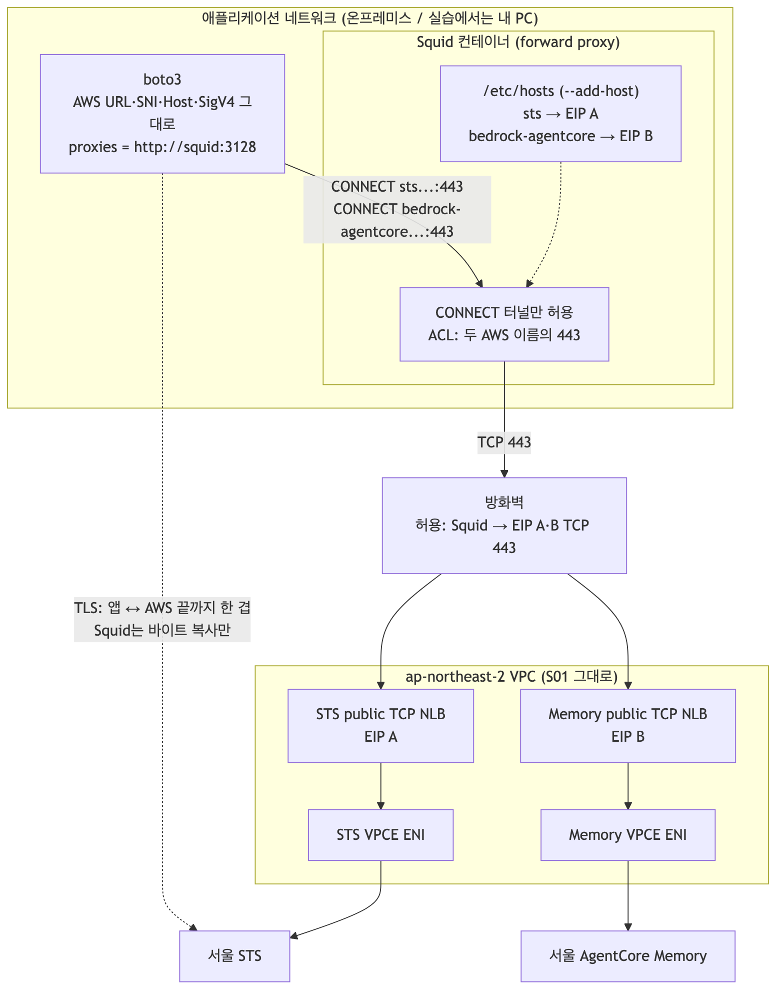
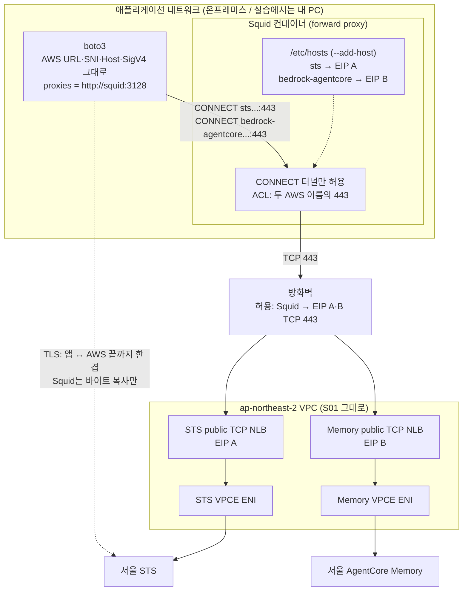
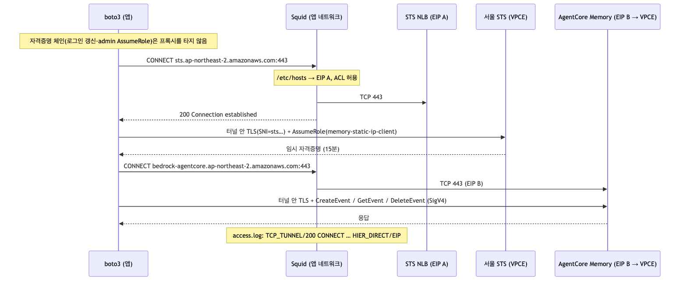
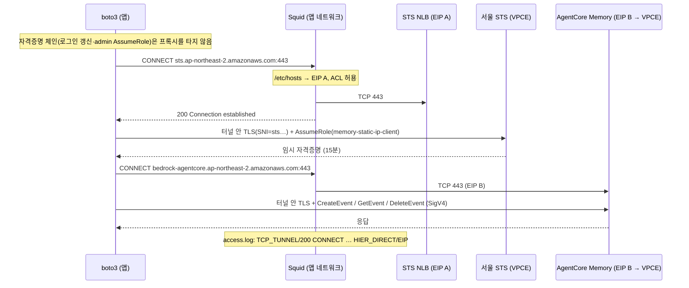

# S02 애플리케이션 네트워크의 forward proxy·hosts 변경 없음·STS

- 판정: 가능. **DNS를 바꿀 수 없을 때의 권장 구성**이에요. AWS 쪽은 S01 그대로이고, 이름을 EIP로 바꾸는 일을 앱 네트워크 안의 프록시가 맡아요.
- 환경: [S02 준비](1-setup.md).
- 코드: [s02_client_proxy_sts.py](../../../scenarios/s02_client_proxy_sts.py), [proxy/squid.conf](../../../proxy/squid.conf).
- 경로: 앱 → Squid(CONNECT 터널) → 서비스별 public TCP NLB EIP → VPCE → STS / Memory.
- 왜 AWS 안의 프록시(S07)가 아니라 여기인가: [결정](../../../knowledge/decisions/2026-09-no-connect-proxy-in-aws.md).

## 아키텍처



위 그림의 Mermaid 원본이에요. `imgs/s02-architecture.mmd`와 같아요.



- 앱이 바꾸는 것은 "AWS 클라이언트가 쓸 프록시 주소" 하나예요. URL·SNI·Host·SigV4는 AWS 이름 그대로예요.
- Squid는 CONNECT 요청의 목적지 이름을 자기 리졸버로 풀어요. 그 리졸버가 `/etc/hosts`를 먼저 보므로 컨테이너의 `--add-host`가 곧 "이름 → EIP" 매핑이에요.
- `200 Connection established` 뒤 Squid는 바이트 복사기예요. TLS 핸드셰이크는 앱과 AWS 사이에서 일어나고 Squid는 SNI와 바이트 수만 봐요.
- 인증·인가는 IAM(SigV4·Role trust·endpoint policy)뿐이에요. 프록시는 목적지 허용 목록만 가져요.

## 인증과 Memory 호출 순서



위 그림의 Mermaid 원본이에요. `imgs/s02-sequence.mmd`와 같아요.



## 애플리케이션 설정

프록시는 AWS API 클라이언트에만 줘요. 환경변수 `HTTPS_PROXY`를 전역으로 주면 자격증명 체인의 외부 호출(aws login 갱신, SSO, credential_process가 부르는 CLI)까지 프록시를 타고, 그 호스트는 허용 목록에 없어 실패해요. 2026-09-06에 실제로 `us-east-1.signin.aws.amazon.com`이 403으로 막혔어요.

```python
cfg = Config(
  region_name="ap-northeast-2",
  proxies={"https": "http://127.0.0.1:3128"},
  proxies_config={"proxy_use_forwarding_for_https": False},  # CONNECT 터널
)
sts    = session.client("sts",               config=cfg)   # endpoint_url 없음
memory = session.client("bedrock-agentcore", config=cfg)
```

- 실무에서 앱이 `HTTPS_PROXY`만 받는다면, 자격증명 갱신이 필요로 하는 호스트(SSO·signin 등)를 프록시 허용 목록에 추가하거나 `NO_PROXY`로 뺀 뒤 그 경로의 방화벽을 따로 열어요.
- `proxy_use_forwarding_for_https=True`는 프록시가 TLS를 여는 모드예요. 쓰지 않아요.

## 실험

```bash
export AWS_PROFILE=admin
export LAB_PROXY_URL=http://127.0.0.1:3128
python -m scenarios.s02_client_proxy_sts
```

## 성공 기준

```text
LOCAL_DNS_UNTOUCHED sts.ap-northeast-2.amazonaws.com -> ['<AWS 공인 IP>']...
LOCAL_DNS_UNTOUCHED bedrock-agentcore.ap-northeast-2.amazonaws.com -> [...]...
PROXY_OK http://127.0.0.1:3128
ASSUME_ROLE_OK expires=...
CALLER_IDENTITY_OK arn=arn:aws:sts::...:assumed-role/memory-static-ip-client/...
CREATE_EVENT_OK / GET_EVENT_OK payload_matches=true / DELETE_EVENT_OK
PASS client-side CONNECT proxy -> NLB EIPs -> STS / AgentCore Memory
```

| 출력 | 확인하는 내용 |
| --- | --- |
| LOCAL_DNS_UNTOUCHED | 내 컴퓨터의 DNS는 손대지 않았음. 매핑은 프록시 쪽 |
| PROXY_OK | AWS 클라이언트가 CONNECT 터널 설정을 받음 |
| ASSUME_ROLE_OK 이후 | 터널 안에서 AWS 인증·데이터 API 성공 |

프록시 로그로 목적지가 EIP였는지 확인해요.

```bash
docker exec aws-forward-proxy tail -5 /var/log/squid/access.log | awk '{print $4, $6, $7, $9}'
```

기대: `TCP_TUNNEL/200 CONNECT sts...:443 HIER_DIRECT/<EIP A>`, Memory는 `HIER_DIRECT/<EIP B>`. 허용 밖 목적지는 `TCP_DENIED/403`.

## 해석과 제한

- 앱 서버는 AWS 이름을 공인 IP로 풀어도 상관없어요. 실제 연결은 Squid가 만들고 Squid만 EIP로 나가요. 방화벽은 Squid 호스트만 열면 돼요.
- 서비스가 늘면 AWS 쪽은 NLB·endpoint·EIP 세트가, 프록시 쪽은 `--add-host`와 ACL 한 줄이 늘어요. NLB 한 개로 여러 서비스를 못 나누는 제약은 S01과 같아요.
- 실습의 Squid는 인증 없이 로컬에만 열려 있어요. 실무에서는 사내 프록시 인증·소스 제한·로그 수집을 그대로 적용해요.
- Squid가 `/etc/hosts`가 아니라 사내 DNS를 보게 하면 hosts 대신 DNS 오버라이드(방법 2)와 같아져요.
