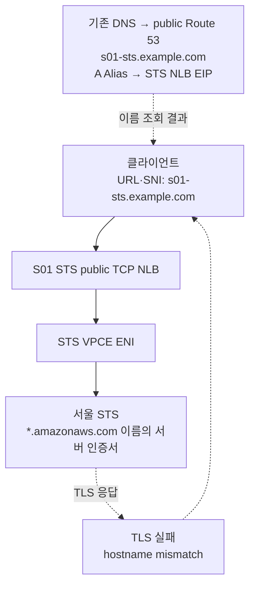

# S05 자체 도메인 Route 53 레코드만으로 NLB를 호출하는 실패 실험

- 판정: 이 구성으로 불가능. AWS TLS 서버 인증서가 자체 도메인 이름을 인증하지 않아요.
- 환경: [S05 준비](1-setup.md).
- 코드: [s05_nlb_endpoint_only.py](../../../scenarios/s05_nlb_endpoint_only.py).
- 질문: "hosts를 못 바꾸니 Route 53에 우리 도메인을 만들어 NLB에 붙이면 되지 않나?"에 대한 답이에요.

## 아키텍처

TCP NLB는 AWS 서버 인증서를 그대로 전달해요. 클라이언트가 URL·SNI에 자체 도메인을 사용하면 서버 인증서의 이름과 일치하지 않아요.



- 자체 Route 53 별칭을 NLB에 추가해도 AWS 서버 인증서의 이름은 바뀌지 않아요.
- Roles Anywhere의 클라이언트 인증서도 HTTPS 서버 이름 검증을 바꾸지 않아요.
- 실험 코드는 TLS만 검사해요. STS 인증 요청과 Memory 호출은 실행하지 않아요.
- 자체 도메인으로 성공하려면 [S07](../s07/2-experiment.md)처럼 그 도메인을 프록시 주소로만 쓰고 AWS 이름은 터널 안에서 유지해야 해요.

## 실험

S05 준비에서 지정한 URL로 TLS 사전 검사를 실행해요.

```bash
python -m scenarios.s05_nlb_endpoint_only
```

## 예상 실패 기준

인증서의 이름 불일치가 재현되면 아래 출력으로 종료돼요.

```text
EXPECTED_FAILURE TLS hostname mismatch; no credentials were sent
```

- OS가 신뢰하는 인증서여도 URL의 자체 도메인과 인증서 SAN이 다르면 실패해요.
- 테스트는 HTTP 인증 요청 전에 중단돼요. AWS 자격증명을 보내지 않아요.
- 다른 이유의 TLS 실패(연결 거부, 시간 초과)는 결론 없음으로 종료돼요. NLB target health와 EIP 허용을 확인해요.
