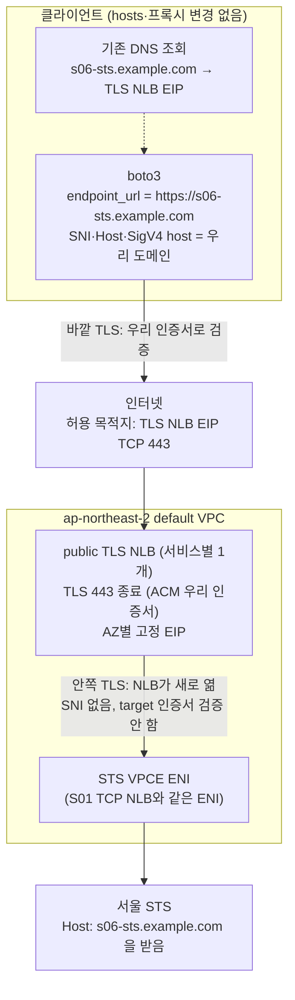

# S06 자체 도메인 TLS NLB 직결(재암호화) 실험

- 판정: **미확정**. Terraform과 클라이언트 코드는 모의 검증을 끝냈고, 실제 AWS 실행은 아직이에요. 실행 결과는 [검증 상태](../../4-validation.md)에 기록해요.
- 환경: [S06 준비](1-setup.md).
- 코드: [s06_own_domain_tls_nlb.py](../../../scenarios/s06_own_domain_tls_nlb.py).
- 질문: "NLB에 우리 도메인(Route 53)과 우리 인증서(ACM)를 붙이고 target group을 endpoint 443 TLS로 잡으면, 애플리케이션이 `endpoint_url`만 그 도메인으로 바꿔서 STS·Memory를 호출할 수 있나?"에 대한 실험이에요.

## S05와 무엇이 다른가

| | S05 | S06 |
| --- | --- | --- |
| NLB listener | TCP 443 (통과) | TLS 443 (ACM 인증서로 종료) |
| target group | TCP 443 | TLS 443 (NLB가 endpoint ENI로 새 TLS를 열어요) |
| 클라이언트가 보는 인증서 | AWS `*.amazonaws.com` → 이름 불일치로 실패 | 우리 이름의 ACM 인증서 → 통과 |
| AWS가 받는 SNI | 우리 도메인 | 없음 |
| AWS가 받는 HTTP Host·SigV4 host | (TLS에서 끝나 도달 안 함) | 우리 도메인 |

- S05는 클라이언트 쪽 TLS에서 끝났어요. S06은 그 문제를 NLB의 TLS 종료로 넘기고, 판단을 AWS 서비스 쪽으로 옮겨요.
- 그래서 S06의 결과는 AWS 서비스가 "자기 이름이 아닌 Host"와 "SNI 없는 연결"을 받아 주는지에 달려 있어요. 문서화된 동작이 아니라서 실험으로만 확인할 수 있어요.

## 아키텍처

TLS가 두 구간으로 나뉘어요. 바깥은 우리 인증서, 안쪽은 NLB가 여는 새 TLS예요.



- Memory도 같은 구조로 NLB 하나가 더 있어요. 한 TLS listener는 SNI별로 target을 나누지 못해서예요.
- NLB의 TLS listener → TLS target 구간에서는 클라이언트의 SNI가 target으로 전달되지 않아요. NLB는 target 인증서를 검증하지 않으므로 endpoint가 어떤 인증서를 내주든 handshake만 끝나면 통과해요.
- HTTP 요청은 NLB가 손대지 않아요. `Host: s06-sts.example.com`과 그 값으로 계산한 SigV4 서명이 그대로 STS에 닿아요. 서명 자체는 서버가 받은 Host로 다시 계산하므로 일치해요. 서비스가 그 Host를 자기 요청으로 인정하는지가 남는 질문이에요.

## 실험 전에 갈라 볼 수 있는 것

SNI 없는 연결을 endpoint가 받아 주는지는 S01의 TCP NLB로 미리 볼 수 있어요. TCP NLB는 ClientHello를 그대로 통과시키니까요.

```bash
sts_eip=$(jq -r '.services.sts.eips | to_entries[0].value' runtime/config.json)
openssl s_client -connect "$sts_eip:443" -noservername </dev/null 2>/dev/null |
  openssl x509 -noout -subject
```

- subject가 출력되면 SNI 없이도 handshake가 끝나요. 그러면 S06에서 실패해도 SNI가 아니라 Host 문제로 좁혀져요.
- 아무것도 안 나오면 endpoint가 SNI 없는 연결을 끊는 거예요. 이 경우 S06은 TLS target 단계에서 막히고, 클라이언트는 NLB에서 연결이 끊기는 것으로 보여요.

## 실험

S06 준비가 끝난 클라이언트에서 실행해요. AWS_PROFILE 주체는 S01과 같아요.

```bash
export AWS_PROFILE=admin
python -m scenarios.s06_own_domain_tls_nlb
```

- `REQUEST host=...` 줄은 boto3가 실제로 보낸 Host 헤더예요. 우리 도메인이어야 실험이 성립해요.
- 코드는 두 도메인의 인증서 확인 → AssumeRole → GetCallerIdentity → Memory Create/Get/Delete 순서로 진행해요. 모두 `endpoint_url`이 우리 도메인이에요.

## 결과 읽는 법

| 마지막 줄 | 종료 코드 | 의미 |
| --- | --- | --- |
| `PASS own-domain TLS NLB -> STS / AgentCore Memory with own Host header` | 0 | AWS가 우리 Host와 SNI 없는 연결을 모두 받았어요. 이 구성으로 호출 가능 |
| `REJECTED stage=STS AssumeRole code=<Code> ...` | 2 | STS가 응답은 했지만 거부했어요. `SignatureDoesNotMatch`·`InvalidClientTokenId`·`IncompleteSignature`면 Host 수용 문제, `AccessDenied`면 IAM·endpoint 정책부터 확인 |
| `REJECTED stage=Memory CreateEvent ...` | 2 | STS는 통과했고 Memory 데이터 API만 거부했어요. 서비스마다 다를 수 있다는 뜻이에요 |
| `FAIL SSLCertVerificationError ...` | 1 | 우리 인증서가 그 이름을 포함하지 않거나 DNS가 TCP NLB(S05 이름)를 가리키고 있어요 |
| `FAIL ConnectionClosedError` / `EndpointConnectionError` | 1 | NLB→endpoint의 안쪽 TLS가 안 열렸을 가능성. 위 `-noservername` 확인과 target health를 봐요 |

- REJECTED와 FAIL은 구분해요. REJECTED는 AWS까지 도달해서 판정이 난 것이고, FAIL은 그 전에 끊긴 것이라 결론이 아니에요.
- 결과가 어느 쪽이든 [검증 상태](../../4-validation.md)의 S06 행과 이 문서의 판정 줄을 함께 갱신해요.

## 결과가 PASS여도 남는 것

- AWS 서비스가 임의의 Host를 받아 주는 것은 공개 문서에 없는 동작이에요. 어느 날 바뀌어도 알림이 없어요. S01은 AWS 이름·인증서·SNI를 모두 그대로 쓰므로 이런 의존이 없어요.
- 안쪽 TLS는 NLB가 target 인증서를 검증하지 않고 열어요. VPC 안 endpoint ENI로만 가므로 경로는 닫혀 있지만, 종단 간 검증은 아니에요.
- 서비스마다 NLB·EIP가 하나씩 더 늘어요. 앱 쪽 변경은 `endpoint_url` 한 줄이라 가장 적어요.
- 그래서 결과가 PASS면 "DNS도 프록시 설정도 못 바꾸고 endpoint_url만 바꿀 수 있는 앱"이라는 조건에서 고를 수 있는 선택지로 남기고, 그 조건이 아니면 S01·S02를 먼저 봐요.

## Citations

1. NLB TLS listener → TLS target 구간에 SNI가 전달되지 않는다는 AWS re:Post 답변: <https://repost.aws/questions/QUOg0LUwafRFaorbsrYDP7xA/does-alb-send-sni-information-in-tls-handshake-to-a-back-end-server>
2. S3 interface endpoint에 자체 도메인을 쓸 때 Host 헤더를 서비스가 인식하지 못한다는 AWS re:Post 답변: <https://repost.aws/questions/QU7ed1gbzfQca1VB0uRvgnSA/access-s3-vpc-endpoint-interface-through-custom-domain>
