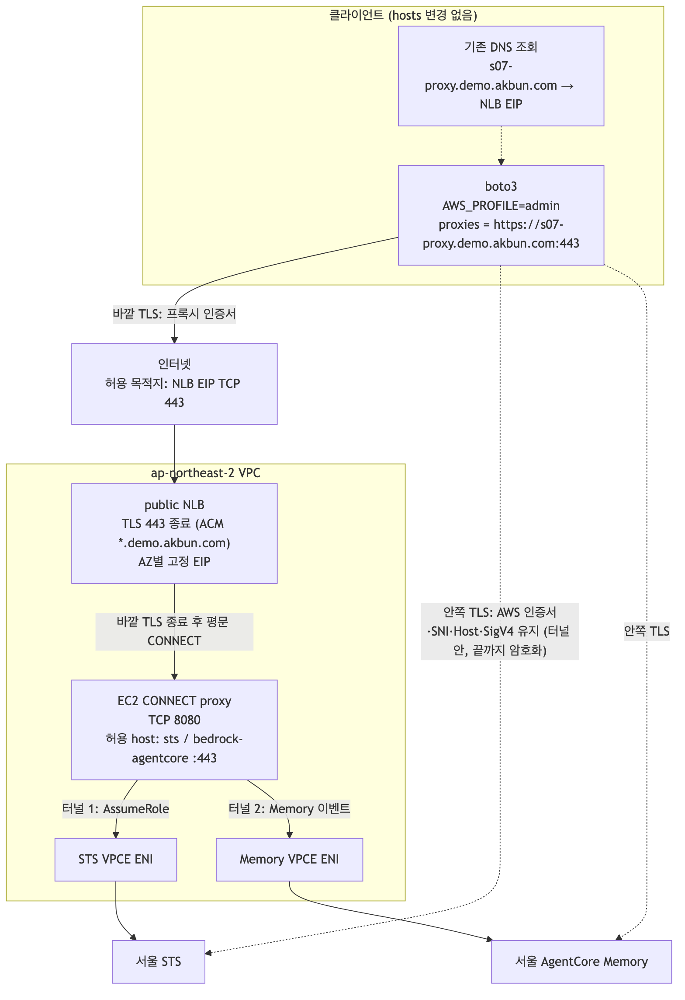
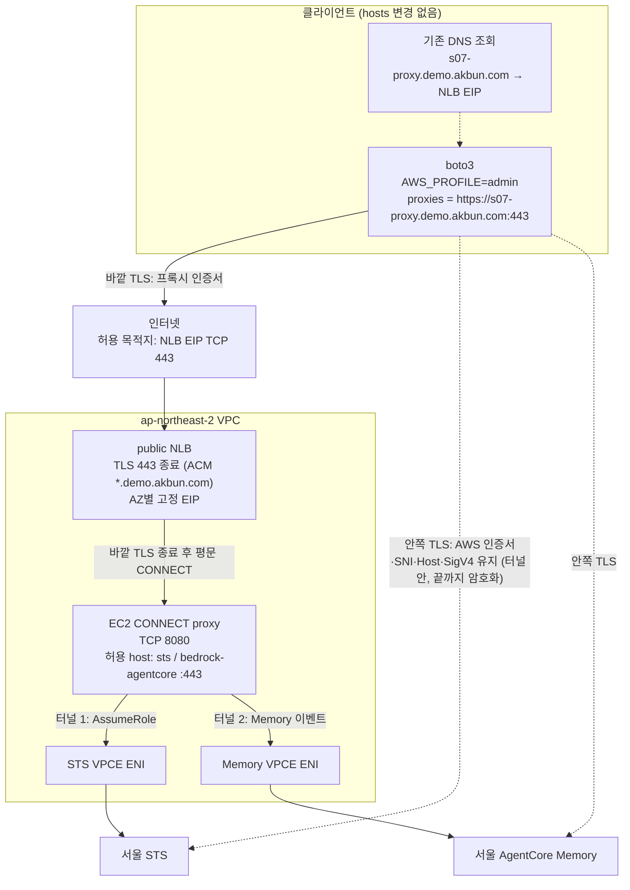
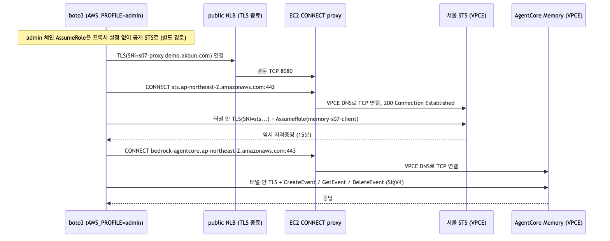
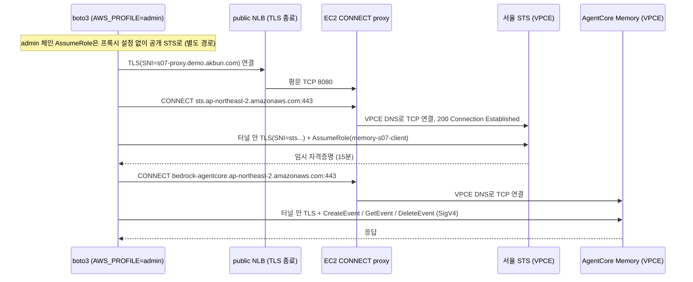

# S07 DNS 변경 없이 public NLB·프록시·STS

- 판정: 동작은 하지만 **권장하지 않아요**. 2026-09-06 실제 PASS 후 참고용으로만 남겼어요. AWS API는 IAM이 인증·인가를 끝까지 담당하는데, 중간에 EC2 프록시를 두면 그 프록시의 인증·인가를 따로 만들어야 해요. 프록시가 필요하면 애플리케이션 네트워크 쪽에 두고 AWS 쪽은 S01을 유지해요. [결정](../../../knowledge/decisions/2026-09-no-connect-proxy-in-aws.md)
- 환경: [S07 준비](1-setup.md).
- 코드: [s07_public_proxy_sts.py](../../../scenarios/s07_public_proxy_sts.py), [CONNECT 프록시](../../../proxy/connect_proxy.py).
- 경로: 인터넷 → public TLS NLB 고정 EIP → EC2 CONNECT proxy → STS/Memory VPCE.

## 아키텍처

기존 DNS에서 `proxy_domain`(예: `s07-proxy.example.com`)을 조회하고, 인터넷을 통해 public NLB EIP에 연결해요. 한 CONNECT 프록시로 STS와 Memory를 호출해요.

연결 구조예요. 바깥 TLS는 NLB에서 끝나고, 안쪽 TLS는 터널을 지나 AWS까지 유지돼요.



위 그림의 Mermaid 원본이에요. `imgs/s07-architecture.mmd`와 같아요.



- 프록시 URL: `https://<proxy_domain>:443`. `runtime/s07.json`의 `proxy_url`이에요.
- `route53_zone_id`의 zone에 A Alias 레코드가 생겨 public NLB를 가리켜요.
- 방화벽에는 모든 AZ의 NLB EIP TCP 443을 허용해요. 일반 DNS 질의 경로는 유지해요.
- AWS 실통신 검증 범위는 [검증 상태](../../4-validation.md)를 확인해요.

TLS 연결은 2겹이에요. NLB는 프록시 접속용 바깥 TLS만 종료해요.

```text
바깥 TLS: 클라이언트 =============> NLB
                                   |
                                   +--> CONNECT proxy --> VPCE --> AWS 서비스
안쪽 TLS: 클라이언트 ============================================> AWS 서비스
```

- 안쪽 TLS의 AWS 서버 인증서·SNI·Host·서명은 그대로 유지해요.
- 프록시는 허용한 AWS 호스트의 터널을 해당 VPCE로 연결해요. AWS 요청을 복호화하거나 다시 서명하지 않아요.

## 인증과 Memory 호출 순서

로컬 AWS 프로파일의 주체로 서울 STS를 호출하고, 반환된 임시 자격증명으로 Memory 요청을 서명해요. 두 호출 모두 프록시 터널을 지나요.

호출 순서예요. CONNECT 한 번에 터널 하나가 열리고, 그 안에서 AWS 요청이 오가요.



위 그림의 Mermaid 원본이에요. `imgs/s07-sequence.mmd`와 같아요.



- STS는 서울 endpoint를 사용하고, 서명 리전은 `ap-northeast-2`로 지정해요.
- SigV4 서명은 클라이언트에서 계산해요. 런타임 IAM API 호출은 없어요.

## 애플리케이션 설정

- STS와 Memory 두 boto3 client에 같은 `proxies={"https": proxy_url}`를 전달해요.
- AWS endpoint·서명 리전은 서울로 유지해요.
- NLB의 자체 도메인은 기존 DNS에서 EIP를 반환해요.
- 프록시 TLS는 ACM 인증서로, 내부 AWS TLS는 AWS 인증서로 각각 검증해요.

## 실험

STS 시작 자격증명이 적재된 클라이언트에서 실행해요.

```bash
export LAB_CONFIG="$PWD/runtime/s07.json"
python -m scenarios.s07_public_proxy_sts
```

## 성공 기준

- `STS_CREDENTIALS_OK`와 Memory 생성·내용 일치·삭제 출력 확인.
- 마지막 `PASS S07 public NLB -> CONNECT proxy + STS` 확인.
- 일반 DNS를 제외한 AWS 데이터 통신을 NLB EIP TCP 443만 허용한 상태에서 확인해요.
- STS와 Memory public IP로의 직접 연결이 차단됐는지 회사 방화벽 로그로 확인해요.

## 해석과 제한

- AWS 서비스별 NLB를 만들지 않고 NLB 한 개로 두 API를 중계해요. EIP는 AZ마다 하나예요.
- 최초 AWS 자격증명 공급·SSO 갱신은 별도예요. 이 실습의 STS는 이미 받은 자격증명을 Role 세션으로 교환해요.
- public NLB의 TCP 443은 기본적으로 모든 IPv4 소스에 공개해요. 프록시·endpoint의 SG 참조와 AWS 인증은 유지해요.
- 프록시는 STS·Memory의 정확한 호스트와 443만 허용해요.
- Python은 로컬 방화벽을 변경하지 않아요. 실제 차단 정책 적용 전 결과는 방화벽 제약의 검증이 아니에요.
