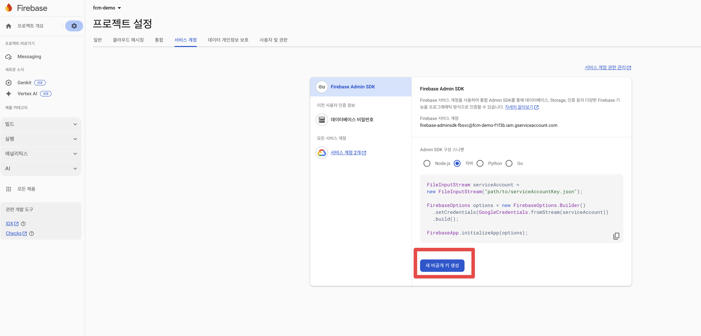

## 개요

* docker-compose를 사용하여 JAVA firebase-admin SDK 9.2.0과 9.4.3 비교

## 실습환경

* 모니터링: proemtheus, grafana, JVM metrics
* 접속주소
  * firebase-admin SDK 9.4.3: http://localhost:8080/send
  * firebase-admin SDK 9.2.0: http://localhost:8081/send
  * grafana: http://localhost:30085 (admin/password1234)

## 실습환경 생성

> 실습을 하기 위해 firebase 프로젝트가 생성되어 있어야 합니다.

1. firebaes java sdk 설정 json파일를 아래 경로에 복사

```sh
./docker-config/springboot/firebase-adminsdk.json
```




2. docker compse up

```sh
docker compose up -d
```

## 부하테스트 방법

```sh

```

## 실습환경 삭제

```sh
docker compose down
```
