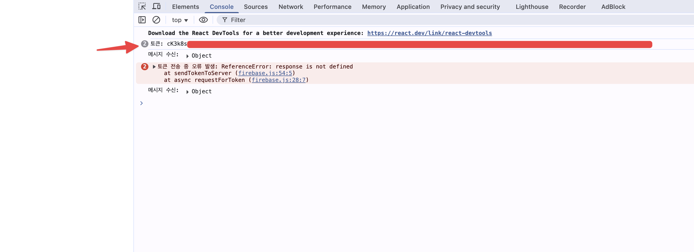

## 개요

* firebase API key를 생성하는 프론트엔드

## 실행 방법

1. npm 패키지 설치

```sh
npm install

```

2. 환경변수 파일 복사

```sh
cp .env.example .env
```

3. 환경변수 설정


```sh
vi .env.example
```

4. 프로젝트 실행 후 console창에서 토큰 확인

```sh
npm run dev
```


