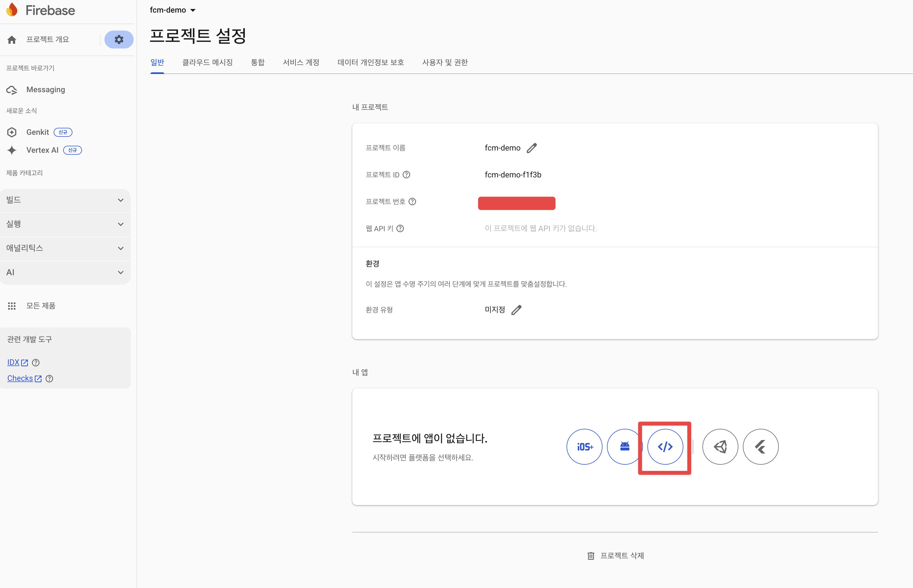
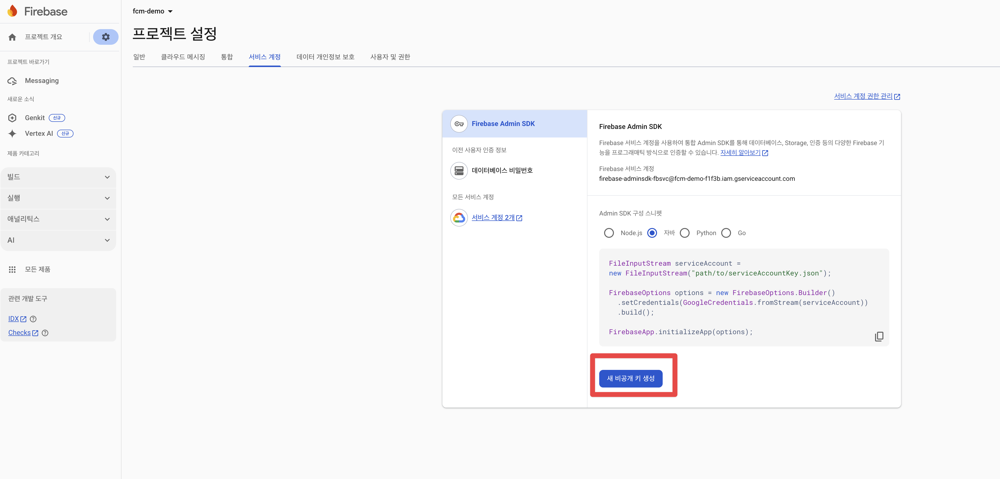

## 개요

* kubernetes 사용하여 JAVA firebase-admin SDK 9.2.0과 9.4.3 비교

## 환경 구축

* 쿠버네티스: kind 클러스터
* 모니터링: proemtheus operator, grafana, JVM metrics, kubernetes metrics
* 접속주소
  * firebase-admin SDK 9.2.0: http://localhost:30080/send
  * firebase-admin SDK 9.4.3: http://localhost:30090/send
  * grafana: http://localhost:30085 (admin/password1234)

> 실습을 하기 위해 firebase 프로젝트가 생성되어 있어야 합니다.

1. kind 클러스터 생성

```sh
make up
```

2. helm chart 릴리즈

```sh
helmfile apply
```

3. firebaes java sdk 설정 json파일를 아래 경로에 복사

```sh
./manifests/firebase-adminsdk.json
```






4. firebase-admin SDK 9.2.0과 9.4.3 비교

```sh
cd manifests/

# secret 생성
kubectl create secret generic firebase-secret \
  --from-file=firebase-adminsdk.json=firebase-adminsdk.json \
  -n default

# deployment, svc 배포
kubectl apply -f backend-v920.yaml
kubectl apply -f backend-v940.yaml
```

## 부하 테스트

* [부하테스트 문서 바로가기](./stress-test/)

## 환경 삭제

```sh
make down
```
