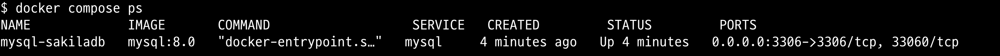

<!-- TOC -->

- [개요](#%EA%B0%9C%EC%9A%94)
- [생성방법](#%EC%83%9D%EC%84%B1%EB%B0%A9%EB%B2%95)
- [참고자료](#%EC%B0%B8%EA%B3%A0%EC%9E%90%EB%A3%8C)

<!-- /TOC -->

## 개요

- mysql 도커 컨테이너을 실행과 동시에 sakila 데이터베이스를 로드

## 생성방법

1. mysql sakila databae 예제 sql 다운로드

```sh
mkdir initdb
cd initdb
curl -O 'https://downloads.mysql.com/docs/sakila-db.zip'
unzip -j sakila-db.zip && rm sakila-db.zip
```

2. sql파일에 실행순서를 결정하기 위해 sql파일에 숫자를 설정

> 참고자료: https://dev.mysql.com/doc/sakila/en/sakila-installation.html

```sh
cd initdb
mv sakila-schema.sql 01_sakila-schema.sql && \
	mv sakila-data.sql 02_sakila-data.sql
```

3. docker container 실행

```sh
docker compose up -d
```

4. 실행 확인

```sh
docker-compose ps
```



## 참고자료

* mysql sakila 공식문서: https://dev.mysql.com/doc/sakila/en/
