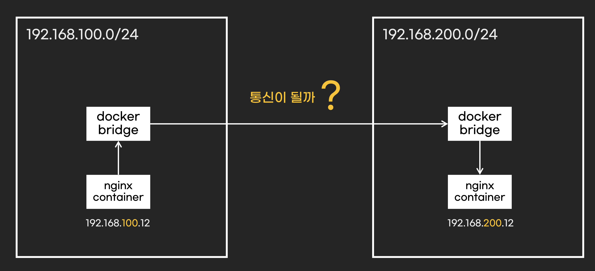
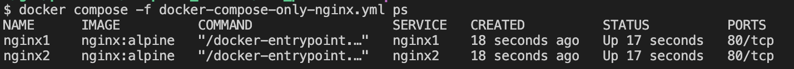
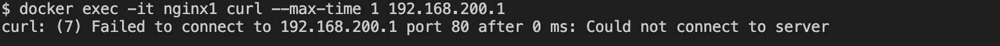
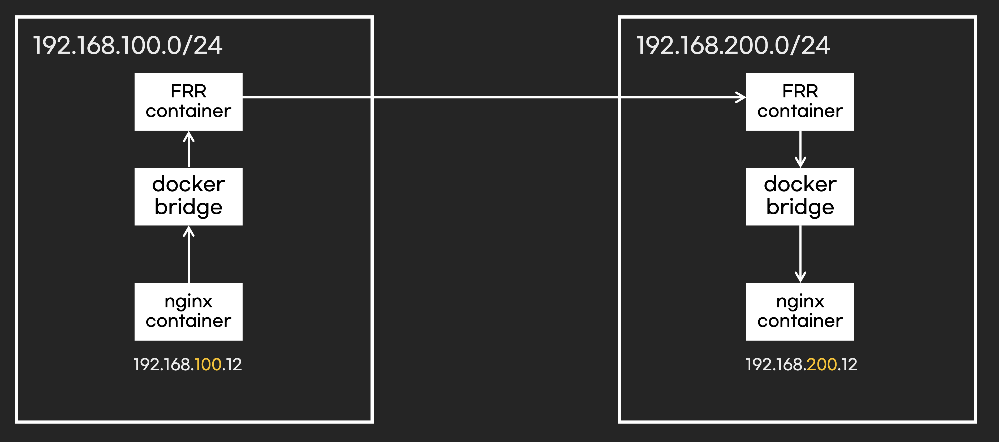
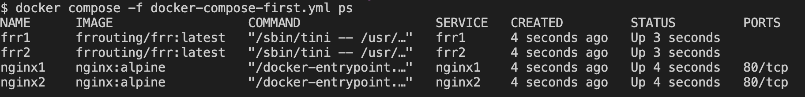

## 개요

* docker를 사용하여 BGP 프로토콜 간단히 실습

## 실습환경 구축

* docker compose로 FRR컨테이너와 nginx 컨테이너 구축
* FRR 설정파일 목록
  * frr.conf
  * daemons: FRR컴퍼넌트 활성화 여부 설정
  * vtysh.conf: FRR컴퍼넌트들의 설정파일들을 frr.conf 한개로 사용

## 기타 실습파일

* [Makefile - 로컬 자동화 스크립트 실행](./Makefile)
* [(deprecated)terraform - aws환경에서 containerlab 설정](./terraform/)
* [deprecated - containerlab](./depreacted/)

## 첫번째 시나리오: 라우터가 없으면?

### 개요

* 다른 대역과 통신할 때 라우터가 필요하다.
* 첫번째 시나리오는 라우터가 없을때, 다른 대역과 통신이 안되는 것을 실습한다.



### 실습

1. docker compose up

```sh
docker compose -f docker-compose-only-nginx.yml up -d
```

2. 실행 확인

```sh
docker compose -f docker-compose-only-nginx.yml ps
```



3. nginx1 컨테이너 -> nginx2 컨테이너 통신 확인

* 대역이 다르기 때문에 당연히 통신 불가

```sh
docker exec -it nginx1 curl --max-time 1 192.168.200.12
```



4. 실습 환경 삭제

```sh
docker compose -f docker-compose-only-nginx.yml down
```

### 두번쨰 시나리오, 라우터가 있는 경우 다른 대역 통신 성공

* 첫번째 시나리오에서 라우터를 추가하여, 다른 대역과 통신이 되는 것을 확인한다.



1. docker compose up

```sh
docker compose -f docker-compose-first.yml up -d
```

2. 실행 확인

```sh
docker compose -f docker-compose-first.yml ps
```



3. 각 FRR 컨테이너에서 BGP프로토콜로 공유받은 IP대역 확인

```sh
docker exec -it frr1 vtysh -c "show ip route"
docker exec -it frr2 vtysh -c "show ip route"
```

4. nginx1 컨테이너에서 OS 라우팅 정보 확인


```sh
docker exec -it nginx1 ip route
```

5. nginx1 컨테이너 -> nginx2 컨테이너 통신 확인

* 대역이 다르기 때문에 당연히 통신 불가

```sh
docker exec -it nginx1 curl --max-time 1 192.168.200.12
<!DOCTYPE html>
<html>
<head>
<title>Welcome to nginx!</title>
```

6. 실습 환경 삭제

```sh
docker compose -f docker-compose-first.yml down
```

## 세번째 시나리오

* BGP프로토콜 전파 확인
* BGP 설정. frr2 <-> frr3은 BGP설정을 안했지만 서로 통신이 됨
  * frr1 <-> frr2
  * frr1 <-> frr3

1. 실습환경 구축 및 호출 테스트

```sh
docker compose -f docker-compose-second.yml up -d
docker exec -it nginx1 curl --max-time 1 192.168.210.12
```

2. BGP path확인

```sh
docker exec -it frr1 vtysh -c "show ip bgp"
```

3. 실습 환경 삭제

```sh
docker compose -f docker-compose-second.yml down
```
