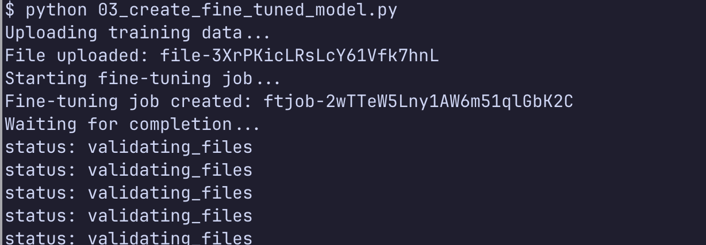
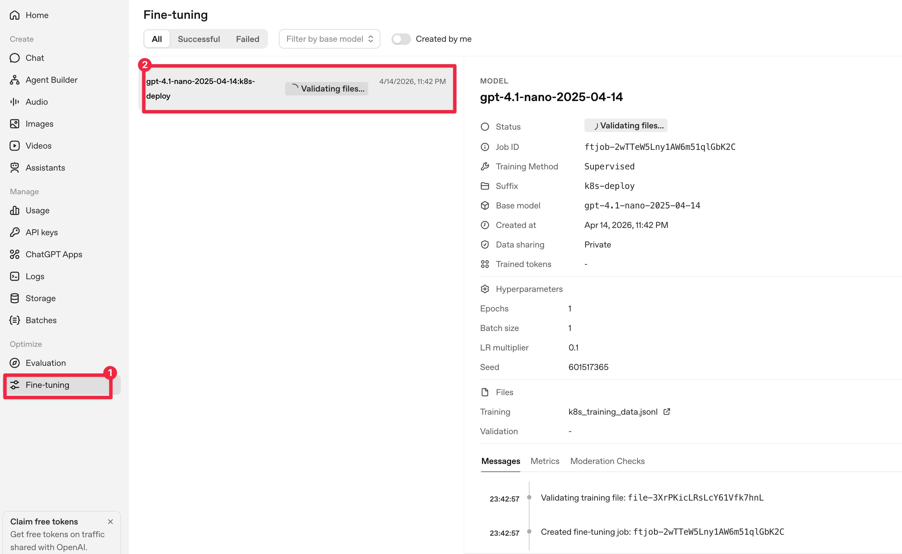

# Kubernetes Fine-tuning Quickstart

OpenAI `gpt-4.1-nano` 모델로 3분 안에 끝내는 파인튜닝 실습.

## 이 실습은 무엇인가

파인튜닝 개념을 빠르게 체험하는 것이 목표다. 적은 데이터(10개 예제), 가장 싼 모델, 1 epoch로 **3분 내외**에 학습을 끝낸다. 학습 주제는 **Kubernetes Deployment manifest 생성**이다. 모델이 항상 `app label`, `resources.requests`, `resources.limits`를 포함하는 스타일을 배우도록 시킨다.

## 구성 요소

| 항목 | 값 |
|---|---|
| 모델 | `gpt-4.1-nano-2025-04-14` (fine-tuning 지원 중 최저가) |
| 학습 데이터 | `k8s_training_data.jsonl` · 10개 예제 · JSONL 포맷 |
| 가상환경 | `uv` 기반 Python 3.12 |
| 파일 구조 | `01_test_base_model.py`, `02_create_training_data.py`, `03_create_fine_tuned_model.py`, `04_test_fine_tuned_model.py` |

## 파인튜닝은 내부적으로 어떻게 돌아가나

코드 한 줄 뒤에서 OpenAI 플랫폼은 다음 단계를 순서대로 밟는다. 이걸 알고 있으면 실습 중 로그가 어느 단계인지 바로 읽힌다.

| 단계 | 설명 |
|---|---|
| 1. File upload | `client.files.create(purpose="fine-tune")` → JSONL이 OpenAI Files 스토리지에 올라가고 `file_id`가 발급된다. |
| 2. Validation | 플랫폼이 JSONL 포맷·메시지 스키마·토큰 수를 검증한다. 한 줄이라도 깨지면 job이 `failed`로 끝난다. |
| 3. Job queued | `fine_tuning.jobs.create` 호출 시 job이 큐에 들어간다. 상태: `validating_files → queued → running`. |
| 4. Training | 베이스 모델(`gpt-4.1-nano`)에 **LoRA 방식 어댑터**를 `n_epochs`만큼 학습시킨다. 원본 가중치는 건드리지 않는다. |
| 5. Model 발급 | 학습이 끝나면 `ft:gpt-4.1-nano-...:org::suffix` 형식의 전용 모델 ID가 발급되고 즉시 호출 가능해진다. |

플랫폼 UI에서 같은 job을 `platform.openai.com/finetune`에서 확인할 수 있다. 실습 중엔 CLI 폴링만으로 충분하다.

## Step 1. 환경 준비

아래 명령으로 uv 가상환경을 만들고 openai 패키지를 설치한다.

```bash
cd kubernetes-finetuning
uv init --python 3.12
uv add openai
export OPENAI_API_KEY="xxxx"   # 실제 키로 교체
```

## Step 2. 학습 전 베이스 모델 확인

파인튜닝 전의 응답을 먼저 본다. `resources` 블록이 빠지거나 label이 불규칙한 것을 확인한다.

```bash
uv run python 01_test_base_model.py
```

## Step 3. 학습 데이터 생성

10개의 Deployment 예제를 `k8s_training_data.jsonl`로 저장한다. OpenAI 파인튜닝은 JSONL(한 줄당 한 JSON) 포맷만 허용하므로 `indent`를 적용하지 않는다.

```bash
uv run python 02_create_training_data.py
```

## Step 4. 파인튜닝 실행

업로드 → job 생성 → 10초 간격 polling 순서로 동작한다. 30분정도 걸린다. 완료되면 모델 ID가 `fine_tuned_model_id.txt`에 저장된다.

```bash
uv run python 03_create_fine_tuned_model.py
```





## Step 5. 학습된 모델 실행

같은 질문을 다시 던져본다. 이번에는 `app label`과 `resources`가 항상 포함된 일관된 manifest가 나와야 한다. 이게 파인튜닝이 "스타일을 학습했다"는 증거다.

```bash
uv run python 04_test_fine_tuned_model.py
```

## Tip

파인튜닝은 **지식 주입이 아니라 스타일/포맷 주입**에 가깝다. 모델에게 새 사실을 가르치고 싶다면 RAG가 더 적합하다. 이 실습은 "같은 질문에 일관된 포맷으로 답하게 만들기"가 파인튜닝의 본질임을 체감하는 것이 목적이다.
