# Chapter 5 EKS 전체 실습

`chapter5-chatbot` 디렉터리 기준으로 시작한다. Terraform 명령은 `eks/terraform` 디렉터리 안에서 실행한다.
EKS에서 JupyterHub, fine-tuning Job, inference API, RAG API, chatbot UI를 순서대로 배포한다.

## TL;DR

- `terraform apply`는 직접 실행한다. Codex는 `fmt`, `validate`, `plan`까지만 확인한다.
- EKS는 `ap-northeast-2` default VPC와 default subnet을 사용한다.
- 데이터셋, notebook, 모델 아티팩트는 S3 Files PVC를 통해 파일시스템처럼 mount한다.
- JupyterHub, inference API, Chatbot UI 접속 확인은 `kubectl port-forward`를 사용한다.

## 공통 전제

- AWS CLI, Terraform, `kubectl`, `helm`, `helmfile`, `envsubst`를 사용할 수 있다.
- Hugging Face model download와 Qdrant snapshot download가 가능한 네트워크를 준비한다.
- OpenAI API key를 준비한다.
- 확인 필요: `g6.xlarge` Spot 용량은 AZ와 시점에 따라 부족할 수 있다.

## 1. EKS 인프라 준비

단계 1. Terraform 변수를 준비한다.

```bash
export AWS_PROFILE=eks
cd eks/terraform
cp terraform.tfvars.example terraform.tfvars
```

단계 2. Terraform plan을 확인한다.

```bash
terraform init
terraform fmt -recursive
terraform validate
terraform plan
```

단계 3. plan을 확인한 뒤 직접 apply한다.

```bash
terraform apply
```

단계 4. kubeconfig를 설정한다.

```bash
aws eks update-kubeconfig \
  --region "$(terraform output -raw aws_region)" \
  --name "$(terraform output -raw cluster_name)"
```

단계 5. node를 확인한다.

```bash
kubectl get nodes -L node-type,nvidia.com/gpu,node.kubernetes.io/instance-type
```

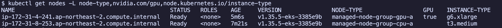

## 2. EKS add-on 이후 Kubernetes 기본 구성

단계 1. Terraform output과 실습 입력값을 환경 변수로 둔다.

```bash
export AWS_REGION=$(terraform output -raw aws_region)
export EKS_CLUSTER_NAME=$(terraform output -raw cluster_name)
export VPC_ID=$(terraform output -raw default_vpc_id)
export S3FILES_FILE_SYSTEM_ID=$(terraform output -raw s3files_file_system_id)
export S3FILES_ACCESS_POINT_ID=$(terraform output -raw s3files_access_point_id)
export S3FILES_MODEL_ASSETS_ACCESS_POINT_ID=$(terraform output -raw s3files_model_assets_access_point_id)
export ALB_CONTROLLER_ROLE_ARN=$(terraform output -raw alb_controller_role_arn)
export JUPYTERHUB_DUMMY_PASSWORD=changeme
```

사용자 환경에 맞게 바꾸는 값은 다음과 같다.

- `JUPYTERHUB_DUMMY_PASSWORD`: JupyterHub 실습 로그인 비밀번호

단계 2. Helmfile과 Kubernetes manifest가 사용할 환경 변수를 확인한다.

`eks/helmfile.yaml.gotmpl`은 다음 환경 변수를 `requiredEnv`로 읽는다.

- `AWS_REGION`
- `EKS_CLUSTER_NAME`
- `VPC_ID`
- `ALB_CONTROLLER_ROLE_ARN`
- `JUPYTERHUB_DUMMY_PASSWORD`

Kubernetes manifest의 `envsubst`는 다음 환경 변수를 사용한다.

- `S3FILES_FILE_SYSTEM_ID`
- `S3FILES_ACCESS_POINT_ID`
- `S3FILES_MODEL_ASSETS_ACCESS_POINT_ID`

단계 3. AWS Load Balancer Controller와 NVIDIA device plugin을 설치한다.

```bash
helmfile -f eks/helmfile.yaml.gotmpl apply --selector phase=addons
```

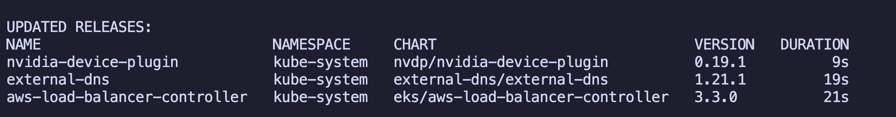

단계 4. NVIDIA device plugin 설치 이유를 확인한다.

`AL2023_x86_64_NVIDIA` EKS optimized AMI에는 NVIDIA driver와 container toolkit이 들어 있지만, NVIDIA Kubernetes device plugin은 들어 있지 않다.
이 실습의 GPU Job과 inference Deployment는 `nvidia.com/gpu` extended resource를 요청하므로 device plugin을 설치해야 한다.

단계 5. gp3 StorageClass와 S3 Files PVC를 만든다.

```bash
kubectl create namespace jupyterhub --dry-run=client -o yaml | kubectl apply -f -
kubectl apply -f eks/manifests/storage/gp3-storageclass.yaml
kubectl apply -f eks/manifests/storage/nfs-storageclass.yaml

# EFS CSI volumeHandle 때문에 S3 Files file system/access point ID를 주입한다.
export S3FILES_FILE_SYSTEM_ID=$(terraform output -raw s3files_file_system_id)
export S3FILES_ACCESS_POINT_ID=$(terraform output -raw s3files_access_point_id)
export S3FILES_MODEL_ASSETS_ACCESS_POINT_ID=$(terraform output -raw s3files_model_assets_access_point_id)
envsubst < eks/manifests/s3files/persistent-volume.yaml | kubectl apply -f -
kubectl apply -f eks/manifests/s3files/persistent-volume-claim.yaml
envsubst < eks/manifests/s3files/model-assets-persistent-volume.yaml | kubectl apply -f -
kubectl apply -f eks/manifests/s3files/model-assets-persistent-volume-claim.yaml

kubectl get storageclass gp3
kubectl get storageclass s3files-static s3files-model-assets-static
kubectl get pvc -n jupyterhub chapter5-s3files-pvc chapter5-model-assets-pvc
```

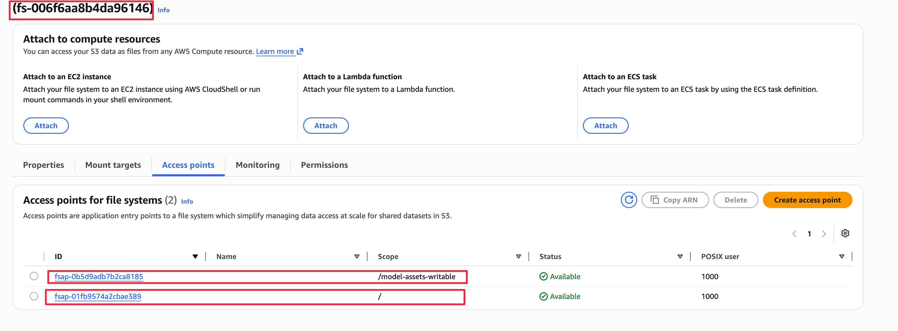

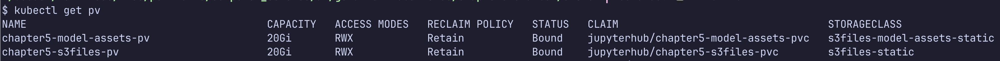

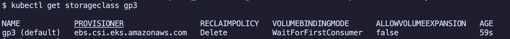

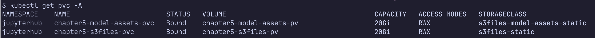

## 3. Experimentation using JupyterHub

단계 1. JupyterHub를 설치한다.

```bash
helmfile -f eks/helmfile.yaml.gotmpl apply --selector app=jupyterhub
```

단계 2. JupyterHub에 접속한다.

```bash
kubectl -n jupyterhub port-forward service/proxy-public 8081:80
```

브라우저에서 접속한다.

```text
http://localhost:8081
```

로그인 정보는 다음 값을 사용한다.

- 사용자: `k8s-user1`
- 비밀번호: `JUPYTERHUB_DUMMY_PASSWORD` 환경 변수 값

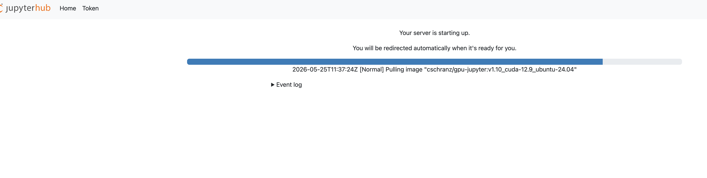

단계 3. notebook을 user home으로 복사한다.

```bash
cp /opt/notebooks/03_fine_tuning_qwen.ipynb ~/
```

주의! s3 filesystem access point 권한이 잘못되어 있으면, 아래처럼 오류가 난다. 오류가 나면 AWS S3 filesystem id를 다시 확인하고 pv,pvc를 다시 생성한다.

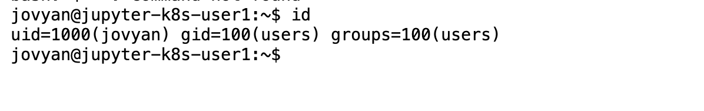

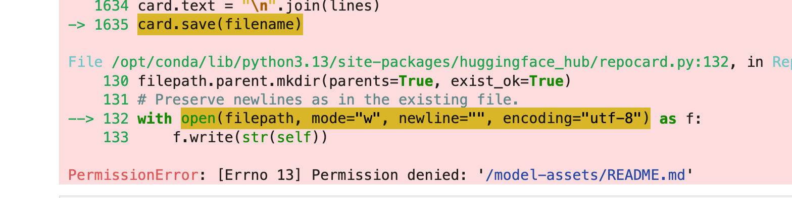


올바른 권한은 아래처럼 되어 있어야 합니다.

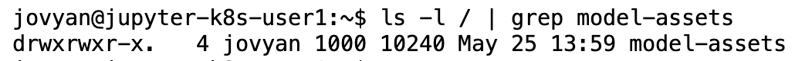

## 4. Fine-tuning Qwen in EKS

단계 1. fine-tuning Job을 실행한다.

```bash
kubectl apply -f eks/manifests/llama-finetuning/job.yaml
kubectl logs -l app.kubernetes.io/name=qwen-finetuning -n jupyterhub -f
kubectl wait -n jupyterhub --for=condition=complete job/qwen-finetuning-job --timeout=30m
```

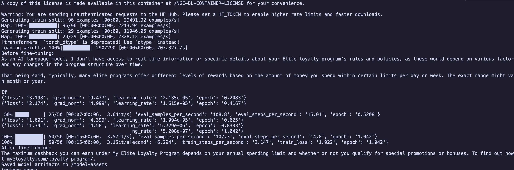

## 5. Deploying the fine-tuned model on EKS

단계 1. inference API를 배포한다.

```bash
kubectl apply -f eks/manifests/inference/deployment.yaml
kubectl apply -f eks/manifests/inference/service.yaml
kubectl rollout status -n jupyterhub deployment/loyalty-inference-deployment --timeout=300s
```

단계 2. inference API를 직접 호출한다.

```bash
kubectl port-forward -n jupyterhub service/loyalty-inference-service 8082:80
```

다른 터미널에서 요청한다.

```bash
curl -s http://localhost:8082/generate \
  -H 'Content-Type: application/json' \
  -d '{"prompt":"[MyElite Loyalty Program FAQ]: Does the MyElite Loyalty Program offer any discount on purchases?"}'
```

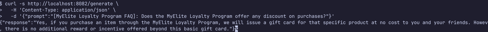

## 6. Deploy a RAG application on EKS

단계 1. OpenAI Secret을 만든다.

```bash
cp eks/manifests/secrets/openai-secret.example.yaml \
  eks/manifests/secrets/openai-secret.yaml
```

단계 2. `eks/manifests/secrets/openai-secret.yaml`의 `replace-me`를 실제 key로 바꾼 뒤 적용한다.

```bash
kubectl apply -f eks/manifests/secrets/openai-secret.yaml
```

단계 3. Qdrant를 설치한다.

```bash
helmfile -f eks/helmfile.yaml.gotmpl apply --selector app=qdrant

kubectl -n qdrant get pods
```

단계 4. Qdrant catalog snapshot을 복원한다.

```bash
kubectl apply -f eks/manifests/rag-app/qdrant-restore-job.yaml
kubectl logs job/qdrant-restore-job -f
kubectl wait --for=condition=complete job/qdrant-restore-job --timeout=10m
```

단계 5. RAG API를 배포한다.

```bash
kubectl apply -f eks/manifests/rag-app/deployment.yaml
kubectl apply -f eks/manifests/rag-app/service.yaml
kubectl rollout status deployment/rag-app-deployment --timeout=300s
```

## 7. Deploying a chatbot on EKS

단계 1. Chatbot UI를 배포한다.

```bash
kubectl apply -f eks/manifests/chatbot/deployment.yaml
kubectl apply -f eks/manifests/chatbot/service.yaml
```

단계 2. Chatbot UI에 port-forward로 접속한다.

```bash
kubectl port-forward service/chatbot-ui-service 7860:7860
```

브라우저에서 접속한다.

```bash
open http://localhost:7860
```

선택: ALB까지 확인해야 하면 Ingress manifest를 적용한다.

```bash
kubectl apply -f eks/manifests/chatbot/ingress.yaml
kubectl get ingress chatbot-ui-ingress
kubectl get ingress chatbot-ui-ingress \
  -o jsonpath='{.status.loadBalancer.ingress[0].hostname}{"\n"}'
```

## 검증

- Chatbot UI 테스트 스크립트: [링크](../../docs/common-principles.md#chatbot-ui-테스트-스크립트)

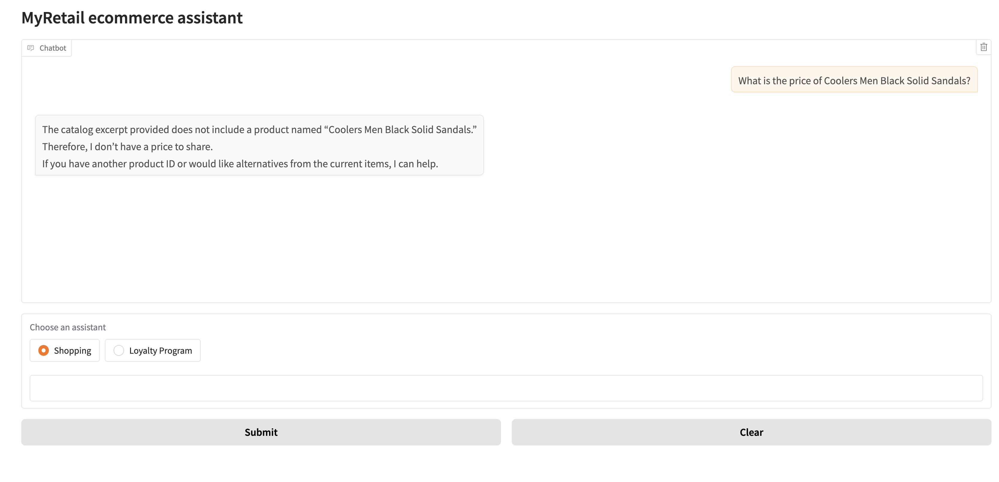


## 정리

Kubernetes 리소스를 삭제한다.

```bash
kubectl delete ingress chatbot-ui-ingress --ignore-not-found
kubectl delete -f eks/manifests/chatbot/service.yaml --ignore-not-found
kubectl delete -f eks/manifests/chatbot/deployment.yaml --ignore-not-found
kubectl delete -f eks/manifests/rag-app/service.yaml --ignore-not-found
kubectl delete -f eks/manifests/rag-app/deployment.yaml --ignore-not-found
kubectl delete -f eks/manifests/rag-app/qdrant-restore-job.yaml --ignore-not-found
kubectl delete -f eks/manifests/inference/service.yaml --ignore-not-found
kubectl delete -f eks/manifests/inference/deployment.yaml --ignore-not-found
kubectl delete -f eks/manifests/llama-finetuning/job.yaml --ignore-not-found
helmfile -f eks/helmfile.yaml.gotmpl destroy --selector app=jupyterhub
helmfile -f eks/helmfile.yaml.gotmpl destroy --selector app=qdrant
helmfile -f eks/helmfile.yaml.gotmpl destroy --selector phase=addons
```

Terraform 리소스는 직접 destroy한다.

```bash
cd eks/terraform
terraform destroy
```

## 참고자료

- 공통 원리: ../../docs/common-principles.md
- EKS troubleshooting: troubleshooting.md
- Amazon EKS S3 Files CSI: https://docs.aws.amazon.com/eks/latest/userguide/s3files-csi.html
- EKS optimized accelerated AMIs: https://docs.aws.amazon.com/eks/latest/userguide/ml-eks-optimized-ami.html
- Manage NVIDIA GPU devices on Amazon EKS: https://docs.aws.amazon.com/eks/latest/userguide/device-management-nvidia.html
- S3 Files prerequisites: https://docs.aws.amazon.com/AmazonS3/latest/userguide/s3-files-prereq-policies.html
- EFS CSI driver S3 Files support: https://github.com/kubernetes-sigs/aws-efs-csi-driver
- 원본 예제: https://github.com/PacktPublishing/Kubernetes-for-Generative-AI-Solutions/tree/main/ch5
