# Chapter 5 K3s 전체 실습

현재 디렉터리 기준으로 실행한다. K3s single-node에서 JupyterHub, fine-tuning Job, inference API, RAG API, chatbot UI를 순서대로 배포한다.

> **CUDA 버전 주의**
>
> 이 실습의 JupyterHub single-user image는 `cschranz/gpu-jupyter:v1.10_cuda-12.9_ubuntu-24.04`를 사용한다.
> 현재 검증 환경은 NVIDIA driver `595.71.05`, `nvidia-smi` 기준 CUDA `13.2`다.
> host driver가 container CUDA runtime보다 낮으면 GPU notebook이 실패할 수 있다.
> PyTorch가 없는 `python-only` image나 CUDA 11.8 image로 바꾸지 않는다.

## 공통 전제

- [GPU 부트스트랩](gpu-bootstrap.md)을 완료한다.
- Docker와 `kubectl`을 사용할 수 있다.
- `export KUBECONFIG=/etc/rancher/k3s/k3s.yaml`를 shell에 설정한다.
- OpenAI API key를 준비한다.
- Hugging Face model download와 Qdrant snapshot download가 가능한 네트워크를 준비한다.

`kubectl` 또는 `helm`에서 kubeconfig 권한 오류가 나면 같은 명령을 다음 형태로 실행한다.

```bash
sudo k3s kubectl get nodes
sudo env KUBECONFIG=/etc/rancher/k3s/k3s.yaml helm list
```

## 1. Experimentation using JupyterHub

단계 1. Helm이 없으면 먼저 설치한다.

```bash
command -v helm >/dev/null || sudo snap install helm --classic
helm version
```

단계 2. 데이터셋과 notebook을 K3s local asset 경로에 복사한다.

```bash
sudo mkdir -p /opt/genai-ch5/data
sudo mkdir -p /opt/genai-ch5/notebooks
sudo cp data/chapter5/* /opt/genai-ch5/data/
sudo cp k3s/notebooks/* /opt/genai-ch5/notebooks/
sudo chmod -R a+rX /opt/genai-ch5/data /opt/genai-ch5/notebooks
```

단계 3. PVC를 만든다.

```bash
kubectl apply -f k3s/manifests/local-assets/pv-pvc.yaml
kubectl apply -f k3s/manifests/model-assets/pvc.yaml
kubectl get pvc chapter5-data-pvc chapter5-notebooks-pvc model-assets-pvc
```

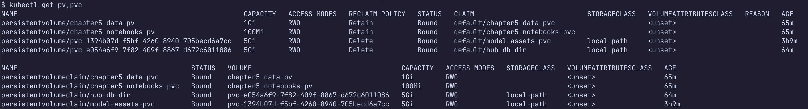

PVC는 jupyterhub에서 아래처럼 mount되어서 사용된다.

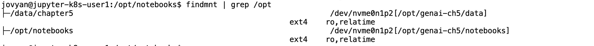

단계 4. JupyterHub를 설치한다.

```bash
command -v envsubst >/dev/null || {
  sudo apt-get update
  sudo apt-get install -y gettext-base
}

export JUPYTER_PASSWORD=changeme
envsubst < k3s/values/jupyterhub/values.yaml > /tmp/jupyterhub-values.yaml

helm repo add jupyterhub https://hub.jupyter.org/helm-chart/ --force-update
helm repo update
helm upgrade --install jupyterhub jupyterhub/jupyterhub \
  --values /tmp/jupyterhub-values.yaml \
  --version 4.3.5
```

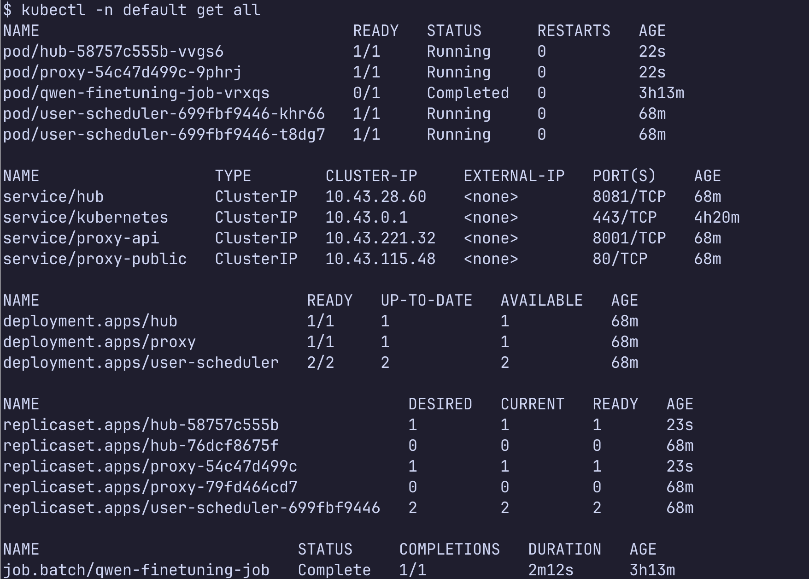

단계 5. JupyterHub에 접속한다.

```bash
kubectl port-forward service/proxy-public 8081:80
```

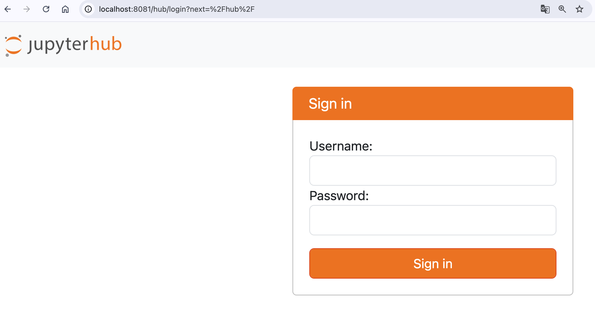

단계 6. 브라우저에서 접속한다.

```text
http://localhost:8081
```

단계 7. 로그인 정보는 다음 값을 사용한다.

- 사용자: `k8s-user1`
- 비밀번호: `changeme`
- 서버를 선택하면 GPU 리소스가 있는 pod가 생성된다.

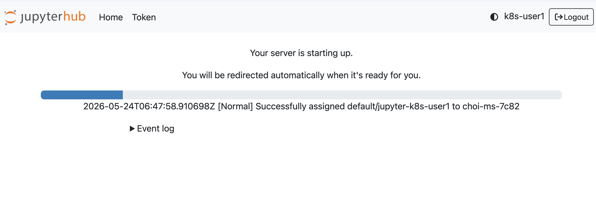

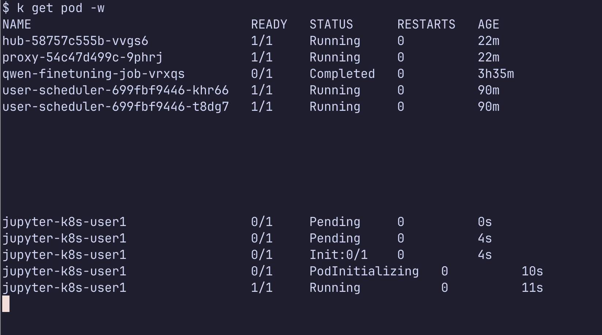

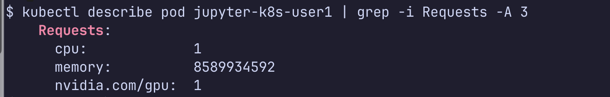

관리자페이지(다른 브라우저에서 실행)에서는 아래처럼 보인다.

```bash
http://localhost:8081/hub/admin
```

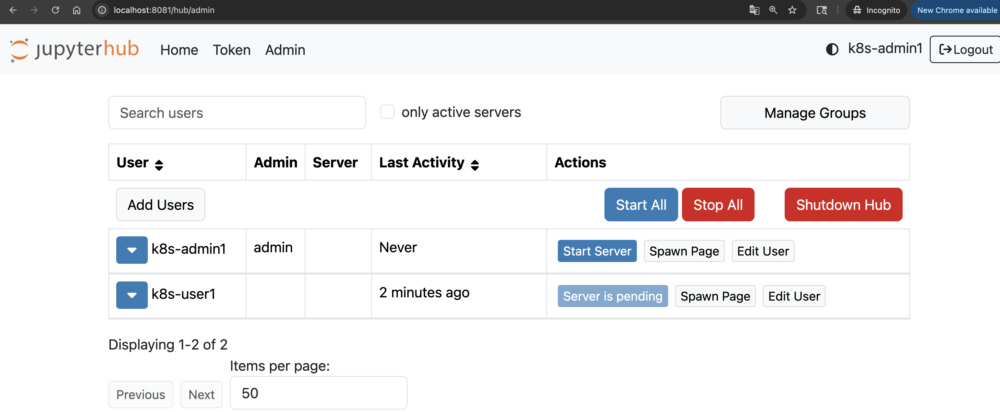

단계 8. JupyterLab terminal에서 notebook을 user home PVC로 복사한다.

```bash
cp /opt/notebooks/03_fine_tuning_qwen.ipynb ~/
```

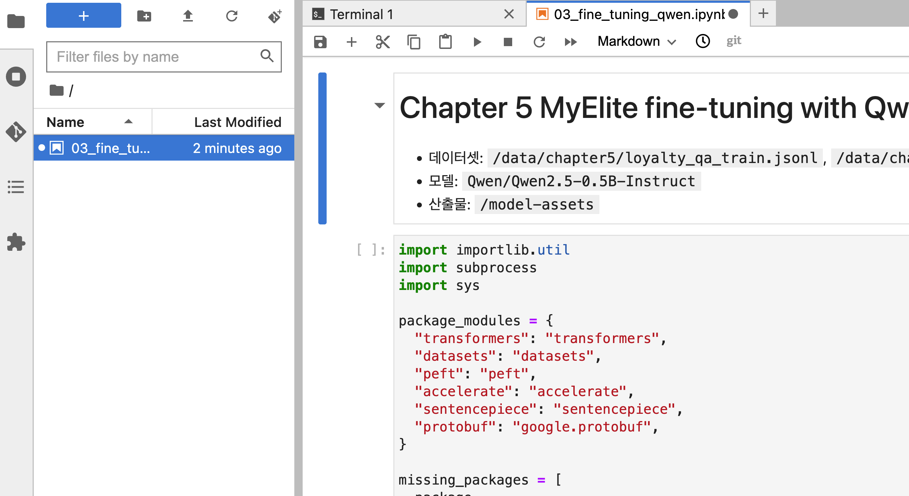

단계 9. GPU와 Python 패키지를 확인한다.

```bash
python - <<'PY'
import importlib.util

required = ["torch", "transformers", "datasets", "peft", "accelerate"]
missing = [name for name in required if importlib.util.find_spec(name) is None]

print("missing packages:", missing)
if "torch" in missing:
  raise SystemExit("PyTorch is missing. Check the JupyterHub image tag.")

import torch
print("cuda available:", torch.cuda.is_available())
PY
```

단계 10. PyTorch 외 누락된 패키지가 있으면 notebook 첫 setup cell을 실행하거나 JupyterLab terminal에서 설치한다.

```bash
python -m pip install transformers datasets peft accelerate sentencepiece protobuf
```

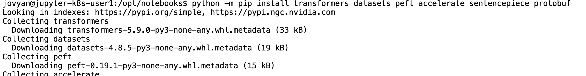

## 2. Fine-tuning Qwen in K8s

단계 1. fine-tuning Job image를 빌드하고 K3s containerd에 import한다.

```bash
docker build -t qwen-finetuning:k3s k3s/llama-finetuning

mkdir -p /tmp/genai-ch5-images
docker save qwen-finetuning:k3s -o /tmp/genai-ch5-images/qwen-finetuning-k3s.tar
sudo k3s ctr images import /tmp/genai-ch5-images/qwen-finetuning-k3s.tar
```

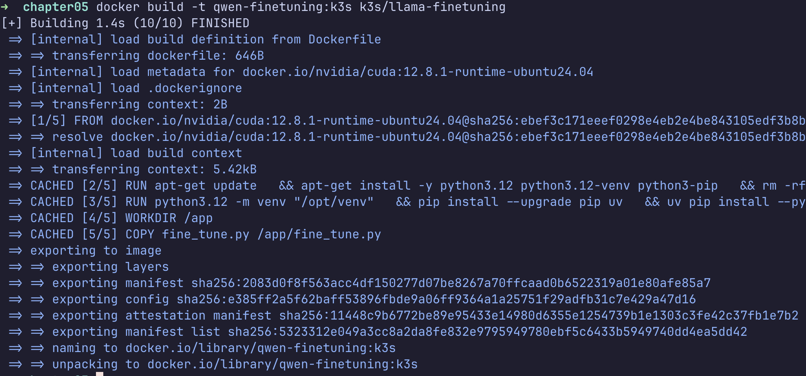

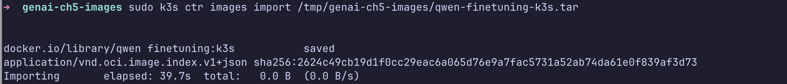

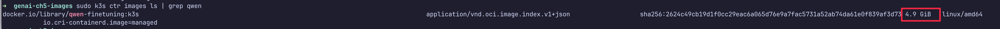

단계 2. fine-tuning Job을 실행한다.

```bash
kubectl apply -f k3s/manifests/llama-finetuning/job.yaml
kubectl logs -l app.kubernetes.io/name=qwen-finetuning -f
kubectl wait --for=condition=complete job/qwen-finetuning-job --timeout=30m
```

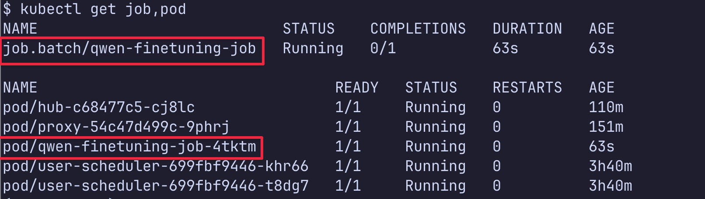

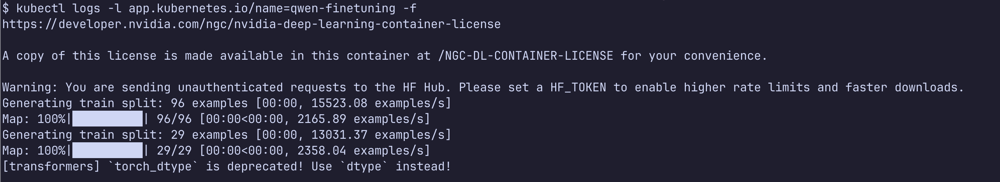

단계 3. Job 완료를 확인한다.

```bash
kubectl get job qwen-finetuning-job
```

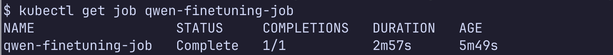

## 3. Deploying the fine-tuned model on K8s

단계 1. inference API image를 빌드하고 K3s containerd에 import한다.

```bash
docker build -t qwen-inference:k3s k3s/inference

mkdir -p /tmp/genai-ch5-images
docker save qwen-inference:k3s -o /tmp/genai-ch5-images/qwen-inference-k3s.tar
sudo k3s ctr images import /tmp/genai-ch5-images/qwen-inference-k3s.tar
```

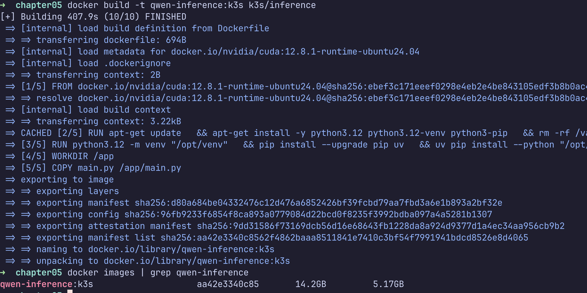

단계 2. inference API를 배포한다.

```bash
kubectl apply -f k3s/manifests/inference/
kubectl rollout status deployment/loyalty-inference-deployment --timeout=300s
```

단계 3. inference API를 직접 호출한다.

```bash
kubectl port-forward service/loyalty-inference-service 8082:80
```

pod 로그에서 uvicorn 로딩이 보여야 합니다.

```bash
Loading weights: 100%
  INFO:     Application startup complete.
  INFO:     Uvicorn running on http://0.0.0.0:80
```

단계 4. 다른 터미널에서 요청한다.

```bash
curl -s http://localhost:8082/generate \
  -H 'Content-Type: application/json' \
  -d '{"prompt":"[MyElite Loyalty Program FAQ]: Does the MyElite Loyalty Program offer any discount on purchases?"}'
```

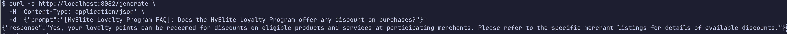

## 4. Deploy a RAG application on K8s

단계 1. OpenAI Secret을 만든다.

```bash
cp k3s/manifests/secrets/openai-secret.example.yaml \
  k3s/manifests/secrets/openai-secret.yaml
```

단계 2. `k3s/manifests/secrets/openai-secret.yaml`의 `replace-me`를 실제 key로 바꾼 뒤 적용한다.

```bash
kubectl apply -f k3s/manifests/secrets/openai-secret.yaml
```

단계 3. Qdrant를 설치한다.

```bash
helm repo add qdrant https://qdrant.github.io/qdrant-helm --force-update
helm repo update
helm upgrade --install qdrant qdrant/qdrant \
  --namespace qdrant \
  --create-namespace \
  --version 1.11.5 \
  --values k3s/values/qdrant/values.yaml

kubectl -n qdrant get pods
```

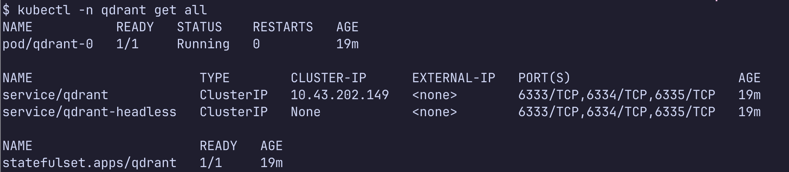

단계 4. Qdrant catalog snapshot을 복원한다.

```bash
kubectl apply -f k3s/manifests/rag-app/qdrant-restore-job.yaml
kubectl logs job/qdrant-restore-job -f
kubectl wait --for=condition=complete job/qdrant-restore-job --timeout=10m
```

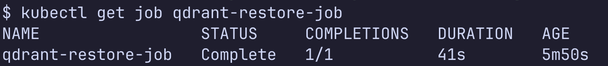

단계 5. RAG API image를 빌드하고 K3s containerd에 import한다.

```bash
docker build -t rag-app:k3s k3s/rag-app

mkdir -p /tmp/genai-ch5-images
docker save rag-app:k3s -o /tmp/genai-ch5-images/rag-app-k3s.tar
sudo k3s ctr images import /tmp/genai-ch5-images/rag-app-k3s.tar
```

단계 6. RAG API를 배포한다.

```bash
kubectl apply -f k3s/manifests/rag-app/deployment.yaml
kubectl apply -f k3s/manifests/rag-app/service.yaml
kubectl rollout status deployment/rag-app-deployment --timeout=300s
```

## 5. Deploying a chatbot on K8s

단계 1. chatbot UI image를 빌드하고 K3s containerd에 import한다.

```bash
docker build -t chatbot-ui:k3s k3s/chatbot

mkdir -p /tmp/genai-ch5-images
docker save chatbot-ui:k3s -o /tmp/genai-ch5-images/chatbot-ui-k3s.tar
sudo k3s ctr images import /tmp/genai-ch5-images/chatbot-ui-k3s.tar
```

단계 2. chatbot UI를 배포한다.

```bash
kubectl apply -f k3s/manifests/chatbot/
kubectl rollout status deployment/chatbot-ui-deployment --timeout=300s
```

단계 3. 브라우저에서 접속한다.

```text
http://<server-ip>/
```

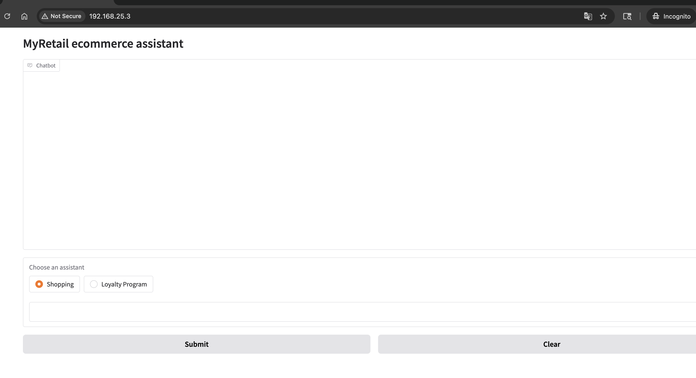

K3s 기본 Traefik이 Ingress를 처리한다.

## 검증

- Chatbot UI 테스트 스크립트: ../../docs/common-principles.md#chatbot-ui-테스트-스크립트

## 정리

```bash
kubectl delete -R -f k3s/manifests/ --ignore-not-found
helm uninstall jupyterhub
helm uninstall qdrant -n qdrant
kubectl -n qdrant delete pvc qdrant-storage-qdrant-0 --ignore-not-found
```

## 참고자료

- 공통 원리: ../../docs/common-principles.md
- GPU 부트스트랩: gpu-bootstrap.md
- 원본 예제: https://github.com/PacktPublishing/Kubernetes-for-Generative-AI-Solutions/tree/main/ch5
