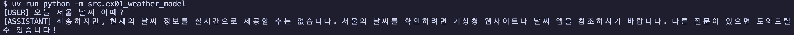
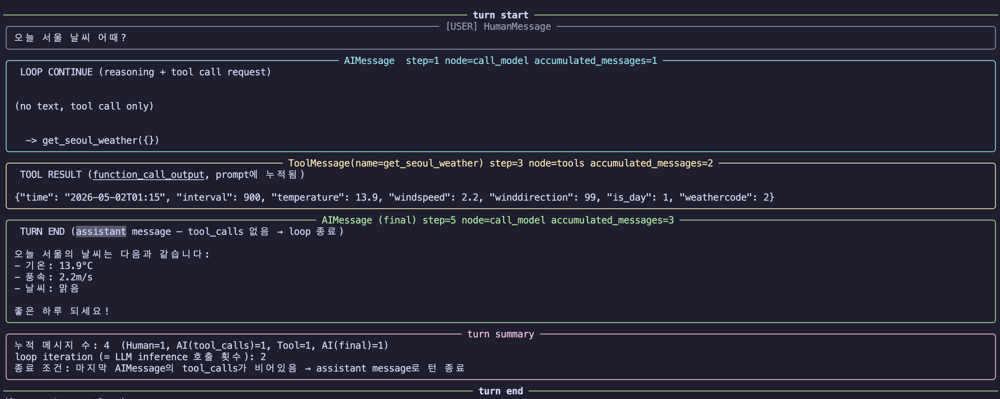
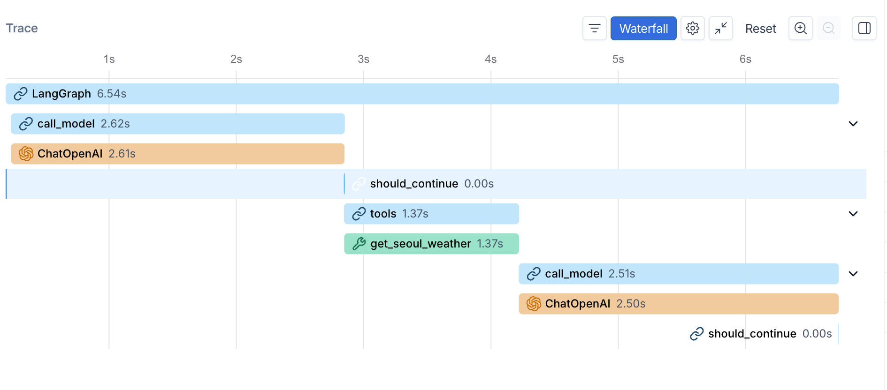
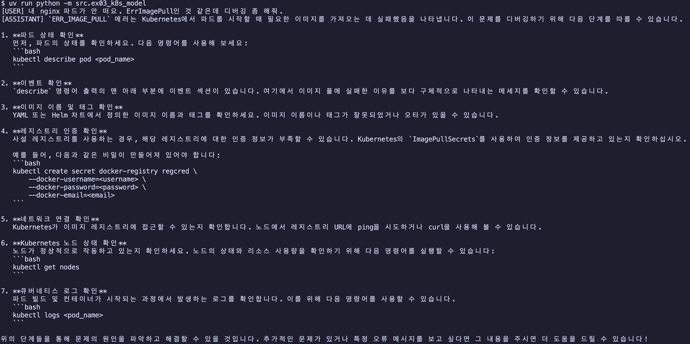
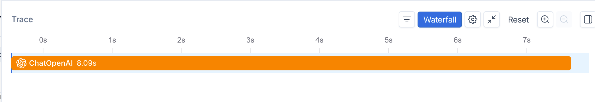
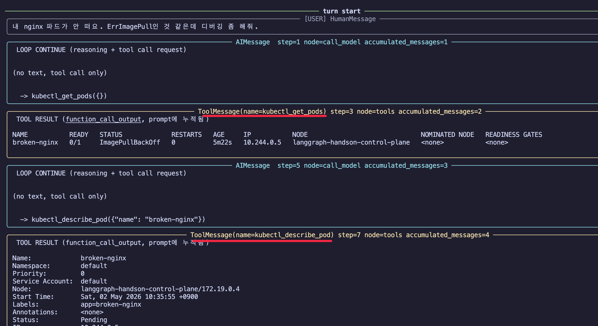
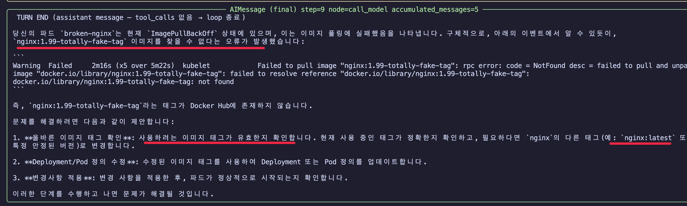
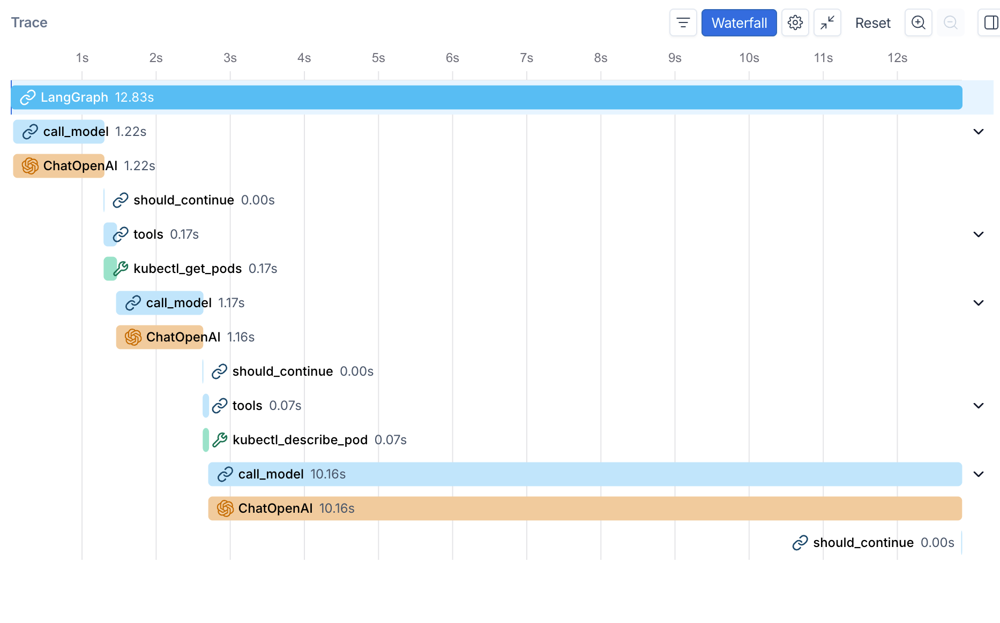

# LangGraph Agent Loop 입문

AI 모델 단독 호출과 AI agent loop의 차이를 langgraph로 직접 만들어 비교한다.

## 사전 요구사항

- uv, docker, kind, kubectl, make
- OpenAI 또는 Anthropic API 키

## 빠른 시작

의존성 설치와 환경변수 셋업:

```bash
uv sync
cp .env.example .env  # API 키 입력
```

핸즈온 1 (날씨) 실행 — kubernetes 없이 바로 가능:

```bash
uv run python -m src.ex01_weather_model   # 모델 단독
uv run python -m src.ex02_weather_agent   # agent loop
```







핸즈온 2 (k8s 디버깅) 실행:

```bash
make cluster-up
make apply-broken
sleep 30  # 파드 상태 안정화
uv run python -m src.ex03_k8s_model       # 모델 단독
uv run python -m src.ex04_k8s_agent       # agent loop
make cluster-down                          # 정리
```











## 학습 순서

1. [이론: agent loop이 뭐고 왜 필요한가](docs/01-theory.md)
2. [LangGraph 용어 사전](docs/02-langgraph-terms.md)
3. [핸즈온 1: 오늘 서울 날씨 (모델 vs agent)](docs/03-handson-weather.md)
4. [핸즈온 2: kubernetes 디버깅 (모델 vs agent)](docs/04-handson-k8s.md)
5. [트레이싱: agent를 디버깅하는 법](docs/05-tracing-aiagent.md)

## 디렉터리 구조

```
.
├── CLAUDE.md                  # Claude Code용 빌드 지시서
├── README.md                  # 이 문서
├── Makefile                   # kind 클러스터 관리
├── pyproject.toml             # uv 의존성
├── .env.example               # 환경변수 템플릿
├── docs/                      # 학습 문서 5종
├── src/
│   ├── tracing.py             # 콘솔 trace 패널 출력 (rich)
│   ├── ex01_weather_model.py  # 모델 단독: 날씨
│   ├── ex02_weather_agent.py  # agent loop: 날씨 (Open-Meteo)
│   ├── ex03_k8s_model.py      # 모델 단독: k8s 디버깅
│   └── ex04_k8s_agent.py      # agent loop: k8s 디버깅 (kubectl tools)
└── manifests/
    └── broken-nginx.yaml      # 일부러 망가진 nginx Pod (ImagePullBackOff)
```

## 참고자료

- [OpenAI - Unrolling the Codex agent loop](https://openai.com/index/unrolling-the-codex-agent-loop/)
- [LangGraph 공식 문서](https://langchain-ai.github.io/langgraph/)
- [LangChain Agents](https://docs.langchain.com/oss/python/langchain/agents)
- [Open-Meteo (no-key 날씨 API)](https://open-meteo.com/)
- [kind (kubernetes 1.35)](https://kind.sigs.k8s.io/)
