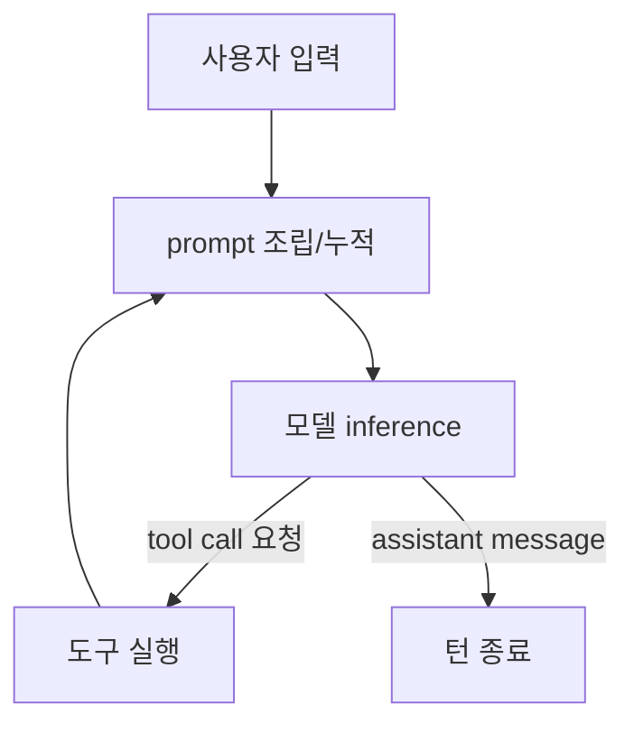

# 이론: AI 모델, AI 에이전트, agent loop

이 프로젝트의 핵심은 세 단어를 분리해서 잡는 것이다. 입문자가 가장 자주 헷갈리는 곳이고, 헷갈린 채로 코드를 보면 "왜 이 코드를 쓰지?"가 끝까지 풀리지 않는다.

이 문서는 OpenAI의 [Unrolling the Codex agent loop](https://openai.com/index/unrolling-the-codex-agent-loop/)을 베이스로 정리한다. langgraph 코드는 이 글이 묘사한 구조를 작은 규모로 직접 짜보는 것이다.

## 세 단어를 한 표로

| 단어 | 무엇인가 | 누가 만드나 | 우리 코드 안 위치 |
|---|---|---|---|
| **AI 모델** | 입력 토큰 → 출력 토큰을 만드는 **한 번의 inference**. stateless. | OpenAI, Anthropic 등 | `init_chat_model(...)` 결과 |
| **AI 에이전트(harness)** | 모델을 감싸서 사용자 입력을 prompt로 만들고, 모델이 도구 호출을 요청하면 실제로 실행하고, 결과를 prompt에 다시 넣어 모델을 또 부르고, 종료를 판단하는 **외부 코드**. | 우리. (또는 Codex CLI, ChatGPT, Cursor, Claude Code 같은 제품 팀) | `StateGraph(...).compile()` 결과 그래프 |
| **Agent loop** | 에이전트가 한 턴을 처리할 때 따르는 **실행 패턴**: inference ↔ 도구 실행이 번갈아 일어나며 prompt가 누적된다. | (에이전트의 동작 방식) | `call_model` ↔ `tools` conditional edge |

요점:

- **에이전트는 더 똑똑해진 모델이 아니다.** 모델을 *감싸는* 코드다.
- **agent loop은 에이전트와 같은 것이 아니다.** 에이전트가 *돌리는* 반복 구조다.
- 이 셋을 섞어서 "에이전트 = 도구 쓰는 모델" 같은 단축어로 잡으면, 디버깅할 때 어디를 봐야 하는지가 흐릿해진다.

## AI 모델 — 한 번의 inference

- input tokens → output tokens. 그게 전부다.
- stateless. 한 번 inference가 끝나면 모델은 직전 호출을 기억하지 않는다. (대화 컨텍스트는 *호출하는 쪽*이 매번 prompt에 다시 넣는다.)
- inference의 출력은 둘 중 하나:
  1. 사용자에게 줄 **assistant message** (최종 답)
  2. **tool call 요청** ("이 함수를 이런 인자로 호출해줘")
- function-calling 지원 모델조차 **함수를 직접 실행하지 않는다**. 호출하라고 *말할* 뿐이다.

`init_chat_model("openai:gpt-4o-mini").invoke(messages)` 한 줄이 정확히 이 inference 한 번이다. 그 이상도 그 이하도 아니다.

## Reasoning(thinking)은 어디에 위치하는가

**한 줄 결론**: reasoning은 본질적으로 **AI 모델의 기능**이다. AI 에이전트(harness)는 그것을 *전달하고 누적*할 뿐 *만들어내지 않는다*. 이 한 줄이 흔들리면 세 단어 분리가 무너진다.

### 본체는 모델 단

- Claude의 extended thinking, OpenAI o-series (o1 / o3), Gemini thinking 같이 **별도로 학습된 모델**만 reasoning channel을 갖는다.
- 모델 응답에 `reasoning` content가 별도 필드로 실려 온다 — Codex 글의 첫 번째 inference 결과 JSON에 `type=reasoning` 항목이 있던 게 정확히 이것. langchain에서는 `AIMessage.additional_kwargs`나 모델별 별도 필드(Anthropic의 `thinking` 블록, OpenAI의 `reasoning` item)로 표현된다.
- **같은 모델을 어떤 harness로 감싸든 같은 prompt에는 같은 reasoning이 나온다.** harness가 바꾸지 못한다.

일반 모델에서 `"Let's think step by step"`을 prompt에 넣어 chain-of-thought를 유도하는 건 **별개 channel이 아니다** — 모델이 *최종 출력 토큰 안에* 사고 과정을 섞어 쓰는 것이다. reasoning model의 별도 reasoning channel과 구분된다.

### Harness가 하는 일은 두 가지뿐

1. **UI 렌더링** — Claude Code / Codex CLI의 회색 "thinking..." 텍스트는 모델 응답의 reasoning content를 harness가 파싱해 그대로 흘려준 것.
2. **다음 inference의 prompt에 누적** — Codex 글의 `encrypted_content`가 이 reasoning을 다음 호출에 안전하게 전달하는 메커니즘이다.

agent loop에 새 노드가 생기는 게 아니라, **기존 inference 노드의 출력 종류가 늘어난 것**이다.

### "잘 추론한다"가 무엇을 더 잘하나

reasoning model은 학습 데이터에 *있는* 사실들을 새 조합으로 연결하는 일을 잘한다. 구체적으로:

- 수학 / 논리 다단계 풀이 (AIME, GSM8K 같은 벤치마크)
- 코드 디버깅 / 알고리즘 설계 (여러 실행 path를 머릿속으로 시뮬레이션, case analysis)
- 제약 만족 / 계획 수립 (퍼즐, 스케줄링)
- 다단계 사실 연결 (multi-hop reasoning — 학습 데이터의 단편 사실들을 조립)
- 자기 검증 / 자기 수정 (한 번 답하고 다시 검토해 틀린 걸 잡는 능력)

### 도서관 비유

| 요소 | 비유 |
|---|---|
| 학습 데이터 | 도서관에 꽂혀 있는 책들 |
| reasoning | 도서관 안에서 책들을 깊이 비교·연결하는 사서의 두뇌 |
| tool use | 도서관 *밖*에 나가서 새 정보(오늘 날씨, 클러스터 상태)를 가져오는 능력 |
| reasoning model | 더 솜씨 좋은 사서. 그러나 여전히 도서관 밖에는 못 나간다 |
| **agent (harness)** | **도서관 운영자. 사서에게 무엇을 묻고 답을 어떻게 정리할지 결정하지만, 사서의 두뇌는 키우지 못한다** |

더 똑똑한 사서를 원하면 (= reasoning model로 바꾸려면) 운영자는 사서를 **교체**해야 한다. 운영 방식만 바꿔서 사서가 똑똑해지지 않는다.

### 세 단어 분리 sanity check

"reasoning은 agent의 기능 아냐?"라고 헷갈리면, **agent를 "더 똑똑해진 모델"로 잘못 잡고 있다는 신호**다. agent는 모델을 *감싸는 코드*이지, 모델 능력의 대체물이나 확장이 아니다.

### 결론: reasoning과 tool use는 직교 축

ex01의 모델을 reasoning model(`openai:o3-mini` 등)로 바꿔도 결과는 동일하게 "모릅니다"다. 더 정확하게 모른다고 답할 뿐이다. 함수 바깥에 닿으려면 에이전트(harness)가 도구를 **실제로** 실행해야 한다 (= ex02). reasoning을 키우는 것과 tool 손을 다는 것은 별개의 작업이다.

## AI 에이전트 — 모델을 감싸는 외부 코드 (= harness)

Codex 글에서 말하는 "harness"가 곧 에이전트다. 책임은 7가지다.

1. 사용자 입력을 받아 **prompt를 조립한다** (system instructions + tools + user message + 이전 대화).
2. 모델을 호출한다 (inference).
3. 모델 출력이 **tool call 요청**이면, 그 함수를 실제로 실행해 결과를 받는다.
4. 도구 결과를 **prompt에 append**한다 (Codex의 `function_call_output` 항목과 동일).
5. 모델 출력이 **assistant message**가 될 때까지 2~4를 반복한다.
6. assistant message를 사용자에게 돌려준다 (한 턴 종료).
7. 새 사용자 입력이 오면 이전 대화를 prompt에 다시 포함해 다음 턴을 시작한다 (= ever-growing prompt).

이것 외에도 production 에이전트는 prompt caching 친화적인 prompt 구성, context window 초과 시 compaction, 권한/샌드박스 관리까지 한다. Codex 글의 후반부가 그 얘기다. 학습용으로 우리는 1~7만 langgraph로 짠다.

## Agent loop — 에이전트의 한 턴 실행 패턴

위 7개 책임 중 2~5단계가 곧 agent loop이다.

핵심 관찰:

- **한 턴 안에서 inference와 도구 실행이 여러 번 번갈아 일어날 수 있다.** Codex 글의 multi-turn 다이어그램이 이걸 보여준다.
- **tool call이 없는 모델 출력(= assistant message)이 나오면 턴이 끝난다.** 이게 종료 조건이다.
- inference 한 번은 stateless지만, **prompt에 이전 메시지를 매번 다시 넣어주기 때문에** 외부에서 보면 마치 모델이 컨텍스트를 갖고 있는 것처럼 보인다.

## Ever-growing prompt

Codex 글의 가장 인상적인 그림은 prompt가 매 단계 길어지는 스냅샷 시퀀스다. 이유는 단순하다.

- 한 턴 안: tool call마다 `reasoning` + `function_call` + `function_call_output` 항목이 prompt에 누적된다.
- 턴 사이: 새 턴이 시작되면 직전 턴의 모든 항목 + 새 user message가 prompt가 된다.

결과:

- prompt 길이가 turn 수에 대해 거의 quadratic하게 증가한다.
- production 에이전트는 prompt caching(정확한 prefix match로 cache hit), context window 초과 시 compaction(요약으로 입력을 줄이기)으로 이걸 완화한다.
- 학습용 코드(우리 langgraph 그래프)는 caching/compaction을 다루지 않는다. 다만 *누적 자체*는 똑같이 한다 — `add_messages` reducer가 그 역할을 한다.

## OpenAI Codex 글과 langgraph 매핑

Codex 글은 production 에이전트를 묘사하고, 우리는 같은 구조를 langgraph로 작게 짠다.

| Codex 글의 개념 | langgraph 대응 |
|---|---|
| Responses API 호출 (한 번의 inference) | `llm.invoke(messages)` (`call_model` 노드 안) |
| `instructions` + `tools` + `input` 으로 prompt 조립 | `state["messages"]` + `bind_tools(tools)` |
| `reasoning` / `function_call` 항목 | `AIMessage` (`tool_calls` 속성 포함) |
| `function_call_output` 항목 | `ToolMessage` |
| input 누적 (ever-growing prompt) | `add_messages` reducer |
| assistant message로 턴 종료 | `tool_calls` 없는 `AIMessage` → END (conditional edge) |
| harness 자체 (Codex CLI) | 우리가 만든 컴파일된 `StateGraph` |
| 다음 턴: 이전 input + 새 user message로 다시 호출 | 같은 그래프를 다시 `invoke`/`stream` (`add_messages`로 자동 누적) |

## 이 프로젝트의 두 핸즈온이 무엇을 비교하는가

| | ex01 / ex03 | ex02 / ex04 |
|---|---|---|
| 무엇을 부르나 | AI 모델 (`llm.invoke()` 한 번) | AI 에이전트 (우리가 langgraph로 만든 harness) |
| inference 횟수 | 1 | 1 ~ N (loop 안에서) |
| 도구 실행 | 없음 | conditional edge로 분기 |
| prompt 누적 | 없음 (호출 한 번이니 누적할 게 없음) | `add_messages`로 매 단계 누적 |
| 출력 | assistant message 1개 | (tool call ↔ tool result) × N → assistant message |

도메인 차이(날씨, k8s)는 부차적이다. 같은 비교를 두 도메인에서 반복하는 이유는, **"AI 모델 호출 한 번"과 "에이전트가 돌리는 agent loop"의 구조적 차이가 도메인과 무관하다**는 걸 손으로 느끼게 하기 위해서다.

부수 효과로, 모델 단독은 실시간 정보(오늘 날씨, 클러스터 상태)에 답하지 못하고 에이전트는 답한다. 이건 효과(effect)이지 본질(essence)이 아니다. 본질은 "에이전트는 모델을 감싸는 외부 코드이고, 그 코드가 도구 실행과 prompt 누적을 orchestrate한다"는 구조다.

## 디버깅 멘탈 모델

에이전트가 잘못 동작할 때 **어디가 망했는지** 세 축으로 분리해 본다.

| 축 | 무엇이 망했나 | 어디서 확인 | 어디를 고치나 |
|---|---|---|---|
| **모델 (reasoning)** | inference 자체가 부적절한 출력을 냈다 | `AIMessage.content`, `AIMessage.tool_calls` | system prompt, 도구 description, 모델 자체 |
| **도구 (tool)** | 모델 출력은 옳은데 도구 실행이 실패했다 | `ToolMessage.content` | 도구 코드, 환경(네트워크, 권한, 클러스터) |
| **에이전트 코드 (loop)** | 종료 조건이나 분기 로직이 잘못됐다 | `should_continue`, conditional edge 매핑 | 에이전트 코드 자체 |

증상 → 의심 축 cheatsheet:

| 증상 | 의심할 축 | 어디서 확인 |
|---|---|---|
| 모델이 도구를 아예 부르지 않음 | 모델 | AIMessage.content (도구 필요성을 인지 못함) |
| 모델이 엉뚱한 도구를 부름 | 모델 | AIMessage.tool_calls (system prompt / tool description 부족) |
| 모델이 도구 부르는 인자가 이상함 | 모델 | tool_calls 안 args |
| 도구가 에러를 냄 | 도구 | ToolMessage.content |
| 도구 결과는 정상인데 답변이 이상함 | 모델 | 다음 AIMessage |
| 무한 루프 | 에이전트 코드 | should_continue 함수, conditional edge |

세 축을 섞으면 디버깅이 안 된다. "도구를 안 부른다"가 보이는데 도구 코드를 들여다보는 건 시간 낭비고 — 모델 입력(prompt + tool description)을 봐야 한다. 반대도 마찬가지다.

## 참고자료

- OpenAI - Unrolling the Codex agent loop (이 문서의 베이스): <https://openai.com/index/unrolling-the-codex-agent-loop/>
- Codex 오픈소스 저장소: <https://github.com/openai/codex>
- LangGraph 공식 문서: <https://langchain-ai.github.io/langgraph/>
- LangChain Agents 가이드: <https://docs.langchain.com/oss/python/langchain/agents>
