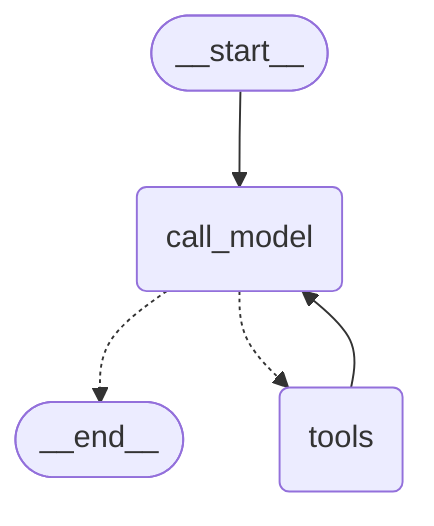

# LangGraph 용어 사전

코드를 읽다 모르는 용어가 나오면 여기로 점프한다. 각 용어는 **한 줄 정의 → 비유 → 코드 한 줄 예시 → 우리 프로젝트 어디서 쓰는지** 4단으로 정리한다.

## State

- 정의: 그래프 노드 사이를 흐르는 공유 데이터.
- 비유: 회의실 가운데 놓인 화이트보드. 모든 사람이 같은 화이트보드를 본다.
- 코드: `class State(TypedDict): messages: Annotated[list[BaseMessage], add_messages]`
- 우리 프로젝트: `src/ex02_weather_agent.py`의 `State`. messages 리스트 하나만 가진다.

## StateGraph

- 정의: 노드와 엣지로 loop을 정의하는 빈 그래프 객체.
- 비유: 비어있는 보드 게임 판. 칸(노드)과 화살표(엣지)를 직접 그려넣는다.
- 코드: `graph = StateGraph(State)`
- 우리 프로젝트: `ex02`, `ex04`에서 builder 패턴으로 직접 만든다.

## Node

- 정의: 함수 하나. State를 받아 State 업데이트(dict)를 반환한다.
- 비유: 보드 게임의 칸. 칸에 도착하면 정해진 행동을 한다.
- 코드: `def call_model(state): return {"messages": [response]}`
- 우리 프로젝트: `call_model`(LLM 호출)과 `tools`(도구 실행) 두 노드.

## Edge

- 정의: 노드 사이 연결. `add_edge(A, B)`는 무조건 A 다음 B다.
- 비유: 보드 게임의 일방통행 화살표.
- 코드: `graph.add_edge(START, "call_model")`
- 우리 프로젝트: `START → call_model`, `tools → call_model`은 무조건 분기.

## Conditional Edge

- 정의: 분기 엣지. State를 보고 다음 노드를 동적으로 결정한다.
- 비유: 보드 게임의 갈림길 — 주머니에 든 카드(state)에 따라 다른 길로 간다.
- 코드: `graph.add_conditional_edges("call_model", should_continue, {"tools": "tools", END: END})`
- 우리 프로젝트: `call_model` 다음에 "도구 호출이면 tools, 아니면 END" 분기. agent loop의 핵심.

## START / END

- 정의: 그래프 진입점/종료점 특수 상수.
- 비유: 보드 게임의 "출발"과 "도착" 칸.
- 코드: `from langgraph.graph import START, END`
- 우리 프로젝트: 모든 그래프가 START에서 시작해 END에서 끝난다.

## Reducer

- 정의: 같은 키에 새 값을 어떻게 합칠지 정의한다.
- 비유: 화이트보드에 글씨를 덧쓸 때 "지우고 새로 쓸지" 또는 "끝에 이어 쓸지"의 규칙.
- 코드: `Annotated[list[BaseMessage], add_messages]`
- 우리 프로젝트: messages 키는 `add_messages` reducer로 "끝에 이어 쓰기"가 된다.

## MessagesState

- 정의: 메시지 리스트를 state로 가지는 prebuilt TypedDict.
- 비유: 위 State를 미리 만들어둔 단축 버전.
- 코드: `from langgraph.graph import MessagesState`
- 우리 프로젝트: 학습 목적상 직접 TypedDict를 작성한다. MessagesState로 바꿔도 동등하다.

## add_messages

- 정의: 기존 messages 리스트에 새 메시지를 append하는 reducer.
- 비유: 회의록에 발언을 한 줄씩 덧붙이는 규칙.
- 코드: `from langgraph.graph.message import add_messages`
- 우리 프로젝트: State의 `messages` 어노테이션에 사용한다.

## HumanMessage / AIMessage / ToolMessage / SystemMessage

- 정의: 메시지 타입. 사용자 입력 / 모델 응답 / 도구 결과 / 시스템 지시.
- 비유: 채팅방의 발화자별 말풍선 색깔.
- 코드: `HumanMessage(content="...")`, `AIMessage(content="...", tool_calls=[...])`
- 우리 프로젝트: trace 출력 색깔이 메시지 타입과 1:1이다 (청록=AIMessage with tool_calls, 노랑=ToolMessage, 초록=AIMessage 최종).

## reasoning content (extended thinking)

- 정의: reasoning model이 최종 답 외에 별도로 뱉는 사고 토큰. 일반 모델에는 없는 channel이다.
- 비유: 시험지 옆에 적은 풀이과정 메모. 채점자(harness)는 그 메모도 같이 보관해 다음 문제 풀 때 참고하게 한다.
- 코드: 모델별로 표현이 다르다. Anthropic은 `thinking` 블록, OpenAI o-series는 응답의 `reasoning` item, langchain 통합 후에는 보통 `AIMessage.additional_kwargs`에 들어간다 (정확한 키는 langchain-anthropic / langchain-openai의 사용 시점 docs 확인).
- 우리 프로젝트: 학습용 기본 모델(`gpt-4o-mini`)은 reasoning channel이 없어 trace에 안 보인다. `LLM_MODEL`을 reasoning model로 바꾸면 LangSmith의 LLM 호출 input/output에서 reasoning content를 확인할 수 있다 (콘솔 trace에 띄우려면 `src/tracing.py`에 출력 코드 추가가 필요하므로 학습 단계에서는 다루지 않는다).

## tool_calls

- 정의: `AIMessage`의 속성. 모델이 호출하려는 도구 목록. 비어있으면 turn 종료 신호.
- 비유: 회의에서 "이 자료 좀 가져와줄래?"라고 적힌 메모. 누군가가 가져와야 다음 진도가 나간다.
- 코드: `last_message.tool_calls` (예: `[{"name": "get_seoul_weather", "args": {}, "id": "..."}]`)
- 우리 프로젝트: `should_continue`의 분기 조건이 바로 이것.

## bind_tools

- 정의: 도구 스키마를 모델에 알려준다.
- 비유: 모델에게 "이런 메뉴가 있어, 필요하면 주문해"라고 메뉴판을 건네는 것.
- 코드: `llm = init_chat_model("openai:gpt-4o-mini").bind_tools(tools)`
- 우리 프로젝트: `ex02`, `ex04`에서 사용. `ex01`, `ex03`은 일부러 안 한다.

## ToolNode

- 정의: prebuilt 노드. AIMessage의 tool_calls를 보고 실제 도구 함수를 실행해 ToolMessage를 만든다.
- 비유: 메뉴판에서 주문이 들어오면 주방에서 요리해 내오는 직원.
- 코드: `from langgraph.prebuilt import ToolNode`, `ToolNode(tools)`
- 우리 프로젝트: `tools` 노드가 이것. 직접 도구 dispatch 로직을 짤 필요 없다.

## compile()

- 정의: StateGraph를 실행 가능한 그래프로 변환한다.
- 비유: 청사진을 실제 집으로 짓기 — 짓기 전엔 살 수 없다.
- 코드: `graph = builder.compile()`
- 우리 프로젝트: `ex02`, `ex04` 마지막 단계.

## invoke / stream

- 정의: 실행 메서드. `invoke`는 끝까지 돌고 최종 state 반환. `stream`은 각 노드 실행 후 중간 결과를 yield한다.
- 비유: 영화를 다 본 뒤 줄거리 한 줄(invoke) vs 한 장면씩 보면서 따라가기(stream).
- 코드: `graph.invoke({"messages": [...]})` 또는 `for chunk in graph.stream(..., stream_mode="updates")`
- 우리 프로젝트: 학습용으로 `stream`을 쓴다. trace를 step별로 보기 위해.

## stream_mode

- 정의: stream의 출력 단위 선택.
- 비유: 영상 재생 속도 모드.
- 종류:
  - `"updates"` — 노드별 업데이트만 (각 step이 어떤 노드가 무엇을 추가했는지)
  - `"values"` — 매번 전체 state
  - `"messages"` — 토큰 단위 스트리밍
- 우리 프로젝트: `"updates"`로 step별 노드 출력만 깔끔하게 본다.

## 우리 그래프를 mermaid로

`graph.get_graph().draw_mermaid()` 결과는 이렇다.

라벨로 매핑하면:

- `__start__` → **START** 상수
- `call_model` → **Node**, 안에서 `llm.invoke()` 호출 (init_chat_model + bind_tools)
- `call_model -.-> tools` 와 `call_model -.-> __end__` 점선 → **Conditional Edge** (`should_continue`가 `tool_calls` 유무로 분기)
- `tools` → **ToolNode** prebuilt
- `tools --> call_model` 실선 → 일반 **Edge** (도구 결과를 갖고 무조건 모델로 돌아간다)

## 참고자료

- LangGraph StateGraph API: <https://langchain-ai.github.io/langgraph/reference/graphs/>
- LangGraph 공식 문서: <https://langchain-ai.github.io/langgraph/>
