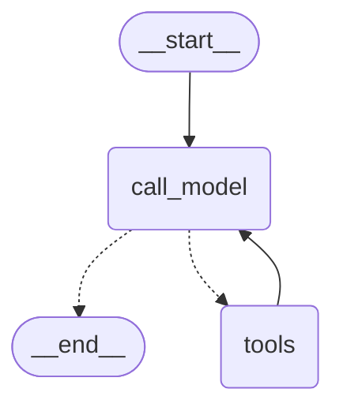

# 핸즈온 1: 오늘 서울 날씨 (AI 모델 vs AI 에이전트)

같은 질문을 두 번 던진다. 한 번은 **AI 모델을 한 번만 호출**하고, 한 번은 **AI 에이전트(우리가 langgraph로 만든 harness)가 agent loop을 돌린다**. 코드 구조의 차이를 먼저 보고, 답변 차이는 그 결과로 따라온다.

이 핸즈온의 목표는 "도구를 붙이면 답할 수 있다"가 아니라, **두 코드가 본질적으로 무엇이 다른지**를 보는 것이다 — `llm.invoke()` 한 번이냐, `graph.invoke()`가 안에서 inference ↔ 도구 실행을 N번 도느냐.

질문: **"오늘 서울 날씨 어때?"**

## 사전 준비

`.env`에 OpenAI 또는 Anthropic 키가 있어야 한다.

```bash
cp .env.example .env  # 키 입력
uv sync
```

## Step A — AI 모델 호출 한 번 (`src/ex01_weather_model.py`)

에이전트도, 도구도, loop도 없다. **inference 한 번**이 전부다. `bind_tools`도 그래프도 없다.

```python
from dotenv import load_dotenv
from langchain.chat_models import init_chat_model
import os

load_dotenv()

def main():
  llm = init_chat_model(os.getenv("LLM_MODEL", "openai:gpt-4o-mini"))
  question = "오늘 서울 날씨 어때?"
  print(f"[USER] {question}")
  response = llm.invoke(question)
  print(f"[ASSISTANT] {response.content}")

if __name__ == "__main__":
  main()
```

실행:

```bash
uv run python -m src.ex01_weather_model
```

기대되는 답변 형태:

> 죄송하지만 저는 실시간 정보를 제공할 수 없습니다. 현재 서울의 날씨를 확인하시려면 ...

학습자가 "AI 모델 호출 한 번이 정말 이게 다구나"를 직접 본다.

**관찰 포인트**:

- 코드는 `llm.invoke(question)` 한 줄이다. inference 한 번.
- 모델은 학습 데이터로 추론은 했지만(=자신이 실시간 정보를 모른다는 사실은 정확히 알아냄), 함수 바깥의 세계(오늘 날씨)에는 닿지 못한다 — 모델이 stateless 함수이기 때문이다.
- 이걸 해결하려면 모델을 더 똑똑하게 만드는 게 아니라, **모델을 감싸는 외부 코드(=에이전트)**를 추가해서 도구를 실제로 실행하고 결과를 다시 모델에 넣어줘야 한다. 그게 Step B다.

## Step B — AI 에이전트가 agent loop을 돌린다 (`src/ex02_weather_agent.py`)

여기서 새로 등장하는 것은 **에이전트(= 우리가 langgraph로 만든 harness)**다. 에이전트의 책임은 docs/01에서 정리한 7가지 — prompt 조립, inference, tool call 실제 실행, 결과 누적, 종료 판단, 사용자 응답, 다음 턴 누적.

도구로 [Open-Meteo](https://open-meteo.com/)를 사용한다 (API 키 불필요).

Step A와의 코드 차이 4가지:

1. **도구 정의** — `@tool` 데코레이터 + docstring (모델에게 도구가 무엇인지 알려주는 description은 docstring에서 온다)
2. **bind_tools** — 모델에 도구 스키마를 알려줘서 모델이 "이 도구를 호출해줘"라고 *말할* 수 있게 함 (실행은 여전히 에이전트의 몫)
3. **StateGraph** — 에이전트의 동작 패턴(agent loop)을 노드와 엣지로 코드화
4. **conditional edge** — `tool_calls` 유무로 분기 (= 종료 조건 = "assistant message면 끝")

핵심 코드:

```python
@tool
def get_seoul_weather() -> dict:
  """서울의 현재 날씨를 반환한다. 기온(섭씨), 풍속, 날씨 코드를 포함."""
  url = "https://api.open-meteo.com/v1/forecast"
  params = {"latitude": 37.5665, "longitude": 126.9780, "current_weather": "true"}
  r = httpx.get(url, params=params, timeout=10)
  return r.json()["current_weather"]

class State(TypedDict):
  messages: Annotated[list[BaseMessage], add_messages]

tools = [get_seoul_weather]
llm = init_chat_model(os.getenv("LLM_MODEL", "openai:gpt-4o-mini")).bind_tools(tools)

def call_model(state: State):
  response = llm.invoke(state["messages"])
  return {"messages": [response]}

def should_continue(state: State) -> str:
  last = state["messages"][-1]
  return "tools" if last.tool_calls else END

graph = (
  StateGraph(State)
  .add_node("call_model", call_model)
  .add_node("tools", ToolNode(tools))
  .add_edge(START, "call_model")
  .add_conditional_edges("call_model", should_continue, {"tools": "tools", END: END})
  .add_edge("tools", "call_model")
  .compile()
)
```

전체 코드는 `src/ex02_weather_agent.py`를 본다.

실행:

```bash
uv run python -m src.ex02_weather_agent
```

## 그래프

`graph.get_graph().draw_mermaid()` 출력:



점선이 conditional edge다. `call_model` 다음에는 `tool_calls` 유무에 따라 `tools` 또는 `__end__`로 간다.

## 콘솔 trace 읽는 법

`ex02`의 main은 다음 순서로 출력한다 (자세한 의미는 [docs/05](05-tracing-aiagent.md) 참고).

1. `print_graph(graph)` — 그래프 구조 mermaid
2. `print_turn_header(question)` — 턴 시작 + 사용자 질문 (흰색)
3. step마다 `print_turn(...)` — 추가된 메시지 색깔 패널
4. `print_turn_footer(final_state)` — 턴 종료 요약 (loop iteration 횟수, 누적 메시지 수, 종료 이유)

색깔 = 메시지 타입 = agent loop 안 역할:

| 색 | 메시지 타입 | 라벨 |
|---|---|---|
| 흰색 | HumanMessage | (USER) |
| 청록 | AIMessage with tool_calls | LOOP CONTINUE — 모델이 도구 호출 요청 |
| 노랑 | ToolMessage | TOOL RESULT — 에이전트가 도구를 실제로 실행한 결과 |
| 초록 | AIMessage 최종 (tool_calls 없음) | TURN END — assistant message |

이번 핸즈온의 기대 시퀀스:

```
흰색 USER ("오늘 서울 날씨 어때?")
  ↓
청록 LOOP CONTINUE (call_model: get_seoul_weather 호출, accumulated_messages=2)
  ↓
노랑 TOOL RESULT (tools: Open-Meteo 응답 JSON, accumulated_messages=3)
  ↓
초록 TURN END (call_model: "현재 서울 기온은 ...°C", accumulated_messages=4)
  ↓
turn summary (loop iteration=2, Human=1 + AI(tool_calls)=1 + Tool=1 + AI(final)=1)
```

`loop iteration=2`가 보이면 inference가 두 번 일어났다는 뜻이다 — 한 번은 도구 호출 요청, 한 번은 도구 결과를 받아 최종 답을 만든 것.

## 두 코드의 구조 비교

| | A: AI 모델 호출 한 번 | B: AI 에이전트가 agent loop을 돌림 |
|---|---|---|
| 무엇을 부르나 | `llm.invoke(question)` | `graph.invoke({"messages": [HumanMessage(...)]})` |
| inference 횟수 | 1 | 1 ~ N (loop 안에서) |
| 도구 실행 코드 존재 | 없음 | `ToolNode`가 실제로 함수를 호출 |
| prompt 누적 | 없음 (호출 한 번이니 누적할 게 없음) | `add_messages` reducer로 매 단계 누적 |
| 종료 판단 | 호출이 끝나면 자동 종료 | `should_continue`가 `tool_calls` 유무로 판단 |
| 답변 (effect) | "실시간 정보 모릅니다" | "현재 서울 기온은 X°C, 풍속 Y km/h..." |
| trace 색 | (trace 없음, 한 번 호출로 끝) | 청록 → 노랑 → 초록 |

핵심: 답변 차이는 *결과*다. 본질은 코드 구조의 차이 — 한쪽은 `invoke` 한 줄, 다른 쪽은 그 한 줄을 감싼 `StateGraph`가 inference ↔ tool 실행을 조율한다.

## 디버깅 연습: tool description을 비워보자

`src/ex02_weather_agent.py`에서 tool docstring을 비운다.

```python
@tool
def get_seoul_weather() -> dict:
  """"""  # 비워둠
  ...
```

다시 실행하면 (모델에 따라) 모델이 도구를 안 부르고 "실시간 정보는 모릅니다" 같은 답을 줄 가능성이 높다.

원인 분석:

- 도구는 그대로지만 모델이 "이 도구가 뭐 하는 도구인지" 모른다.
- 그래서 도구 호출 자체를 결정하지 못한다.
- → **reasoning 축의 실패**다. tool 코드는 멀쩡하다.
- 고치는 곳: docstring (모델 입력) 이지, 도구 코드가 아니다.

이 연습을 한 번만 해보면 "도구를 안 부른다 → 모델 입력(prompt + 도구 description)을 의심한다"가 몸에 새겨진다.

## 사고 실험: ex01의 모델을 reasoning model로 바꾸면?

docs/01의 "reasoning과 tool use는 직교 축"이라는 결론을 직접 손으로 검증한다.

코드는 안 건드리고 `.env`만 한 줄 바꾼다.

```
LLM_MODEL=openai:o3-mini
```

(또는 다른 reasoning model — 정확한 모델 ID는 사용 시점의 OpenAI / Anthropic docs를 확인.)

실행:

```bash
uv run python -m src.ex01_weather_model
```

기대 결과: 답변은 여전히 **"모릅니다"** 또는 **"실시간 정보가 필요합니다, 도구가 없어 답할 수 없습니다"**. 다만 일반 모델보다 자기가 모르는 *이유*를 더 분해해서 답할 가능성이 높다 (예: "오늘 서울 날씨는 학습 cutoff 이후의 실시간 데이터이고, 저는 web 접근이 없습니다").

도서관 비유로 다시 잡으면: **사서가 더 솜씨 좋아져도 도서관 밖에는 못 나간다.** 더 똑똑한 사서를 데려와도 도서관 *밖*의 정보(=오늘 기온)는 가져올 수 없다. 그건 운영자가 사서에게 "밖에 나가는 도구"를 쥐여줘야 한다 — 즉 ex02의 agent loop 구조가 필요하다.

원인 분석:

- reasoning은 **모델 단의 학습된 능력**이고, 학습 데이터에 *있는* 사실들을 더 잘 조합한다.
- "오늘 서울 날씨"는 학습 데이터에 없는 사실 → reasoning을 아무리 길게 돌려도 못 만들어낸다.
- → **모델 축은 잘 동작했다** (자기가 모른다는 사실을 정확히 추론). 빠진 건 *도구*다.
- 고치는 곳: 모델이 아니라 ex02처럼 에이전트(harness)에 도구를 추가하는 것.

비용 메모: o3-mini 같은 reasoning model은 reasoning tokens도 별도 과금된다. 학습용 1회 호출은 부담 없지만 반복 실행 시 토큰 누적에 주의.

LangSmith를 켜두면 (docs/05 참고) 이 호출의 LLM input / output에서 reasoning content가 어떻게 생겼는지도 같이 볼 수 있다 — "사서가 머릿속에서 무슨 생각을 했는지"의 실물.

## 참고자료

- Open-Meteo (no-key 날씨 API): <https://open-meteo.com/>
- OpenAI - Unrolling the Codex agent loop: <https://openai.com/index/unrolling-the-codex-agent-loop/>
- LangChain Tools: <https://docs.langchain.com/oss/python/langchain/tools>
