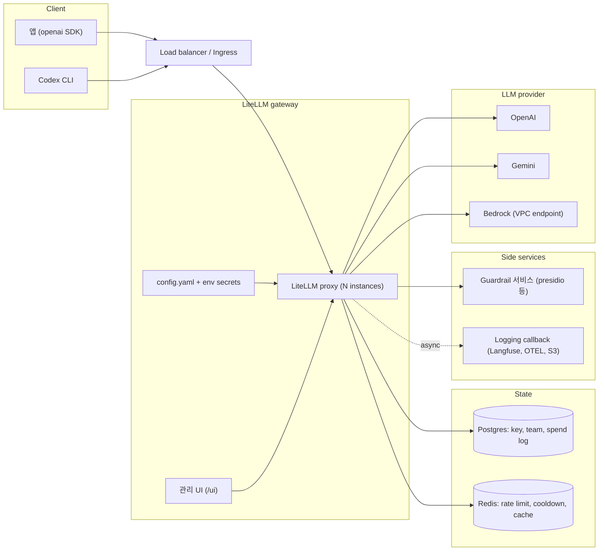
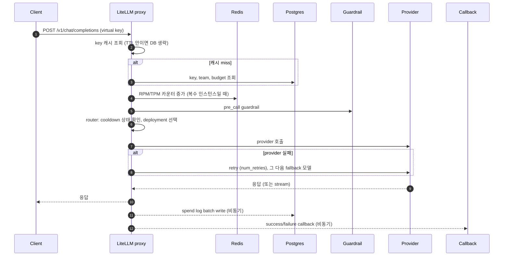
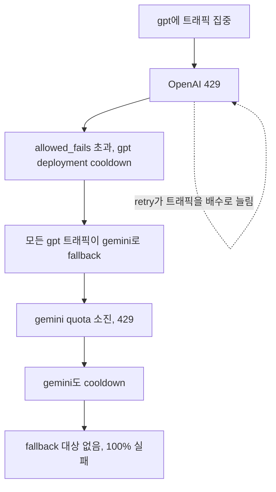
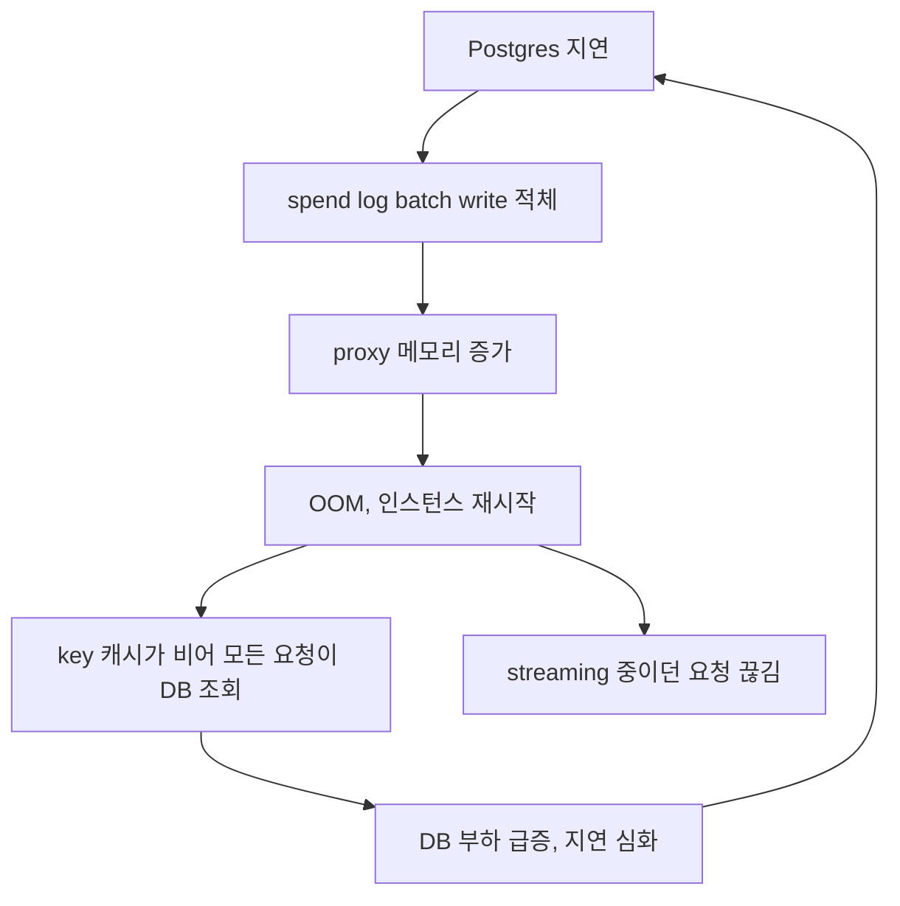

# LiteLLM 아키텍처 장애 시나리오: 컴포넌트별로 무엇이 깨지고 현업은 무엇을 고민해야 하나

gateway는 모든 LLM 트래픽의 단일 경로. 그래서 통제가 되고, 같은 이유로 gateway의 어떤 컴포넌트가 죽어도 회사의 모든 AI 기능이 같이 멈춤. 이 글은 이 워크스페이스([computer_science/ai/litellm](../README.md))의 아키텍처를 기준으로, 컴포넌트마다 어떤 시나리오에서 무엇이 깨지는지와 현업에서 반드시 결정해 둬야 하는 것을 정리함.

## 전제: 다루는 아키텍처

- 기준 구성: [install/set-model](../install/set-model/)의 proxy + Postgres 한 쌍
- 현업 확장분: proxy 복수 인스턴스, Redis, 외부 guardrail 서비스, logging callback, load balancer
- 폐쇄망 구성: [Track B](../docs/9-setup.md)의 VPC endpoint + EC2 instance role + Bedrock

컴포넌트와 의존 방향. 화살표는 "누가 누구에게 의존하는가"를 뜻함.



## 요청 한 건이 지나는 길

장애를 이해하려면 요청이 어느 컴포넌트를 동기로 지나고 어느 것이 비동기인지 알아야 함. 동기 경로의 장애는 요청 실패, 비동기 경로의 장애는 데이터 유실.



동기 경로에 있는 것: proxy, key 캐시 miss 시 Postgres, Redis, guardrail, provider. 비동기 경로에 있는 것: spend log, callback. 이 구분이 아래 모든 시나리오의 뼈대.

## 컴포넌트별 장애 시나리오

### 1. LiteLLM proxy 프로세스

| 시나리오 | 증상 | 영향 범위 |
|---|---|---|
| 단일 인스턴스 재시작·OOM | 모든 요청 connection refused | 회사의 모든 LLM 트래픽 |
| 느린 provider 하나가 worker를 점유 | 정상 provider로 가는 요청까지 대기·timeout | 전체 모델 (head-of-line blocking) |
| 배포 시 config.yaml 문법·참조 오류 | 프로세스 기동 실패, 롤링 배포가 멈춤 | 전체 |
| 업그레이드 시 Prisma migration 실패·lock | 새 버전이 뜨지 못하고 구버전만 남거나 둘 다 없음 | 전체 |
| spend log batch가 쌓인 채 DB write 실패 | 메모리 증가 후 OOM | 전체 |
| 긴 streaming 응답 중 인스턴스 교체 | 클라이언트가 응답 중간에 끊김 | 해당 요청 |

현업에서 고민할 것

- 인스턴스 수와 worker 수. 한 provider의 지연이 다른 provider 트래픽을 굶기지 않게 timeout(router_settings.timeout)과 max parallel requests를 명시적으로 정함
- readiness 경로. /health는 provider를 실제로 호출해 비용과 rate limit을 소모하므로 LB health check에는 /health/liveliness·/health/readiness를 씀
- config 변경을 "재기동"으로 반영할지 store_model_in_db로 무중단 반영할지. 후자는 DB가 config의 진실이 되어 DB 장애의 영향이 커짐
- 배포 전 config 검증을 CI에 넣을지. 문법 오류 하나가 회사 전체 AI를 세움
- streaming 요청을 위한 graceful shutdown 유예 시간

### 2. Postgres

| 시나리오 | 증상 | 영향 범위 |
|---|---|---|
| DB down | 캐시 TTL이 지난 virtual key부터 401, /key/generate·/team 계열 API 전부 실패, UI 접속 불가 | 캐시 만료 순서대로 전체 |
| DB 지연 | 캐시 miss 요청의 응답 시간이 DB 지연만큼 증가 | 일부 요청 |
| 디스크 가득 참 | spend log write 실패, 이후 인증 조회까지 실패 | 전체 |
| connection pool 고갈 | proxy 인스턴스 × worker 수만큼 커넥션이 열려 max_connections 초과 | 새로 뜨는 인스턴스 |
| 예산 초과 감지 지연 | spend는 비동기 batch로 기록되므로 그 주기 동안 예산을 넘겨 씀 | 예산이 걸린 key·team |
| 백업 없이 볼륨 유실 | 발급된 모든 virtual key와 spend 기록 소멸 | 전체 (모든 클라이언트 key 재발급) |

현업에서 고민할 것

- DB가 죽었을 때 gateway를 fail-open할지 fail-closed할지. allow_requests_on_db_unavailable 옵션은 DB 장애 중 요청을 통과시키지만 인증·한도 검사가 약해짐. 폐쇄망 안이라면 열고, 외부 노출이면 닫는 식으로 네트워크 위치에 따라 결정
- user_api_key_cache_ttl. 길면 DB 장애를 버티는 시간이 늘지만 key 회수가 그만큼 늦게 반영됨. 유출 대응 시간과 가용성의 교환
- spend log 보존 기간. store_prompts_in_spend_logs를 켜면 프롬프트 전문이 남아 테이블이 빠르게 커짐. maximum_spend_logs_retention_period로 회전시키거나 외부 로깅으로 옮김
- 예산 초과를 "정확히" 막아야 하는지, "대략" 막아도 되는지. 정확히 막으려면 batch 주기를 줄여야 하고 DB 부하가 늘어남
- Postgres를 관리형(RDS Multi-AZ)으로 둘지, 컨테이너 볼륨으로 둘지. 실습은 후자지만 현업에서는 key 저장소이므로 백업·복구 절차가 필수

### 3. Redis (proxy가 둘 이상일 때)

| 시나리오 | 증상 | 영향 범위 |
|---|---|---|
| Redis 없이 인스턴스만 늘림 | 인스턴스마다 카운터를 따로 세어 rpm_limit이 인스턴스 수 배로 느슨해짐 | 한도가 걸린 모든 key |
| Redis down | 인스턴스별 in-memory로 회귀해 위와 같은 상태, 또는 요청 실패 | 한도·cooldown·cache |
| Redis 지연 | 모든 요청이 카운터 갱신 왕복만큼 느려짐 | 전체 |
| cooldown 상태 유실 | 죽은 provider로 다시 트래픽이 가서 실패가 반복됨 | fallback 대상 모델 |
| 캐시 키 충돌 (여러 환경이 같은 Redis 공유) | 다른 환경의 한도·캐시 응답이 섞임 | 환경 간 |

현업에서 고민할 것

- 한도가 "대략"이어도 되는지. 비용 상한이 목적이면 인스턴스 수 배의 오차를 감수할 수 있고, provider quota 보호가 목적이면 Redis가 필수
- Redis를 요청 경로에 넣는 순간 Redis 가용성이 gateway 가용성의 상한이 됨. 관리형 Redis와 그 SLA를 확인
- 환경(dev·staging·prod)별로 Redis를 분리할지, key prefix로 나눌지

### 4. LLM provider

| 시나리오 | 증상 | 영향 범위 |
|---|---|---|
| provider 전면 장애 | fallback이 있으면 다른 provider로, 없으면 5xx | 해당 별칭 |
| 429 rate limit | retry가 트래픽을 더 늘려 429가 길어짐 | 해당 provider의 모든 team (quota는 provider key 단위로 공유) |
| 특정 모델 deprecation·404 | 인증은 되는데 모델이 없어 실패. fallback 조건에 안 걸리면 그대로 실패 | 해당 별칭 |
| provider key 만료·회수 | 401. fallback이 받으면 조용히 다른 provider 비용으로 전환됨 | 해당 별칭 |
| 리전 장애 (Bedrock) | inference profile이 다른 리전으로 못 넘어가면 실패 | 폐쇄망 트랙 전체 |
| 응답은 오지만 느림 | timeout 전까지 worker 점유. 1번 시나리오로 번짐 | 전체 |

현업에서 고민할 것

- provider key를 team마다 따로 둘지 하나로 공유할지. 공유하면 한 팀의 폭주가 다른 팀의 429가 됨(noisy neighbor). 분리하면 key 관리 비용이 늘어남
- retry 횟수와 backoff. num_retries가 크면 장애 중 provider에 보내는 트래픽이 배수로 늘어 복구를 늦춤
- 모델 deprecation을 누가 감시하는지. gateway는 별칭을 감추므로 앱은 모델이 사라진 것을 알 수 없음

### 5. Router와 fallback 설정

fallback은 장애 대응 기능이면서 동시에 장애를 퍼뜨리는 통로. 아래 도미노가 대표 사례.



| 시나리오 | 증상 | 영향 범위 |
|---|---|---|
| fallback 도미노 | 1차 provider 장애가 2차 provider quota를 소진해 둘 다 죽음 | 두 별칭 모두 |
| cooldown 오탐 | 한 key의 429로 deployment 전체가 cooldown되어 정상 팀도 fallback으로 넘어감 | 전체 |
| fallback 모델의 품질·형식 차이 | tool call·JSON 형식이 달라 앱 파싱이 깨짐. drop_params가 조용히 파라미터를 버림 | 앱 로직 |
| fallback 비용 차이 | 싼 모델 예산으로 비싼 모델을 써 예산이 예상보다 빨리 소진 | 예산이 걸린 team |
| context_window·content_policy fallback 미설정 | 긴 입력이나 정책 거부가 일반 실패로 처리되어 fallback이 안 탐 | 해당 요청 |

현업에서 고민할 것

- fallback 대상 provider의 quota가 1차 트래픽 전체를 받을 수 있는지. 못 받으면 fallback은 장애를 전파하는 장치
- allowed_fails와 cooldown_time. 너무 민감하면 오탐, 너무 둔하면 죽은 provider에 계속 보냄
- fallback이 발생했다는 사실을 앱과 운영자에게 어떻게 알릴지. 응답 헤더·로그·알림 중 무엇으로
- fallback 후 응답 형식이 달라지는 것을 앱이 감당할 수 있는지. 안 되면 같은 provider 안의 다른 모델로만 fallback을 제한

### 6. Guardrail 서비스

| 시나리오 | 증상 | 영향 범위 |
|---|---|---|
| 외부 guardrail 서비스 down | pre_call 단계에서 예외. fail-closed면 전체 요청 실패 | default_on인 모든 요청 |
| guardrail 지연 | 모든 요청에 지연 가산. streaming 첫 토큰이 늦어짐 | 전체 |
| 오탐 | 정상 프롬프트가 차단·마스킹됨. hide-secrets가 코드 안의 예시 문자열을 지우는 식 | 해당 요청 |
| 미탐 | 막아야 할 것이 통과. 보안팀은 gateway가 막는다고 믿고 있음 | 신뢰 |
| post_call guardrail과 streaming | 응답을 다 모아야 검사할 수 있어 streaming 이점이 사라짐 | streaming 요청 |

현업에서 고민할 것

- guardrail 장애 시 fail-open과 fail-closed 중 무엇을 택할지. 보안 요건이면 closed, 가용성 요건이면 open. 이 결정을 보안팀과 문서로 합의
- guardrail을 요청 경로에 두는 대신 비동기 감사로 뺄 수 있는 항목이 있는지
- 오탐 신고 경로. 개발자가 "왜 막혔는지" 알 수 없으면 우회를 시도하게 됨

### 7. Logging callback과 observability

| 시나리오 | 증상 | 영향 범위 |
|---|---|---|
| Langfuse·OTEL collector down | 비동기 callback이 큐에 쌓여 메모리 증가, 결국 proxy OOM | 전체 |
| 동기 callback 사용 | callback 대상 지연이 요청 지연이 됨 | 전체 |
| 로그 유실 | 사고 조사 시 "누가 무엇을 보냈는지"가 비어 있음 | 감사 |
| 로그에 프롬프트 전문 저장 | 로깅 시스템이 새로운 PII 저장소가 됨 | 규제 |

현업에서 고민할 것

- 감사 로그의 진실 원천을 Postgres spend log로 둘지 외부 로깅으로 둘지. 둘 다 두면 불일치가 생기고, 하나만 두면 그 하나의 장애가 감사 공백
- callback 장애가 proxy를 죽이지 않도록 큐 상한과 drop 정책이 있는지
- 로그 보존 기간과 접근 권한. 프롬프트가 들어간 로그는 코드 로그와 다른 등급

### 8. 설정과 secret

| 시나리오 | 증상 | 영향 범위 |
|---|---|---|
| LITELLM_SALT_KEY 변경 | DB에 암호화 저장된 provider 자격증명 복호화 실패. UI에서 등록한 모델 전부 무효 | store_model_in_db 사용 시 전체 |
| master key 유출 | 모든 key 발급·삭제·예산 변경 가능 | 전체 |
| provider key 회전 | env 방식이면 재기동 필요. 회전 순서를 틀리면 그 사이 401 | 해당 provider |
| .env를 이미지나 git에 포함 | 자격증명 유출 | 전체 |
| secret manager 연동 후 그 서비스 장애 | 기동 시 secret을 못 읽어 proxy가 뜨지 않음 | 재기동 시 전체 |

현업에서 고민할 것

- salt key와 master key를 어디에 보관하고 누가 볼 수 있는지. salt key는 한 번 정하면 바꿀 수 없는 값으로 취급
- master key를 사람이 직접 쓰는 일이 없도록 admin 전용 virtual key를 따로 둘지
- provider key 회전 절차를 무중단으로 할 수 있는지. 같은 provider에 key 두 개를 deployment로 등록해 두면 교체 중 한쪽이 받음

### 9. Load balancer와 ingress

| 시나리오 | 증상 | 영향 범위 |
|---|---|---|
| idle timeout이 짧음 | 긴 생성 응답이 도중에 끊김. ALB 기본 60초 | 긴 streaming |
| health check가 /health를 호출 | 주기적으로 provider를 실제 호출해 비용과 rate limit 소모 | provider quota |
| 응답 버퍼링 | streaming인데 LB가 모아서 보내 첫 토큰이 늦음 | streaming |
| TLS 종료 지점 오류 | 앱의 base_url이 통째로 실패 | 전체 |

현업에서 고민할 것

- 최대 생성 길이 기준으로 idle timeout을 정했는지
- health check 경로가 provider를 건드리지 않는지
- streaming 응답을 버퍼링하지 않도록 ingress 설정을 확인했는지

### 10. 폐쇄망 (Track B)

| 시나리오 | 증상 | 영향 범위 |
|---|---|---|
| bedrock-runtime endpoint의 private DNS 비활성 | 호출이 공인 endpoint로 가려다 인터넷이 없어 timeout | LLM 호출 전체 |
| endpoint security group에서 443 차단 | 위와 같은 timeout | 해당 endpoint 기능 |
| IMDSv2 hop limit 1 | docker bridge 안의 컨테이너가 instance role 자격증명을 못 받아 Bedrock 401. 호스트에서는 되는데 컨테이너에서만 실패 | 컨테이너 안의 LLM 호출 |
| instance role 권한이 inference profile만 있거나 foundation model만 있음 | 한쪽 리소스에서 AccessDenied | 해당 모델 |
| Bedrock model access 미활성·리전 quota 초과 | 403 또는 429 | 해당 모델 |
| ECR endpoint 제거 후 컨테이너 재시작 | 이미지 pull 실패로 proxy가 다시 못 뜸 | 재기동 시 전체 |
| SSM endpoint 장애 | 서버 접속 자체가 불가. 장애 대응을 할 수 없음 | 운영 |

현업에서 고민할 것

- 폐쇄망에서는 "인터넷이 없어서 timeout"과 "provider 장애로 timeout"이 같은 증상으로 보임. endpoint 상태를 따로 모니터링해야 구분됨
- 이미지·패키지 공급 경로가 endpoint 하나에 걸려 있음. 재기동을 못 하는 상태가 되지 않도록 이미지를 EC2에 미리 두거나 ECR endpoint를 이중화
- SSM이 끊기면 아무것도 못 함. 접속 수단의 대안(EC2 Serial Console 등)을 정해 둠
- instance role 자격증명은 자동 갱신되지만 IMDS 경로가 막히면 갱신이 멈춤. 컨테이너 네트워크 모드와 hop limit을 함께 확인

### 11. Client

| 시나리오 | 증상 | 영향 범위 |
|---|---|---|
| 앱이 timeout 없이 호출 | gateway 지연이 앱 스레드 고갈로 번짐 | 앱 |
| 앱의 무한 retry | gateway 장애 중 트래픽이 배수로 늘어 복구를 늦춤 | gateway 전체 |
| 앱이 429를 provider 오류로 오인 | 예산 초과인데 "provider 장애"로 대응 | 운영 |
| virtual key를 코드에 하드코딩 | key 회수 시 앱 배포가 필요 | 해당 앱 |
| gateway 하나만 알고 우회 경로 없음 | gateway 장애가 곧 앱 장애 | 앱 |

현업에서 고민할 것

- 클라이언트 retry와 gateway retry가 곱해지지 않도록 어느 층에서만 retry할지 정함
- gateway가 막은 것(401·403·429·guardrail 차단)과 provider 실패(5xx)를 앱이 구분해 다른 메시지를 내도록 응답 규약을 정함
- gateway 전면 장애 시 앱의 동작. 기능 비활성화, 캐시 응답, provider 직결 중 무엇을 허용할지. 직결을 허용하면 gateway의 통제가 우회됨

## 연쇄 장애: DB 지연에서 시작하는 재시작 폭풍

단일 컴포넌트 장애보다 위험한 것은 서로 다른 컴포넌트가 연쇄되는 경우. 두 번째 대표 사례.



이 고리를 끊는 지점은 셋. spend log 큐에 상한을 두는 것, 재시작 직후 캐시 warm-up 없이 트래픽을 받지 않는 것(readiness), DB에 커넥션 상한을 두는 것.

## 단일 경로의 역설: 결정해 둬야 하는 것 요약

gateway를 두는 이유가 "단일 경로"인데, 장애 관점에서는 그 단일 경로가 단일 장애점. 컴포넌트마다 "죽으면 열 것인가 닫을 것인가"를 미리 결정하지 않으면 장애 순간에 코드가 대신 결정함.

| 컴포넌트 | 장애 시 기본 동작 | 미리 결정할 것 |
|---|---|---|
| proxy | 닫힘 (요청 실패) | 인스턴스 수, timeout, graceful shutdown |
| Postgres | 캐시 만료 후 닫힘 | fail-open 허용 여부, 캐시 TTL, 보존 기간, 백업 |
| Redis | 인스턴스별 in-memory로 열림 (한도 느슨) | 한도 정확도 요구 수준 |
| provider | fallback 있으면 열림, 없으면 닫힘 | fallback 대상 quota, retry 횟수, key 분리 |
| guardrail | 구현에 따라 다름 | fail-open/closed를 보안팀과 합의 |
| callback | 열림 (로그 유실) | 큐 상한, 감사 진실 원천 |
| LB | 닫힘 | idle timeout, health check 경로 |
| VPC endpoint | 닫힘 | endpoint 모니터링, 접속 대안 |
| client | 앱에 따라 다름 | retry 층, 오류 구분, 우회 정책 |

## 그림: blast radius map

mermaid로는 컴포넌트가 죽었을 때 "어디까지 번지는가"를 겹치는 영역으로 표현하기 어려움. 아래 프롬프트로 이미지를 생성해 이 절에 넣음.

todo-generate-image

```text
A horizontal hand-drawn whiteboard-style diagram showing the blast radius of component failures
in an LLM gateway, drawn with slightly wobbly marker lines on a clean white background, in a
friendly handwritten marker font. All text is in English.

TITLE: a short title at the top in handwritten marker font, reading exactly: "LiteLLM gateway: what breaks when".

COMPONENTS, laid out left to right as plain rectangles with a dark (near-black) hand-drawn outline
and white fill, each labeled inside:
- "Apps (openai SDK, Codex)" on the far left
- "Load balancer"
- "LiteLLM proxy" in the center, slightly larger than the others
- "Postgres (keys, spend)" below the proxy
- "Redis (limits, cooldown)" below Postgres
- "Guardrail service" above the proxy
- "Logging callback" above the guardrail box
- "OpenAI", "Gemini", "Bedrock" stacked vertically on the far right

FLOW (all arrows are BLACK, left to right): Apps to Load balancer, Load balancer to LiteLLM proxy,
LiteLLM proxy to each of OpenAI, Gemini, Bedrock. Solid arrows from the proxy down to Postgres and
Redis, a solid arrow from the proxy up to Guardrail service, and a DASHED arrow from the proxy up
to Logging callback labeled "async".

BLAST RADIUS, drawn as three translucent hand-drawn rounded regions with a colored outline and a
short handwritten label at the region's edge:
- A RED (#D64545) region enclosing "LiteLLM proxy", "Postgres (keys, spend)" and "Load balancer",
  labeled "everything stops".
- An ORANGE (#E8870C) region enclosing "OpenAI" and "Gemini" together, labeled "fallback domino".
- A GREEN (#2FA84F) region enclosing "Logging callback" and "Redis (limits, cooldown)",
  labeled "requests survive, data or limits degrade".
Regions may overlap slightly at the proxy box; keep labels outside the boxes they enclose.

STYLE: clean, friendly hand-drawn whiteboard sketch, generous spacing, arrows and labels never
overlapping, very legible. 16:9 aspect ratio.

DO NOT: add any product logos or icons (components are labeled boxes only). No watermarks, no extra
UI chrome. Do not misspell the component names or labels. Do not let arrows or text overlap.
```

## 참고

- 이 워크스페이스의 라우팅·fallback 실습: [docs/3-routing.md](../docs/3-routing.md)
- 한도와 예산 실습: [docs/4-auth-rate-limit.md](../docs/4-auth-rate-limit.md), [docs/5-team-user.md](../docs/5-team-user.md)
- 감사와 guardrail 실습: [docs/6-audit-guardrails.md](../docs/6-audit-guardrails.md)
- 폐쇄망 설계 결정: [adr/2026-07-closed-private-subnet-design.md](../adr/2026-07-closed-private-subnet-design.md)
- LiteLLM proxy 설정 레퍼런스: https://docs.litellm.ai/docs/proxy/config_settings
- LiteLLM router reliability(retry, cooldown, fallback): https://docs.litellm.ai/docs/routing
- LiteLLM proxy 운영 가이드(prod): https://docs.litellm.ai/docs/proxy/prod
