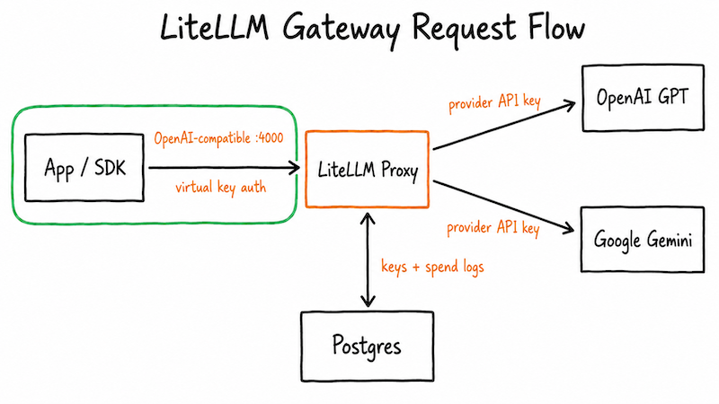

# 엔터프라이즈는 왜 AI 모델보다 AI gateway를 먼저 찾을까

회사가 GPT를 도입하기로 했다고 하자. 회사가 처음 던지는 질문은 "어떤 모델을 쓸 거냐"가 아니고, "누가 그 key를 쥐고, 누가 얼마를 쓰는지 어떻게 감사하냐"다. AI gateway는 이 질문에 답하려고 모델 앞에 놓는 계층이다. LiteLLM은 그 계층의 대표 오픈소스 구현이고, 이 문서는 gateway가 정확히 무슨 문제를 푸는지부터 정리한다.

## AI를 도입하면 왜 gateway부터 막히는가

엔지니어 입장에서 LLM 호출은 간단하다. OpenAI SDK에 key 하나 넣고 부르면 끝이다. 문제는 이게 "엔지니어 한 명"이 아니라 "회사"일 때 생긴다.

- key를 각 애플리케이션에 나눠주면, 누가 어디에 썼는지 추적이 안 되고 회수도 어렵다.
- 팀마다 쓰는 모델이 다른데, 코드에 provider별 SDK가 흩어진다. 모델을 바꾸면 코드를 다 고쳐야 한다.
- 비용이 폭주해도 누구 때문인지 모른다. 한도를 걸 지점이 없다.
- 보안이 엄격한 회사는 애초에 인터넷으로 SaaS를 못 부른다.

이 문제들은 모델을 더 좋은 걸로 바꾼다고 풀리지 않는다. 호출을 한 곳으로 모아, 그 지점에서 인증·라우팅·한도·감사를 거는 계층이 있어야 풀린다. 그 계층이 AI gateway다. 네트워크로 치면 reverse proxy가 하는 일을 LLM 트래픽에 하는 것이다.

## gateway 하나가 감추는 것

gateway의 핵심 가치는 "뒤를 감춘다"는 데 있다. 애플리케이션은 gateway의 OpenAI 호환 endpoint 하나만 안다. 그 뒤에 GPT가 있든 Gemini가 있든, SaaS든 폐쇄망의 Bedrock이든 애플리케이션 코드는 바뀌지 않는다.

여기서 "왜 Postgres가 붙어 있냐"는 질문이 자연스럽다. gateway가 발급한 virtual key, 팀·예산, 그리고 누가 얼마를 썼는지 남기는 spend log가 전부 이 DB에 있다. gateway를 인증·감사 계층으로 만드는 상태가 여기 저장된다. 그래서 이 실습은 proxy와 Postgres를 한 쌍으로 띄운다.

## 엔터프라이즈가 gateway에 요구하는 6가지

채용 공고와 보안 요건에서 반복되는 요구를 추리면 여섯 가지다. 각각이 LiteLLM의 어떤 기능이고 이 실습의 어디에서 다루는지 함께 본다.

| 요구 | LiteLLM 기능 | 다루는 문서 |
|---|---|---|
| model 다중 선택·장애 대응 | model_list 라우팅, fallback | [3-routing.md](3-routing.md) |
| 인증/인가 | master key, virtual key, team·user 계층 | [4-auth-rate-limit.md](4-auth-rate-limit.md), [5-team-user.md](5-team-user.md) |
| token rate limit | key·team별 RPM·TPM, max_budget | [4-auth-rate-limit.md](4-auth-rate-limit.md) |
| audit·비용 추적 | spend logs | [6-audit-guardrails.md](6-audit-guardrails.md) |
| 가드레일 | guardrails hook | [6-audit-guardrails.md](6-audit-guardrails.md) |
| 인터넷 없는 곳에 구축 | 폐쇄망 + Bedrock | [9-setup.md](9-setup.md), [10-airgapped-bedrock.md](10-airgapped-bedrock.md) |

이 여섯 가지 위에 실무 운영을 위한 세 가지를 Track A에 더 붙였다. 권한을 사람·팀 규모로 넓히는 [5-team-user.md](5-team-user.md), 이 모든 걸 눈으로 관리하는 콘솔 [7-web-ui.md](7-web-ui.md), 실제 client를 코드 수정 없이 붙이는 [8-connect-clients.md](8-connect-clients.md)다.

## 다음

먼저 로컬 실습 환경을 띄우는 [2-setup.md](2-setup.md)로 넘어간다. 환경이 뜨면 GPT·Gemini를 한 endpoint로 부르는 [3-routing.md](3-routing.md)로 이어진다.
