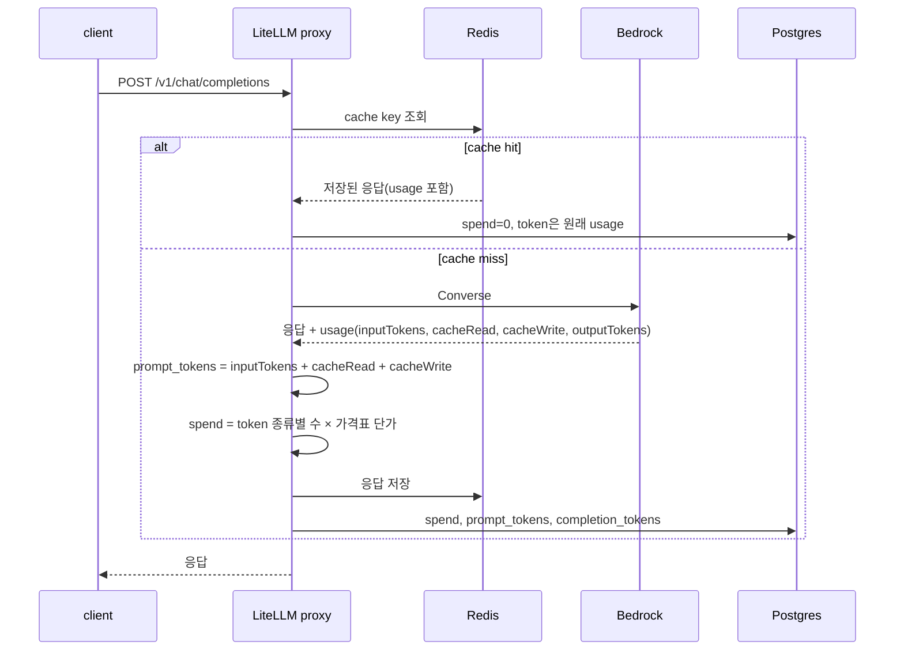

# LiteLLM은 청구서를 읽지 않고 usage에 가격표를 곱합니다

[3-scenarios.md](3-scenarios.md)에서 본 차이의 원인을 LiteLLM v1.99.1(commit `10f4033437`) 소스와 GitHub 이력에서 찾습니다. 먼저 왜 이렇게 만들어졌는지를 보고, 그 뒤에 어떻게 동작하는지를 봅니다.

주장마다 확신 등급을 붙입니다.

| 등급 | 뜻 |
|---|---|
| `[Direct]` | 작성자가 커밋, PR, 이슈, 코드 주석에 글로 썼습니다 |
| `[Supported]` | 간접 증거 여러 개가 같은 쪽을 가리킵니다 |
| `[Inferred]` | 코드를 읽고 제가 해석했습니다 |
| `[Unknown]` | 찾았지만 없었습니다 |

## 질문

LiteLLM proxy가 `bedrock/global.anthropic.claude-sonnet-4-6`을 호출할 때 LiteLLM spend와 AWS 청구가 달라지는 지점은 어디이고, 왜 그렇게 설계됐는가.

## Why: 차이는 버그보다 회계 기준의 차이에서 나옵니다

### 가격표는 LiteLLM 저장소의 JSON 파일입니다

- `[Direct]` LiteLLM은 단가를 `model_prices_and_context_window.json`에서 읽습니다. 기본 동작은 proxy가 기동할 때 GitHub main의 파일을 받아오는 것입니다. `litellm/litellm_core_utils/get_model_cost_map.py:1-8`의 docstring이 "Pulls the cost ... from <https://github.com/BerriAI/litellm/blob/main/model_prices_and_context_window.json>. This can be disabled by setting the LITELLM_LOCAL_MODEL_COST_MAP environment variable to True"라고 씁니다. URL 기본값은 `litellm/__init__.py:412`에 있습니다.
- `[Inferred]` 같은 v1.99.1 이미지라도 기동한 날에 따라 단가가 다를 수 있습니다. AWS가 요금을 바꿔도 누군가 JSON을 고쳐 PR을 올리기 전까지 LiteLLM은 옛 단가를 씁니다.
- `[Direct]` cross-region profile은 가격표 키가 따로 있습니다. v1.99.1 가격표에서 `global.anthropic.claude-sonnet-4-6`은 입력 `3e-06`, `us.`과 `eu.`과 `jp.`과 `au.` 접두사는 `3.3e-06`입니다. 10% 차이입니다.
- `[Direct]` 접두사가 붙은 키를 찾지 못하고 기본 모델 단가로 떨어지는 문제가 열려 있습니다. 이슈 #30768(Prathamesh010, 2026-06-18, open)은 "get_model_info resolves pricing using the base-model key ... so the reported/logged cost is understated"라고 보고합니다. `global.`은 기본 모델과 단가가 같아서 이 문제의 영향을 받지 않습니다. 이 핸즈온이 `global.`을 쓰는 한 단가 차이는 0이어야 합니다.

### Bedrock 캐시 token은 한 번 잘못 계산된 뒤 고쳐졌습니다

- `[Direct]` Converse 응답의 캐시 token을 OpenAI 형식 usage로 옮기는 코드는 커밋 `f99b1937db`(Krrish Dholakia, 2025-03-13, "translate converse usage block with cache creation values to openai format")에서 들어왔습니다.
- `[Direct]` 그 뒤 비용이 두 배로 잡히는 버그가 보고됐습니다. 이슈 #12258(2025-07-02)은 spend log가 $0.084096인데 손으로 계산하면 $0.0423804라고 적고, 원인을 "I don't see any special treatment of a bedrock llm provider, which then leads to it being calculated in the default way where no cached tokens are included"로 짚습니다. PR #12488(jdietzsch91, 2025-07-11 merge)이 `litellm/llms/bedrock/cost_calculation.py`를 추가해 고쳤습니다.
- `[Direct]` 커밋 `c84597ecd0`(Ishaan Jaffer, 2026-04-14)은 제목이 "capture raw input_tokens as text_tokens before cache inflation"입니다. 작성자가 `prompt_tokens`에 캐시 token을 더하는 동작을 inflation이라고 부릅니다.
- `[Inferred]` `prompt_tokens`에 캐시 token을 더하는 이유는 OpenAI 형식과 맞추기 위해서로 보입니다. OpenAI usage는 `prompt_tokens`가 전체 입력이고 `prompt_tokens_details.cached_tokens`가 그 부분집합입니다. 이유를 직접 적은 글은 찾지 못했습니다.

### 응답 캐시 hit 행의 token 의미는 정해지지 않았습니다

- `[Direct]` 캐시 hit의 비용은 코드가 0으로 고정합니다. `litellm/cost_calculator.py:1789`와 `litellm/proxy/hooks/proxy_track_cost_callback.py:260`이 그렇게 합니다.
- `[Direct]` token 컬럼은 원래 응답의 usage를 그대로 다시 적습니다. 이슈 #39057(roy-tong, 2026-09-01, open)이 이 동작을 "spend is zeroed but token columns replay the original usage"로 정리하고 의도된 계약이 무엇인지 묻습니다. 2026-09-20 기준 maintainer의 답은 없습니다. 같은 이슈의 댓글은 한 행 안에서 금액은 provider 비용 기준, token은 제공량 기준이라 서로 다른 회계 기준을 따른다고 지적합니다.
- `[Unknown]` 비용을 0으로 두기로 한 최초 커밋의 설명은 찾지 못했습니다. partial clone에서 `git log -S`가 실패해 이력을 끝까지 따라가지 못했습니다.

### 끊긴 스트림은 "안 남김"에서 "추정해서 남김"으로 바뀌었습니다

- `[Direct]` 이슈 #14457(jasonpnnl, 2025-09-11, v1.75.8)은 클라이언트가 스트림을 끊으면 usage가 통째로 사라진다고 보고합니다. provider는 usage를 마지막 chunk에만 싣기 때문입니다. 작성자는 "Provider bills for tokens, but LiteLLM cannot bill downstream customers"라고 썼고, v1.80.11에서도 그대로라고 댓글을 남겼습니다.
- `[Direct]` v1.99.1에는 `_bill_partial_streamed_spend_on_disconnect`(`litellm/proxy/common_request_processing.py:319`)가 있습니다. docstring이 "A client disconnect throws GeneratorExit/CancelledError into the streaming generator, so neither the success nor the failure logging callback fires ... Assemble the partial response from the wrapper's collected chunks and dispatch success logging for it"라고 설명합니다.
- `[Direct]` 이 경로는 token을 추정합니다. 이슈 #37992(linshaoyong, 2026-08-23, open)에 따르면 `calculate_usage()`가 `prompt_tokens or token_counter(...)` 형태라서 provider usage가 없거나 0이면 로컬 tokenizer 값으로 바뀝니다. 해당 코드는 `litellm/litellm_core_utils/streaming_chunk_builder_utils.py:949`에 있습니다. 같은 이슈는 이 행이 `status=success`로 저장된다고도 적습니다.

### 모르는 것

- 클라이언트가 끊은 뒤에도 Bedrock `OutputTokenCount`가 `max_tokens`까지 올라간 이유. 시나리오 4에서 3건 모두 800이었습니다. proxy가 upstream 스트림을 닫지 않아서인지, 닫아도 Bedrock이 생성을 끝까지 하는지는 구분하지 못했습니다. PR #36126(open, "close upstream stream when a /v1/responses or /v1/messages client disconnects")이 같은 계열의 문제를 다루지만 `/v1/chat/completions` 경로는 제목에 없습니다(확인 필요).
- Anthropic 모델용 Claude tokenizer가 LiteLLM에 없을 때 `token_counter`가 쓰는 대체 tokenizer와 그 오차 크기.

### 본 소스

- 로컬 git: 태그 v1.99.1의 위 파일들과 `git log -- litellm/llms/bedrock/cost_calculation.py`.
- GitHub: `gh api search/issues`로 `bedrock cost in:title`, `cache hit spend in:title`, `stream disconnect cost`, `bedrock prompt caching cost`를 검색했습니다. 이슈 #12258, #14457, #30768, #37992, #39057과 PR #12488을 본문과 댓글까지 읽었습니다.
- 보지 않은 것: LiteLLM 공식 문서 사이트, AWS 요금 페이지. 단가는 v1.99.1 가격표 값만 확인했고 AWS 요금표와 대조하지 않았습니다.

## How: 요청 하나가 spend 한 줄이 되기까지

핵심은 세 단계입니다.

1. `_transform_usage`(`litellm/llms/bedrock/chat/converse_transformation.py:1846-1885`)가 Bedrock usage를 옮깁니다. Bedrock의 `inputTokens`는 캐시되지 않은 입력만 셉니다. LiteLLM은 여기에 `cacheReadInputTokens`와 `cacheWriteInputTokens`를 더해 `prompt_tokens`를 만들고, 더하기 전 값을 `text_tokens`로 따로 둡니다.
2. `generic_cost_per_token`이 부르는 `_calculate_input_cost`(`litellm/litellm_core_utils/llm_cost_calc/utils.py:646`)는 `prompt_tokens`가 아니라 `text_tokens`, `cache_hit_tokens`, `cache_creation_tokens`에 각각 다른 단가를 곱합니다. 그래서 spend는 맞고 `prompt_tokens`만 큽니다. 캐시 쓰기가 1시간 TTL이면 `cache_creation_input_token_cost_above_1hr` 단가를 씁니다.
3. proxy는 결과를 `LiteLLM_SpendLogs`에 요청당 한 줄로 씁니다. 캐시 hit은 `request_id`에 `_cache_hit<시각>`을 붙인 새 행이 됩니다(`litellm/proxy/spend_tracking/spend_tracking_utils.py:429-432`).

AWS 쪽은 집계 단위가 다릅니다. Bedrock은 자기가 처리한 호출만 세고, 입력과 출력과 캐시 읽기와 캐시 쓰기를 서로 다른 usage type으로 나눠 source region에 청구합니다. Cost Explorer와 CUR은 이 값을 시간 또는 일 단위 합계로 보여줍니다. 요청 단위 행은 없습니다.

## 차이가 나는 지점

| 지점 | LiteLLM | AWS | 시나리오 |
|---|---|---|---|
| 요청 수 | proxy가 받은 요청 전부. 캐시 hit, 실패 포함 | Bedrock이 처리한 호출 | 2 |
| 캐시 hit 행의 token | 원래 usage를 다시 적음 | 호출이 없으므로 0 | 2 |
| 입력 token의 범위 | `prompt_tokens` = 일반 + 캐시 읽기 + 캐시 쓰기 | 세 가지를 usage type으로 분리 | 3 |
| 끊긴 스트림의 token | 받은 chunk에서 추정(실측 205) | 서버가 `max_tokens`까지 생성한 값(실측 2,400) | 4 |
| 실패한 요청 | 추정 `prompt_tokens`와 spend 0인 행 | 인증 실패처럼 모델에 닿지 않은 호출은 청구 없음 | - |
| 단가 | 기동 시점의 가격표 JSON | 청구 시점의 AWS 요금표 | 1 |
| 재시도, fallback | 요청 1건 | 호출 여러 건 | 끔(`num_retries: 0`) |
| 금액의 종류 | 정가 × token | credit, 할인, 세금이 반영된 값 | - |
| 시점 | 수 초 | 하루쯤, UTC 기준 일 단위 | - |

실패한 요청 행은 이 workspace를 검증하면서 확인했습니다. 잘못된 AWS 키로 시나리오 1을 돌리면 `status=failure`인 행이 `prompt_tokens` 26, spend 0으로 남습니다.

## 제약 세트

LiteLLM spend를 비용 통제에 쓸 때 이 분석에서 나오는 제약입니다.

- Preserve: 금액 집계는 `spend` 컬럼으로 합니다. 캐시 hit이 0으로 들어가므로 청구서와 같은 기준입니다.
- Preserve: `LITELLM_LOCAL_MODEL_COST_MAP=True`나 자체 가격표 URL(`LITELLM_MODEL_COST_MAP_URL`)로 단가의 출처를 고정합니다. 단가가 언제 바뀌었는지 알 수 있어야 대조가 됩니다.
- Avoid: `prompt_tokens` 합에 입력 단가를 곱해 비용을 역산하지 않습니다. prompt caching을 쓰면 이슈 #12258과 같은 방식으로 두 배 가까이 부풀려집니다.
- Avoid: `prompt_tokens`와 `completion_tokens` 합을 provider 사용량으로 보고하지 않습니다. 응답 캐시 hit과 실패 행이 섞여 있습니다. `cache_hit`과 `status`로 걸러야 Bedrock의 값에 가까워집니다.
- Risk: token 기준 budget이나 rate limit은 캐시 hit에도 차감될 수 있습니다(#39057 댓글의 지적, 코드로 확인하지 않음).
- Risk: 끊긴 스트림의 spend는 추정값이고 실측에서 Bedrock 쪽 금액의 9%였습니다. 금액이 어긋난 시나리오는 이것 하나입니다. 스트리밍 중단이 잦은 클라이언트(코딩 agent)가 많으면 `max_tokens`를 낮추는 것이 청구를 줄이는 직접적인 수단입니다.

## 확신 요약

캐시 token 합산, 캐시 hit의 spend 0과 token 재기록, 가격표 출처, 끊긴 스트림의 부분 과금은 v1.99.1 코드와 이슈 원문으로 확인했습니다. token 수는 [3-scenarios.md](3-scenarios.md)의 기록표에서 CloudWatch 지표와 대조해 확인했습니다. 합산의 설계 이유와 끊긴 스트림에서 Bedrock이 끝까지 생성한 원인은 추론이거나 미확인이고, Cost Explorer 금액 대조는 남아 있습니다.
