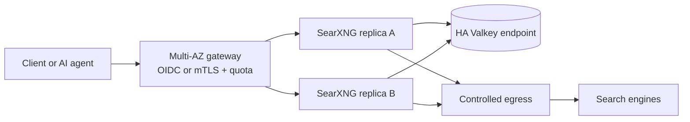

# SearXNG를 두 대 띄워도 프로덕션이 되지 않는 이유

SearXNG replica 두 대가 모두 `healthy`인데 검색 결과가 사라질 수 있습니다. 장애 지점이 SearXNG 안이 아니라, 같은 egress IP를 보는 외부 검색 엔진에 있기 때문입니다. **프로덕션의 핵심은 replica 수보다 누가 얼마나 검색하게 할지 통제하는 것입니다.**

## 봇 탐지는 두 방향에서 일어납니다

SearXNG의 limiter와 외부 검색 엔진의 봇 탐지는 목적도 결과도 다릅니다.

| 방향 | 탐지 주체 | 대표 신호 | 관찰되는 결과 |
| --- | --- | --- | --- |
| Client → SearXNG | SearXNG limiter | 비정상 header, IP별 burst, JSON API 반복 호출 | SearXNG가 `429` 반환 |
| SearXNG → Origin | Google, Bing, DuckDuckGo 등 | egress IP의 요청량·동시성, TLS/HTTP fingerprint, query 패턴 | Origin이 CAPTCHA, `403`, `429` 반환 |

SearXNG limiter가 필요한 이유는 단순히 자기 서버의 CPU를 보호하기 위해서가 아닙니다. 들어오는 자동화 요청을 그대로 통과시키면 모든 사용자의 검색이 몇 개의 egress IP로 합쳐집니다. 외부 검색 엔진 입장에서는 SearXNG 자체가 대규모 bot으로 보입니다.

### 사용자를 봇으로 판정하는 과정

SearXNG limiter는 Valkey에 IP별 sliding window를 기록합니다. 현재 기본값은 burst 20초 동안 15회, 장기 10분 동안 150회, JSON 같은 API 형식은 1시간 동안 4회입니다. `curl` 같은 User-Agent와 `text/html`이 없는 `Accept` header도 의심 신호가 됩니다.

여기서 보통 "로그인한 사용자면 limiter를 끄면 되지 않나" 하고 묻습니다. 인증은 사용자가 누구인지 증명할 뿐, 그 사용자가 외부 검색 엔진을 고갈시키지 않는다는 보장은 아닙니다. 인증 뒤에도 사용자·tenant·service별 quota와 전체 egress budget이 필요합니다.

[실습](./3-hands-on.md)은 JSON 검색을 반복해 다섯 번째 요청부터 `429`를 발생시킵니다. 실제 임계값은 제품 트래픽에 맞춰 edge gateway 정책과 함께 조정해야 합니다.

### SearXNG가 봇으로 판정되는 과정

외부 검색 엔진은 약관, IP 평판, 요청 빈도, 동시성, protocol fingerprint와 query 패턴을 각자의 기준으로 평가합니다. 판정 기준은 공개되지 않으며 엔진마다 바뀝니다. 같은 NAT Gateway를 쓰는 replica를 늘리면 source IP는 그대로인데 요청량만 늘어 차단을 앞당길 수도 있습니다.

Origin이 CAPTCHA, `403`, `429`를 반환하면 SearXNG는 engine 오류로 분류하고 설정된 시간 동안 해당 engine을 suspend합니다. 문제는 전체 `/search` 응답이 여전히 `200`일 수 있다는 점입니다. 다른 engine 결과만 남거나, `results`가 비고 `unresponsive_engines`에 오류가 기록됩니다. HTTP availability만 보면 검색 품질 장애를 놓칩니다.

실제 검색 엔진을 강제로 차단시키는 부하 테스트는 하지 않습니다. 상대 서비스에 불필요한 트래픽을 만들고 재현성도 없습니다. [로컬 mock 실습](./3-hands-on.md)에서 Origin의 `429`와 SearXNG의 engine suspend를 같은 방식으로 관찰합니다.

## 인증과 인가는 SearXNG 앞에서 끝냅니다

SearXNG의 private engine token은 특정 engine을 숨기는 기능입니다. 사용자 계정, 조직 group, session, per-user quota를 제공하는 일반적인 IAM은 아닙니다. **SearXNG를 private upstream으로 두고 identity-aware gateway를 유일한 진입점으로 사용합니다.**

| 호출자 | 인증 | 인가와 제한 |
| --- | --- | --- |
| 사내 사용자 | VPN 또는 OIDC login | IdP group별 route 허용, 사용자별 quota |
| Backend service | mTLS 또는 짧은 수명의 signed JWT | service identity별 RPS·동시 검색 수 제한 |
| AI agent | gateway가 발급·검증하는 service credential | model·tenant별 daily budget, 결과 개수 제한 |

Gateway는 인증 실패를 SearXNG에 전달하지 않아야 합니다. `Authorization` header도 upstream에서 제거합니다. 외부에 노출되는 endpoint는 TLS, request size 제한, timeout, audit event가 필요합니다. 검색어는 민감정보가 될 수 있으므로 access log에는 query string을 그대로 남기지 않습니다.

IP limiter를 사용자 quota로 착각하면 안 됩니다. 회사 NAT 뒤의 여러 사용자는 하나의 IP로 합쳐져 함께 차단될 수 있고, 공격자는 IP를 바꿀 수 있습니다. SearXNG limiter는 마지막 방어선으로 유지하고 identity 기반 quota는 gateway에서 별도로 적용합니다.

## HA는 web replica보다 더 넓게 봐야 합니다

권장 구조는 다음과 같습니다.

두 SearXNG replica에는 같은 image version, `settings.yml`, `limiter.toml`, `secret_key`를 배포합니다. limiter가 같은 IP의 요청을 어느 replica에서 받아도 합산하도록 같은 HA Valkey endpoint를 사용합니다. `/var/cache/searxng`는 SQLite 기반 cache를 포함하므로 replica별 volume으로 두고 하나의 writable filesystem을 공유하지 않습니다.

Gateway와 Valkey도 Multi-AZ 또는 자동 failover 구성이어야 합니다. Valkey 장애는 단순 cache miss가 아니라 bot protection 상태 손실로 취급합니다. Edge quota는 Valkey와 독립된 방어선으로 남겨 SearXNG limiter 하나에 의존하지 않습니다.

여기서 보통 "replica마다 egress IP를 나누면 차단도 해결되지 않나" 하고 묻습니다. IP별 요청량은 줄일 수 있지만 origin 정책 준수나 fingerprint 판정을 해결하지는 못합니다. 유료·공식 API가 있는 engine은 그것을 우선하고, 허용된 엔진만 운영하며, engine별 동시성·timeout·오류 budget을 정해야 합니다.

### 검색이 살아 있는지 측정하는 지표

- Gateway: 인증 실패율, identity별 rate limit, queue와 timeout
- SearXNG: 검색 latency, 빈 결과 비율, `unresponsive_engines`, engine별 오류율
- Origin: CAPTCHA, `403`, `429`, suspend 시간, engine별 성공 결과 수
- Valkey: 연결 실패, latency, memory, failover
- 품질 SLI: 요청당 정상 engine 수와 최소 결과 수

Liveness probe가 `200`인지보다 canary query가 기대한 최소 결과를 돌려주는지가 중요합니다. 다만 canary 자체가 origin 부하가 되지 않도록 낮은 빈도와 별도 budget을 둡니다.

## 프로덕션 전 체크리스트

- SearXNG를 public endpoint로 직접 노출하지 않습니다.
- Gateway에서 OIDC·mTLS·JWT 중 호출자에 맞는 인증을 적용합니다.
- Identity quota와 SearXNG IP limiter를 모두 둡니다.
- 신뢰할 proxy CIDR만 `trusted_proxies`에 넣고 client의 `X-Forwarded-For`를 덮어씁니다.
- SearXNG replica가 같은 config와 secret을 사용하게 합니다.
- Limiter용 Valkey를 공유하고 Valkey 장애를 감시합니다.
- 이미지 tag 대신 검증한 digest를 고정하고 변경 내역을 확인한 뒤 배포합니다.
- Origin별 `403`, `429`, CAPTCHA와 빈 결과를 alert로 만듭니다.
- 외부 검색 엔진 약관과 자동화 허용 범위를 확인합니다.
- 실제 Origin을 향한 차단 유도 부하 테스트를 하지 않습니다.

정리하면, SearXNG의 프로덕션 장애는 process가 죽어서보다 검색할 권한과 속도를 통제하지 못해 발생할 가능성이 큽니다. 인증은 앞단에서, limiter 상태는 공유 Valkey에서, 가용성 판단은 Origin 결과 품질에서 끝까지 확인해야 합니다.

## 참고자료

- [SearXNG Limiter](https://docs.searxng.org/admin/searx.limiter.html)
- [SearXNG Bot Detection](https://docs.searxng.org/src/searx.botdetection.html)
- [SearXNG server settings](https://docs.searxng.org/admin/settings/settings_server.html)
- [SearXNG search settings](https://docs.searxng.org/admin/settings/settings_search.html)
- [SearXNG private engines](https://docs.searxng.org/admin/settings/settings_engines.html#private-engines-tokens)
- [SearXNG container installation](https://docs.searxng.org/admin/installation-docker.html)
- [Why use a private instance?](https://docs.searxng.org/own-instance.html)
