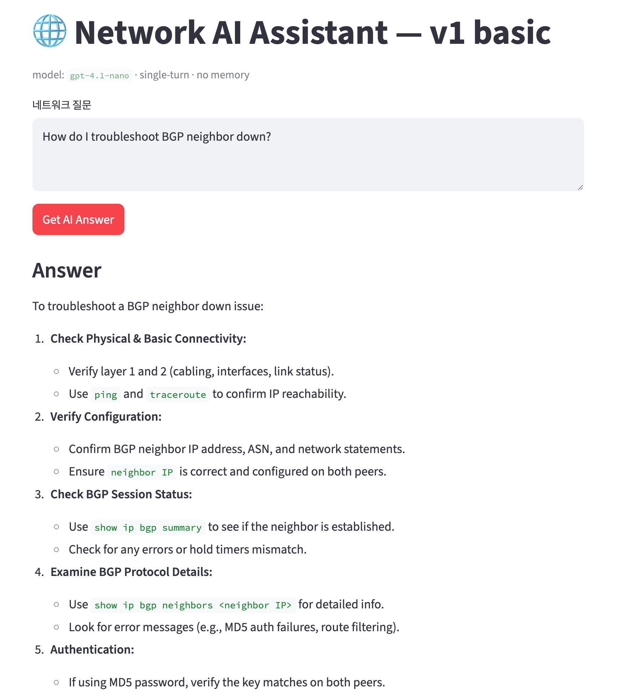

# 핸즈온: v1부터 v4까지 손으로 따라가기

## 사전 준비

파이썬 가상환경과 패키지 설치

```bash
cd ../
uv venv
uv sync
```

## v1 — inference 한 번을 손으로 본다

v1을 띄운다.

```bash
uv run streamlit run src/v1_basic.py
open http://localhost:8501
```

질문 두 개를 차례로 던져본다. 2번째 질문이 첫번째 질문과 답변을 모르는 것을 확인한다

1. "What is BGP?"
2. "그래서 timer는 어떻게 봐?"




## v2 — system prompt가 답을 어떻게 바꾸는가

v2를 띄운다. v2는 시스템프롬프트를 device type별로 다르게 구현한 예제이다.

```bash
uv run streamlit run src/v2_device_aware.py
```

같은 질문을 device_type만 바꿔서 두 번 던진다.

1. device_type=`cisco`, 질문="Show me how to configure an OSPF area"
2. device_type=`juniper`, 같은 질문


