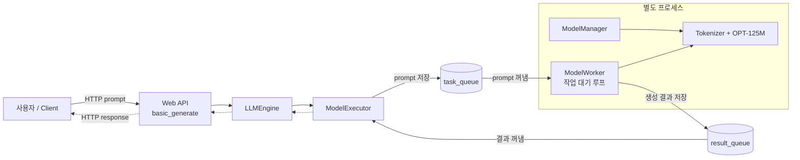
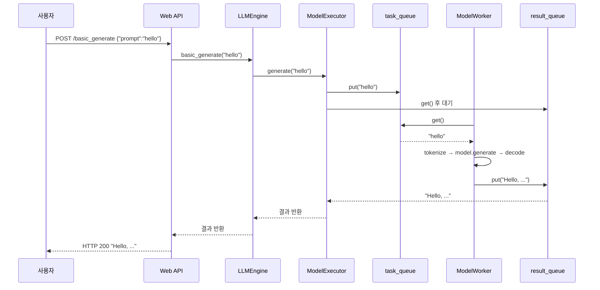

# 02. 단일 요청 처리 (주제 1·2)

## 주제

- 단일 요청의 FastAPI → LLM engine → model executor → model worker 흐름
- 웹 프로세스와 model worker 프로세스 분리
- `multiprocessing.Queue`를 이용한 요청·응답 IPC
- batching 없는 단일 worker의 직렬 처리 한계

## 컴포넌트 역할

| 컴포넌트           | 역할                  |
| -------------- | ------------------- |
| Web API        | HTTP 요청을 받고 응답을 반환  |
| LLMEngine      | 전체 생성 흐름을 조율하는 진입점  |
| ModelExecutor  | Worker 프로세스와 큐로 통신  |
| `task_queue`   | Worker가 처리할 프롬프트 전달 |
| `result_queue` | Worker가 생성한 결과 전달   |
| ModelWorker    | 별도 프로세스에서 모델 추론 수행  |
| ModelManager   | 모델과 토크나이저 로딩·관리     |
| OPT-125M       | 실제 토큰 생성 수행         |




## 코드 설명 (10초)

> `serving_v1.py`는 6개 component 중 4개(API server / LLM engine / model executor / model worker)만 쓴 최소 구현이다.
> FastAPI가 prompt를 받고, `LLMEngine`이 `ModelExecutor`에 넘기고, `ModelExecutor`는 `mp.Queue` 두 개로 **별도 프로세스**의 `ModelWorker`에 일을 보낸다.
> worker는 프로세스 시작 때 model을 한 번 로드하고, 이후 `while True`로 큐를 지키며 요청마다 `model.generate()`를 돌린다.
> 핵심은 **model 실행이 웹 프로세스와 완전히 분리되어 있다**는 것 — GPU를 CPU 작업으로 기다리게 하지 않기 위한 구조다.



## 실행

## macOS Docker Compose

서비스를 빌드하고 실행한 뒤 동시 요청 benchmark를 수행한다.

```bash
ENTRY=02_basic/serving_v1.py docker compose --profile cpu up -d --build --force-recreate serving
docker compose logs -f serving

uv run python 02_basic/client_v1.py --concurrency 20
```

소스 변경을 감지해 image와 container를 자동으로 다시 만드는 개발 실행 명령이다.

```bash
ENTRY=02_basic/serving_v1.py docker compose --profile cpu watch serving
```

## macOS 로컬 실행

서비스를 실행하고 동시 요청 benchmark를 수행한다.

```bash
uv run python 02_basic/serving_v1.py
uv run python 02_basic/client_v1.py --concurrency 8
```

## Ubuntu + RTX 5060

GPU 서비스를 실행하고 사용률을 관찰한다.

```bash
ENTRY=02_basic/serving_v1.py docker compose --profile gpu up -d --build --force-recreate serving-gpu
uv run python 02_basic/client_v1.py --concurrency 8

# GPU 사용률을 옆 터미널에서 관찰
watch -n 0.5 nvidia-smi
```

## API 요청 테스트

- [requests.http](./requests.http): HTTP Client를 이용한 health check와 단일 생성 요청
- [akbun-requesthttp.md](./akbun-requesthttp.md): akbun-requesthttp를 이용한 수동·scenario 테스트
- `client_v1.py`: 동시 요청 throughput과 latency 측정

`.http` 파일은 VS Code REST Client 또는 JetBrains HTTP Client에서 실행한다.

## Queue 상태 확인

`task_queue`와 `result_queue`는 Redis가 아닌 `multiprocessing.Queue`다. API server와 별도 model worker 프로세스 사이에서만 사용하는 로컬 IPC다.

Queue 상태 endpoint를 한 번 호출한다.

```bash
curl -s http://localhost:8000/queue_state | python3 -m json.tool
```

Queue 상태를 반복해서 확인한다.

```bash
bash 02_basic/watch_queue.sh
```

다른 터미널에서 최소 15초 걸리는 작업 8개를 동시에 보낸다.

```bash
uv run python 02_basic/client_v1.py --concurrency 8 --min-processing-seconds 15
```

`min_processing_seconds`는 Queue 관찰을 위한 교육용 지연이다. 실제 model 추론이 더 오래 걸리면 추가로 기다리지 않는다. 단일 worker가 작업 8개를 직렬 처리하므로 전체 실행은 약 2분 걸린다.

- `queued_tasks`: worker가 아직 가져가지 않은 작업 수
- `processing_tasks`: worker가 처리 중인 작업 수
- `completed_tasks`: 프로세스 시작 후 완료한 누적 작업 수
- `pending_tasks`: 대기 중인 작업과 처리 중인 작업의 합
- `worker_alive`: model worker 프로세스 생존 여부

## 로그 확인

Docker Compose 로그를 실시간으로 확인한다.

```bash
docker compose logs -f serving
```

로그 형식은 `timestamp component event pid fields` 순서다. 모든 component가 같은 `request_id`를 사용하므로 요청 처리 순서를 연결해서 볼 수 있다.

```text
2026-08-15T12:34:56.123+00:00 component=api_server event=request_received pid=10 request_id=... path=/basic_generate
2026-08-15T12:34:56.124+00:00 component=llm_engine event=generation_started pid=10 request_id=...
2026-08-15T12:34:56.125+00:00 component=model_executor event=task_enqueued pid=10 request_ids=... queued_tasks=1
2026-08-15T12:34:56.126+00:00 component=model_worker event=task_started pid=42 request_ids=... queued_tasks=0 processing_tasks=1
```

## 관찰 포인트

1. `ps -ef | grep serving_v1` → **프로세스가 2개**. 하나는 uvicorn, 하나는 model worker
2. `--concurrency`를 1 → 4 → 8로 올려도 **throughput이 거의 안 오름**
   - 이유: worker의 `while True` 루프가 요청을 **하나씩** 처리. 동시 요청은 큐에서 줄만 섬
3. Ubuntu에서 `nvidia-smi` → GPU 사용률이 **띄엄띄엄 튐**. 사이사이가 tokenize/HTTP 처리 시간
4. worker 프로세스만 `kill -9` → API는 살아 있지만 요청이 영원히 멈춤 (격리의 양면)

## 스스로 답해보기

- q2: process 격리의 **주된** 이유는 장애 격리인가 GPU 활용률인가?
- q3: 동시 100 요청에서 GPU가 노는 이유를 연산 관점에서 설명할 수 있나?
