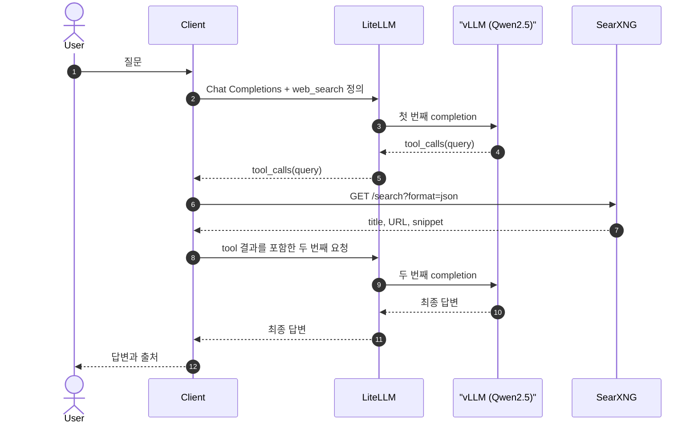
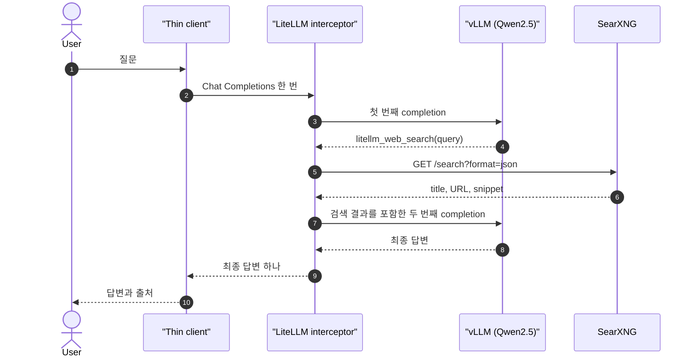
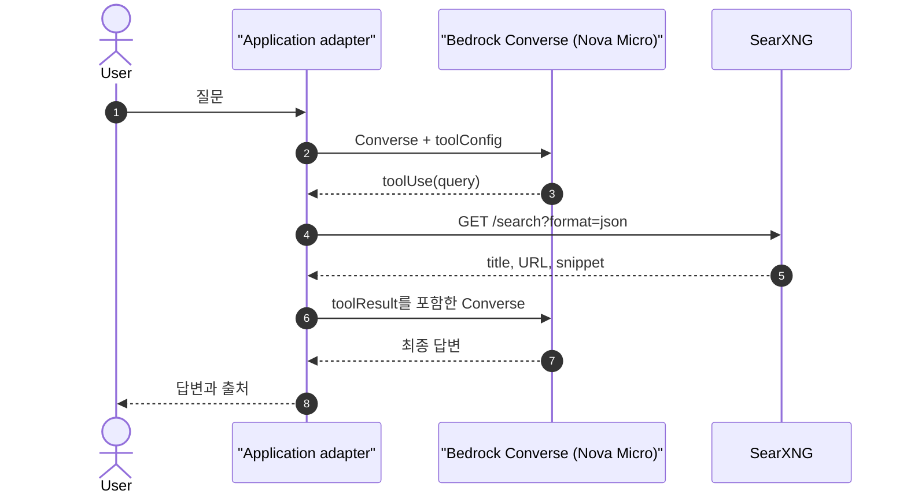

# Web search tool 실행 책임

`tool call`은 검색 실행이 아니다. 모델은 함수 이름과 인자를 만들고, client·gateway·provider adapter 중 하나가 실제 검색을 실행한다.

## 실습 구성요소

### SearXNG

- 실제 web 검색을 수행하는 self-hosted search backend다.
- Client 또는 LiteLLM이 HTTP JSON API로 호출한다.
- 여러 검색 engine의 결과를 공통 형식으로 제공한다.
- AI 모델이나 tool 실행 여부를 결정하는 agent가 아니다.
- 모델에는 검색 결과의 title·URL·snippet만 전달한다.

### AI 모델

- vLLM: `Qwen/Qwen2.5-1.5B-Instruct`
- Bedrock: `amazon.nova-micro-v1:0`

두 vLLM 시나리오는 같은 Qwen 모델을 사용한다. 검색 실행 위치만 Client와 LiteLLM으로 달라진다.

## Client가 실행

Client는 OpenAI Chat Completions 요청에서 구조화된 함수 호출을 받고 SearXNG를 실행한 뒤, tool 결과를 담아 두 번째 요청을 보낸다.

- LiteLLM은 인증·라우팅·quota·usage 기록에 집중한다.
- 검색 장애가 gateway 전체 장애로 확산되지 않는다.
- Client마다 tool round·timeout·검색 정책을 구현해야 한다.
- 결과 절단·prompt injection 방어·citation 검증도 client 책임이다.

기본 선택은 client 실행이다. 여러 client가 동일한 정책을 공유해야 할 때만 실행 위치를 gateway로 옮긴다.

### 예상 흐름

## LiteLLM이 실행

Web search interception은 LiteLLM을 request router에서 작은 agent runtime으로 확장한다. LiteLLM이 `litellm_web_search`를 감지하고 검색과 후속 completion을 실행한다.

- Client는 OpenAI 호환 요청 한 번만 보낸다.
- 검색 자격증명과 정책을 중앙화할 수 있다.
- 검색 latency·retry·실패 처리가 gateway 책임이 된다.
- 검색 장애가 정상적인 모델 요청에도 영향을 줄 수 있다.

LiteLLM의 `/v1/search/{search_tool_name}`는 검색 API만 정규화한다. Interception은 모델 판단, 검색, 후속 completion까지 포함한다.

SearXNG는 LiteLLM의 `max_results`를 따르지 않는다. Gateway가 실행할 때는 검색 결과 크기를 별도로 제한해야 한다.

### 예상 흐름

## AI provider가 tool call 생성

vLLM과 Bedrock Converse는 구조화된 tool call을 생성한다. 모델 프로세스가 임의의 web request를 직접 수행한다는 의미는 아니다.

### vLLM

- 모델 출력을 OpenAI `tool_calls` 형식으로 변환한다.
- Named tool choice는 schema 형태를 강제한다.
- Automatic choice는 `--enable-auto-tool-choice`와 모델별 parser가 필요하다.
- Qwen2.5 실습은 Hermes parser를 사용한다.
- 이 실습의 Chat Completions custom tool은 정의·실행·결과 추가·최종 요청이 caller 책임이다.
- vLLM은 Responses API와 `--tool-server`를 조합하면 serving runtime에서 등록된 tool을 실행할 수도 있다.
- Tool server는 기본으로 활성화되지 않으며 이 실습에서도 사용하지 않는다.

### Bedrock Converse

- Application이 tool definition을 보낸다.
- 모델은 `toolUse`를 반환한다.
- Application이 검색 후 `toolResult`를 보낸다.
- Server-side tool 실행은 일부 Responses API 모델과 AgentCore Gateway 또는 Lambda가 필요하다.

Amazon Nova Micro는 AWS 모델이므로 Anthropic first-time use form이나 third-party Marketplace 구독 없이 Converse tool use를 확인하기 적합하다.

이 실습에서 AI provider가 검색을 직접 실행하지 않는다. Application adapter가 Bedrock의 `toolUse`를 받아 SearXNG를 호출한다.

#### 예상 흐름

## 참고자료

- [LiteLLM Web Search Integration](https://docs.litellm.ai/docs/integrations/websearch_interception)
- [LiteLLM Search API](https://docs.litellm.ai/docs/search)
- [LiteLLM SearXNG provider](https://docs.litellm.ai/docs/search/searxng)
- [vLLM tool calling](https://docs.vllm.ai/en/stable/features/tool_calling/)
- [vLLM tool server와 MCP 보안](https://docs.vllm.ai/en/latest/usage/security/#tool-server-and-mcp-security)
- [Bedrock tool use](https://docs.aws.amazon.com/bedrock/latest/userguide/tool-use.html)
- [Bedrock server-side tool use](https://docs.aws.amazon.com/bedrock/latest/userguide/tool-use-server-side.html)
- [Bedrock model access](https://docs.aws.amazon.com/bedrock/latest/userguide/model-access.html)
