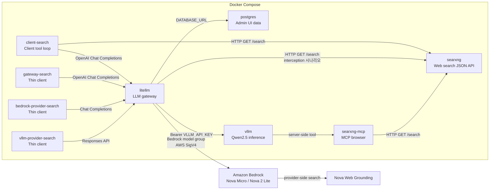

# 실습 환경 준비

실습 명령은 `web-search-tool` 디렉터리에서 실행한다. 모든 container를 동시에 시작하지 않고 시나리오에 필요한 service만 선택한다.

이 문서의 detached 실행 명령은 `--progress quiet`로 Docker Compose progress UI를 표시하지 않는다. Progress의 `Starting` 표시는 실제 container 상태와 다르게 남을 수 있으므로 `docker compose ps`와 service log 또는 API로 준비 상태를 확인한다.

## 1. Docker Compose container와 역할

| Container | 실행 형태 | 역할 | 기본 port |
| --- | --- | --- | --- |
| `searxng` | 상시 service | 실제 web 검색을 실행하고 JSON 결과 제공 | `8080` |
| `searxng-mcp` | `cpu` profile의 상시 service | SearXNG를 vLLM Tool Server용 MCP browser로 제공 | `8888` |
| `vllm` | `cpu` profile의 상시 service | CPU Qwen 추론과 선택적인 server-side tool loop 실행 | `8000` |
| `postgres` | 상시 service | LiteLLM Admin UI 사용자와 gateway 관리 데이터 저장 | 없음 |
| `litellm` | 상시 service | 인증·model routing·usage 기록, 선택적으로 web search interception 실행 | `4000` |
| `client-search` | `client` profile의 일회성 job | Client-owned tool loop 실행 | 없음 |
| `gateway-search` | `client` profile의 일회성 job | 검색 코드가 없는 thin client 실행 | 없음 |
| `bedrock-provider-search` | `bedrock` profile의 일회성 job | LiteLLM을 거쳐 Bedrock Web Grounding 최종 응답 확인 | 없음 |
| `vllm-provider-search` | `client` profile의 일회성 job | LiteLLM을 거쳐 vLLM server-side search 최종 응답 확인 | 없음 |

`Amazon Bedrock`과 Nova Web Grounding은 Docker Compose container가 아니다. LiteLLM이 AWS HTTPS endpoint를 호출한다.

## 2. 호출 관계



### 2.1 Client 실행 시나리오

1. `client-search`가 LiteLLM의 `/v1/chat/completions`를 호출한다.
2. LiteLLM이 model group에 따라 vLLM/Qwen 또는 Bedrock/Nova Micro를 호출한다.
3. 선택한 AI model이 `web_search` tool call을 반환한다.
4. `client-search`가 SearXNG의 `/search?format=json`을 호출한다.
5. 검색 결과를 같은 model 경로로 전달하고 최종 답변까지 Tool loop를 반복한다.

### 2.2 LiteLLM 실행 시나리오

1. `gateway-search`가 LiteLLM에 OpenAI 호환 요청 한 번을 보낸다.
2. LiteLLM이 vLLM의 `litellm_web_search` tool call을 감지한다.
3. LiteLLM interceptor가 SearXNG를 호출한다.
4. LiteLLM이 검색 결과를 넣어 vLLM을 다시 호출한다.
5. `gateway-search`는 최종 응답 하나만 받는다.

### 2.3 Bedrock이 검색을 실행하는 시나리오

1. `bedrock-provider-search`가 LiteLLM에 `web_search_options` 요청을 한 번 보낸다.
2. LiteLLM adapter가 요청을 Nova 2 Lite의 `nova_grounding` system tool로 변환한다.
3. Bedrock이 web search와 재추론을 실행한다.
4. Client는 provider trace를 실행하지 않고 최종 답변과 citation을 사용한다.

### 2.4 vLLM이 검색을 실행하는 시나리오

1. `vllm-provider-search`가 LiteLLM Responses API에 요청을 한 번 보낸다.
2. LiteLLM이 요청을 `vllm-provider-search` model group으로 routing한다.
3. vLLM Tool Server가 `searxng-mcp`를 호출하고 검색 결과를 Qwen에 다시 전달한다.
4. Client는 vLLM 내부 tool loop에 참여하지 않고 최종 답변을 사용한다.

## 3. 환경별 지원 범위

| 환경 | SearXNG | LiteLLM | vLLM container | Bedrock |
| --- | --- | --- | --- | --- |
| macOS Intel | 지원 | 지원 | 지원, CPU | 지원 |
| macOS Apple Silicon | 지원 | 지원 | 지원, CPU | 지원 |
| Linux | 지원 | 지원 | 지원, CPU | 지원 |

SearXNG 공식 image는 `linux/amd64`와 `linux/arm64`를 제공한다. macOS에서는 Docker Desktop의 Linux VM 안에서 실행된다.

이 실습의 기본 환경은 GPU가 없는 macOS와 Docker Desktop이다. `vllm/vllm-openai-cpu:latest` multi-architecture image가 Mac CPU에 맞는 Linux image를 자동으로 선택한다.

- Apple Silicon: `linux/arm64`
- Intel Mac: `linux/amd64`

Docker container는 macOS native vLLM이 아니라 Docker Desktop Linux VM에서 CPU inference를 실행한다. CPU 응답은 GPU보다 느리므로 정확도와 tool-call 흐름 확인에만 사용한다.

### 3.1 jq 설치

실습의 JSON 응답은 `jq`로 필요한 필드를 확인한다. macOS에 `jq`가 없다면 Homebrew로 설치한다.

```bash
brew install jq
jq --version
```

## 4. SearXNG 실행

Docker Desktop 또는 Docker Engine을 실행한 뒤 SearXNG만 시작한다.

```bash
docker compose --progress quiet up -d searxng
```

설정과 JSON 검색을 확인한다.

```bash
curl -sS http://localhost:8080/config \
  | jq .

curl -sS -G http://localhost:8080/search \
  --data-urlencode "q=오늘 날짜 서울 날씨" \
  --data-urlencode "format=json" \
  | jq '{
      query,
      results: [.results[:3][] | {title, url, content}]
    }'
```

`searxng/settings.yml`은 로컬 실습을 위해 JSON 응답을 허용하고 limiter를 끈다. 외부에 공개하는 설정으로 사용하지 않는다.

## 5. vLLM 실행

LiteLLM보다 먼저 macOS Docker Desktop에서 CPU vLLM을 시작하고 model load와 API 인증을 확인한다.

### 5.1 배경지식

- vLLM은 모델 자체가 아니라 model inference server다.
- `Qwen/Qwen2.5-1.5B-Instruct`를 load한다.
- 이 실습은 CUDA나 Metal 가속을 사용하지 않는다.
- Docker Desktop Linux VM 안에서 CPU image를 실행한다.
- LiteLLM은 vLLM의 OpenAI 호환 `/v1/chat/completions`를 호출한다.
- `--enable-auto-tool-choice`가 자동 tool 선택을 허용한다.
- `--tool-call-parser hermes`가 Qwen 출력을 OpenAI `tool_calls`로 변환한다.
- `--tool-server searxng-mcp:8888`이 vLLM 내부 tool loop를 MCP browser에 연결한다.
- `VLLM_USE_EXPERIMENTAL_PARSER_CONTEXT=1`이 non-Harmony Qwen의 MCP tool calling을 활성화한다.
- `ai-provider/vllm/Dockerfile`은 현재 vLLM Tool Server와 호환되는 MCP 1.x를 고정한다.

### 5.2 API key 생성

vLLM이 API key를 발급하는 endpoint는 없다. 운영자가 임의의 secret을 생성하고 vLLM server와 LiteLLM에 같은 값을 설정한다.

```bash
openssl rand -hex 32
```

출력값을 현재 shell 환경 변수로 설정한다. 이 값을 뒤의 공통 환경 파일에도 동일하게 저장한다.

```bash
export VLLM_API_KEY="paste-generated-key-here"
```

API key는 vLLM 시작 시 읽힌다. 실행 중 값을 변경했다면 container를 다시 생성한다.

### 5.3 vLLM container 시작

Docker Desktop의 CPU와 memory를 각각 4 core, 8GB 이상 할당하는 것을 권장한다. vLLM을 시작하면 의존 service인 SearXNG와 MCP browser도 함께 시작된다.

```bash
docker compose --progress quiet up -d vllm
```

또는 Make target을 사용한다.

```bash
make up-vllm
```

Qwen2.5 1.5B 모델을 처음 실행하면 Hugging Face model download 시간이 필요하다.

Compose progress UI 대신 실제 container 상태를 확인한다.

```bash
docker compose ps vllm searxng-mcp
```

`STATUS`가 `Up`이어도 model download와 CPU warm-up이 진행 중일 수 있다. Log를 따라가다가 `Application startup complete`를 확인한 뒤 `Ctrl+C`로 log 보기만 종료한다. Container는 계속 실행된다.

```bash
docker compose logs -f vllm
```

실행 image와 CPU memory 설정은 `.env.example`의 다음 값으로 조정할 수 있다.

```dotenv
VLLM_IMAGE=vllm/vllm-openai-cpu:latest
VLLM_CPU_KVCACHE_SPACE=2
VLLM_CPU_NUM_OF_RESERVED_CPU=1
```

### 5.4 vLLM 인증 확인

API key 없이 요청하면 `401 Unauthorized`가 반환되어야 한다.

```bash
curl -sS http://localhost:8000/v1/models \
  | jq .
```

현재 shell에 설정한 key로 다시 요청한다.

```bash
curl -sS http://localhost:8000/v1/models \
  -H "Authorization: Bearer ${VLLM_API_KEY}" \
  | jq '{models: [.data[].id]}'
```

Model 목록에 `Qwen/Qwen2.5-1.5B-Instruct`가 있으면 준비가 끝난다. vLLM의 API key는 일부 OpenAI 호환 endpoint만 보호하므로 운영에서는 network 접근 제어를 함께 사용한다.

## 6. 공통 환경 파일

vLLM 실행과 인증 확인이 끝나면 LiteLLM이 사용할 환경 파일을 만든다. `.env`는 Git에서 제외된다.

```bash
cp .env.example .env
```

API key가 필요한 host `curl`에서도 같은 값을 사용하도록 `.env`를 현재 shell에 반영한다.

```bash
set -a
source .env
set +a
```

로컬 vLLM은 Compose network의 service 이름과 5.2에서 생성한 같은 API key를 설정한다.

```dotenv
VLLM_API_BASE=http://vllm:8000/v1
VLLM_API_KEY=<5.2에서 생성한-key>
```

원격 vLLM으로 바꾸려면 LiteLLM container에서 접근 가능한 주소와 원격 server의 API key를 설정한다.

```dotenv
VLLM_API_BASE=http://vllm-host.example:8000/v1
VLLM_API_KEY=remote-vllm-api-key
```

Compose는 `VLLM_API_KEY`를 vLLM의 인증 검증과 LiteLLM upstream 요청의 Bearer token에 공통으로 사용한다. 두 값이 다르면 LiteLLM의 vLLM 요청이 `401 Unauthorized`로 실패한다.

LiteLLM API master key, Admin UI 계정, PostgreSQL 계정을 설정한다. Admin UI 비밀번호는 API master key와 분리한다.

```dotenv
LITELLM_MASTER_KEY=<API-master-key>
UI_USERNAME=admin
UI_PASSWORD=<UI-password>
POSTGRES_USER=litellm
POSTGRES_PASSWORD=<database-password>
POSTGRES_DB=litellm
```

## 7. 로컬 Bedrock 인증

LiteLLM을 시작하기 전에 AWS CLI session을 준비한다. 로컬에서는 장기 access key 대신 `aws login` session을 사용한다. AWS CLI가 만든 임시 자격증명과 refresh token은 `~/.aws/login/cache`에 저장된다.

Named profile로 로그인한다.

```bash
aws login --profile default
aws sts get-caller-identity --profile default
```

Session이 만료되면 `aws login --profile default`를 다시 실행한다. Login cache를 container에 연결하므로 재로그인 후 LiteLLM을 재생성할 필요는 없다.

`.env`에 같은 profile과 region을 설정한다.

```dotenv
AWS_REGION=us-east-1
AWS_PROFILE=default
```

로컬 전용 `compose.aws-login.yaml`은 다음 파일을 LiteLLM container에 전달한다.

- `~/.aws/config`: read-only profile 설정
- `~/.aws/login/cache`: 임시 자격증명 자동 갱신을 위한 read-write cache

Boto3에서 login credentials provider를 사용하려면 AWS CRT가 필요하다. `litellm/Dockerfile`과 실습 application image는 `boto3[crt]`를 설치한다.

## 8. LiteLLM 실행

SearXNG, vLLM endpoint, AWS login session을 먼저 준비하고 LiteLLM을 시작한다. Compose가 PostgreSQL을 먼저 시작하고 health check가 성공한 뒤 LiteLLM을 시작한다.

```bash
docker compose \
  -f compose.yaml \
  -f compose.aws-login.yaml \
  --progress quiet up -d --build vllm litellm
```

`.env`의 UI 계정이나 database 설정을 변경한 경우 실행 중인 container의 환경 변수는 바뀌지 않는다. LiteLLM을 재생성해 새 값을 적용한다.

```bash
docker compose \
  -f compose.yaml \
  -f compose.aws-login.yaml \
  --progress quiet up -d --build --force-recreate vllm litellm
```

또는 같은 명령을 Make target으로 실행한다.

```bash
make up-aws-login
```

vLLM API key는 vLLM의 검증 값과 LiteLLM의 upstream Bearer token에 함께 사용된다. `.env`에서 변경하면 `restart`가 아니라 두 container를 모두 `--force-recreate`해야 한다.

LiteLLM은 `litellm/config.yaml`의 `os.environ/VLLM_API_KEY`를 읽어 vLLM 요청에 사용한다.

상태와 log를 확인한다.

```bash
docker compose ps
docker compose logs --since=2m litellm
```

`http://localhost:4000/ui/`에서 `.env`의 `UI_USERNAME`과 `UI_PASSWORD`로 로그인한다. `LITELLM_MASTER_KEY`는 OpenAI 호환 API 인증에 사용한다.

LiteLLM `main-latest`는 최신 web search interception 확인을 위한 선택이다. 운영에서는 검증한 digest로 고정한다.

## 9. AWS workload 인증

AWS workload에서는 `compose.aws-login.yaml`을 사용하지 않는다. Access key 환경 변수도 설정하지 않는다.

- EC2: instance profile
- ECS: task role
- EKS: Pod Identity 또는 IRSA
- Lambda: execution role

Boto3 기본 자격증명 체인이 workload role의 임시 자격증명을 자동으로 선택한다. 동일한 application 코드를 유지하고 배포 환경에서 role만 연결한다.

Converse 호출에는 최소 `bedrock:InvokeModel` 권한이 필요하다. Nova Web Grounding에는 `arn:aws:bedrock::*:system-tool/amazon.nova_grounding` 대상의 `bedrock:InvokeTool` 권한도 필요하다. Streaming 호출에는 `bedrock:InvokeModelWithResponseStream`도 필요하다.

## 10. 종료

```bash
docker compose --profile cpu --profile client --profile bedrock down -v
```

`-v`는 vLLM model cache와 PostgreSQL의 LiteLLM Admin UI 데이터를 모두 제거한다. 다음 실행에서는 model을 다시 download하고 database migration을 다시 수행한다.
