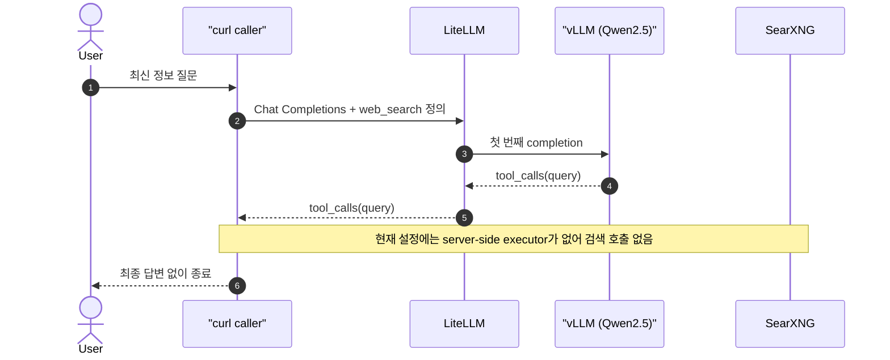
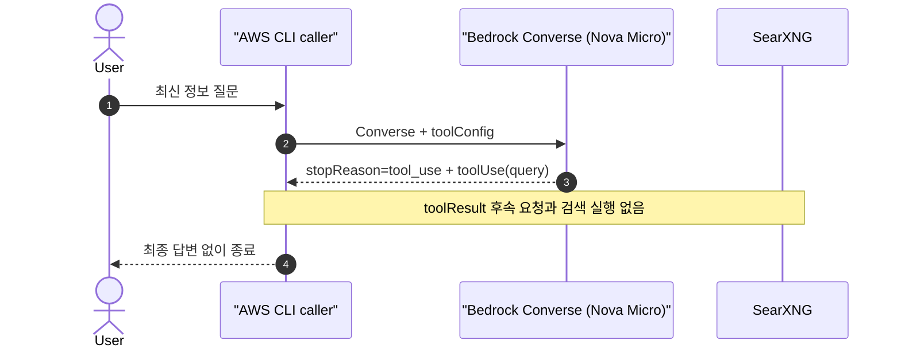

# Web search 실행 주체가 없는 기준선

[실습 환경](2-setup.md)을 준비한다. vLLM과 Bedrock에 `web_search` 함수 정의만 전달하고, 반환된 tool call을 실행하지 않으면 어떤 결과가 나오는지 확인한다.

## 시나리오 요약

| 항목 | 내용 |
| --- | --- |
| 확인 목적 | Tool call과 tool 실행이 서로 다른 단계임을 확인 |
| 호출 방법 | vLLM은 `curl`, Bedrock은 AWS CLI |
| vLLM 경로 | `curl → LiteLLM → vLLM` 한 번 |
| Bedrock 경로 | `AWS CLI → Bedrock Converse` 한 번 |
| 검색 경로 | 없음, 현재 설정에 server-side tool executor가 없음 |
| 예상 결과 | vLLM은 `tool_calls`, Bedrock은 `toolUse`만 반환 |

## 15초 이론

AI 모델은 사용할 tool과 인자를 결정한다. 실제 실행은 Client·gateway뿐 아니라 AI provider의 관리형 runtime이나 tool server가 연결된 serving engine도 담당할 수 있다. 이 실습의 vLLM Chat Completions와 Bedrock Converse는 client-side custom tool mode이므로 caller가 실행하지 않으면 각각 `tool_calls`와 `toolUse`에서 끝난다.

## Tool 실행 위치 구분

| 실행 위치 | 동작 예 | 현재 실습 |
| --- | --- | --- |
| Client | Application이 `tool_calls`를 받아 SearXNG 실행 | 4번에서 확인 |
| Gateway | LiteLLM interceptor가 SearXNG 실행 | 5번에서 확인 |
| AI provider runtime | Bedrock Responses가 Lambda 또는 AgentCore tool 실행 | 사용하지 않음 |
| Serving engine runtime | vLLM Responses API가 `--tool-server`로 연결한 tool 실행 | 비활성화 |

Provider 또는 serving engine이 실행하더라도 foundation model process가 임의의 network 요청을 직접 보내는 것은 아니다. 신뢰된 server-side runtime이 모델의 요청을 받아 등록된 tool을 실행한다.

## vLLM 예상 흐름



## Bedrock 예상 흐름



## vLLM 실행

`web_search`를 강제로 선택한 요청을 한 번 보낸다.

```bash
curl -sS --fail-with-body http://localhost:4000/v1/chat/completions \
  -H "Authorization: Bearer ${LITELLM_MASTER_KEY:-sk-local-web-search}" \
  -H "Content-Type: application/json" \
  -d '{
    "model": "local-tool-model",
    "messages": [
      {"role": "user", "content": "오늘은 몇 월 며칠이고 서울 날씨는 어때요? 출처 URL과 함께 답하세요."}
    ],
    "tools": [
      {
        "type": "function",
        "function": {
          "name": "web_search",
          "description": "Search the public web.",
          "parameters": {
            "type": "object",
            "properties": {"query": {"type": "string"}},
            "required": ["query"]
          }
        }
      }
    ],
    "tool_choice": {
      "type": "function",
      "function": {"name": "web_search"}
    }
  }' \
  | jq '{
      finish_reason: .choices[0].finish_reason,
      content: .choices[0].message.content,
      tool_calls: .choices[0].message.tool_calls
    }'
```

응답의 `choices[0].message.tool_calls`에는 검색어가 있지만 최종 자연어 답변은 없다.

예상 응답의 핵심 형태는 다음과 같다.

```json
{
  "finish_reason": "tool_calls",
  "content": "",
  "tool_calls": [
    {
      "function": {
        "name": "web_search",
        "arguments": "{\"query\": \"today's month and day in Seoul, Korea\"}"
      }
    }
  ]
}
```

- `arguments.query`: 날씨 검색 결과가 아니라 모델이 검색 도구에 넘기려는 검색어다.
- `finish_reason=tool_calls`: 모델이 자연어 답변 대신 Tool 실행을 요청하고 멈췄다는 뜻이다.
- `content=""`: 날짜·날씨에 대한 최종 답변이 아직 없다는 뜻이다.
- SearXNG 실행과 두 번째 모델 호출이 없으므로 이 결과가 3번 실습의 성공 조건이다.

## Bedrock 실행

[로컬 Bedrock 인증](2-setup.md#7-로컬-bedrock-인증)을 완료한 뒤 Nova Micro에 Converse 요청을 한 번 보낸다.

먼저 같은 profile의 host 자격증명이 유효한지 확인한다.

```bash
aws sts get-caller-identity \
  --profile "${AWS_PROFILE:-default}" \
  | jq '{Account, Arn}'
```

STS 확인이 성공한 뒤에만 다음 Bedrock 요청을 실행한다.

```bash
aws bedrock-runtime converse \
  --profile "${AWS_PROFILE:-default}" \
  --region "${AWS_REGION:-us-east-1}" \
  --model-id "${BEDROCK_MODEL_ID:-amazon.nova-micro-v1:0}" \
  --messages '[
    {
      "role": "user",
      "content": [
        {"text": "오늘은 몇 월 며칠이고 서울 날씨는 어때요? 출처 URL과 함께 답하세요."}
      ]
    }
  ]' \
  --tool-config '{
    "tools": [
      {
        "toolSpec": {
          "name": "web_search",
          "description": "Search the public web.",
          "inputSchema": {
            "json": {
              "type": "object",
              "properties": {"query": {"type": "string"}},
              "required": ["query"]
            }
          }
        }
      }
    ],
    "toolChoice": {
      "tool": {"name": "web_search"}
    }
  }' \
  --inference-config '{"maxTokens": 512, "temperature": 0}' \
  | jq '{
      stopReason,
      toolUse: [.output.message.content[] | select(.toolUse) | .toolUse]
    }'
```

응답의 `stopReason`은 `tool_use`이고 `output.message.content[].toolUse`에는 `toolUseId`, 함수명, 검색어가 있다. Tool을 실행하거나 `toolResult`를 보내지 않았으므로 최종 자연어 답변은 없다.

## 검색 미실행 확인

두 요청을 실행한 뒤 SearXNG log에서 `/search` 요청이 발생하지 않았는지 확인한다.

```bash
docker compose logs --since=1m searxng
```

## 성공 조건

- 응답에 `web_search`와 `query`가 있다.
- vLLM 응답의 최종 `message.content`가 비어 있다.
- Bedrock 응답의 `stopReason`이 `tool_use`다.
- Bedrock에 `toolResult`를 포함한 두 번째 요청이 없다.
- SearXNG에 `/search` 요청이 없다.

이 결과는 장애가 아니라 의도한 기준선이다. [다음 실습](4-client-hands-on.md)에서는 Client가 누락된 실행 단계를 담당한다.

## 참고자료

- [Amazon Bedrock server-side tool use](https://docs.aws.amazon.com/bedrock/latest/userguide/tool-use-server-side.html)
- [Amazon Bedrock client-side tool use](https://docs.aws.amazon.com/bedrock/latest/userguide/tool-use-client-side.html)
- [AWS CLI Converse 명령](https://docs.aws.amazon.com/cli/latest/reference/bedrock-runtime/converse.html)
- [vLLM tool server와 MCP 보안](https://docs.vllm.ai/en/latest/usage/security/#tool-server-and-mcp-security)
