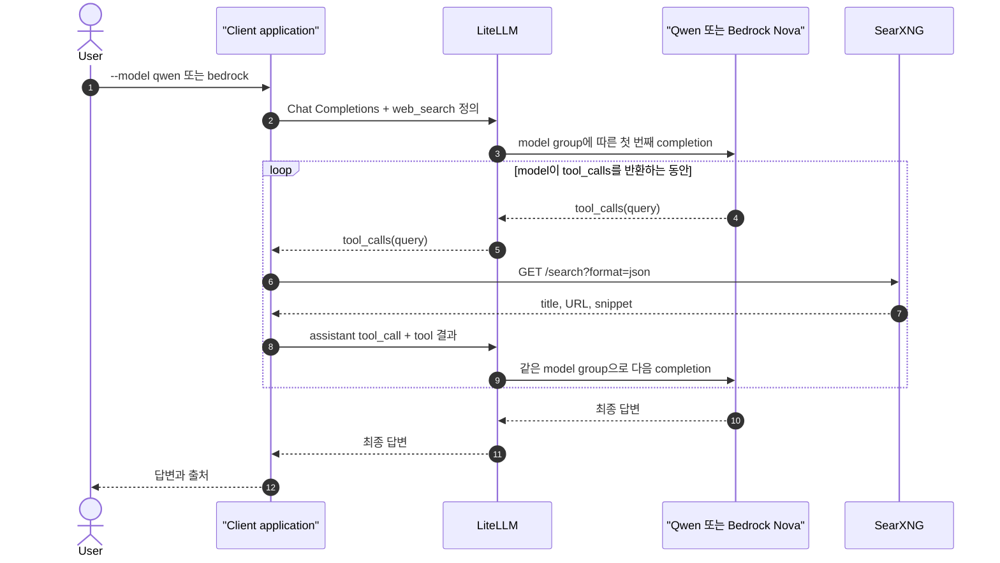

# Client가 같은 로직으로 Qwen과 Bedrock의 web search 실행

[실습 환경](2-setup.md)을 준비한다. OpenAI Python SDK로 LiteLLM을 호출하고 Client application이 SearXNG를 실행한다. `--model` 인자만 바꿔 Qwen과 Bedrock을 같은 Tool loop로 호출한다.

## 시나리오 요약

| 항목 | 내용 |
| --- | --- |
| 확인 목적 | LiteLLM 뒤의 AI model을 바꿔도 Client Tool loop가 같음을 확인 |
| 실행 job | `client-search` |
| Qwen 경로 | `client-search → LiteLLM → vLLM/Qwen`을 Tool loop 동안 호출 |
| Bedrock 경로 | `client-search → LiteLLM → Bedrock/Nova Micro`를 Tool loop 동안 호출 |
| 검색 경로 | `client-search → SearXNG` |
| 변경되는 값 | `--model qwen` 또는 `--model bedrock` |
| 유지되는 로직 | Tool schema, 검색 실행, Tool 결과 message, 최종 답변 요청 |

## 15초 이론

Client-owned tool loop는 모델의 요청을 application이 직접 실행하는 방식이다. Application은 OpenAI 호환 형식만 사용하고 LiteLLM이 `local-tool-model`은 Qwen으로, `bedrock-nova-micro`는 Bedrock으로 routing한다. Provider가 날짜와 날씨를 한 번 또는 여러 번의 검색으로 나눠도 같은 loop가 최종 답변까지 처리한다.

Client는 두 model에 같은 `tool_choice`를 보낸다. Bedrock model route의 `drop_params`가 adapter에서 지원하지 않는 OpenAI parameter만 제거한다. 이 provider 차이는 Client 분기가 아니라 gateway 변환 설정으로 처리한다.

두 model route는 LiteLLM 시작 전에 한 번 설정한다. 실행 중에는 Client 코드, LiteLLM 설정, container 구성을 변경하지 않는다. 각 요청의 `model` 값만 바뀐다.

| 실행 인자 | LiteLLM model group | 실제 AI model |
| --- | --- | --- |
| `qwen` | `local-tool-model` | `Qwen/Qwen2.5-1.5B-Instruct` |
| `bedrock` | `bedrock-nova-micro` | `amazon.nova-micro-v1:0` |

## 예상 흐름



## Application 조립

Application은 다음 네 단계를 하나의 tool loop로 조립한다.

```text
model_group = --model 인자를 LiteLLM model group으로 변환

web_search_schema = 함수 이름, 설명, query JSON schema 정의

response = model에게 질문과 web_search_schema 전달

최대 3회 반복:
  response에 tool_calls가 없으면 최종 답변 출력 후 종료
  각 tool_call의 함수 이름, call ID, query 추출
  SearXNG에 query 전달
  assistant tool_call과 같은 call ID의 tool result를 conversation에 추가
  conversation과 같은 web_search_schema를 model에 전달
```

핵심은 첫 응답을 버리지 않는 것이다. Assistant의 `tool_calls`와 Client가 만든 `tool` message를 함께 보내야 모델이 어떤 호출의 결과인지 연결할 수 있다.

실제 코드의 역할은 다음과 같다.

| 단계 | 코드 |
| --- | --- |
| Model 인자 변환 | `parse_model_argument()` |
| 함수 schema 정의 | `WEB_SEARCH_TOOL` |
| 첫 모델 요청 | `request_search()` |
| 함수 인자 해석·검색·결과 조립 | `append_tool_results()` |
| 다음 모델 요청 | `request_answer()` |
| 전체 순서 제어 | `main()` |

## 실행

AWS login mount가 적용된 동일한 LiteLLM instance를 사용해 두 model을 차례로 호출한다. Qwen도 이 구성에서 그대로 사용할 수 있다.

Qwen을 선택해 Client Tool loop를 실행한다.

```bash
docker compose \
  -f compose.yaml \
  -f compose.aws-login.yaml \
  --profile client run --rm client-search --model qwen
```

같은 Client와 LiteLLM에서 model 인자만 Bedrock으로 바꾼다.

```bash
docker compose \
  -f compose.yaml \
  -f compose.aws-login.yaml \
  --profile client run --rm client-search --model bedrock
```

다른 terminal에서 LiteLLM log를 확인한다.

```bash
docker compose logs --since=2m litellm
```

## 성공 조건

- Qwen과 Bedrock 실행 모두 답변과 source URL을 출력한다.
- 두 실행 모두 같은 `client/app.py`와 `web_search.py`를 사용한다.
- 각 실행의 LiteLLM log에 첫 Tool 요청, Tool 결과 전달, 최종 답변 요청이 있다.
- Qwen은 `local-tool-model`, Bedrock은 `bedrock-nova-micro`로 routing된다.
- LiteLLM search endpoint log에는 SearXNG 호출이 없다.

## 실패 해석

- vLLM 연결 실패: `VLLM_API_BASE`를 LiteLLM container에서 접근할 수 없다.
- Bedrock 연결 실패: [로컬 Bedrock 인증](2-setup.md#7-로컬-bedrock-인증)을 확인한다.
- 빈 `tool_calls`: 모델이 forced function schema를 따르지 않았다.
- SearXNG `403`: `searxng/settings.yml`에서 JSON 형식이 비활성화되었다.
