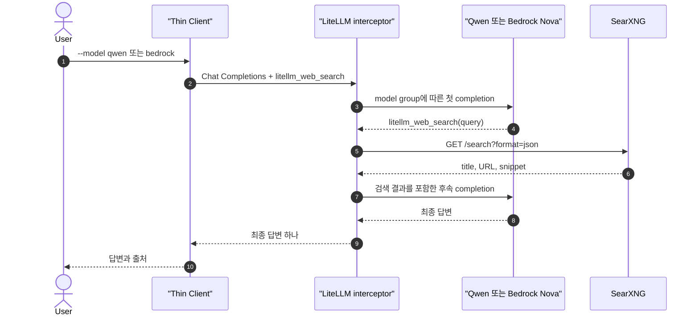

# LiteLLM이 Qwen과 Bedrock의 web search 실행

[실습 환경](2-setup.md)을 준비한다. Thin Client는 LiteLLM을 한 번 호출하고 LiteLLM이 model 호출, SearXNG 검색, 후속 model 호출을 실행한다. `--model` 인자만 바꿔 Qwen과 Bedrock에서 같은 interception을 확인한다.

## 시나리오 요약

| 항목 | 내용 |
| --- | --- |
| 확인 목적 | LiteLLM이 AI provider와 무관하게 Tool runtime 역할을 수행하는지 확인 |
| 실행 job | `gateway-search` |
| Qwen 경로 | `Thin Client → LiteLLM → vLLM/Qwen` |
| Bedrock 경로 | `Thin Client → LiteLLM → Bedrock/Nova Micro` |
| 검색 경로 | `LiteLLM interceptor → SearXNG` |
| 변경되는 값 | `--model qwen` 또는 `--model bedrock` |
| 핵심 관찰 | Thin Client는 중간 Tool call과 검색 결과를 처리하지 않음 |

## 15초 이론

`websearch_interception`은 모든 질문을 자동 검색하지 않는다. Model이 `litellm_web_search` Tool call을 반환했을 때만 LiteLLM이 이를 가로채 SearXNG를 실행한다. 따라서 Client는 사용 가능한 Tool 정의를 요청에 포함해야 하지만 Tool call을 해석하거나 실행할 필요는 없다.

`litellm_web_search`는 interception callback이 알아보는 예약된 함수명이다. 일반 `web_search`와 구분해 Application이 실행할 Tool을 LiteLLM이 실수로 가로채지 않도록 실행 책임을 명시한다.

이 실습은 `tool_choice`로 `litellm_web_search` 선택을 강제한다. `tool_choice`를 생략하면 검색 필요 여부를 model이 결정한다.

## LiteLLM 필수 설정

```yaml
search_tools:
  - search_tool_name: local-search
    litellm_params:
      search_provider: searxng
      api_base: os.environ/SEARXNG_URL

litellm_settings:
  callbacks: ["websearch_interception"]
  websearch_interception_params:
    enabled_providers: ["openai", "bedrock"]
    search_tool_name: local-search
```

- `search_tools`: LiteLLM이 실행할 검색 backend를 등록한다.
- `callbacks`: model 응답의 Tool call을 검사하는 interceptor를 활성화한다.
- `enabled_providers`: interception을 허용할 AI provider를 제한한다.
- `search_tool_name`: 여러 검색 backend 중 `local-search`를 선택한다.
- `SEARXNG_URL`: Compose network의 `http://searxng:8080`을 사용한다.

## `drop_params` 이해

Provider가 지원하지 않는 OpenAI parameter를 받으면 LiteLLM은 기본적으로 오류를 반환한다. `drop_params: true`는 오류 대신 지원하지 않는 parameter를 제거하고 요청을 계속한다.

```text
Client 요청: tools + tool_choice

Qwen route:    tools + tool_choice 전달
Bedrock route: tools 전달, 지원하지 않는 tool_choice 제거
```

현재 설정은 영향을 줄이기 위해 Bedrock model route에만 적용한다.

```yaml
- model_name: bedrock-nova-micro
  litellm_params:
    model: bedrock/amazon.nova-micro-v1:0
    drop_params: true
```

장점:

- Client에 provider별 parameter 분기가 필요 없다.
- 하나의 OpenAI 호환 요청을 여러 provider에 재사용할 수 있다.

트레이드오프:

- 강제 Tool 선택이 자동 선택으로 바뀌는 등 요청 의미가 약해질 수 있다.
- `response_format`, `seed` 같은 parameter가 제거되면 출력 형식이나 재현성이 달라질 수 있다.
- 오류가 사라지는 대신 parameter 제거 사실을 놓치기 쉽다.

운영에서는 전역 설정보다 model별 `drop_params`를 사용하고, 중요한 parameter가 실제 적용됐는지 test와 trace로 확인한다. 제거할 항목을 이미 알고 있다면 `additional_drop_params: ["tool_choice"]`처럼 대상을 한정하는 편이 더 엄격하다.

## 예상 흐름



## Thin Client 요청

Client는 예약된 함수명과 입력 schema를 선언한다.

```python
{
  "type": "function",
  "function": {
    "name": "litellm_web_search",
    "parameters": {
      "type": "object",
      "properties": {"query": {"type": "string"}},
      "required": ["query"],
    },
  },
}
```

Client에는 SearXNG 호출, Tool 결과 message, 반복 Tool loop 코드가 없다.

## Qwen 실행

AWS login mount가 적용된 동일한 LiteLLM instance를 두 model에서 사용한다.

```bash
docker compose \
  -f compose.yaml \
  -f compose.aws-login.yaml \
  --profile client run --rm gateway-search --model qwen
```

## Bedrock 실행

Client와 LiteLLM 설정을 바꾸지 않고 model 인자만 변경한다.

```bash
docker compose \
  -f compose.yaml \
  -f compose.aws-login.yaml \
  --profile client run --rm gateway-search --model bedrock
```

## 확인

```bash
docker compose logs --since=5m litellm
```

## 성공 조건

- Qwen과 Bedrock 모두 Thin Client 요청 한 번으로 최종 답변을 반환한다.
- 두 실행 모두 같은 `litellm/app.py`를 사용한다.
- LiteLLM log에 `litellm_web_search` interception과 SearXNG 실행이 기록된다.
- Thin Client에는 SearXNG URL과 검색 실행 코드가 없다.

## Client 실행 시나리오와 비교

- [4번](4-client-hands-on.md): `web_search`를 Client가 실행한다.
- [5번](5-litellm-hands-on.md): `litellm_web_search`를 LiteLLM이 실행한다.

## 참고자료

- [LiteLLM Web Search Interception](https://docs.litellm.ai/docs/integrations/websearch_interception)
- [LiteLLM Drop Unsupported Params](https://docs.litellm.ai/docs/completion/drop_params)
