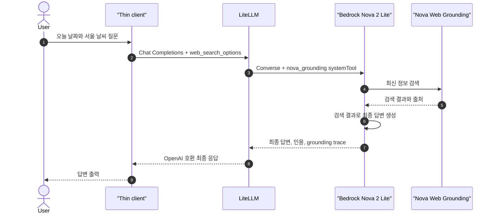

# Bedrock이 web search 실행

[실습 환경](2-setup.md)에서 LiteLLM과 로컬 AWS login session을 준비한다. Client는 LiteLLM을 한 번 호출하고, Amazon Nova 2 Lite가 Web Grounding으로 검색과 답변 조립을 완료한다.

## 시나리오 요약

| 항목 | 내용 |
| --- | --- |
| 확인 목적 | AI provider가 web search와 최종 답변 조립까지 담당하는 흐름 확인 |
| 실행 job | `bedrock-provider-search` |
| 호출 경로 | `Client → LiteLLM → Bedrock Nova 2 Lite` |
| 검색 실행 | Amazon Nova Web Grounding |
| Client가 받는 값 | 추가 tool loop 없이 사용할 수 있는 최종 답변과 citation metadata |
| 사용하지 않는 구성 | Client tool loop, LiteLLM interception, SearXNG, vLLM |

## 15초 이론

일반적인 Bedrock Converse `toolConfig`는 모델이 `toolUse`만 반환하므로 호출자가 tool을 실행해야 한다. Nova 2 Lite의 Web Grounding은 예외다. LiteLLM이 OpenAI 형식의 `web_search_options`를 Bedrock `nova_grounding` system tool로 변환하면 Bedrock이 검색, 출처 수집, 재추론을 수행하고 최종 답변을 반환한다.

## 예상 흐름



## 코드와 설정

Client는 tool schema와 tool loop를 구현하지 않는다.

```python
response = client.chat.completions.create(
  model="bedrock-provider-search",
  messages=[{"role": "user", "content": question}],
  web_search_options={},
)
```

LiteLLM model group은 Nova 2 Lite를 가리킨다.

```yaml
- model_name: bedrock-provider-search
  litellm_params:
    model: bedrock/us.amazon.nova-2-lite-v1:0
    aws_region_name: os.environ/AWS_REGION
```

`websearch_interception`이 아니라 LiteLLM의 Bedrock adapter가 `web_search_options`를 Nova의 `nova_grounding` system tool로 변환한다. 검색 실행 주체는 LiteLLM이 아니라 Bedrock다. OpenAI 호환 응답에는 `nova_grounding` tool trace가 남을 수 있지만 Client가 실행하거나 재호출할 대상은 아니다.

## 실행

AWS login session을 LiteLLM container에 연결한 상태로 실행한다.

```bash
docker compose \
  -f compose.yaml \
  -f compose.aws-login.yaml \
  --profile bedrock run --rm bedrock-provider-search
```

또는 Make target을 사용한다.

```bash
make provider-bedrock
```

## 성공 조건

- Client가 LiteLLM에 요청을 한 번만 보낸다.
- Client와 LiteLLM이 SearXNG를 호출하지 않는다.
- 별도 tool 요청을 처리하지 않고 출처가 포함된 최종 답변을 출력한다.
- Bedrock 호출 role에 `bedrock:InvokeModel`과 `bedrock:InvokeTool` 권한이 있다.

## 제약

- Web Grounding은 Nova 2 Lite와 지원되는 미국 region 또는 US cross-region inference profile을 사용한다.
- 일반적인 Converse tool use와 Web Grounding을 같은 동작으로 해석하면 안 된다.
- Provider 종속 기능이므로 다른 model로 바꾸면 `web_search_options` 지원 여부를 다시 확인한다.

## 참고자료

- [Amazon Nova 2 Web Grounding](https://docs.aws.amazon.com/nova/latest/nova2-userguide/web-grounding.html)
- [Amazon Bedrock tool use](https://docs.aws.amazon.com/bedrock/latest/userguide/tool-use.html)
