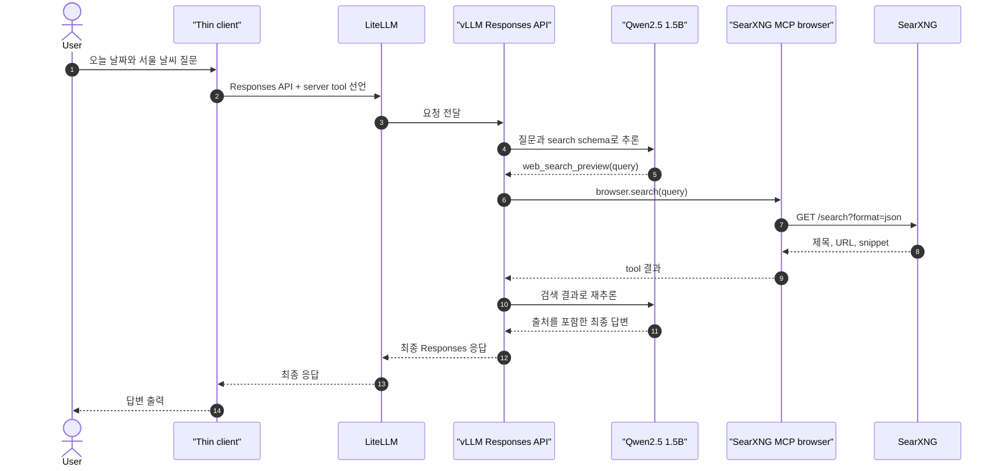

# vLLM이 web search 실행

[실습 환경](2-setup.md)에 따라 SearXNG MCP server, vLLM, LiteLLM을 준비한다. Client는 LiteLLM을 한 번 호출하고, vLLM이 Qwen 추론·검색 실행·재추론을 완료한다. Client application은 최종 `output_text`만 출력한다.

## 시나리오 요약

| 항목 | 내용 |
| --- | --- |
| 확인 목적 | 로컬 AI serving engine이 web search와 최종 답변 조립까지 담당하는 흐름 확인 |
| 실행 job | `vllm-provider-search` |
| 호출 경로 | `Client → LiteLLM → vLLM/Qwen` |
| 검색 경로 | `vLLM Tool Server → SearXNG MCP → SearXNG` |
| Client가 사용하는 값 | Responses 결과의 최종 `output_text` |
| LiteLLM 역할 | 인증과 model routing만 담당 |

## 15초 이론

vLLM Responses API의 `--tool-server`는 server-side tool runtime이다. Qwen이 검색 호출을 만들면 vLLM이 MCP browser tool을 실행하고, 결과를 Qwen에 다시 넣어 최종 답변까지 만든다. Client와 LiteLLM은 이 반복 실행에 참여하지 않는다.

## 예상 흐름



## 코드와 설정

현재 vLLM의 non-Harmony model MCP 지원은 실험적이다. Qwen2.5에는 다음 두 선언을 함께 전달한다.

```python
tools = [
  {"type": "web_search_preview"},
  {
    "type": "function",
    "name": "web_search_preview",
    "description": "Search the public web for current information.",
    "parameters": {
      "type": "object",
      "properties": {"query": {"type": "string"}},
      "required": ["query"],
    },
  },
]
```

- 첫 선언: vLLM의 server-side browser 실행을 활성화한다.
- 둘째 선언: Qwen prompt에 호출 가능한 함수 schema를 제공한다.
- 같은 이름: Qwen의 함수 호출을 vLLM built-in browser 실행으로 연결한다.
- `tool_choice="auto"`: 검색 결과를 받은 다음 추론에서 반복 호출을 멈추고 최종 답변을 만들 수 있게 한다.
- `instructions`: 검색을 정확히 한 번 실행하고 결과를 받은 뒤 답변하도록 경량 model의 행동을 제한한다.

vLLM은 다음 옵션으로 MCP tool server를 연결한다.

```yaml
command:
  - Qwen/Qwen2.5-1.5B-Instruct
  - --enable-auto-tool-choice
  - --tool-call-parser
  - hermes
  - --tool-server
  - searxng-mcp:8888
```

LiteLLM의 `vllm-provider-search` group은 `hosted_vllm` provider를 사용한다. 현재 interception 대상인 `openai`, `bedrock`에 포함되지 않으므로 LiteLLM이 검색을 가로채지 않는다.

## 실행

vLLM과 MCP search server를 시작한다.

```bash
docker compose --profile cpu --progress quiet up -d --build vllm
docker compose ps vllm searxng-mcp
```

Client job을 실행한다.

```bash
docker compose --profile client run --rm vllm-provider-search
```

vLLM이 MCP tool을 실행했는지 log로 확인한다.

```bash
docker compose logs --since=5m vllm searxng-mcp
```

## 성공 조건

- vLLM log에 `MCPToolServer initialized with tools: ['browser']`가 있다.
- `searxng-mcp` log에 Client 요청 시점의 `search query=`가 있다.
- Client는 LiteLLM에 요청을 한 번만 보낸다.
- Client는 server-side tool trace를 실행하지 않고 최종 `output_text`를 출력한다.
- LiteLLM interceptor가 SearXNG를 호출하지 않는다.

## 제약

- Qwen2.5 1.5B는 경량 model이라 검색 query와 출처 조립 품질이 낮을 수 있다.
- SearXNG upstream이 CAPTCHA나 `403`을 반환하면 tool loop는 성공해도 검색 결과가 비어 답변 품질이 낮아진다.
- non-Harmony MCP tool calling은 실험적이므로 vLLM upgrade 시 두 tool 선언의 필요 여부를 다시 검증한다.
- `vllm/vllm-openai-cpu:latest`는 재현성이 낮다. 운영에서는 검증한 version과 image digest를 고정한다.
- vLLM Tool Server의 MCP client와 MCP dependency major version이 맞아야 한다. 이 예제 image는 호환되는 MCP 1.x를 고정한다.

## 참고자료

- [vLLM OpenAI-compatible server](https://docs.vllm.ai/en/latest/serving/online_serving/)
- [vLLM serve CLI: tool server](https://docs.vllm.ai/en/latest/cli/serve/)
- [vLLM server security](https://docs.vllm.ai/en/latest/usage/security/)
- [vLLM MCP tool example](https://github.com/vllm-project/vllm/blob/main/examples/tool_calling/openai_responses_client_with_mcp_tools.py)
