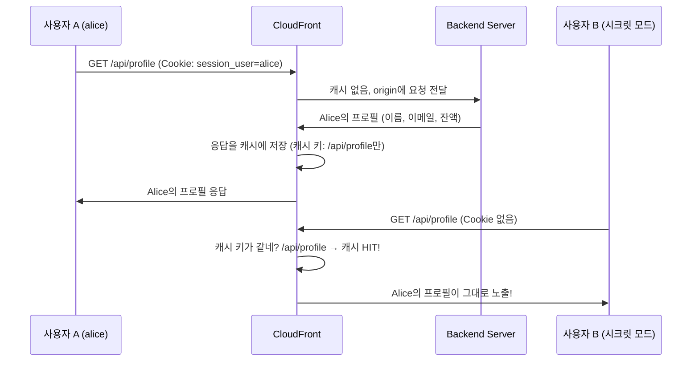

# CloudFront 캐시 정책의 위험성 - 다른 사람의 개인정보가 보이는 문제

## 요약

- **CloudFront 캐시 정책(Cache Policy)에서 Cookie를 캐시 키에 포함하지 않으면, 사용자 A의 응답이 사용자 B에게 그대로 노출됩니다.**
- 이 핸즈온은 실제로 캐시 정책 설정 실수로 다른 사용자의 프로필(이름, 이메일, 잔액)이 보이는 상황을 재현합니다.
- Terraform으로 CloudFront + S3 + ALB + EC2(Graviton) 인프라를 구성합니다.
- 실습 후 반드시 `terraform destroy`로 리소스를 삭제하세요.

## 목차

1. [캐시 정책이 뭔가요?](#1-캐시-정책이-뭔가요)
2. [왜 위험한가요?](#2-왜-위험한가요)
3. [아키텍처](#3-아키텍처)
4. [사전 준비](#4-사전-준비)
5. [실습](#5-실습)
6. [위험한 시나리오 재현](#6-위험한-시나리오-재현)
7. [왜 이런 일이 발생했을까?](#7-왜-이런-일이-발생했을까)
8. [올바른 해결 방법](#8-올바른-해결-방법)
9. [리소스 삭제](#9-리소스-삭제)
10. [참고자료](#10-참고자료)

## 1. 캐시 정책이 뭔가요?

Cache Policy(캐시 정책)는 두 가지 단어를 합친 용어입니다. Cache + Policy

1. **Cache**: CloudFront가 origin 응답을 저장해두는 것
2. **Policy**: 어떤 기준으로 캐시를 구분할지 정하는 규칙
3. **Cache Policy**: CloudFront가 캐시를 저장하고 구분할 때 사용하는 규칙

정리하면, **Cache Policy는 "같은 요청인지 다른 요청인지"를 판단하는 기준**입니다.

### 캐시 키(Cache Key)란?

캐시 키는 CloudFront가 "이 요청은 전에 본 적 있는 요청인가?"를 판단하는 기준입니다.

캐시 키에 포함할 수 있는 요소는 3가지입니다.

| 요소 | 설명 | 예시 |
|------|------|------|
| Header | HTTP 요청 헤더 | `Authorization`, `Accept-Language` |
| Cookie | 브라우저가 보내는 쿠키 | `session_id`, `user_token` |
| Query String | URL 뒤의 파라미터 | `?page=1&sort=name` |

**캐시 키에 Cookie를 포함하지 않으면, Cookie가 다른 두 요청을 "같은 요청"으로 판단합니다.**

## 2. 왜 위험한가요?

그런데, 캐시 키에 Cookie를 빼면 어떤 일이 일어날까요?



사용자 B는 로그인하지 않았는데, 사용자 A의 개인정보(이름, 이메일, 잔액)가 보입니다.

## 3. 아키텍처

[아키텍처 그림: CloudFront → S3(프론트엔드) + ALB → EC2(백엔드) 구성]

```
사용자 → CloudFront → S3 (정적 파일: index.html, style.css, app.js)
                    → ALB → EC2 Graviton (Flask API: /api/login, /api/profile)
```

| 구성 요소 | 역할 |
|-----------|------|
| S3 | 프론트엔드 정적 파일 호스팅 |
| EC2 (t4g.small, Graviton) | Flask 백엔드 API 서버 |
| ALB | EC2 앞단 로드밸런서 |
| CloudFront | CDN, 캐시 정책 적용 |

핵심은 CloudFront의 캐시 정책입니다. `/api/*` 경로에 **Cookie를 캐시 키에서 제외**하는 위험한 설정을 적용합니다.

## 4. 사전 준비

- AWS 계정
- Terraform >= 1.11
- AWS CLI 설정 완료

## 5. 실습

### 5-1. 코드 다운로드

```bash
git clone https://github.com/choisungwook/portfolio.git
cd portfolio/computer_science/dangerous_cache
```

### 5-2. Terraform 배포

```bash
cd terraform
terraform init
terraform plan
terraform apply
```

배포가 완료되면 output에 CloudFront 도메인이 출력됩니다.

```bash
cloudfront_domain_name = "d1234abcdef.cloudfront.net"
```

### 5-3. EC2 초기화 대기

EC2 user_data로 Flask 앱이 자동 설치됩니다. **배포 후 약 2~3분 정도 기다려주세요.**

ALB health check가 통과했는지 확인합니다.

```bash
# ALB target group health 확인
aws elbv2 describe-target-health \
  --target-group-arn $(terraform output -raw alb_target_group_arn 2>/dev/null || echo "콘솔에서 확인")
```

## 6. 위험한 시나리오 재현

### Step 1: 브라우저 1에서 alice로 로그인

1. CloudFront 도메인으로 접속: `http://d1234abcdef.cloudfront.net`
2. alice / password123 입력 후 Login 클릭
3. Alice Kim의 프로필 확인 (이름, 이메일, 잔액 $15,230.00)

### Step 2: 시크릿 모드에서 같은 URL 접속

1. 새 시크릿 모드 창 열기 (Ctrl+Shift+N)
2. 같은 CloudFront 도메인 접속
3. **로그인하지 않고** 브라우저 개발자 도구(F12) → Console에서 실행:

```javascript
fetch("/api/profile").then(r => r.json()).then(console.log)
```

4. **Alice의 프로필 정보가 그대로 보입니다!**

### Step 3: 응답 헤더 확인

개발자 도구(F12) → Network 탭에서 `/api/profile` 요청을 확인합니다.

```
x-cache: Hit from cloudfront
```

`Hit from cloudfront`가 보이면 캐시된 응답이 전달된 것입니다.

## 7. 왜 이런 일이 발생했을까?

CloudFront 캐시 정책을 보면 원인을 알 수 있습니다.

이 핸즈온에서 사용한 위험한 캐시 정책의 설정입니다.

```hcl
resource "aws_cloudfront_cache_policy" "dangerous_no_cookie" {
  name = "dangerous-no-cookie"

  parameters_in_cache_key_and_forwarded_to_origin {
    cookies_config {
      cookie_behavior = "none"   # Cookie를 캐시 키에 포함하지 않음
    }
    headers_config {
      header_behavior = "none"   # Header도 캐시 키에 포함하지 않음
    }
    query_strings_config {
      query_string_behavior = "none"
    }
  }
}
```

**`cookie_behavior = "none"`이 핵심 원인입니다.** Cookie가 캐시 키에 포함되지 않으므로, 모든 사용자의 `/api/profile` 요청이 같은 캐시 키를 가집니다.

그런데, Origin Request Policy에서는 Cookie를 origin으로 전달하고 있습니다.

```hcl
resource "aws_cloudfront_origin_request_policy" "forward_cookies" {
  cookies_config {
    cookie_behavior = "all"   # Cookie를 origin으로 전달
  }
}
```

정리하면 이런 상황입니다.

| 설정 | 값 | 의미 |
|------|-----|------|
| Cache Policy → Cookie | none | 캐시 구분에 Cookie 사용 안 함 |
| Origin Request Policy → Cookie | all | origin에는 Cookie 전달 |

**Cookie로 사용자를 구분해서 응답하지만, 캐시는 사용자를 구분하지 못합니다.**

## 8. 올바른 해결 방법

### 방법 1: 캐시 키에 Cookie 포함

```hcl
parameters_in_cache_key_and_forwarded_to_origin {
  cookies_config {
    cookie_behavior = "whitelist"
    cookies {
      items = ["session_user"]
    }
  }
}
```

### 방법 2: 사용자별 응답은 캐시하지 않기

백엔드에서 `Cache-Control: no-store` 헤더를 설정합니다.

```python
resp.headers["Cache-Control"] = "no-store"
```

### 방법 3: CloudFront 관리형 캐시 정책 사용

AWS가 제공하는 `CachingDisabled` 정책을 사용하면 캐시를 완전히 비활성화할 수 있습니다.

**사용자별 응답을 반환하는 API에는 반드시 Cookie나 Authorization 헤더를 캐시 키에 포함하거나, 캐시를 비활성화해야 합니다.**

## 9. 리소스 삭제

실습이 끝나면 반드시 리소스를 삭제하세요.

```bash
cd terraform
terraform destroy
```

## 10. 참고자료

- https://docs.aws.amazon.com/AmazonCloudFront/latest/DeveloperGuide/controlling-the-cache-key.html
- https://docs.aws.amazon.com/AmazonCloudFront/latest/DeveloperGuide/understanding-the-cache-key.html
- https://docs.aws.amazon.com/AmazonCloudFront/latest/DeveloperGuide/using-managed-cache-policies.html
