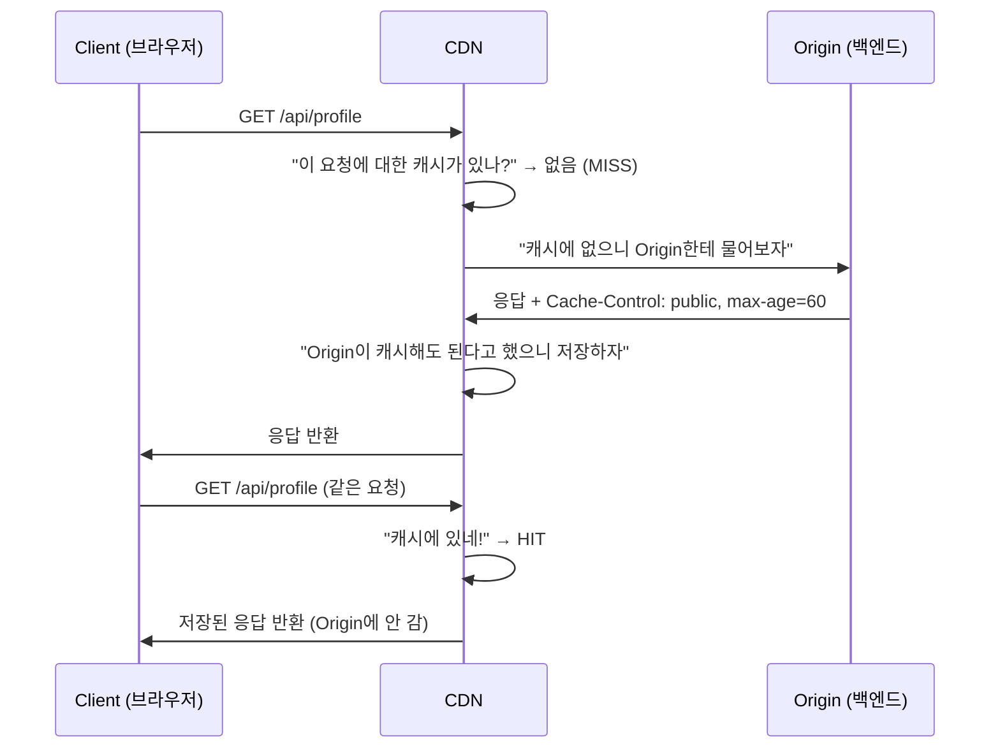
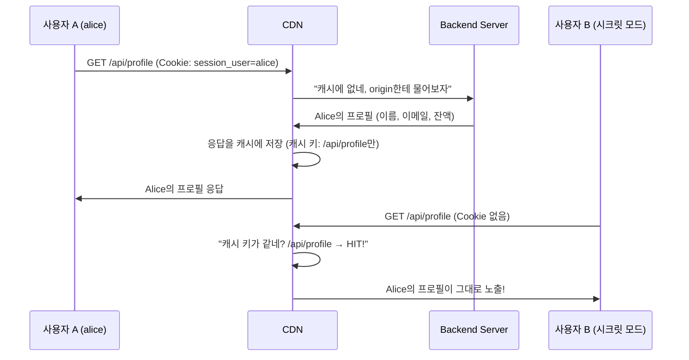

# CDN 캐시 개념과 위험성

## 목차

- [공부 배경](#공부-배경)
- [이 글을 읽고 답할 수 있는 질문](#이-글을-읽고-답할-수-있는-질문)
- [CDN 캐시는 어떻게 동작하나요?](#cdn-캐시는-어떻게-동작하나요)
- [캐시 키에 뭘 포함할 수 있나요?](#캐시-키에-뭘-포함할-수-있나요)
- [캐시 정책](#캐시-정책)
- [왜 위험한가요?](#왜-위험한가요)
- [아키텍처](#아키텍처)
- [왜 이런 일이 발생했을까?](#왜-이런-일이-발생했을까)
- [올바른 해결 방법](#올바른-해결-방법)
- [헷갈리면 안 되는 점](#헷갈리면-안-되는-점)
- [결론](#결론)

## 공부 배경

CDN 캐시 설정을 잘못하면 다른 사용자의 개인정보가 노출될 수 있습니다. 실제로 이런 사고가 발생한 사례가 있어서, 직접 재현하면서 원리를 정리했습니다.

## 이 글을 읽고 답할 수 있는 질문

1. CDN의 캐시 키(Cache Key)는 무엇이고, 기본값은 왜 URL만 포함하나요?
2. Origin의 `Cache-Control` 헤더와 캐시 키는 어떤 차이가 있나요?
3. 캐시 키에 Cookie를 포함하지 않으면 어떤 보안 문제가 발생하나요?
4. Cache Policy와 Origin Request Policy는 왜 별개 설정인가요?
5. 사용자별 응답을 반환하는 API의 캐시를 안전하게 설정하는 방법은 무엇인가요?

## CDN 캐시는 어떻게 동작하나요?

CDN(Content Delivery Network)은 Origin 서버의 응답을 중간에 저장해두고, 같은 요청이 오면 Origin에 가지 않고 저장된 응답을 바로 돌려주는 서비스입니다.

아래 다이어그램은 Client, CDN, Origin의 관계를 보여줍니다.



그런데 CDN이 "같은 요청"인지 판단하려면 기준이 필요합니다. **이 기준이 캐시 키(Cache Key)입니다.**

### CDN은 클라이언트 요청을 보고 판단합니다

CDN은 무조건 캐싱하는 것이 아닙니다. 클라이언트 요청이 들어오면 이런 과정을 거칩니다.

1. 요청에서 **캐시 키**를 구성합니다
2. 캐시 키가 일치하는 저장된 응답이 있으면 → **HIT** (캐시 반환)
3. 없으면 → **MISS** (Origin에 요청 후 응답을 캐시에 저장)

### CDN의 기본 설계: 정적 컨텐츠에 최적화

**CDN의 기본 캐시 키는 URL 경로만 사용합니다.** 정적 컨텐츠(CSS, JS, 이미지)에 최적화된 설계입니다.

`/style.css`는 누가 요청해도 같은 파일입니다. URL만으로 캐시를 구분하면 충분합니다. 하지만 `/api/profile`은 사용자마다 다른 응답을 반환합니다. 여기서 문제가 시작됩니다.

## 캐시 키에 뭘 포함할 수 있나요?

캐시 키에 포함할 수 있는 요소는 3가지입니다.

| 요소 | 설명 | 예시 |
|------|------|------|
| Header | HTTP 요청 헤더 | `Authorization`, `Accept-Language` |
| Cookie | 브라우저가 보내는 쿠키 | `session_id`, `user_token` |
| Query String | URL 뒤의 파라미터 | `?page=1&sort=name` |

기본값은 URL 경로만 캐시 키로 사용합니다. **Cookie를 캐시 키에 포함하지 않으면, Cookie가 다른 두 요청을 "같은 요청"으로 판단합니다.**

## 캐시 정책

CDN의 캐시 동작은 두 단계로 나뉩니다. 이 두 단계를 혼동하면 안 됩니다.

| 단계 | 역할 | 판단 기준 |
|------|------|----------|
| **캐시 저장 여부** | "이 응답을 캐시에 저장해도 되나?" | Origin의 `Cache-Control` 헤더 |
| **캐시 조회/구분** | "이 요청에 대한 캐시가 이미 있나?" | 캐시 키 (URL, Cookie 등) |

**CDN은 Origin의 `Cache-Control` 헤더를 존중하여 캐시 동작을 결정합니다.** 이것이 HTTP 표준 메커니즘입니다.

Origin이 `Cache-Control: public, max-age=60`을 응답하면, CDN은 "이 응답은 60초간 저장해도 된다"고 판단합니다. 반대로 `Cache-Control: no-store`를 응답하면, 캐시 키와 관계없이 저장 자체를 하지 않습니다.

즉, 두 단계가 모두 맞아야 캐시가 동작합니다.

- Origin이 `no-store` → 캐시 키와 관계없이 저장 안 함
- Origin이 `public` + 캐시 키가 다름 → MISS (별도 캐시로 저장)
- Origin이 `public` + 캐시 키가 같음 → HIT (캐시된 응답 반환)

## 왜 위험한가요?

사용자별 응답을 반환하는 API에서 캐시 키에 Cookie를 빼면 어떤 일이 일어날까요?

아래 시퀀스 다이어그램은 CDN 캐시 키에 Cookie를 포함하지 않았을 때 발생하는 문제를 보여줍니다.



사용자 B는 로그인하지 않았는데, 사용자 A의 개인정보(이름, 이메일, 잔액)가 보입니다. **CDN이 URL만으로 캐시를 구분하기 때문에, 모든 사용자의 `/api/profile` 요청을 "같은 요청"으로 판단한 것입니다.**

## 아키텍처

이 핸즈온은 CDN 캐시 취약점을 두 가지 환경에서 재현합니다.

| 구성 요소 | Docker 실습 | CloudFront 실습 |
|-----------|-------------|-----------------|
| CDN | Nginx (리버스 프록시 + 캐시) | CloudFront |
| 프론트엔드 | Nginx 정적 파일 서빙 | S3 |
| 백엔드 | Flask 컨테이너 | EC2 (t4g.small, Graviton) |
| 로드밸런서 | 없음 (직접 연결) | ALB |

**핵심은 동일합니다.** CDN이 캐시 키에 Cookie를 포함하지 않으므로, URL만으로 캐시를 구분합니다.

## 왜 이런 일이 발생했을까?

CDN에는 두 가지 설정이 있습니다.

1. **캐시 키 설정**: 어떤 요소로 캐시를 구분할지 (Header, Cookie, Query String)
2. **Origin 전달 설정**: 어떤 요소를 Origin 서버에 전달할지

**이 두 설정은 별개입니다.** 이 핸즈온에서 사용한 위험한 설정을 보겠습니다.

| 설정 | 값 | 의미 |
|------|-----|------|
| 캐시 키 → Cookie | 포함하지 않음 | 캐시 구분에 Cookie 사용 안 함 |
| Origin 전달 → Cookie | 전부 전달 | Origin에는 Cookie 전달 |

Cookie를 Origin에 전달하니까 백엔드는 사용자를 구분해서 응답합니다. 하지만 CDN은 캐시 키에 Cookie가 없으므로 사용자를 구분하지 못합니다.

**이것이 함정입니다.** Origin은 사용자별로 다른 응답을 보내지만, CDN은 모든 응답을 "같은 요청"으로 캐시합니다. CDN의 기본 설계가 정적 컨텐츠에 최적화되어 있기 때문에, 캐시 키에 Cookie를 명시적으로 추가하지 않으면 이 문제가 발생합니다.

## 올바른 해결 방법

### 방법 1: 캐시 키에 Cookie 포함

캐시 키에 세션 Cookie를 포함하여 사용자별로 캐시를 구분합니다. `session_user` Cookie 값이 다른 요청은 별도의 캐시로 저장됩니다.

| CDN | 설정 방법 |
|-----|----------|
| CloudFront | Cache Policy에서 `cookie_behavior = "whitelist"`로 설정 |
| Nginx | `proxy_cache_key`에 `$cookie_session_user` 추가 |

### 방법 2: 사용자별 응답은 캐시하지 않기

백엔드에서 `Cache-Control: no-store` 헤더를 설정하여 CDN이 응답을 캐시하지 않도록 합니다.

```python
resp.headers["Cache-Control"] = "no-store"
```

CDN은 이 헤더를 보고 해당 응답을 캐시에 저장하지 않습니다.

### 방법 3: 캐시 비활성화

CDN에서 특정 경로의 캐시를 완전히 비활성화할 수 있습니다. CloudFront는 `CachingDisabled` 관리형 정책을, Nginx는 `proxy_no_cache` 설정을 사용합니다.

**사용자별 응답을 반환하는 API에는 반드시 Cookie나 Authorization 헤더를 캐시 키에 포함하거나, 캐시를 비활성화해야 합니다.**

## 헷갈리면 안 되는 점

- CDN이 "무지성으로 캐시한다"고 생각하기 쉽지만, 실제로는 **클라이언트 요청을 보고 캐시 키를 구성하여 판단합니다**
- 문제는 CDN의 **기본 캐시 키가 URL만 포함**한다는 점입니다. 정적 컨텐츠에는 충분하지만, 사용자별 응답에는 부족합니다
- Origin Request Policy에서 Cookie를 전달한다고 해서 캐시 키에 Cookie가 포함되는 것은 아닙니다. **Cache Policy와 Origin Request Policy는 별개 설정입니다**

## 결론

CDN 캐시는 "캐시 저장 여부"와 "캐시 조회/구분" 두 단계로 동작합니다. Origin이 캐시를 허용하더라도 캐시 키 설정이 잘못되면 다른 사용자의 개인정보가 노출됩니다. 사용자별 응답을 반환하는 API에서는 캐시 키에 Cookie를 포함하거나, 캐시를 비활성화하는 것이 안전합니다.
