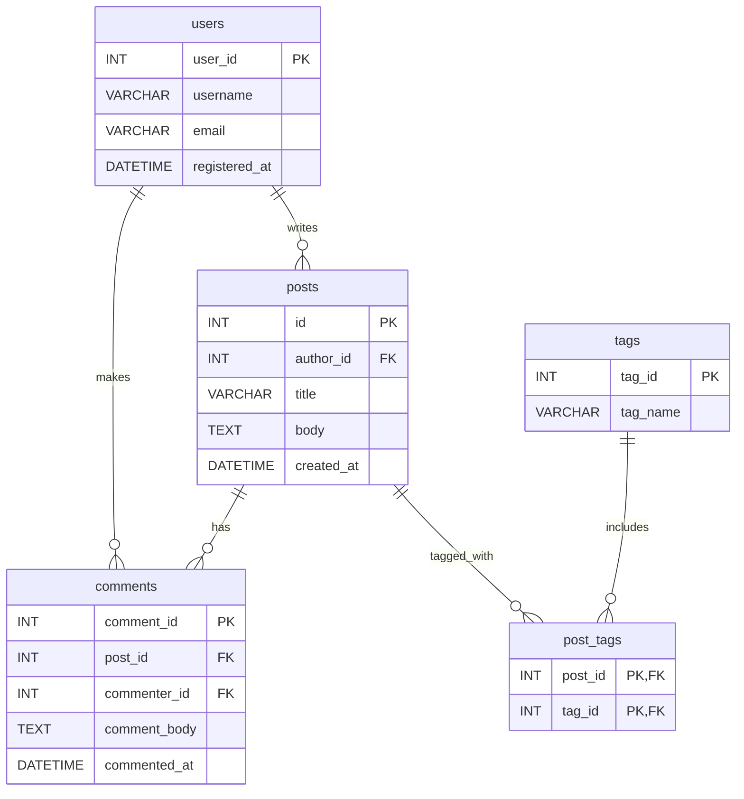

## 개요

* database 인덱스 연습
* 백엔드 코드는 Geminipro 2.5이 작성했습니다.

## 스키마 구조

* 한 명의 유저는 여러 개의 글을 작성할 수 있으며, 각 글은 반드시 한 명의 유저에 의해 작성되어야 한다.
* 한 명의 유저는 여러 개의 댓글을 작성할 수 있으며, 각 댓글은 반드시 한 명의 유저가 작성해야 한다.
* 한 게시글은 여러 개의 댓글을 가질 수 있으며, 각 댓글은 반드시 한 게시글에 달려 있어야 한다.
* 한 게시글은 여러 태그를 가질 수 있고, 한 태그는 여러 게시글을 가질 수 있다. 즉, 게시글과 태그는 N:M관계이다.

```mermaid
erDiagram
    users {
        INT user_id PK
        VARCHAR username
        VARCHAR email
        DATETIME registered_at
    }

    posts {
        INT id PK
        INT author_id FK
        VARCHAR title
        TEXT body
        DATETIME created_at
    }

    comments {
        INT comment_id PK
        INT post_id FK
        INT commenter_id FK
        TEXT comment_body
        DATETIME commented_at
    }

    tags {
        INT tag_id PK
        VARCHAR tag_name
    }

    post_tags {
        INT post_id PK, FK
        INT tag_id PK, FK
    }

    users ||--o{ posts : writes
    users ||--o{ comments : makes
    posts ||--o{ comments : has
    posts ||--o{ post_tags : tagged_with
    tags ||--o{ post_tags : includes
```

## 부하 테스트

* 부하 테스트는 k6로 진행합니다.
* [부하 테스트 문서 바로가기](./stress_test/README.md)
