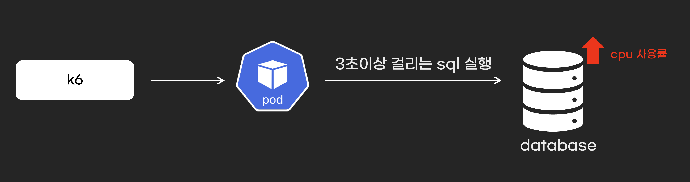

## 개요

* database 인덱스 연습

## 백엔드 코드

* 백엔드 코드는 mysql 연결과 액츄리에티 liveness, readiness를 활성화 했습니다. 그 이외 특별한 로직은 없습니다.
* [백엔드 코드 바로가기](../../backend/readiness/)

## 테스트 시나리오

### 1. API 부하 테스트

1. 시나리오

* sql실행시간이 3초 이상 걸리는 API를 동시에 여러 번 요청하여, DB부하 발생
* DB 부하 발생 후 pod readiness 실패하여, pod가 not runing




2. 백엔드 API 구조

* [http 파일 참조](./sbtest1-queries.http)

3. mysql, applicaton 배포

```sh
kubectl apply -f ./kubernetes/manifests
```

4. 더미 데이터 준비

* sysbench prepare함수로 천만개 더미 데이터 생성
* mysql pod는 6core 필요

> 참고자료: 악분 유투브-> https://youtube.com/shorts/3UbWpWtwjpU

```sh
sysbench oltp_read_write \
  --mysql-host=127.0.0.1 \
  --mysql-port=30080 \
  --mysql-user=root \
  --mysql-password=password1234 \
  --mysql-db=testdb \
  --tables=1 \
  --table-size=10000000 \
  prepare
```

6. test쿼리 준비

* c 필드값을 조회하여 [k6 스크립트의 sql](./stress_test/load-test-by-c.js)를 변경하세요.

```sh
SELECT c FROM testdb.sbtest1 limit 100;
```

7. mysql pod의 cpu를 1코로 변경(기존:4코어)

```sh
kubectl edit deploy mysql
```

8. k6로 API 부하 테스트 진행

```sh
k6 run ./stress_test/load-test-by-c.js
```

9. pod가 not Ready인것을 확인하세요

### (deprecated) 2. database cpu 부하가 100%여서 pod readiness 실패, 서비스 장애

1. 시나리오

* 부하 테스트는 sysbench를 사용합니다.
* [부하 테스트 문서 바로가기](./stress_test/README.md)

2. mysql, applicaton 배포

```sh
kubectl apply -f ./kubernetes/manifests
```

3. 더미 데이터 준비

* sysbench prepare함수로 천만개 더미 데이터 생성
* mysql pod는 6core 필요

> 참고자료: 악분 유투브-> https://youtube.com/shorts/3UbWpWtwjpU

```sh
sysbench oltp_read_write \
  --mysql-host=127.0.0.1 \
  --mysql-port=30080 \
  --mysql-user=root \
  --mysql-password=password1234 \
  --mysql-db=testdb \
  --tables=1 \
  --table-size=10000000 \
  prepare
```

4. test쿼리 준비

* c 필드값을 조회하여 [test_query.lua 파일](./stress_test/test_query.lua)의 쿼리를 변경하세요

```sh
SELECT c FROM testdb.sbtest1 limit 100;
```

5. mysql pod의 cpu를 1코로 변경(기존:4코어)


```sh
kubectl edit deploy mysql
```

6. 실행시간 3초이상 걸리는 쿼리 실행

```sh
sysbench ./stress_test/test_query.lua \
  --mysql-host=127.0.0.1 \
  --mysql-port=30080 \
  --mysql-user=root \
  --mysql-password=password1234 \
  --mysql-db=testdb \
  --threads=16 \
  --time=180 \
  --report-interval=10 \
  run
```

## 부하를 해결하려면?

* index 설정

```sh
use testdb;
CREATE INDEX idx_c ON sbtest1(c);
```

* index 삭제

```sh
use testdb;
SHOW INDEX FROM sbtest1;
```
