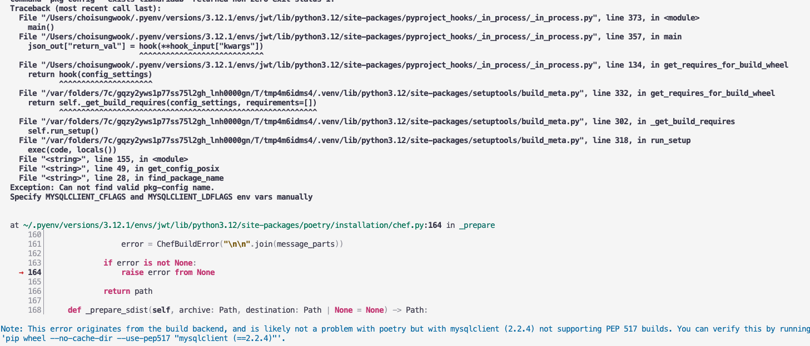

# pip install mysql 에러
* 운영체제에 mysql 라이브러리가 설치되어 있지 않을때, 아래 에러가 발생

```sh
at ~/.pyenv/versions/3.12.1/envs/jwt/lib/python3.12/site-packages/poetry/installation/chef.py:164 in _prepare
    160│
    161│                 error = ChefBuildError("\n\n".join(message_parts))
    162│
    163│             if error is not None:
  → 164│                 raise error from None
    165│
    166│             return path
    167│
    168│     def _prepare_sdist(self, archive: Path, destination: Path | None = None) -> Path:
```



* 해결방법: mysql 라이브러리 설치

```sh
brew install mysql-client pkg-config
export PKG_CONFIG_PATH="$(brew --prefix)/opt/mysql-client/lib/pkgconfig"
```

# 참고자료
* https://velog.io/@dl-00-e8/Django-Ninja-%EC%9E%A5%EA%B3%A0-%EB%8B%8C%EC%9E%90-%EB%8F%84%EC%A0%84%EA%B8%B0-2
