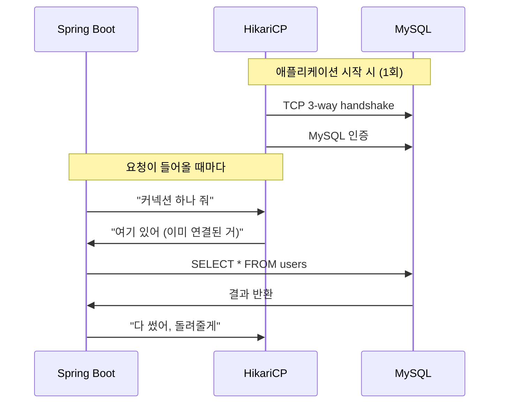

# SpringBoot HikariCP 커넥션 풀과 리눅스 TCP 소켓 디버깅

# 요약

- **DB 커넥션 풀은 TCP 연결을 재사용하는 구조**입니다. 커넥션 풀을 이해하려면 TCP를 함께 봐야 합니다
- HikariCP `maximum-pool-size: 5` 설정에서 slow query 10개를 동시에 보내면, 5개는 처리되고 나머지 5개는 `connection-timeout`으로 실패합니다
- `ss`, `tcpdump` 명령어로 커넥션 풀이 실제로 TCP 연결을 어떻게 관리하는지 눈으로 확인할 수 있습니다
- 커넥션 풀 없이 운영하면 요청마다 TCP 3-way handshake가 발생합니다. tcpdump로 직접 확인합니다

# 목차

- [개요](#개요)
- [실습 환경](#실습-환경)
- [시나리오 1: 정상 상태에서 커넥션 풀과 TCP 연결 관찰](#시나리오-1-정상-상태에서-커넥션-풀과-tcp-연결-관찰)
- [시나리오 2: 커넥션 풀 고갈 시뮬레이션](#시나리오-2-커넥션-풀-고갈-시뮬레이션)
- [시나리오 3: tcpdump로 커넥션 생성과 재사용 패킷 분석](#시나리오-3-tcpdump로-커넥션-생성과-재사용-패킷-분석)
- [시나리오 4: 커넥션 풀 없이 운영했을 때의 문제점](#시나리오-4-커넥션-풀-없이-운영했을-때의-문제점)
- [커넥션 풀 튜닝 포인트](#커넥션-풀-튜닝-포인트)
- [TCP 디버깅 명령어 정리](#tcp-디버깅-명령어-정리)
- [참고자료](#참고자료)

# 개요

## 커넥션 풀이란?

Connection Pool은 두 단어를 합친 용어입니다. Connection + Pool

1. Connection: 애플리케이션과 DB 사이의 네트워크 연결입니다. TCP 연결 위에서 동작합니다
2. Pool: 미리 만들어둔 연결을 모아두는 저장소입니다
3. Connection Pool: **미리 만들어둔 DB 연결(TCP)을 재사용하는 구조**입니다

## 왜 커넥션 풀을 써야 할까?

DB 연결을 맺는 과정은 생각보다 비쌉니다.

1. TCP 3-way handshake (SYN → SYN-ACK → ACK)
2. MySQL 프로토콜 handshake (인증, 세션 설정)
3. 쿼리 실행
4. TCP 4-way handshake로 연결 종료 (FIN → ACK → FIN → ACK)

요청마다 이 과정을 반복하면 latency가 늘어납니다. **커넥션 풀은 1, 2, 4 과정을 제거하고 3번만 실행하는 구조**입니다.



## 왜 TCP와 함께 봐야 할까?

커넥션 풀의 동작을 진짜로 이해하려면 OS 레벨에서 확인해야 합니다.

- `ss` 명령어로 ESTABLISHED 상태의 TCP 연결 수를 보면, 커넥션 풀 크기와 일치하는지 확인할 수 있습니다
- `tcpdump`로 패킷을 캡처하면, 커넥션이 재사용되는지 새로 만들어지는지 직접 볼 수 있습니다

정리하면, **커넥션 풀 = TCP 연결 관리자**입니다.

# 실습 환경

## 구성

| 컴포넌트 | 설명 |
|---------|------|
| Spring Boot 3.2 | HikariCP 내장 (기본 커넥션 풀) |
| MySQL 8.0 | Docker 컨테이너 |
| Linux tools | `ss`, `tcpdump`, `curl` |

## 디렉토리 구조

```
db_pool/
├── Makefile
├── README.md
├── example-app/
│   ├── Dockerfile
│   ├── build.gradle
│   └── src/main/
│       ├── java/com/example/dbpool/
│       │   ├── DbPoolApplication.java
│       │   ├── controller/PoolTestController.java
│       │   └── service/SlowQueryService.java
│       └── resources/
│           ├── application.yml
│           └── application-no-pool.yml
├── manifests/
│   ├── docker-compose.yml
│   └── docker-compose-separate-network.yml
└── scripts/
    ├── check-tcp-connections.sh
    ├── watch-pool-and-tcp.sh
    ├── simulate-pool-exhaustion.sh
    └── tcpdump-mysql.sh
```

## HikariCP 설정

`example-app/src/main/resources/application.yml`에서 핵심 설정을 확인합니다.

| 설정 | 값 | 의미 |
|-----|---|------|
| `maximum-pool-size` | 5 | 최대 커넥션 수. TCP 연결 5개까지만 유지 |
| `minimum-idle` | 2 | 최소 유휴 커넥션 수 |
| `connection-timeout` | 3000ms | 풀에서 커넥션을 못 받으면 3초 후 타임아웃 |
| `idle-timeout` | 30000ms | 유휴 커넥션 30초 후 제거 |
| `max-lifetime` | 60000ms | 커넥션 최대 수명 60초 |

## 환경 시작

```bash
make up
```

앱이 정상적으로 뜨는지 확인합니다.

```bash
curl http://localhost:8080/fast
# fast query result: 1
```

# 시나리오 1: 정상 상태에서 커넥션 풀과 TCP 연결 관찰

## 목표

HikariCP가 실제로 TCP 연결을 몇 개 유지하는지 `ss` 명령어로 확인합니다.

## 실습

### Step 1: 풀 상태 확인

```bash
curl http://localhost:8080/pool-status
# active=0, idle=2, waiting=0, total=2
```

`idle=2`입니다. `minimum-idle: 2` 설정 때문에 미리 2개의 커넥션을 만들어둔 상태입니다.

### Step 2: TCP 연결 확인

```bash
make tcp-check
```

`ss` 명령어로 MySQL 포트(3306)에 대한 TCP 연결을 확인합니다.

```bash
ss -tnp state established '( dport = :3306 or sport = :3306 )'
```

**ESTABLISHED 상태의 TCP 연결이 2개** 보여야 합니다. idle 커넥션 수와 일치합니다.

### Step 3: 요청을 보내고 다시 확인

```bash
curl http://localhost:8080/fast
curl http://localhost:8080/pool-status
# active=0, idle=2, waiting=0, total=2
```

fast query는 즉시 끝나기 때문에 커넥션을 빌려갔다가 바로 반환합니다. TCP 연결 수는 변하지 않습니다.

**이것이 커넥션 풀의 핵심입니다. TCP 연결을 새로 만들지 않고 기존 연결을 재사용합니다.**

# 시나리오 2: 커넥션 풀 고갈 시뮬레이션

## 목표

`maximum-pool-size: 5`인 상태에서 slow query 10개를 동시에 보내면 어떻게 되는지 확인합니다.

## 실습

### Step 1: 터미널 2개 준비

터미널 1에서 풀 상태를 실시간으로 모니터링합니다.

```bash
make tcp-watch
```

출력 예시:

```
[14:30:01] pool=(active=0, idle=2, waiting=0, total=2) | tcp_established=2
```

### Step 2: 풀 고갈 시키기

터미널 2에서 slow query 10개를 동시에 보냅니다.

```bash
make pool-exhaust
```

이 스크립트는 `curl http://localhost:8080/slow?seconds=15`를 10개 동시에 실행합니다.

### Step 3: 모니터링 결과 관찰

터미널 1에서 변화를 관찰합니다.

```
[14:30:05] pool=(active=5, idle=0, waiting=5, total=5) | tcp_established=5
```

- `active=5`: 5개의 커넥션이 모두 사용 중
- `idle=0`: 남은 커넥션 없음
- `waiting=5`: 5개의 스레드가 커넥션을 기다리는 중
- `tcp_established=5`: TCP 연결도 정확히 5개

### Step 4: 타임아웃 발생 확인

3초(`connection-timeout: 3000`) 후 대기 중이던 요청들이 실패합니다.

```
HikariPool-Debug - Connection is not available, request timed out after 3000ms.
```

**풀 크기(5)보다 많은 동시 요청이 들어오면, 초과분은 대기하다가 타임아웃으로 실패합니다.** 이것이 커넥션 풀 고갈(Pool Exhaustion)입니다.

## 왜 위험할까?

운영 환경에서 slow query 하나가 커넥션을 오래 점유하면, 다른 정상 요청들까지 영향을 받습니다. 커넥션 풀이 고갈되면 전체 서비스가 응답 불능 상태에 빠집니다.

# 시나리오 3: tcpdump로 커넥션 생성과 재사용 패킷 분석

## 목표

tcpdump로 패킷을 캡처해서 커넥션 풀이 TCP 연결을 재사용하는 것을 직접 확인합니다.

## 실습

### Step 1: tcpdump 시작

터미널 1에서 패킷 캡처를 시작합니다.

```bash
sudo tcpdump -i any -nn port 3306 -w /tmp/mysql-tcp-capture.pcap -v
```

또는 Makefile을 사용합니다.

```bash
make tcp-capture
```

### Step 2: 요청 보내기

터미널 2에서 fast query를 여러 번 보냅니다.

```bash
for i in $(seq 1 5); do
  curl -s http://localhost:8080/fast
  echo ""
done
```

### Step 3: tcpdump 중지 후 분석

Ctrl+C로 캡처를 중지하고 결과를 분석합니다.

```bash
tcpdump -r /tmp/mysql-tcp-capture.pcap -nn | head -30
```

### 관찰 포인트

커넥션 풀이 **정상 동작**하면:

- SYN → SYN-ACK → ACK (3-way handshake) 패킷이 **보이지 않습니다**
- MySQL 프로토콜 데이터 패킷(PSH, ACK)만 보입니다
- 이미 맺어진 TCP 연결 위에서 쿼리만 주고받는 것입니다

반면 커넥션이 **새로 생성**되면:

- SYN → SYN-ACK → ACK 패킷이 나타납니다
- 이후 MySQL handshake 패킷이 이어집니다

**tcpdump에서 SYN 패킷이 안 보인다면, 커넥션 풀이 제대로 동작하고 있다는 증거입니다.**

### SYN 패킷만 필터링

```bash
tcpdump -r /tmp/mysql-tcp-capture.pcap -nn 'tcp[tcpflags] & tcp-syn != 0'
```

이 명령어로 SYN 플래그가 포함된 패킷만 필터링합니다. 커넥션 풀이 정상이면 결과가 거의 없어야 합니다.

# 시나리오 4: 커넥션 풀 없이 운영했을 때의 문제점

## 목표

커넥션 풀 크기를 1로 줄이고, idle 커넥션을 0으로 설정해서 매 요청마다 TCP 연결이 새로 생성되는 것을 확인합니다.

## 실습

### Step 1: 풀 크기 최소화

`application-no-pool.yml` 프로파일을 사용합니다.

```yaml
spring:
  datasource:
    hikari:
      maximum-pool-size: 1
      minimum-idle: 0
      connection-timeout: 1000
```

`minimum-idle: 0`이면 유휴 커넥션을 유지하지 않습니다. 요청이 올 때마다 커넥션을 새로 만들고, 끝나면 바로 닫습니다.

### Step 2: 환경 재시작

docker-compose에서 app 서비스의 환경변수를 추가합니다.

```bash
docker compose -f manifests/docker-compose.yml down -v

SPRING_PROFILES_ACTIVE=no-pool docker compose -f manifests/docker-compose.yml up -d --build
```

### Step 3: tcpdump로 비교

```bash
sudo tcpdump -i any -nn port 3306 -w /tmp/no-pool-capture.pcap -v &

for i in $(seq 1 5); do
  curl -s http://localhost:8080/fast
  echo ""
  sleep 1
done

kill %1
```

### Step 4: SYN 패킷 비교

```bash
echo "=== 커넥션 풀 있을 때 ==="
tcpdump -r /tmp/mysql-tcp-capture.pcap -nn 'tcp[tcpflags] & tcp-syn != 0' | wc -l

echo "=== 커넥션 풀 없을 때 ==="
tcpdump -r /tmp/no-pool-capture.pcap -nn 'tcp[tcpflags] & tcp-syn != 0' | wc -l
```

**커넥션 풀 없는 경우 SYN 패킷이 요청 수만큼 나타납니다.** 매 요청마다 TCP 3-way handshake가 발생하는 것입니다.

## 성능 차이

| 항목 | 커넥션 풀 사용 | 커넥션 풀 미사용 |
|-----|-------------|--------------|
| TCP handshake | 앱 시작 시 1회 | 매 요청마다 |
| MySQL 인증 | 앱 시작 시 1회 | 매 요청마다 |
| SYN 패킷 수 | 거의 0 | 요청 수와 동일 |
| 응답 시간 | 빠름 | 느림 (handshake 오버헤드) |
| TIME_WAIT 소켓 | 거의 없음 | 요청 수만큼 누적 |

**커넥션을 자주 맺고 끊으면 TIME_WAIT 소켓이 쌓입니다.** 이것은 OS 레벨에서 포트 고갈로 이어질 수 있습니다.

```bash
ss -tn state time-wait '( dport = :3306 )'
```

# 커넥션 풀 튜닝 포인트

## maximum-pool-size

가장 중요한 설정입니다. 공식은 없지만 기본 원칙이 있습니다.

- 너무 크면: DB에 과도한 부하. MySQL의 `max_connections`를 초과할 수 있음
- 너무 작으면: 풀 고갈로 타임아웃 발생
- HikariCP 권장: **CPU 코어 수 * 2 + 디스크 수** (PostgreSQL 기준이지만 참고할 만합니다)

## connection-timeout

풀에서 커넥션을 기다리는 최대 시간입니다.

- 짧으면: 빠르게 실패. 사용자에게 즉시 에러 반환
- 길면: 스레드가 오래 블로킹. 전체 요청 처리량 감소

## idle-timeout과 max-lifetime

- `idle-timeout`: 유휴 커넥션 제거 주기. DB 방화벽의 idle timeout보다 짧게 설정해야 합니다
- `max-lifetime`: MySQL의 `wait_timeout`보다 짧게 설정합니다. 그렇지 않으면 "connection reset" 에러가 발생합니다

## 주의사항

**`max-lifetime`은 반드시 MySQL `wait_timeout`보다 짧아야 합니다.**

MySQL에서 wait_timeout을 확인합니다.

```sql
SHOW VARIABLES LIKE 'wait_timeout';
```

기본값은 28800초(8시간)입니다. HikariCP `max-lifetime`을 이보다 짧게 설정합니다.

# TCP 디버깅 명령어 정리

| 명령어 | 용도 |
|-------|------|
| `ss -tnp state established '( dport = :3306 )'` | ESTABLISHED 연결 확인 |
| `ss -tn '( dport = :3306 )'` | 모든 상태의 연결 확인 |
| `ss -tn state time-wait '( dport = :3306 )'` | TIME_WAIT 소켓 확인 |
| `ss -s` | 전체 소켓 통계 |
| `tcpdump -i any -nn port 3306` | MySQL 패킷 실시간 캡처 |
| `tcpdump -r file.pcap -nn 'tcp[tcpflags] & tcp-syn != 0'` | SYN 패킷만 필터 |
| `tcpdump -r file.pcap -nn 'tcp[tcpflags] & tcp-fin != 0'` | FIN 패킷만 필터 |

# 참고자료

- https://github.com/brettwooldridge/HikariCP
- https://github.com/brettwooldridge/HikariCP/wiki/About-Pool-Sizing
- https://docs.spring.io/spring-boot/reference/data/sql.html#data.sql.datasource.connection-pool
- https://dev.mysql.com/doc/refman/8.0/en/server-system-variables.html#sysvar_wait_timeout
