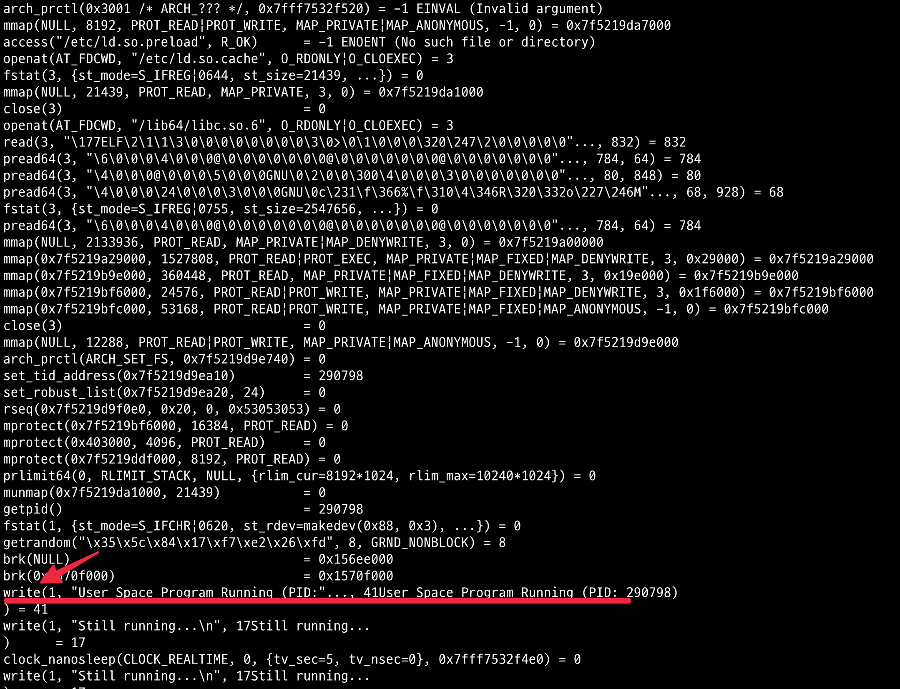
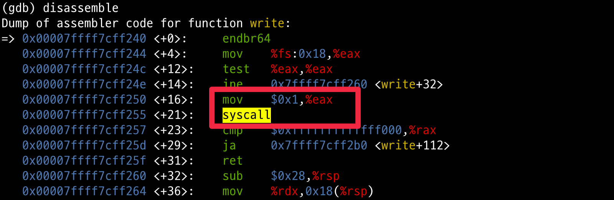

# 개요

* linux userspace에서 실행되는 코드 예제와 디버깅 방법

## 컴파일 방법

```sh
gcc -o userspace_program userspace_program.c
```

## 실행방법

```sh
$ chmod u+x ./userspace_program
$ ./userspace_program
```

## userspace 프로세스 확인

```sh
ps aux | grep userspace_program
```

## userspace 프로세스의 syscall 확인

```sh
strace ./userspace_program
```




## gdb로 userspace의 syscall 직접 확인

```sh
# GDB로 프로그램 실행
gdb ./userspace_program

# GDB 명령어들:
(gdb) break main
Breakpoint 1 at 0x401174

(gdb) run
Starting program: ./userspace_program

(gdb) break write
Breakpoint 2 at 0x7ffff7ec7090

(gdb) continue
Continuing.

Breakpoint 2, write () at ../sysdeps/unix/syscall-template.S:84
84      ../sysdeps/unix/syscall-template.S: No such file or directory.

# 어셈블리 코드 확인
(gdb) disassemble
Dump of assembler code for function write:
=> 0x00007ffff7ec7090 <+0>:     endbr64
   0x00007ffff7ec7094 <+4>:     mov    %edi,%edi
   0x00007ffff7ec7096 <+6>:     mov    %rsi,%rsi
   0x00007ffff7ec7098 <+8>:     mov    %rdx,%rdx
   0x00007ffff7ec709a <+10>:    mov    $0x1,%eax    ← syscall 번호
   0x00007ffff7ec709f <+15>:    syscall             ← 여기!!!
   0x00007ffff7ec70a1 <+17>:    cmp    $0xfffffffffffff001,%rax
   0x00007ffff7ec70a7 <+23>:    jae    0x7ffff7ec70ab <write+27>
   0x00007ffff7ec70a9 <+25>:    ret
```



## userspace 프로세스의 메모리 주소 확인

* 00400000주소가 userspace 메모리

```sh
$ cat /proc/{process id}/maps
00400000-00401000 r--p 00000000 103:01 37787107                          /root/ebpf-hello-world/userspace_program
00401000-00402000 r-xp 00001000 103:01 37787107                          /root/ebpf-hello-world/userspace_program
00402000-00403000 r--p 00002000 103:01 37787107                          /root/ebpf-hello-world/userspace_program
00403000-00404000 r--p 00002000 103:01 37787107                          /root/ebpf-hello-world/userspace_program
...
```


