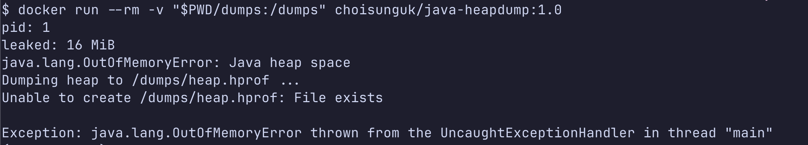

# 3. OOM 순간의 dump 재현하기

OOM으로 죽는 앱에서 dump가 자동으로 남는 것, 같은 이름의 dump가 이미 있으면 남지 않는 것, 살아 있는 JVM에서 수동으로 뜨는 것까지 세 가지를 실험합니다. 두 번째 실험이 의외일 수 있습니다. JVM은 dump 파일을 덮어쓰지 않습니다.

실습 준비는 [1. 실습 준비](./1-setup.md)를 따릅니다. `make build`로 이미지가 만들어져 있어야 합니다.

## 실험 1. OOM에서 dump가 자동으로 남는다

실습 앱은 static 컬렉션에 1MiB 배열을 계속 쌓습니다. static 참조는 GC root에서 닿기 때문에 GC가 회수하지 못하고, heap이 가득 차면 OOM이 납니다. heap을 64MiB로 줄여 몇 초 안에 터뜨립니다.

dump를 받을 디렉터리를 만들고 앱을 실행합니다.

```bash
mkdir -p dumps
docker run --rm -v "$PWD/dumps:/dumps" choisunguk/java-heapdump:1.0
```

이미지의 기본 실행 명령이 곧 이 실험입니다. 컨테이너 안에서 실행되는 java 명령은 다음과 같습니다.

```bash
java -Xmx64m \
  -XX:+HeapDumpOnOutOfMemoryError \
  -XX:HeapDumpPath=/dumps/heap.hprof \
  LeakApp
```

몇 초 뒤 OOM과 함께 dump 생성 로그가 남습니다.

```text
java.lang.OutOfMemoryError: Java heap space
Dumping heap to /dumps/heap.hprof ...
Heap dump file created [36183233 bytes in 0.088 secs]
```



파일 크기 36MB는 OOM 순간의 heap 사용량과 거의 같습니다. dump 크기는 `-Xmx`가 아니라 그 순간 heap에 살아 있는 객체량을 따라가고, OOM 시점에는 heap이 거의 가득 차 있으므로 사실상 `-Xmx`가 상한이 됩니다.

## 실험 2. 같은 이름의 dump가 있으면 남지 않는다

dump 파일을 지우지 않은 채 같은 명령을 다시 실행합니다.

```bash
docker run --rm -v "$PWD/dumps:/dumps" choisunguk/java-heapdump:1.0
```

OOM은 똑같이 나지만 이번에는 dump가 남지 않습니다.

```text
java.lang.OutOfMemoryError: Java heap space
Dumping heap to /dumps/heap.hprof ...
Unable to create /dumps/heap.hprof: File exists
```

**JVM은 기존 dump 파일을 덮어쓰지 않고 dump 생성을 포기합니다.** 첫 사고의 증거가 다음 사고로 지워지지 않는다는 뜻이기도 하고, 수거하지 않고 방치하면 다음 사고의 증거를 잃는다는 뜻이기도 합니다.

dump가 안 남은 이유를 정확히 구분해 둘 필요가 있습니다. [2번 문서](./2-why-heapdump-on-oom.md)의 "첫 OOM에서 한 번만" 플래그 때문이 아닙니다. 그 플래그는 JVM 프로세스 내부에만 있어서, 지금처럼 컨테이너를 새로 띄우면(systemd 재시작도 마찬가지) 새 JVM이고 플래그는 초기화된 상태입니다. 그래서 이 JVM도 dump를 쓰려고 시도했고, 로그에 `Dumping heap to ...`가 실제로 찍혔습니다. 실패한 이유는 오직 파일 충돌입니다. 프로세스마다 1회씩 dump가 생기는 것이 정상 동작이고, 같은 경로에 같은 이름으로 쓰려다 막힌 것입니다.

여기서 보통 "파일명에 `%p` 같은 변수를 넣으면 되지 않나"를 묻습니다. JDK 21에서 `-XX:HeapDumpPath=/dumps/oom-%p.hprof`로 실행해 보면 치환 없이 문자 그대로 `oom-%p.hprof` 파일이 생깁니다. `HeapDumpPath`에 디렉터리를 주면 `java_pid<pid>.hprof`로 pid가 붙긴 하지만, 컨테이너는 재시작해도 pid가 같아서 결국 같은 이름으로 충돌합니다. 그래서 이 문제는 파일명이 아니라 dump 수거·정리 절차로 풀어야 하고, [5. 운영 적용 체크리스트](./5-production-checklist.md)에서 다룹니다.

## 실험 3. 살아 있는 JVM에서 수동으로 뜬다

OOM 전이라도 heap이 이상하게 자라는 게 보이면 그 시점의 dump를 떠서 비교할 수 있습니다. heap을 4GiB로 늘려 앱을 죽지 않게 띄워 둡니다. `docker run` 뒤에 java 명령을 붙이면 이미지의 기본 실행 명령을 덮어씁니다.

```bash
docker run -d --name heapdump-live -v "$PWD/dumps:/dumps" choisunguk/java-heapdump:1.0 \
  java -Xmx4g LeakApp
```

몇 초 기다려 heap이 쌓이면 jcmd로 dump를 뜹니다. jcmd는 pid 대신 main class 이름으로도 대상 JVM을 지정할 수 있습니다.

```bash
docker exec heapdump-live jcmd LeakApp GC.heap_dump /dumps/live.hprof
```

dump를 확인하고 컨테이너를 정리합니다.

```bash
ls -lh dumps
docker rm -f heapdump-live
```

이 실습에서는 약 1GB dump가 3.1초에 남았습니다. 로컬 NVMe 기준이고, dump를 쓰는 동안 JVM의 모든 스레드가 멈춘다는 점은 [5. 운영 적용 체크리스트](./5-production-checklist.md)에서 다시 다룹니다. 경로는 jcmd를 실행한 쪽이 아니라 대상 JVM 기준의 경로라는 점만 주의합니다.

## dump가 안 남는 OOM도 있다

`-XX:+HeapDumpOnOutOfMemoryError`는 JVM이 heap 부족으로 던지는 OOM에 반응합니다. 라이브러리 코드가 직접 만들어 던지는 OOM은 이 훅을 타지 않습니다. 예를 들어 direct buffer가 `-XX:MaxDirectMemorySize` 한도에 걸리면 `OutOfMemoryError: Cannot reserve ... direct buffer memory`가 나는데, 이때는 dump가 남지 않습니다. off-heap 문제는 heap dump가 아니라 Native Memory Tracking 같은 다른 도구의 영역입니다.

dump는 JVM 프로세스마다 첫 heap OOM에서 한 번 남고, 같은 이름의 파일이 있으면 남지 않습니다. 이제 남긴 `dumps/heap.hprof`에서 범인을 찾으러 갑니다. [4. dump에서 범인 찾기](./4-analyze-heapdump.md)로 이어집니다.

## 참고자료

- [java 명령 매뉴얼의 HeapDumpPath 항목](https://docs.oracle.com/en/java/javase/21/docs/specs/man/java.html)
- [jcmd 매뉴얼](https://docs.oracle.com/en/java/javase/21/docs/specs/man/jcmd.html)
- `%p` 치환 미동작은 JDK 21(eclipse-temurin:21-jdk) 실측 결과다. 다른 JDK 버전은 확인 필요
