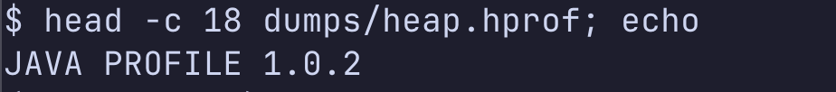
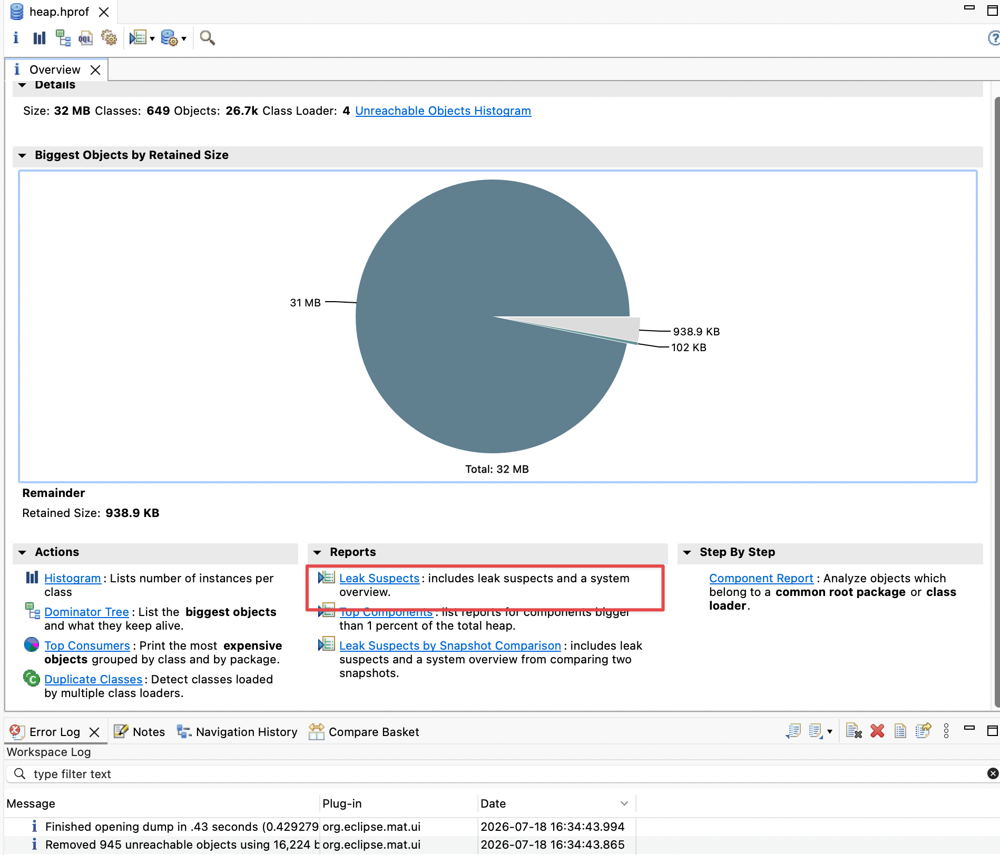
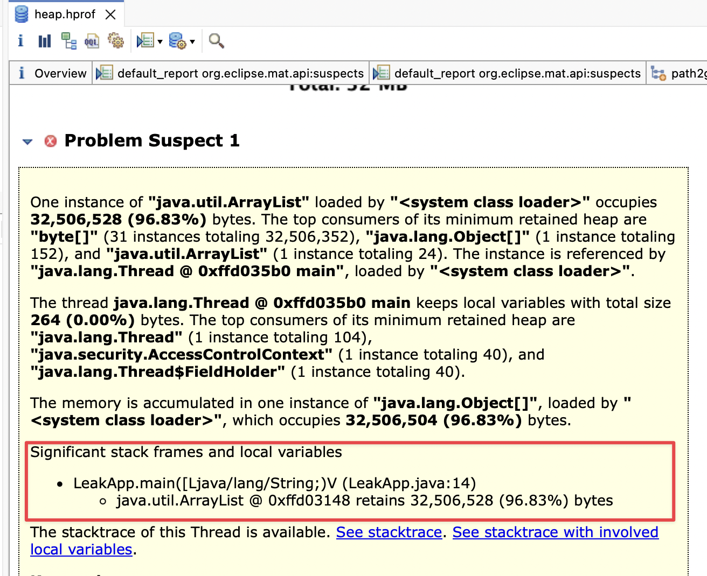
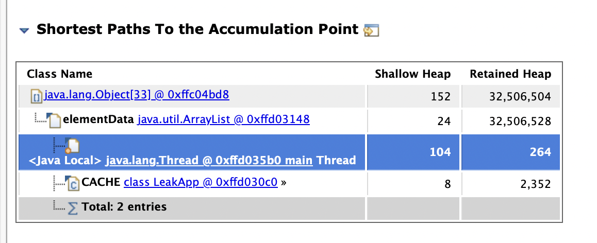

# 4. dump에서 범인 찾기 — 메모리를 제일 많이 쓴 객체는 범인이 아니다

[3번 문서](./3-reproduce-oom-dump.md)에서 OOM 순간의 heap을 `dumps/heap.hprof`로 남겼습니다. 이제 이 36MB 파일을 열어 누수의 범인을 찾을 차례입니다. 파일 안에는 OOM 순간 heap에 있던 모든 객체가 들어 있어서 눈으로 뒤질 수는 없고, 이 실습은 macOS에서 Eclipse MAT(Memory Analyzer Tool) GUI로 분석합니다. 파일의 정체를 확인하고, 분석 도구를 고르고, MAT로 범인을 특정하는 순서로 갑니다. 그 과정에서 제목의 질문 — 왜 메모리를 제일 많이 쓴 객체가 범인이 아닌지 — 도 풀립니다.

## 파일의 정체 — 도구 없이 확인할 수 있는 것

heap dump는 HPROF binary format으로 저장된 바이너리 파일입니다. 도구를 열기 전에 파일이 정상인지부터 확인할 수 있습니다. 형식 이름이 파일 맨 앞에 문자열로 들어 있습니다.

```bash
head -c 18 dumps/heap.hprof; echo
```



정상 dump라면 형식 시그니처가 나옵니다.

```text
JAVA PROFILE 1.0.2
```

이 헤더 뒤로 record들이 이어집니다. 문자열 테이블, 로드된 클래스 목록, 스레드 스택, 그리고 파일 대부분을 차지하는 heap dump segment(모든 객체의 필드 값과 객체 사이의 참조)가 순서대로 담깁니다. 파일 하나에 "그 순간 heap의 전부"가 들어 있고, 분석 도구가 하는 일은 이 record를 파싱해 참조 그래프를 복원하는 것입니다.

객체 내용이 압축 없이 그대로 들어 있다는 것도 파일 자체로 확인됩니다. dump 안의 문자열을 훑으면 클래스 이름이 보입니다.

```bash
strings -a dumps/heap.hprof | grep -m 3 LeakApp
```

여기까지가 도구 없이 볼 수 있는 한계입니다. 수만 개 record의 참조 그래프를 눈으로 따라가는 것은 불가능하므로, 그래프를 복원하고 질의할 파서가 필요합니다.

## JDK에는 hprof를 여는 도구가 없다 — 오픈소스에서 고른다

hprof 뷰어가 JDK에 있긴 했습니다(jhat). 그러나 JDK 9에서 제거됐고, jmap과 jcmd는 살아 있는 프로세스에 붙는 도구라서 파일만 남은 상황에서는 쓸 수 없습니다. 그래서 hprof 파일 분석은 외부 도구의 영역이고, 널리 쓰이는 오픈소스 도구는 둘입니다.

| 도구 | 라이선스 | 특징 |
| --- | --- | --- |
| [Eclipse MAT](https://eclipse.dev/mat/) | EPL | retained heap, dominator tree, Leak Suspects 리포트로 누수를 역추적한다 |
| [VisualVM](https://visualvm.github.io/) | GPLv2+CPE | hprof를 열어 클래스별 점유와 개별 인스턴스를 훑는 GUI. Leak Suspects 리포트와 dominator tree에 해당하는 기능은 없다 |

IntelliJ IDEA에도 hprof 뷰어가 내장돼 있지만 오픈소스는 아닙니다. dump를 웹에 업로드하는 SaaS 분석기도 있는데, dump에는 그 순간 메모리의 민감정보가 그대로 들어 있으므로 외부 업로드는 하지 않습니다([5. 운영 적용 체크리스트](./5-production-checklist.md) 참고).

이 실습은 MAT GUI를 씁니다. 누수 분석의 핵심 질문이 "무엇이 많은가"가 아니라 "누가 붙잡고 있어서 GC가 회수하지 못하는가"인데, 이 질문에 답하는 retained heap과 dominator tree 분석이 MAT에 있기 때문입니다.

## MAT 설치와 dump 열기

분석은 컨테이너가 아니라 host(macOS)에서 합니다. dump는 이미 volume mount를 타고 host의 `dumps/` 디렉터리에 파일로 나와 있으므로, 컨테이너는 dump를 만드는 역할에서 끝납니다. 운영에서도 같은 구조입니다. 서버(컨테이너)는 dump를 남기는 곳이고, 분석은 dump를 수거한 분석 장비에서 GUI로 엽니다.

macOS는 Homebrew로 MAT를 설치하고, 다른 OS는 [MAT 다운로드 페이지](https://eclipse.dev/mat/)에서 받습니다.

```bash
brew install --cask mat
```

설치된 MemoryAnalyzer 앱을 실행하고 **File > Open Heap Dump...** 에서 `dumps/heap.hprof`를 선택합니다. MAT가 파일을 파싱하면서 hprof와 같은 디렉터리에 index 파일들을 만드는데, 다음에 같은 dump를 열 때는 이 index를 재사용해 파싱 없이 바로 열립니다. dump를 지울 때 index 파일도 같이 지우면 됩니다.

파싱이 끝나면 **Getting Started Wizard**가 뜨고 첫 항목이 **Leak Suspects Report**입니다. 이 창을 닫았더라도 Overview 탭의 Reports 영역에서 Leak Suspects를 언제든 다시 실행할 수 있습니다.



## Leak Suspects — 범인이 한 문장으로 나온다

Leak Suspects Report를 실행하면 retained size 기준 pie chart와 함께 suspect가 나옵니다. 이 실습 dump에서는 이렇게 나옵니다.

```text
Problem Suspect 1
One instance of java.util.ArrayList loaded by <system class loader>
occupies 32,506,528 (96.83%) bytes.
```



ArrayList 하나가 heap의 96.83%를 붙잡고 있다는 결론이 한 문장으로 나옵니다. suspect 아래의 **Details »** 링크를 누르면 **Shortest Paths To the Accumulation Point** 섹션이 있고, 여기서 이 ArrayList를 heap에 붙잡아 두는 참조 사슬이 보입니다.

```text
class LeakApp (system class loader)
└─ CACHE  java.util.ArrayList
   └─ elementData  java.lang.Object[]
      └─ byte[1048576] ...
```

`LeakApp` 클래스의 static 필드 `CACHE`가 GC root에서 닿는 출발점입니다. static 참조는 클래스가 살아 있는 한 끊기지 않으므로 GC가 이 사슬 아래 전부를 회수하지 못합니다. 코드에서 지울 지점이 `CACHE` 한 곳으로 특정된 것입니다.

## 왜 byte 배열이 아니라 ArrayList가 범인인가

이 앱의 heap을 실제로 채운 것은 1MiB짜리 byte 배열 수십 개입니다. 그런데 suspect는 배열이 아니라 ArrayList입니다. 왜일까요. MAT가 크기를 두 가지로 나눠 보기 때문입니다.

| 개념 | 의미 | 이 dump의 실측값 (ArrayList) |
| --- | --- | --- |
| shallow heap | 객체 자신의 크기 | 24 byte |
| retained heap | 그 객체가 사라지면 함께 회수될 총량. 누수 분석은 이 값을 본다 | 32,506,528 byte (약 31MiB) |
| dominator | 어떤 객체에 닿는 모든 참조 경로가 반드시 거치는 객체. dominator가 사라지면 아래가 전부 회수된다 | ArrayList가 byte 배열 전부의 dominator |

byte 배열 하나하나는 shallow로는 크지만, 각 배열은 ArrayList를 거쳐야만 닿을 수 있습니다. 즉 ArrayList가 배열 전부의 dominator이고, ArrayList의 retained heap에 배열들이 전부 합산됩니다. shallow 24 byte짜리 객체의 retained heap이 약 31MiB가 되는 이유입니다. **Leak Suspects는 shallow가 아니라 retained heap이 큰 객체를 지목하므로, 범인은 배열이 아니라 배열을 살려 두는 ArrayList가 됩니다.**

Shortest Paths To the Accumulation Point 화면에서 두 값을 나란히 확인할 수 있습니다.



MAT의 **Histogram** 뷰(툴바의 막대그래프 아이콘)로 이 차이를 직접 확인할 수 있습니다. 클래스별 목록에서 shallow heap 1위는 byte 배열(`[B`)입니다. 여기서 보통 "그럼 histogram만 보면 되지 않나" 싶은데, shallow 순위는 그 객체들을 어떤 참조가 붙잡고 있는지 알려 주지 않으므로 histogram만으로는 끊을 지점을 특정하지 못합니다. Retained Heap 열은 기본으로 비어 있고, 열 머리글의 계산 버튼(Calculate retained size)으로 채웁니다.

**Dominator Tree** 뷰(툴바의 트리 아이콘)는 이 관계를 한 화면으로 보여 줍니다. retained heap 순으로 정렬된 최상단에 ArrayList가 있고, 펼치면 `Object[]` 아래로 1MiB byte 배열들이 매달려 있습니다. Leak Suspects가 자동으로 내려 준 결론을, Histogram과 Dominator Tree로 직접 재구성할 수 있으면 suspect가 여러 개 나오는 실무 dump에서도 같은 방법으로 좁혀 갈 수 있습니다.

## systemd로 관리하는 JVM은 dump가 쌓인다 — logrotate가 필요하다

분석 절차가 잡혔어도, 분석할 dump가 하나만 생긴다는 보장은 없습니다. [3번 문서의 실험 2](./3-reproduce-oom-dump.md)에서 컨테이너는 재시작해도 pid가 같아 파일명이 충돌하고 첫 dump만 남는 것을 확인했습니다. host에서 systemd로 java process를 관리하면 반대 방향의 문제가 생깁니다. OOM으로 죽은 서비스를 systemd가 재시작하면 새 프로세스는 pid가 달라지고, `HeapDumpPath`가 디렉터리면 재시작마다 `java_pid<pid>.hprof`가 새로 생깁니다. 누수가 고쳐지기 전까지 OOM → 재시작 → OOM 루프가 돌면 `-Xmx` 크기의 dump가 재시작 횟수만큼 쌓여 디스크를 채웁니다.

JVM에는 오래된 dump를 지우는 기능이 없으므로 정리는 바깥에서 해야 합니다. dump 디렉터리에 logrotate 설정을 두어 보관 기간과 개수에 상한을 걸고, 분석 장비로 수거한 원본은 바로 지웁니다. 디스크 여유와 수거 절차까지 포함한 전체 체크리스트는 다음 문서에서 다룹니다.

정리하면, 메모리를 제일 많이 쓴 객체와 범인이 다른 이유는 MAT가 shallow가 아니라 retained heap으로 누수를 추적하기 때문입니다. dump를 GUI로 열고 Leak Suspects → Shortest Paths To the Accumulation Point 순서로 따라가면 끊어야 할 참조가 코드 위치로 특정됩니다. 마지막으로 이 옵션을 운영에 켤 때의 주의사항을 봅니다. [5. 운영 적용 체크리스트](./5-production-checklist.md)로 이어집니다.

## 참고자료

- [Eclipse Memory Analyzer](https://eclipse.dev/mat/)
- [MAT 공식 문서의 shallow/retained heap 개념](https://help.eclipse.org/latest/topic/org.eclipse.mat.ui.help/concepts/shallowretainedheap.html)
- [VisualVM](https://visualvm.github.io/)
