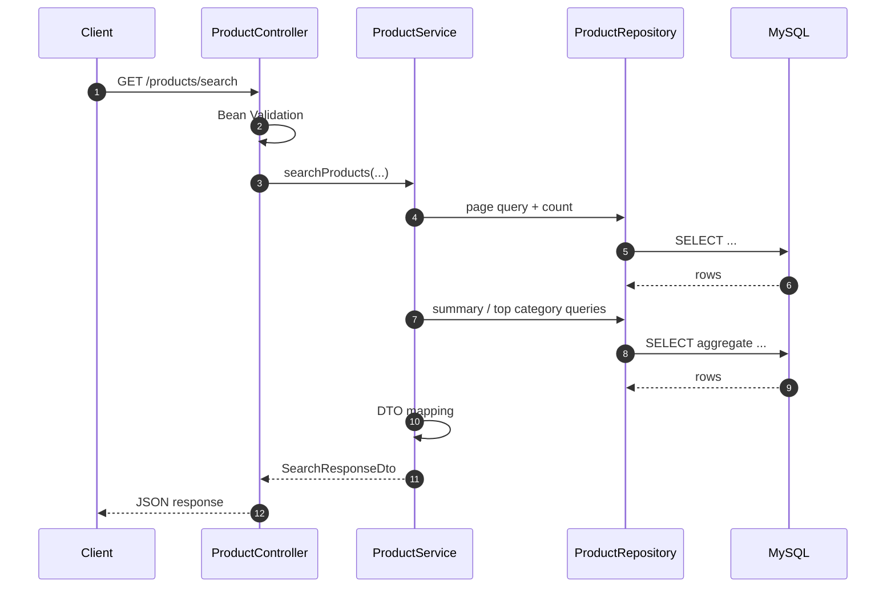
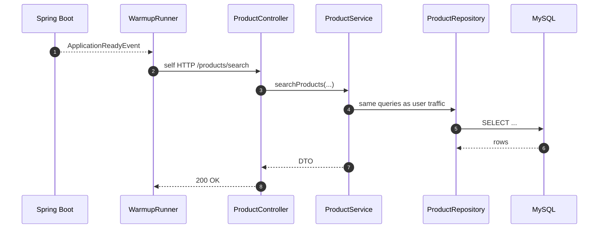

# App 구조

이 앱은 부팅 직후 초기화 비용이 실제 요청 경로에 어떻게 실리는지 보기 위한 작은 Spring Boot 애플리케이션이다. 핵심 구성은 `ProductController -> ProductService -> ProductRepository -> MySQL`이고, `WarmupRunner`는 앱 준비 직후 같은 HTTP 경로를 self-call 해서 이 경로를 미리 예열한다.

## 일반 요청 흐름

## Warm-up 흐름

실험 해석 포인트는 단순하다. `no-warmup`에서는 첫 burst가 이 초기화 비용을 직접 부담하므로 Hikari `usage`가 먼저 오른다. `with-warmup`에서는 같은 경로를 앱 시작 직후 미리 태우기 때문에, 사용자 요청 시점에는 `usage`와 그 뒤의 `acquire` 상승이 더 작아진다.
