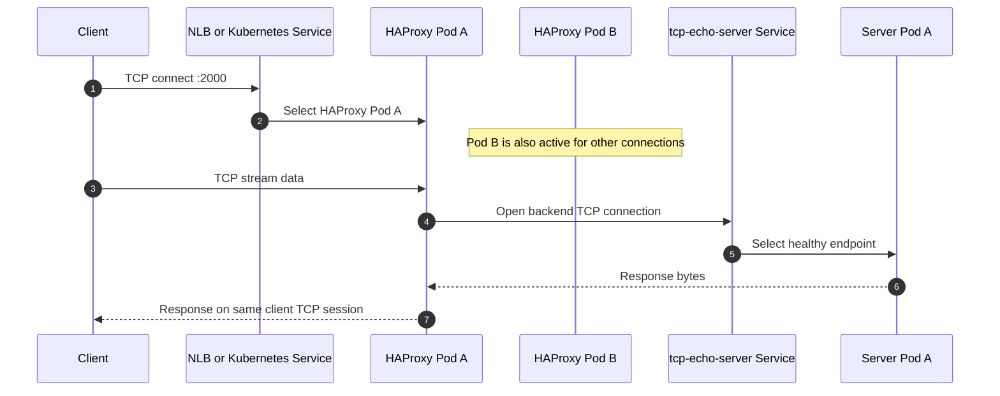
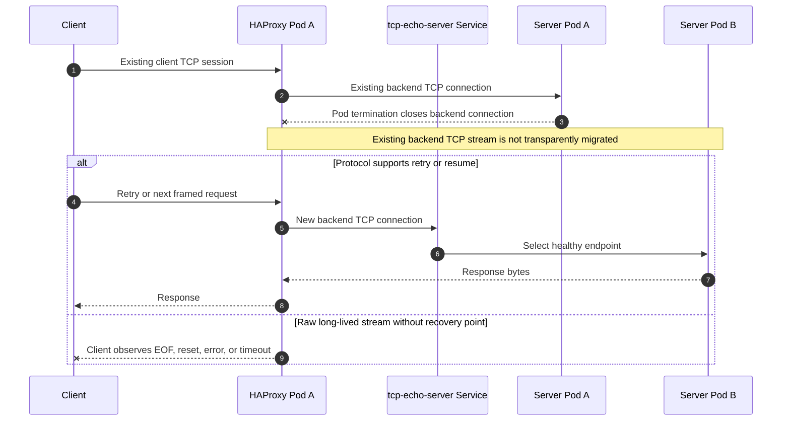
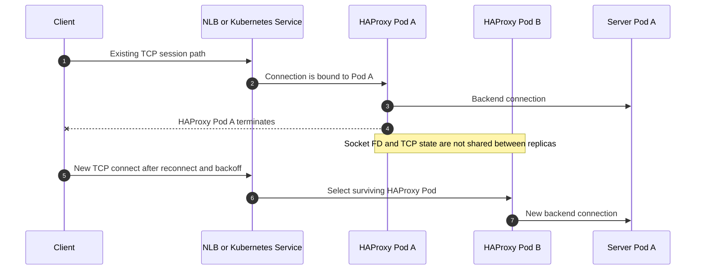

# 아키텍처

TL;DR: 검증 경로는 `client -> L4 TCP proxy -> server Pod`이다. 로컬에서는 proxy Service를 NodePort로 열고, EKS에서는 같은 Service를 NLB로 노출한다. 이 문서는 L4 proxy의 공통 개념을 정리하며, 본문 예시는 archive된 HAProxy 구성을 기준으로 한다. 현재 active 실습인 Envoy 구성의 차이는 [Envoy 아키텍처](envoy-architecture.md)를 본다.

## 목표

핵심 검증 질문은 server Pod 종료가 client의 장기 TCP 연결에 어떤 영향을 주는지다. 확인할 사실은 세 가지다.

| 항목 | 확인 방법 |
|---|---|
| client와 HAProxy 사이 소켓 유지 여부 | client 로그, `ss -tnp`, 에러 발생 여부 |
| backend 교체 여부 | server 응답의 `hostname=...` 변화 |
| RST/FIN 발생 여부 | client 로그, HAProxy traffic log, 필요 시 `tcpdump` |

## 로컬 경로

로컬 kind 경로는 다음과 같다.

```text
local client or client Pod
  -> localhost:2000 or haproxy NodePort 32090
  -> HAProxy Pod
  -> tcp-echo-server Service
  -> tcp-echo-server Pod
```

## EKS 경로

EKS 전환 후 production 형태에 가까운 경로는 다음과 같다.

```text
external client
  -> AWS NLB TCP listener :2000
  -> HAProxy Pod
  -> tcp-echo-server Service
  -> tcp-echo-server Pod
```

## 정상 흐름 시퀀스

아래 시퀀스는 client connection이 HAProxy Pod 하나에 고정되고, backend connection은 server Service 뒤 Pod 하나로 연결되는 정상 흐름이다.



## Backend Pod 종료 시퀀스

아래 시퀀스는 server Pod가 종료될 때 기대하면 안 되는 지점과 안전한 복구 지점을 구분한다.



## HAProxy Pod 종료 시퀀스

아래 시퀀스는 HAProxy replica 2개가 live session failover를 의미하지 않는다는 점을 보여준다.



## 중요한 한계

HAProxy TCP mode는 client 연결 하나에 대해 선택된 backend 연결을 유지한다. client TCP connection이 HAProxy에 붙어 있다는 사실과, backend Pod가 죽어도 HAProxy가 같은 byte stream을 새 Pod로 이어준다는 주장은 다르다. backend connection이 닫히면 HAProxy는 client-side connection을 계속 들고 있을 수는 있어도, 같은 stream의 다음 byte를 안전하게 만들어낼 수 없다.

이 핸즈온의 요구사항은 server Pod 재시작 중에도 client가 `server closed connection`을 보지 않는 것이다. 따라서 `AUTO_RECONNECT=false`에서 close가 발생하면 실험 실패이며, HAProxy TCP mode가 이 요구사항을 만족하지 못한 결과로 기록한다.

장점: client와 server 사이에 관측 가능한 proxy 계층을 두기 때문에 로그, timeout, drain 정책을 실험하기 쉽다.

단점: HAProxy replica 간 live TCP 세션 공유는 없으므로 HAProxy Pod 자체가 종료되면 해당 replica에 붙은 client 연결은 끊길 수 있다.

## PM 관점의 핵심 판단

이 아키텍처는 "장애 영향을 줄이는 proxy 계층"이지 "live TCP session migration 장치"가 아니다. CS 지식이 있는 PM에게는 다음 구분이 가장 중요하다.

| 기대 | 실제 의미 |
|---|---|
| HAProxy가 client connection을 받아준다 | client TCP session은 HAProxy Pod에서 끝난다 |
| HAProxy 뒤 server Pod를 바꿀 수 있다 | 새 요청 또는 새 backend connection은 다른 Pod로 갈 수 있다 |
| backend Pod가 죽어도 client가 무조건 모른다 | 이 핸즈온의 검증 목표다. `connection-error`가 나면 요구사항 미충족이다 |
| HAProxy replicas 2라서 session이 안전하다 | 신규 연결 가용성은 좋아지지만 live connection state는 replica 간 공유되지 않는다 |

## HAProxy HA 모드의 의미

현재 Kubernetes Deployment `replicas: 2` 구조는 active/standby가 아니라 active/active에 가깝다.

```text
client
  -> NLB or Kubernetes Service
  -> HAProxy Pod A or HAProxy Pod B
  -> server Pod
```

HAProxy Pod A와 Pod B는 같은 설정을 들고 독립적으로 연결을 처리한다. Pod A가 받은 TCP socket FD, TCP sequence state, receive/send buffer, backend connection state는 Pod B로 복제되지 않는다. 따라서 Pod A가 죽으면 Pod A에 붙어 있던 client connection은 끊긴다. Pod B는 새 연결을 받을 수 있지만, 기존 연결을 이어받지는 못한다.

active/standby HA를 만들려면 보통 VIP, VRRP, keepalived 같은 별도 계층이 필요하다. Kubernetes Pod replicas만으로는 live socket handoff가 생기지 않는다.

## 위험한 경우

다음 조건이 있으면 "HAProxy가 TCP 세션을 안 끊기게 관리한다"는 목표가 위험해진다.

| 위험 조건 | 왜 위험한가 |
|---|---|
| 임의의 TCP stream을 장시간 유지 | request 경계가 없어서 안전한 재시도 지점을 proxy가 알기 어렵다 |
| 세션 안에 transaction, cursor, 인증 상태, 순서 보장 상태가 있음 | backend가 바뀌면 이전 상태를 새 Pod가 알 수 없다 |
| backend Pod가 죽어도 같은 stream이 새 Pod로 이어져야 함 | 일반 HAProxy TCP proxy는 live TCP stream migration을 제공하지 않는다 |
| HAProxy Pod도 Karpenter, rollout, node 장애 대상임 | HAProxy 자체가 죽으면 그 Pod가 들고 있던 client socket도 사라진다 |

## 더 안전한 설계 방향

아래 방향은 close 없는 구조가 현재 proxy만으로 충족되지 않을 때의 대안이다. 이 핸즈온의 핵심 시나리오에서는 `AUTO_RECONNECT=false`를 유지하고, close 발생 여부를 먼저 판정한다.

| 방향 | 설명 | 장점 | 단점 |
|---|---|---|---|
| client reconnect/backoff | 연결 끊김을 client의 정상 처리 경로로 둔다 | 장애 복구가 명확하다 | client 구현이 필요하다 |
| application-level resume/replay | protocol에 request id, offset, cursor token, idempotency key를 둔다 | long-lived 작업도 복구 가능하다 | protocol 설계가 필요하다 |
| idempotent request 설계 | 같은 요청이 재실행돼도 결과가 깨지지 않게 한다 | retry가 쉬워진다 | 모든 작업에 적용하기 어렵다 |
| graceful shutdown | readiness off, preStop, drain으로 새 요청을 막고 기존 작업 시간을 준다 | 배포/scale-in 충격이 줄어든다 | node 장애나 강제 종료는 막지 못한다 |
| HAProxy 안정화 | PDB, anti-affinity, on-demand node 등으로 HAProxy를 앱보다 덜 흔들리게 한다 | proxy 자체 장애 빈도가 낮아진다 | 비용과 운영 복잡도가 늘어난다 |
| session state 외부화 | server-local 상태를 DB/Redis 등 외부 저장소로 옮긴다 | backend Pod 교체에 강해진다 | latency와 설계 복잡도가 생긴다 |

## 결론

이 구조를 검증할 때의 올바른 질문은 "HAProxy가 live TCP session을 옮겨주는가?"가 아니다. 더 현실적인 질문은 다음이다.

1. backend Pod graceful shutdown 중 어느 범위까지 client 체감 장애가 줄어드는가?
2. client와 HAProxy 사이 connection은 어떤 조건에서 유지되고, 어떤 조건에서 끊기는가?
3. protocol이 retry, replay, resume을 지원하는가?
4. HAProxy Pod 자체가 죽는 경우를 서비스 장애 모델에 포함했는가?

결론적으로 HAProxy는 장애 영향을 줄이는 proxy 계층으로는 유용하다. 하지만 live TCP session migration 장치로 보면 안 된다.
