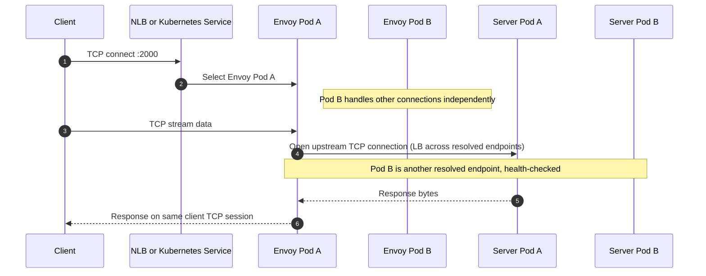
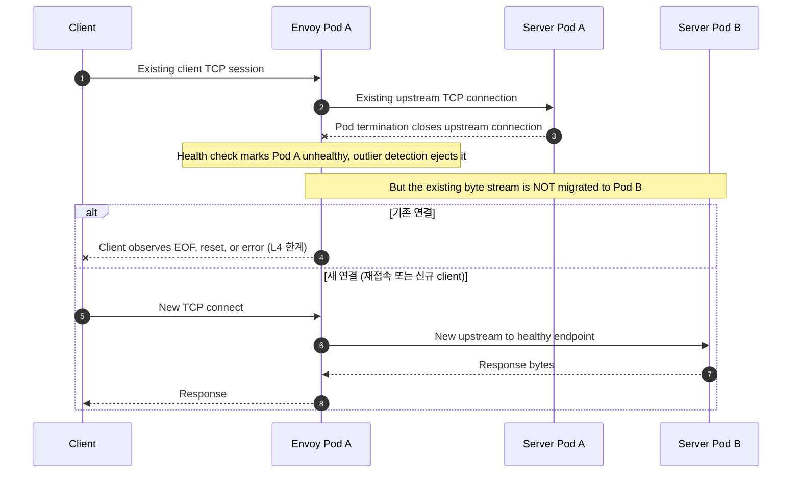
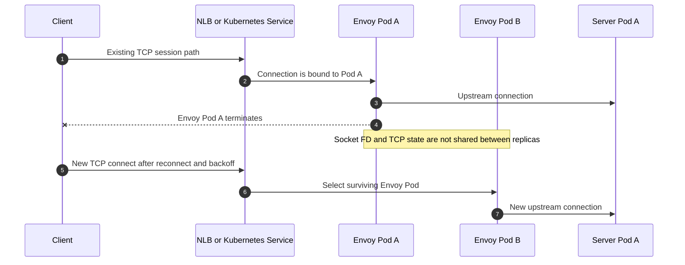

# Envoy 아키텍처

TL;DR: 검증 경로는 `client -> Envoy -> server Pod`다. Envoy는 Istio sidecar가 아니라 standalone L4 TCP proxy Deployment다. HAProxy 실습을 archive하고 Envoy로 바꾼 이유는 "L4 프록시가 live TCP stream을 옮겨준다"를 다시 기대해서가 아니라, Envoy가 Pod 단위 endpoint를 직접 보고 health check/outlier detection을 수행하는 모습을 관측하기 위해서다.

## 왜 HAProxy를 archive하고 Envoy로 왔나

HAProxy 실습의 결론은 명확했다. `mode tcp`(L4)에서는 backend Pod가 죽으면 같은 client TCP stream을 다른 Pod로 투명하게 이어주지 못한다. 이것은 HAProxy 버그가 아니라 [TCP 프로토콜의 근본 제약](tcp-session-migration.md)이다.

그래서 Envoy로 바꿀 때 기대를 바꿔야 한다. 이 실습이 확인하려는 것은 두 가지다.

| 질문 | 기대 |
|---|---|
| Envoy TCP(L4) proxy도 기존 연결을 이전하지 못하는가 | 그렇다. HAProxy와 동일한 결과를 재현해 L4의 일반 성질임을 확인한다 |
| Envoy는 endpoint를 어떻게 관리하는가 | STRICT_DNS로 Pod 단위 endpoint를 보고 health check/outlier detection으로 새 연결을 건강한 Pod로 보낸다 |

## 검증 경로

로컬 kind 경로는 다음과 같다.

```text
local client or client Pod
  -> localhost:2000 or Envoy NodePort 32090
  -> Envoy Pod
  -> tcp-echo-server-headless (STRICT_DNS)
  -> tcp-echo-server Pod
```

EKS 경로는 다음과 같다.

```text
external client
  -> AWS NLB TCP listener :2000
  -> Envoy Pod
  -> tcp-echo-server-headless (STRICT_DNS)
  -> tcp-echo-server Pod
```

## 정상 흐름 시퀀스

아래 시퀀스는 client 연결이 Envoy Pod 하나에 고정되고, Envoy가 STRICT_DNS로 알아낸 server Pod 중 하나로 upstream 연결을 여는 정상 흐름이다.



## Backend Pod 종료 시퀀스

아래 시퀀스는 Envoy가 health check/outlier detection으로 **새 연결**은 건강한 Pod로 보내지만, **이미 relay 중인 연결**은 이전하지 못한다는 점을 구분한다.



## Envoy Pod 종료 시퀀스

아래 시퀀스는 Envoy replica가 2개여도 live session failover가 아니라는 점을 보여준다. HAProxy 때와 같은 성질이다.



## HAProxy와의 차이 정리

| 항목 | HAProxy 실습(archive) | Envoy 실습(현재) |
|---|---|---|
| backend 지정 | `tcp-echo-server` Service DNS 하나 | `tcp-echo-server-headless` STRICT_DNS, Pod 단위 endpoint |
| endpoint 선택 주체 | kube-proxy | Envoy 자체 LB |
| health check | `option tcp-check` (Service 대상) | `tcp_health_check` (Pod 대상) |
| 비정상 endpoint 격리 | 없음(Service가 endpoint 관리) | `outlier_detection`으로 ejection |
| 관측 도구 | HAProxy stats UI(Service 1개) | admin `/clusters`로 Pod별 상태 |
| 기존 TCP stream 이전 | 불가 | 불가 (동일) |

## 중요한 한계

Envoy의 `tcp_proxy`는 client 연결 하나에 대해 선택된 upstream 연결을 relay한다. health check와 outlier detection은 **다음 연결**을 더 건강한 Pod로 보내기 위한 장치이지, 진행 중인 byte stream을 새 Pod로 이어 붙이는 장치가 아니다.

이 핸즈온의 요구사항은 server Pod 재시작 중에도 client가 `server closed connection`을 보지 않는 것이다. `AUTO_RECONNECT=false`에서 close가 발생하면 요구사항 미충족으로 기록한다. Envoy도 HAProxy와 같은 결과를 낼 것이며, 이는 L4 프록시의 일반 성질이라는 점을 데이터로 확인하는 것이 이 실습의 목적이다.

## 결론

같은 기술이라도 맥락에 따라 선택이 달라진다. Envoy를 고른 이유는 "L4로 session migration이 된다"가 아니라, endpoint를 Pod 단위로 보고 health/outlier를 직접 다루는 proxy의 동작을 관측하기 위해서다.

raw TCP에서 client 연결 유지가 정말 필요하다면 방향은 L4 proxy 교체가 아니라 다음 중 하나다. 자세한 비교는 [TCP session migration 한계](tcp-session-migration.md)에 정리했다.

1. application protocol에 request 경계와 idempotency/resume을 도입하고 L7(HTTP 등) retry를 쓴다.
2. client reconnect/backoff를 정상 실패 경로로 둔다.
3. 프로토콜 전용 proxy(PgBouncer, RDS Proxy 등)를 쓴다. [RDS Proxy 비교](usecase-rdsproxy.md) 참고.
