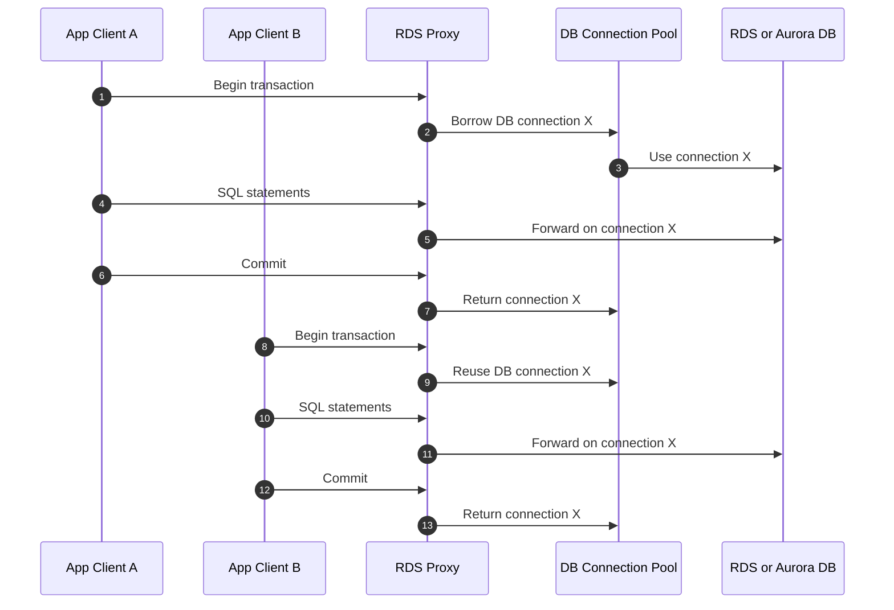
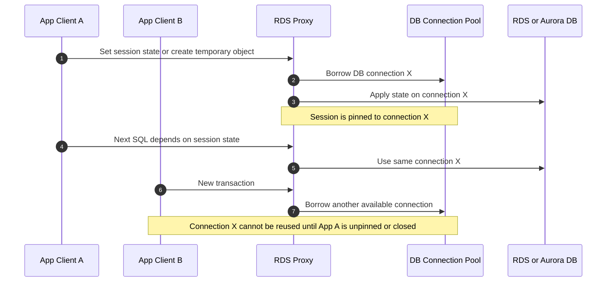
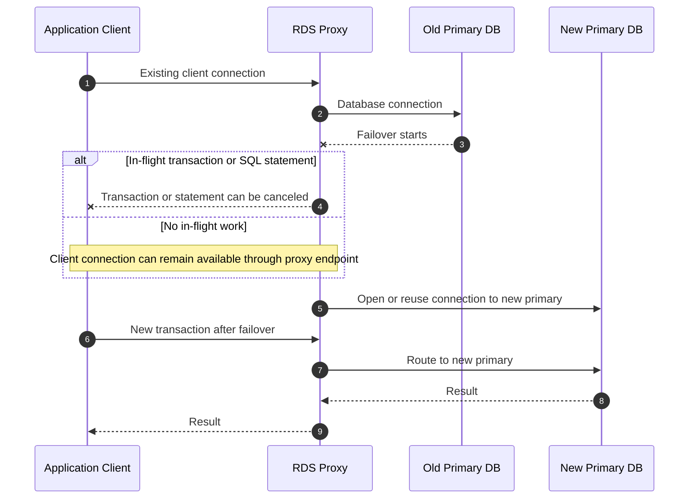

# RDS Proxy 비교

TL;DR: RDS Proxy도 client와 database 사이의 연결을 분리한다는 점에서는 현재 TCP proxy 구조와 비슷하다. 하지만 RDS Proxy는 database protocol과 transaction boundary를 이해하고 connection pooling, multiplexing, pinning을 수행한다. 일반 HAProxy TCP proxy가 임의의 TCP stream을 이해하지 못하는 것과 다르다.

## 왜 비슷해 보이나

현재 실습 구조는 다음과 같다.

```text
application client
  -> HAProxy
  -> server Pod
```

RDS Proxy 구조는 다음과 같다.

```text
application client
  -> RDS Proxy
  -> RDS or Aurora database
```

둘 다 client connection과 backend connection을 분리한다. 그래서 backend 쪽 장애나 교체를 proxy 계층에서 어느 정도 흡수할 수 있어 보인다.

하지만 중요한 차이가 있다. RDS Proxy는 database protocol을 대상으로 설계된 managed proxy다. SQL transaction, session state, database connection pool을 다룬다. 반면 현재 TCP proxy 실습은 임의의 TCP byte stream을 중계한다.

## RDS Proxy의 기본 원리

AWS 문서 기준으로 RDS Proxy는 application에서 proxy로 오는 연결을 client connection, proxy에서 database로 가는 연결을 database connection으로 구분한다. client connection은 proxy에서 terminate되고, database connection은 RDS Proxy 내부 pool에서 관리된다.

핵심 기능은 세 가지다.

| 기능 | 의미 |
|---|---|
| Connection pooling | database connection을 미리 열어두고 재사용한다 |
| Multiplexing | transaction이 끝난 뒤 같은 database connection을 다른 client session에 재사용한다 |
| Pinning | session state 때문에 안전하게 재사용할 수 없으면 client session을 특정 database connection에 고정한다 |

AWS 공식 문서는 RDS Proxy가 connection pool을 만들고 재사용해 새 DB connection 생성 비용을 줄인다고 설명한다. 또한 transaction이 끝난 후 backend database connection을 재사용할 수 있고, multiplexing이 불가능하면 pinning으로 전환한다고 설명한다.

참고:

- [RDS Proxy concepts and terminology](https://docs.aws.amazon.com/AmazonRDS/latest/UserGuide/rds-proxy.howitworks.html)
- [RDS Proxy connection considerations](https://docs.aws.amazon.com/AmazonRDS/latest/UserGuide/rds-proxy-connections.html)
- [Avoiding pinning an RDS Proxy](https://docs.aws.amazon.com/AmazonRDS/latest/UserGuide/rds-proxy-pinning.html)

## 정상 transaction multiplexing 시퀀스

아래 시퀀스는 RDS Proxy가 transaction 경계에서 database connection을 재사용하는 흐름이다. 핵심은 client TCP socket 자체를 database server 사이에서 옮기는 것이 아니라, proxy 내부의 database connection pool을 transaction 단위로 빌리고 돌려준다는 점이다.



## Pinning 시퀀스

아래 시퀀스는 session state가 생겨 multiplexing을 멈추고 특정 database connection에 고정하는 흐름이다.



## Failover 때 실제로 하는 일

RDS Proxy가 "세션을 안 끊기게 한다"는 표현은 조심해야 한다. AWS 문서는 failover 중에도 RDS Proxy가 같은 endpoint에서 connection을 받고 새 primary DB instance로 연결을 라우팅한다고 설명한다. 또한 application 자체 connection pool을 쓰는 경우 대부분의 connection이 failover나 disruption 중에도 살아 있고, transaction 또는 SQL statement 중간에 있는 connection만 취소된다고 설명한다.

즉 RDS Proxy의 모델은 다음에 가깝다.

```text
client connection은 proxy 쪽에서 최대한 유지
database connection은 transaction boundary 기준으로 재연결/재사용/교체
in-flight transaction 또는 SQL statement는 취소될 수 있음
```

이것은 live TCP socket state를 다른 database server로 그대로 이식하는 방식이 아니다. RDS Proxy가 database protocol과 transaction boundary를 이해하기 때문에, 안전한 경계에서 database connection을 다시 빌리거나 새 primary로 보낼 수 있는 것이다.

아래 시퀀스는 failover 상황을 단순화한 것이다. 여기서도 핵심은 live TCP socket migration이 아니라 database-aware reconnect와 routing이다.



## Pinning이 중요한 이유

RDS Proxy가 항상 자유롭게 database connection을 바꿀 수 있는 것은 아니다. session variable, prepared statement, temporary table, cursor, advisory lock 같은 session state가 있으면 이후 요청이 이전 state에 의존할 수 있다. 이때 RDS Proxy는 안전을 위해 client session을 특정 database connection에 고정한다. 이 동작이 pinning이다.

```text
pinning 없음:
  client session A -> transaction 1 -> DB connection X
  client session B -> transaction 2 -> DB connection X 재사용 가능

pinning 있음:
  client session A -> DB connection X 고정
  다른 client는 DB connection X 재사용 불가
```

Pinning은 정확성을 위한 선택이다. 대신 multiplexing 효율은 떨어진다. AWS는 RDS Proxy 성능 튜닝에서 transaction-level connection reuse를 최대화하고 pinning을 줄이는 것이 중요하다고 설명한다.

## 현재 TCP proxy 구조와의 차이

| 항목 | RDS Proxy | 현재 TCP proxy 구조 |
|---|---|---|
| protocol 이해 | DB protocol과 transaction 경계를 이해 | 임의 TCP byte stream으로 취급 |
| backend 교체 가능 지점 | transaction 종료 후 같은 안전한 경계 | proxy가 애플리케이션 경계를 모르면 판단 불가 |
| session state 처리 | state 변화 감지 시 pinning | state 의미를 모름 |
| failover 처리 | DB failover에 맞춰 새 primary로 routing, 일부 in-flight 취소 | backend Pod 종료 시 기존 stream 투명 이전 불가 |
| 핵심 장점 | DB connection storm 완화, failover 체감 감소 | backend 앞에 관측 가능한 TCP proxy 계층 추가 |
| 핵심 한계 | pinning이 많으면 pooling/multiplexing 효율 저하 | live TCP session migration을 제공하지 않음 |

## OS 업데이트나 proxy 자체 업데이트는 어떻게 하나

확인 필요: RDS Proxy 내부 proxy fleet의 OS 업데이트나 rolling maintenance 구현 세부는 공개 문서에서 확인되지 않는다.

다만 공개 문서로 확인되는 보장은 database failover와 connection pooling 동작에 관한 것이다. RDS Proxy는 managed service이므로 내부적으로 여러 proxy capacity와 routing 계층을 운영할 수 있지만, 그것이 임의 client TCP socket을 다른 proxy node로 live migration한다는 뜻은 아니다. 문서상으로도 client connection에는 최대 수명과 idle timeout이 있다.

따라서 RDS Proxy를 이해할 때는 "AWS가 proxy process의 live TCP socket을 다른 process로 옮긴다"가 아니라, "proxy endpoint와 DB protocol-aware pooling 계층을 통해 대부분의 client connection을 유지하고, 안전하지 않은 in-flight work는 취소하거나 pinning한다"로 보는 편이 정확하다.

## 우리 아키텍처에 주는 시사점

RDS Proxy가 성립하는 이유는 database protocol에 명확한 transaction boundary가 있고, proxy가 session state를 추적하거나 pinning으로 보수적으로 동작하기 때문이다.

현재 시스템이 RDS Proxy와 비슷한 효과를 원한다면 TCP proxy만으로는 부족하다. 다음 중 하나가 필요하다.

| 선택지 | 설명 | 장점 | 단점 |
|---|---|---|---|
| application protocol에 transaction boundary 추가 | proxy나 client가 안전한 재시도 지점을 알게 한다 | RDS Proxy와 비슷한 판단 구조를 만들 수 있다 | protocol 변경이 필요하다 |
| request id와 idempotency key 도입 | 실패한 요청을 안전하게 재실행한다 | 장애 복구가 명확하다 | 서버 구현과 데이터 모델 검토 필요 |
| resume token 도입 | 장기 작업을 중간 지점부터 재개한다 | long-lived stream에 유리하다 | 상태 저장소와 보상 로직 필요 |
| session state 외부화 | Pod-local state 의존을 줄인다 | Pod 교체에 강하다 | latency와 운영 비용 증가 |
| client reconnect를 공식 지원 | 연결 끊김을 정상 실패 모델로 둔다 | 가장 단순하고 예측 가능하다 | client UX/SDK 변경 필요 |

## 결론

RDS Proxy는 현재 구조와 겉모습은 비슷하지만, 핵심은 단순 TCP handoff가 아니다. RDS Proxy는 DB protocol-aware connection pooler이며, transaction boundary에서 multiplexing하고 session state가 생기면 pinning한다.

따라서 현재 TCP proxy 구조에 RDS Proxy 같은 효과를 기대하려면, "TCP 세션을 proxy가 영원히 유지한다"가 아니라 "애플리케이션 프로토콜이 안전한 재시도와 재개 지점을 제공한다"는 방향으로 설계해야 한다.
