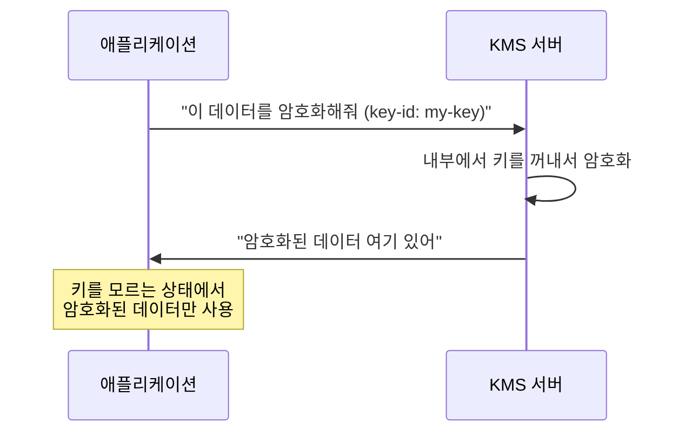
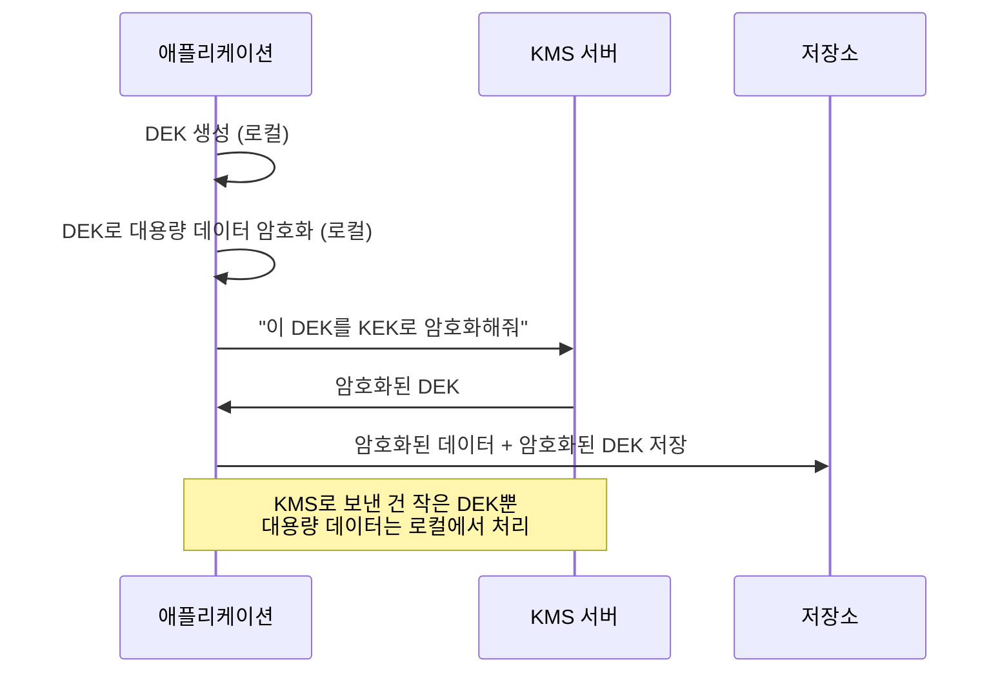
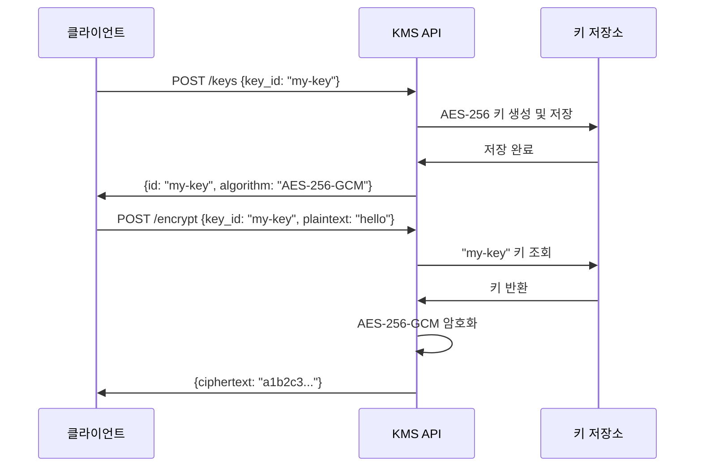

# KMS(Key Management Service) 기초와 원리

# 요약

- KMS(Key Management Service)는 암호화 키를 안전하게 생성, 저장, 관리하는 시스템입니다
- **암호화 키를 코드나 설정 파일에 직접 넣으면 유출 사고로 이어집니다.** KMS는 키를 중앙에서 관리하여 이 문제를 해결합니다
- 이 핸즈온에서는 KMS 서버를 Go로 직접 구현하고, 오픈소스(HashiCorp Vault)로 교체하고, AWS KMS 리소스까지 다룹니다
- 실습자료는 저의 github에 있습니다

# 목차

1. [KMS의 정의](#1-kms의-정의)
2. [KMS가 왜 필요한가?](#2-kms가-왜-필요한가)
3. [KMS Use Case](#3-kms-use-case)
4. [KMS를 안쓰면 뭐가 문제인가?](#4-kms를-안쓰면-뭐가-문제인가)
5. [KMS 서버는 무엇인가?](#5-kms-서버는-무엇인가)
6. [KMS 서버를 Go로 직접 구현](#6-kms-서버를-go로-직접-구현)
7. [KMS 오픈소스: HashiCorp Vault](#7-kms-오픈소스-hashicorp-vault)
8. [AWS KMS 리소스 소개](#8-aws-kms-리소스-소개)

---

# 1. KMS의 정의

KMS는 세 가지 단어를 합친 용어입니다. Key + Management + Service

1. **Key**: 암호화에 사용되는 키(열쇠)를 의미합니다
2. **Management**: 키의 생성, 저장, 회전(rotation), 삭제 등 키의 전체 생명주기(lifecycle)를 관리
3. **Service**: 이 기능을 API로 제공하는 서비스

**정리하면 KMS는 암호화 키의 생성부터 폐기까지 전체 생명주기를 중앙에서 안전하게 관리하는 서비스입니다.**

[아키텍처 그림: 애플리케이션 → KMS 서버 → 키 저장소(HSM/DB) 구조]

핵심 키워드는 2개입니다.

- **중앙 집중 관리**: 암호화 키를 한 곳에서 관리합니다. 여러 애플리케이션이 같은 KMS를 사용합니다
- **키 분리**: 암호화 키는 KMS 안에만 존재합니다. 애플리케이션은 키를 직접 가지고 있지 않습니다

# 2. KMS가 왜 필요한가?

## 암호화 키를 어디에 저장할 것인가?

데이터를 암호화한다는 것은 좋은 결정입니다. 그런데, **암호화 키를 어디에 저장할 것인가?** 이 질문이 핵심입니다.

흔히 하는 실수들:

```
# 실수 1: 소스 코드에 하드코딩
DB_PASSWORD = "super-secret-password"
ENCRYPTION_KEY = "my-aes-256-key-1234567890123456"
```

```yaml
# 실수 2: 설정 파일에 평문 저장
database:
  password: "super-secret-password"
api:
  key: "sk-1234567890abcdef"
```

```bash
# 실수 3: 환경변수에 저장 (서버에 접근하면 바로 노출)
export DB_PASSWORD="super-secret-password"
```

이 방식들의 공통 문제는 **키가 애플리케이션과 같은 위치에 있다**는 것입니다.

## KMS가 해결하는 문제

KMS를 사용하면 키는 KMS 서버에만 존재합니다. 애플리케이션은 KMS에 "이 데이터를 암호화해줘"라고 요청할 뿐, 키 자체를 알지 못합니다.



# 3. KMS Use Case

## Use Case 1: 비밀번호 암호화 저장

DB에 사용자 비밀번호를 저장할 때, KMS로 암호화하여 저장합니다. DB가 유출되어도 암호문만 노출됩니다.

## Use Case 2: 설정 파일 민감 값 암호화

DB 접속 정보, API 키 등 민감한 설정값을 KMS로 암호화하여 저장합니다. 설정 파일이 git에 올라가도 안전합니다.

## Use Case 3: Envelope Encryption (봉투 암호화)

대용량 데이터를 직접 KMS로 암호화하면 네트워크 부하가 큽니다. **Envelope Encryption은 데이터를 로컬에서 DEK(Data Encryption Key)로 암호화하고, DEK만 KMS의 KEK(Key Encryption Key)로 암호화하는 기법입니다.**

말이 어려운데 핵심 키워드는 3개입니다.

1. **DEK(Data Encryption Key)**: 실제 데이터를 암호화하는 키. 로컬에서 생성
2. **KEK(Key Encryption Key)**: DEK를 암호화하는 키. KMS에서 관리
3. **봉투(Envelope)**: DEK를 KEK로 감싼다는 의미. 편지를 봉투에 넣는 것과 비슷

[아키텍처 그림: Envelope Encryption 과정 - DEK 생성 → 데이터 암호화 → DEK를 KEK로 암호화 → 저장]



AWS KMS도 이 방식을 사용합니다. `GenerateDataKey` API가 바로 Envelope Encryption을 위한 API입니다.

## Use Case 4: 키 회전(Key Rotation)

암호화 키를 주기적으로 교체해야 보안이 강화됩니다. KMS는 자동 키 회전을 지원합니다. 애플리케이션 코드 변경 없이 키를 교체할 수 있습니다.

# 4. KMS를 안쓰면 뭐가 문제인가?

## 문제 1: 키 유출 시 전체 시스템 위험

암호화 키가 소스 코드나 설정 파일에 있으면, 한 번 유출되면 모든 암호화된 데이터가 복호화됩니다.

```
# git 히스토리에 남은 키 → 영원히 유출
git log -p | grep "ENCRYPTION_KEY"
ENCRYPTION_KEY = "my-aes-256-key-1234567890123456"
```

## 문제 2: 키 관리의 복잡성

- 여러 서비스가 각자 키를 관리하면, 키가 어디에 있는지 파악하기 어렵습니다
- 키 회전(교체)을 할 때 모든 서비스를 수동으로 업데이트해야 합니다
- 누가 언제 어떤 키를 사용했는지 감사(audit) 로그가 없습니다

## 문제 3: 규정 준수 실패

금융, 의료, 공공 분야에서는 암호화 키 관리에 대한 규정이 있습니다. KMS 없이는 이러한 규정을 준수하기 어렵습니다.

| 구분 | KMS 사용 | KMS 미사용 |
|------|----------|------------|
| 키 저장 위치 | KMS 서버 (격리) | 소스코드, 설정파일, 환경변수 |
| 키 유출 시 영향 | KMS 접근 제어로 차단 | 전체 데이터 복호화 가능 |
| 키 회전 | 자동/API 호출 | 수동, 전체 서비스 재배포 |
| 감사 로그 | 자동 기록 | 없음 |
| 규정 준수 | 충족 | 미충족 |

# 5. KMS 서버는 무엇인가?

KMS 서버는 암호화 키를 관리하고 암호화/복호화 기능을 API로 제공하는 서버입니다.

**KMS 서버의 핵심 기능 4가지:**

1. **키 생성(Create Key)**: 암호화 키를 안전하게 생성합니다
2. **암호화(Encrypt)**: 키 ID를 지정하면 해당 키로 데이터를 암호화합니다
3. **복호화(Decrypt)**: 키 ID와 암호문을 보내면 원본 데이터를 반환합니다
4. **키 관리(Key Management)**: 키 목록 조회, 삭제, 회전 등



## KMS 서버 vs 일반 암호화 라이브러리

헷갈리면 안되는 점이 있습니다. "그냥 암호화 라이브러리를 쓰면 되지 않나?"라는 질문을 할 수 있습니다.

차이점은 **키의 위치**입니다.

- **암호화 라이브러리**: 키를 애플리케이션이 직접 관리. 키가 메모리/파일에 존재
- **KMS 서버**: 키를 별도 서버에서 관리. 애플리케이션은 키를 모름

**정리하면 KMS 서버는 "키를 분리"하는 것이 목적입니다.**

# 6. KMS 서버를 Go로 직접 구현

KMS의 원리를 이해하기 위해 Go로 KMS 서버를 직접 구현합니다. 코드는 `kms-server/` 디렉토리에 있습니다.

## KMS 서버 구조

```
kms-server/
├── main.go          # KMS 서버 (API + 암호화 로직)
├── main_test.go     # 테스트 코드
├── Dockerfile       # 컨테이너 빌드
└── go.mod
```

## API 목록

| Method | Path | 설명 |
|--------|------|------|
| POST | /keys | 암호화 키 생성 |
| GET | /keys | 키 목록 조회 |
| DELETE | /keys/{keyID} | 키 삭제 |
| POST | /encrypt | 데이터 암호화 |
| POST | /decrypt | 데이터 복호화 |
| GET | /health | 헬스체크 |

## 핵심 구현: AES-256-GCM 암호화

AES-256-GCM은 두 가지 단어를 합친 용어입니다. AES-256 + GCM

1. **AES-256**: Advanced Encryption Standard, 256비트 키를 사용하는 대칭 암호화 알고리즘
2. **GCM(Galois/Counter Mode)**: 암호화와 동시에 데이터 무결성을 검증하는 모드

**정리하면 AES-256-GCM은 256비트 키로 데이터를 암호화하면서 위변조까지 탐지하는 알고리즘입니다.**

## 실습: KMS 서버 실행

### 테스트 실행

```bash
make server-test
```

```
=== RUN   TestCreateAndListKeys
--- PASS: TestCreateAndListKeys (0.00s)
=== RUN   TestEncryptDecrypt
--- PASS: TestEncryptDecrypt (0.00s)
=== RUN   TestEncryptWithInvalidKey
--- PASS: TestEncryptWithInvalidKey (0.00s)
=== RUN   TestDeleteKey
--- PASS: TestDeleteKey (0.00s)
=== RUN   TestHTTPCreateKey
--- PASS: TestHTTPCreateKey (0.00s)
PASS
```

### KMS 서버 시작

```bash
# 터미널 1: KMS 서버 시작
make server-run
```

### 키 생성

```bash
# 터미널 2: 키 생성
curl -s -X POST http://localhost:8080/keys \
  -H "Content-Type: application/json" \
  -d '{"key_id": "my-first-key"}' | python3 -m json.tool
```

```json
{
    "id": "my-first-key",
    "algorithm": "AES-256-GCM"
}
```

### 데이터 암호화

```bash
curl -s -X POST http://localhost:8080/encrypt \
  -H "Content-Type: application/json" \
  -d '{"key_id": "my-first-key", "plaintext": "hello, KMS!"}' | python3 -m json.tool
```

```json
{
    "key_id": "my-first-key",
    "ciphertext": "a1b2c3d4e5f6..."
}
```

### 데이터 복호화

```bash
# 위에서 받은 ciphertext 값을 넣으세요
curl -s -X POST http://localhost:8080/decrypt \
  -H "Content-Type: application/json" \
  -d '{"key_id": "my-first-key", "ciphertext": "<위에서_받은_ciphertext>"}' | python3 -m json.tool
```

```json
{
    "key_id": "my-first-key",
    "plaintext": "hello, KMS!"
}
```

## Use Case 실습

KMS 서버가 실행된 상태에서 클라이언트 예제를 실행합니다.

### Use Case 1: 비밀번호 암호화 저장

```bash
make client-usecase1
```

```
=== Use Case 1: 비밀번호 암호화 저장 ===

[Step 1] KMS에 암호화 키 생성
  키 생성 완료: password-key (status: 201)

[Step 2] 사용자 비밀번호를 KMS로 암호화하여 DB에 저장
  - alice: 평문(alice-secret-123) → 암호문(a1b2c3...)
  - bob: 평문(bob-password-456) → 암호문(d4e5f6...)

[Step 4] 로그인 시뮬레이션 - alice가 올바른 비밀번호로 로그인
  결과: alice 로그인 성공!

[Step 4] 로그인 시뮬레이션 - alice가 잘못된 비밀번호로 로그인
  결과: alice 로그인 실패 (비밀번호 불일치)
```

### Use Case 2: 설정 파일 암호화

```bash
make client-usecase2
```

### Use Case 3: Envelope Encryption

```bash
make client-usecase3
```

## go fix 실행

```bash
make server-fix
```

go fix는 Go 버전 업그레이드 시 deprecated된 API를 자동으로 수정해주는 도구입니다.

# 7. KMS 오픈소스: HashiCorp Vault

6번에서 직접 구현한 KMS 서버는 학습용입니다. 실제 운영에서는 검증된 오픈소스를 사용합니다.

## HashiCorp Vault 소개

HashiCorp Vault는 시크릿 관리 도구입니다. 그 중 **Transit secret engine**이 KMS 기능을 제공합니다.

직접 구현한 KMS 서버와 비교:

| 구분 | 직접 구현 KMS | Vault Transit |
|------|--------------|---------------|
| 키 저장소 | 메모리 (재시작 시 소멸) | 암호화된 스토리지 |
| 키 회전 | 미구현 | 자동 지원 |
| 접근 제어 | 없음 | 정책(Policy) 기반 |
| 감사 로그 | 로그 출력 | 감사 로그 엔진 |
| 고가용성 | 단일 서버 | 클러스터 지원 |

## Vault 설치 (Docker)

```bash
# Vault 컨테이너 시작
make vault-up
```

```yaml
# vault/docker-compose.yml
services:
  vault:
    image: hashicorp/vault:1.18
    container_name: vault-kms
    ports:
      - "8200:8200"
    environment:
      VAULT_DEV_ROOT_TOKEN_ID: "root-token"
      VAULT_DEV_LISTEN_ADDRESS: "0.0.0.0:8200"
    cap_add:
      - IPC_LOCK
    command: vault server -dev
```

dev 모드로 시작하면 자동으로 unsealed 상태입니다. 실제 운영에서는 dev 모드를 사용하면 안됩니다.

## Transit 엔진 설정

```bash
# Transit 엔진 활성화 및 키 생성
make vault-setup
```

setup.sh 스크립트가 다음을 수행합니다:

1. Transit secret engine 활성화
2. `my-app-key` 암호화 키 생성 (AES-256-GCM)

### 수동으로 확인

```bash
# Transit 엔진으로 암호화
curl -s --header "X-Vault-Token: root-token" \
  --request POST \
  --data '{"plaintext": "'$(echo -n "hello, Vault KMS!" | base64)'"}' \
  http://127.0.0.1:8200/v1/transit/encrypt/my-app-key | python3 -m json.tool
```

```json
{
    "data": {
        "ciphertext": "vault:v1:abcdef123456..."
    }
}
```

Vault Transit의 암호문은 `vault:v1:` 접두사가 붙습니다. `v1`은 키 버전입니다. 키를 회전하면 `v2`, `v3`으로 올라갑니다.

## KMS 서버를 Vault로 교체

6번에서 만든 클라이언트의 KMS 서버를 Vault로 교체합니다. 코드는 `vault/vault-client/`에 있습니다.

**핵심: encrypt/decrypt 함수만 교체하면 됩니다.** 비즈니스 로직은 변경할 필요가 없습니다.

```bash
# Vault가 실행된 상태에서
make vault-client
```

```
=== Vault Transit Engine으로 KMS 교체 ===

[Step 1] 비밀번호를 Vault Transit으로 암호화
  - alice: 평문(alice-secret-123) → 암호문(vault:v1:...)
  - bob: 평문(bob-password-456) → 암호문(vault:v1:...)

[Step 2] Vault Transit으로 복호화
  - alice: 복호화 결과 = alice-secret-123
  - bob: 복호화 결과 = bob-password-456
```

## 주의사항

- dev 모드는 학습/테스트 전용입니다. 데이터가 메모리에만 저장되어 재시작 시 사라집니다
- 실제 운영에서는 Vault를 HA(고가용성) 모드로 배포하고, unseal 키를 안전하게 관리해야 합니다
- `root-token`은 절대 운영 환경에서 사용하면 안됩니다

# 8. AWS KMS 리소스 소개

AWS에서는 완전 관리형(Fully Managed) KMS를 제공합니다. 직접 KMS 서버를 운영할 필요 없이 API만 호출하면 됩니다.

## AWS KMS 핵심 개념

| 개념 | 설명 |
|------|------|
| CMK(Customer Master Key) | KMS에서 관리하는 마스터 키. 데이터를 직접 암호화하거나 DEK를 암호화 |
| Alias | 키에 대한 별칭. `alias/my-key`처럼 사람이 읽기 쉬운 이름 |
| Key Policy | 키에 대한 접근 권한 정책 (IAM Policy와 별도) |
| Key Rotation | 매년 자동으로 키를 교체. 이전 키로 암호화된 데이터도 복호화 가능 |
| Envelope Encryption | GenerateDataKey API로 DEK를 생성하여 사용 |

## AWS KMS를 사용하는 AWS 서비스들

- **S3**: 버킷의 객체를 KMS 키로 서버 사이드 암호화 (SSE-KMS)
- **EBS**: EC2 볼륨을 KMS 키로 암호화
- **RDS**: 데이터베이스 스토리지를 KMS 키로 암호화
- **Secrets Manager**: 시크릿 값을 KMS 키로 암호화하여 저장
- **Lambda**: 환경변수를 KMS 키로 암호화

## Terraform으로 AWS KMS 리소스 생성

코드는 `aws-kms/` 디렉토리에 있습니다.

### KMS 키 생성

```hcl
resource "aws_kms_key" "symmetric" {
  description             = "kms-handson symmetric encryption key"
  deletion_window_in_days = 7
  enable_key_rotation     = true
  rotation_period_in_days = 90

  tags = {
    Name = "kms-handson-symmetric-key"
  }
}

resource "aws_kms_alias" "symmetric" {
  name          = "alias/kms-handson-symmetric"
  target_key_id = aws_kms_key.symmetric.key_id
}
```

헷갈리면 안되는 점:

- `deletion_window_in_days`: 키를 삭제하면 바로 사라지지 않고 7~30일 동안 대기합니다. 실수로 삭제하는 것을 방지합니다
- `enable_key_rotation`: 활성화하면 `rotation_period_in_days` 주기로 키가 자동 교체됩니다. 이전 키로 암호화된 데이터도 정상 복호화됩니다

### S3 버킷에 KMS 암호화 적용

```hcl
resource "aws_s3_bucket_server_side_encryption_configuration" "encrypted" {
  bucket = aws_s3_bucket.encrypted.id

  rule {
    apply_server_side_encryption_by_default {
      sse_algorithm     = "aws:kms"
      kms_master_key_id = aws_kms_key.symmetric.arn
    }
  }
}
```

### AWS CLI로 KMS 사용

```bash
# 키 목록 조회
aws kms list-keys --region ap-northeast-2

# 별칭으로 키 조회
aws kms list-aliases --region ap-northeast-2

# 데이터 암호화
aws kms encrypt \
  --key-id alias/kms-handson-symmetric \
  --plaintext "hello, AWS KMS!" \
  --region ap-northeast-2

# 데이터 복호화
aws kms decrypt \
  --ciphertext-blob fileb://encrypted.dat \
  --region ap-northeast-2
```

# 부록: 전체 실습 순서 정리

```bash
# 1. KMS 서버 테스트
make server-test

# 2. KMS 서버 시작 (터미널 1)
make server-run

# 3. Use Case 실행 (터미널 2)
make client-usecase1
make client-usecase2
make client-usecase3

# 4. KMS 서버 종료 (터미널 1에서 Ctrl+C)

# 5. Vault 시작
make vault-up

# 6. Vault Transit 엔진 설정
make vault-setup

# 7. Vault 클라이언트 실행 (KMS → Vault 교체)
make vault-client

# 8. Vault 종료
make vault-down
```

# 더 공부할 것

- HSM(Hardware Security Module)과 KMS의 관계
- AWS KMS의 Key Policy와 IAM Policy 차이
- Vault의 Auto Unseal 설정
- KMS 기반 Kubernetes Secrets 암호화 (Sealed Secrets, SOPS)

# 참고자료

- https://docs.aws.amazon.com/kms/latest/developerguide/overview.html
- https://developer.hashicorp.com/vault/docs/secrets/transit
- https://pkg.go.dev/crypto/aes
- https://en.wikipedia.org/wiki/Envelope_encryption
