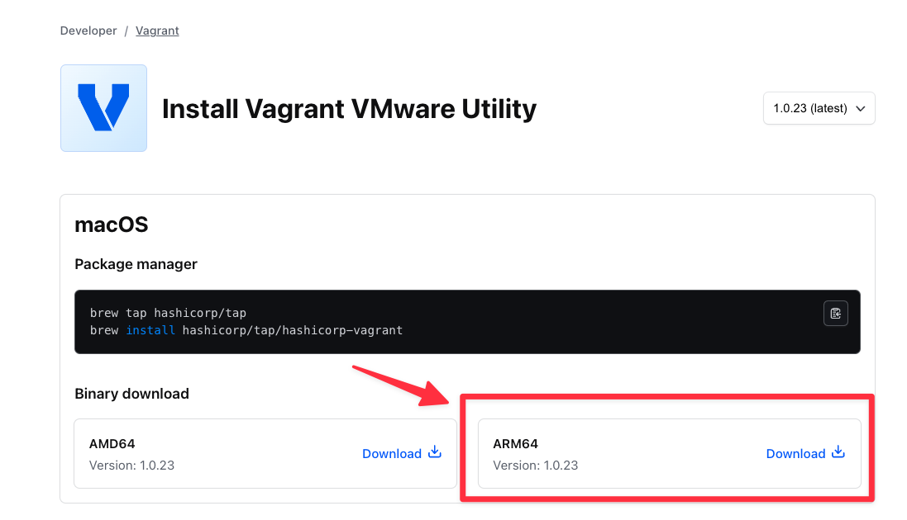
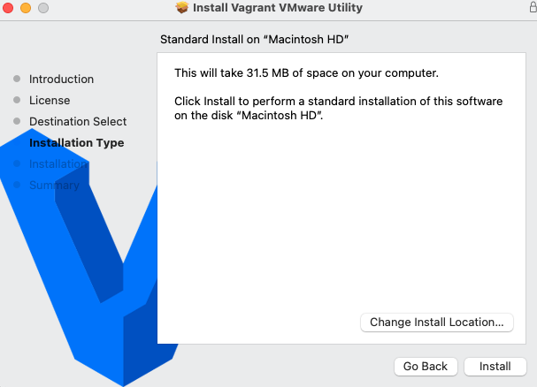

# 실습환경
* 실리콘 맥OS
* vmware fusion

# 준비
## vagrant 설치

```sh
brew tap hashicorp/tap
brew install hashicorp/tap/hashicorp-vagrant
```

## Vagrant VMware Utility 설치
* [공식홈페이지](https://developer.hashicorp.com/vagrant/install/vmware)에서 바이너리 다운로드 후 설치





## vagrant vmware fusion 플러그인 설치

```sh
vagrant plugin install vagrant-vmware-desktop
```

# 실행방법

* vm 생성

```sh
vagrant up --provider=vmware_desktop
```

* vm ssh 접속

```sh
vagrant ssh
```

* vm 종료

```sh
vagrant halt
```
