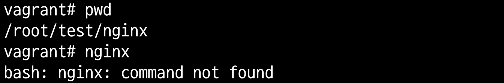

# 개요
* 리눅스에서 mount namespace와 chroot를 사용하여 컨테이너가 어떻게 각자 실행파일을 갖는지 실습

# 필요지식
* [linux mount namespace](../mount_namespace/)

# 실습환경
* vagrant ubuntu

# 실습

1. 실습 디렉터리 생성

```sh
mkdir /root/test
```

2. nginx 실행파일과 라이브러리가 설치되어 있는 압축파일 다운로드와 압축 해제

```sh
docker export $(docker create nginx) -o /root/test/nginx.tar
ls -l /root/test/nginx.tar
```


3. nginx_image.tar 압축 해제

```sh
cd /root/test
mkdir -p ./nginx
tar -xvf ./nginx.tar -C ./nginx
```

```sh
ls -l ./etc/nginx/conf.d/
```


4. nginx 디렉터리에서 nginx를 실행 -> nginx 실행되지 않음

```sh
mknod -m 666 /dev/null c 1 3
cd ./nginx
nginx
```



5. chroot를 실행하려 root디렉터리를 변경하고, nginx를 실행


```sh
$ pwd
$ unshare --mount chroot nginx /bin/bash
$ nginx -version
nginx version: nginx/1.27.1

# nginx 실행
$ mknod -m 666 /dev/null c 1 3
$ nginx
```


# 참고자료
* 이게 돼요? 도커 없이 컨테이너 만들기 / if(kakao)2022 - https://youtu.be/mSD88FuST80?si=Vbl63IkW6Dc8YFJk
