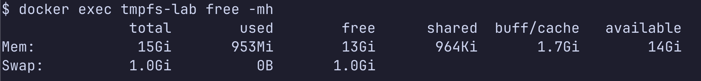
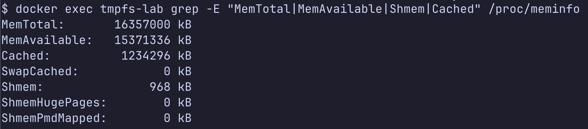
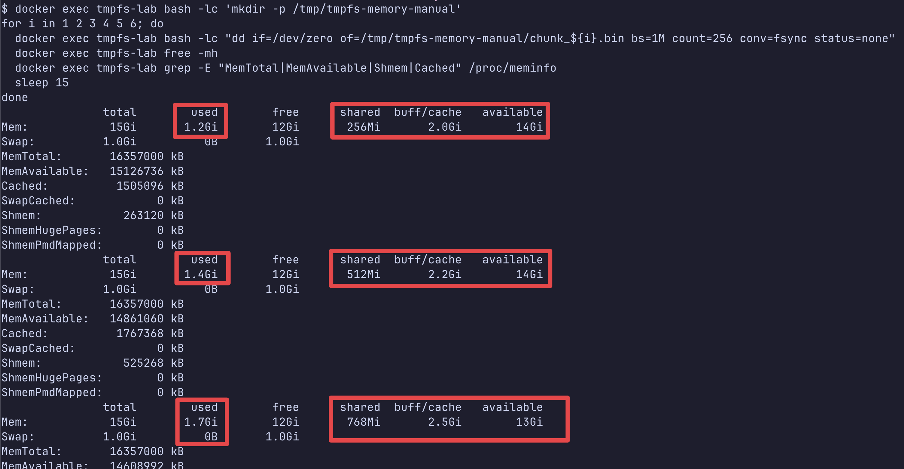
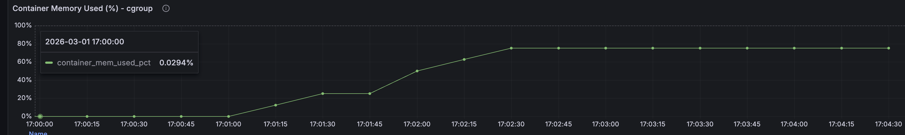
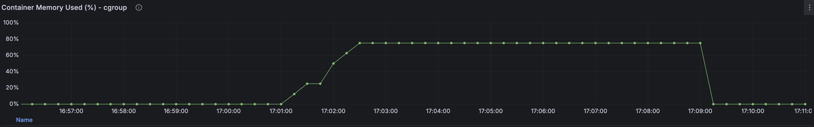

# Manual Test (No Script)

## 1. Stack Start

```bash
make up
```

## 2. Target Container Check

```bash
docker exec tmpfs-lab df -h /tmp
```


## 3. Baseline Metrics

```bash
docker exec tmpfs-lab free -mh
docker exec tmpfs-lab grep -E "MemTotal|MemAvailable|Shmem|Cached" /proc/meminfo
```





## 4. Write 256MB x N

```bash
docker exec tmpfs-lab bash -lc 'mkdir -p /tmp/tmpfs-memory-manual'
for i in 1 2 3 4 5 6; do
  docker exec tmpfs-lab bash -lc "dd if=/dev/zero of=/tmp/tmpfs-memory-manual/chunk_${i}.bin bs=1M count=256 conv=fsync status=none"
  docker exec tmpfs-lab free -mh
  docker exec tmpfs-lab grep -E "MemTotal|MemAvailable|Shmem|Cached" /proc/meminfo
  sleep 15
done
```





## 5. Delete Step

```bash
# (옵션1) 한번에 삭제
docker exec tmpfs-lab rm -rf /tmp/tmpfs-memory-manual
```

```bash
# (옵션2) 단계적 삭제
for i in 6 5 4 3 2 1; do
  docker exec tmpfs-lab bash -lc "rm -f /tmp/tmpfs-memory-manual/chunk_${i}.bin"
  docker exec tmpfs-lab free -mh
  docker exec tmpfs-lab grep -E "MemTotal|MemAvailable|Shmem|Cached" /proc/meminfo
  sleep 15
done
```


