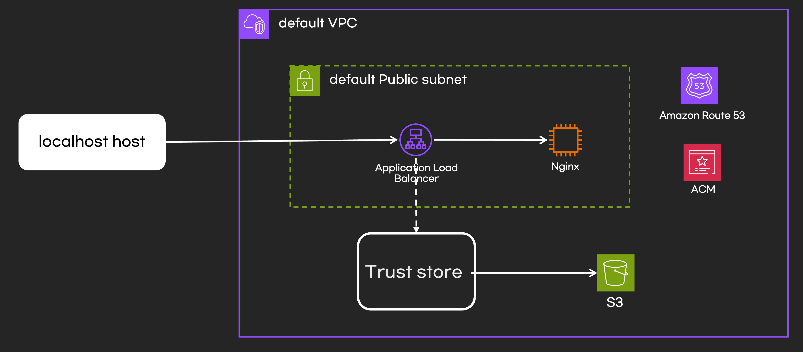

## 개요

* AWS mTLS 예제



## 실습환경 구축

* [테라폼 문서 바로가기](./terraform/README.md)

## 실습

### ALB 호출

* 클라이언트 인증서 없이 ALB 호출하면 연결이 종료됨

```sh
curl https://{your-domain}
```


### 클라이언트1 인증서를 가지고 ALB 호출

```sh
curl --cert ./certs/client1.crt --key ./certs/client1.key https://{your-domain}
```


### 클라이언트2 인증서를 가지고 ALB호출

* 클라이언2 인증서는 revocation list에 있으므로 인증실패

```sh
curl --cert ./certs/client2.crt --key ./certs/client2.key https://{your-domain}
```


## 참고자료

* AWS ALB mTLS: https://aws.amazon.com/ko/blogs/tech/introduction-mtls-for-application-loadbalancer/
* AWS 한국 블로그: https://aws.amazon.com/ko/blogs/korea/mutual-authentication-for-application-load-balancer-to-reliably-verify-certificate-based-client-identities/
* https://aws.amazon.com/ko/blogs/compute/introducing-mutual-tls-authentication-for-amazon-api-gateway/
* https://github.com/terraform-aws-modules/terraform-aws-alb/tree/v9.13.0/modules/lb_trust_store
